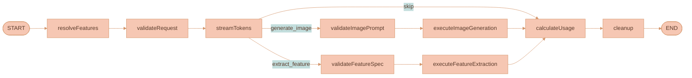
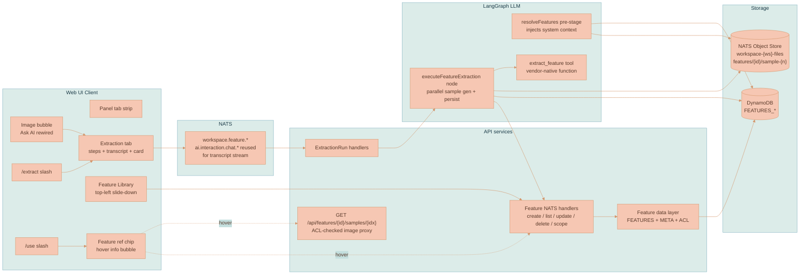

# Feature Extraction & Library

## TL;DR

A new first-class Lixpi primitive: **features** — reusable, scoped, named library entries that capture the essence of any visual abstraction (painting style, color palette, mood, stroke pattern, lighting setup, anything the user names) extracted from one or more reference inputs (images, documents, threads, or combinations). Features are applied later via a slash-command reference (`/use loose-watercolor`) inside any prompt; the server resolves the reference at send time and injects the feature's instructions and sample images as system context — without ever forwarding the original reference content to the downstream model. Anti-leakage by construction.

This ticket replaces the image bubble's current "Ask AI" handler (which today creates a `contextRegion` thread node + edge — see [`WorkspaceCanvas.ts`](services/web-ui/src/infographics/workspace/WorkspaceCanvas.ts) `initCanvasBubbleMenu` ~lines 359–425) with a new feature-extraction flow, adds a Feature Library panel, a `/use` reference chip, an `/extract` slash command, a tabbed AI chat panel, an `extract_feature` LangGraph tool, and a `resolveFeatures` LangGraph pre-stage. Foundation primitives only — no canvas node type, no Svelte changes beyond the toolbar icon.

## Problem statement

Lixpi is a node-based visual canvas for AI image and video generation pipelines. Its defining win is **artifact piping for character consistency** — the same image node piped into multiple threads via directional edges guarantees identical character/object reproduction downstream (see [`documentation/PRODUCT-OVERVIEW.md`](documentation/PRODUCT-OVERVIEW.md) §3).

But there is a parallel problem with no current solution: **stylistic and aesthetic consistency without subject leakage**.

When an artist, art director, or brand designer wants to apply a specific painting style, color palette, mood, lighting setup, or stroke pattern across many generations, the current options are all bad:

1. **Re-type the style description from scratch every time.** Lossy. Inconsistent. Doesn't survive across workspaces. Doesn't survive across collaborators.
2. **Pipe the original reference image as edge context.** Carries unwanted subject content into outputs. A portrait of a watercolor cat ends up appearing — at least in spirit — in every generation that was supposed to merely *borrow its watercolor look*. The artist's reference content leaks into work that has nothing to do with cats.
3. **Maintain an external prompt cheat-sheet (Notion, Google Doc, etc.).** Breaks the spatial workflow paradigm. Not searchable from the canvas. Not shareable as first-class data.

None of these preserve a pure, reusable, shareable abstraction of *just the style* with no content leakage. This is the gap.

The closest prior art outside Lixpi is the custom-style features in **Recraft** (saveable styles created from up to 5 reference images, with "Style essentials" vs "Style and composition" interpretation modes), **Magnific Custom Styles**, **On-Model AI presets** (JSON-format presets covering palette / pose / camera / lighting), and **SVGAPP style preset tool** (extracts palette / linework / contrast / temperature into structured JSON). The 2026 disentanglement research (StyleDecoupler, DICE, StyleGallery, UniCSG) attacks the leakage problem at the model-architecture level via latent-space subspace decomposition. We don't have model access, but we can solve 80% of the practical problem with prompt-level disentanglement (see "Anti-leakage strategy" below), and we can do it natively in Lixpi's spatial paradigm.

## Goals

This ticket ships a feature that:

1. Lets a user extract any reusable abstraction from one or more reference inputs into a named, categorized, scoped library entry — by clicking the rewired Ask-AI button on a canvas image, by asking the chat agent in natural language, or by typing `/extract` in any prompt input.
2. Captures the abstraction in two complementary forms: a rich markdown instructions body the LLM consumes when applying it, and 0–3 sample images that demonstrate the abstraction on neutral subjects (no source-content leakage).
3. Stores the entry with one of four scopes: `workspace` (default), `user` (private cross-workspace library), `organization`, `public` (community-shared, instant publish + report-driven moderation).
4. Lets the user apply the feature to any future generation by typing `/use feature-name` in a prompt input. The reference renders as an obviously-highlighted chip; hovering shows a lazy-loaded info card.
5. Hosts the extraction UX in a new tabbed AI chat panel (so extraction never displaces the user's current thread). Tabs persist across reload via `canvasState`.
6. Surfaces the library through a top-left toggle icon that opens a slide-down panel. Vanilla TypeScript — no Svelte changes beyond the toolbar icon.

## Non-goals (v1)

- A new `feature` canvas node type. v1 is library-only. Drag-to-canvas placement is parking-lotted for v2.
- Editing feature instructions inline in the library card. Edits go through "Open in extraction tab → Re-extract."
- Versioning / revision history of features.
- A search index for public features. v1 ships a simple GSI scan; OpenSearch / Algolia-class search is a v2 problem.
- Admin moderation UI. Reports flag features into a `'reported'` status that excludes them from public lists; restoration is a manual DB operation in v1.
- Multi-step autonomous agent behavior (DeepAgents-style planning). Feature extraction is deterministic and single-shot — see "DeepAgents vs LangGraph" below.

## Product principles

Three principles drive every design decision in this ticket. When trade-offs come up during implementation, these are the tiebreakers:

1. **The artist's reference content must never leak into downstream generations.** If you extract a watercolor style from a picture of your cat, generations that use that feature must not contain cats unless the user explicitly asks. This is the headline value proposition; everything else is in service of it.
2. **Features are reusable across the artist's entire workflow.** A user who builds a library of 50 personal styles, palettes, and moods has effectively built a small in-house DSL for their visual brand. Switching workspaces, sharing with their org, or publishing to the community must be one click.
3. **Application is frictionless.** Typing `/use my-watercolor` in any prompt should feel as natural as @-mentioning a coworker.

## What is an extracted feature?

A **feature** is a reusable, scoped library entry that captures the essence of one specific visual abstraction. Conceptually it's a "saved style preset" generalized far beyond style.

Every feature contains:

| Field | Description |
|---|---|
| `category` | Free-form, agent-determined: `painting-style`, `color-palette`, `mood`, `stroke-pattern`, `lighting-setup`, `composition-rule`, anything the user / agent invents. Used for grouping in the library and for color-coding chips. |
| `name` | Drawn from the user's request ("extract loose watercolor style" → `loose-watercolor`) or invented by the agent if context is insufficient. Used for `/use {name}` references. |
| `summary` | One line, used in the library list and in the hover info bubble. |
| `tags` | Short string tags for search and filter. |
| `instructions` | A markdown body — the rich how-to-apply guide the LLM consumes when the feature is invoked. Written by the agent during extraction. Anywhere from 100 to 2000 words, depending on category. This is the workhorse field. |
| `parameters` | Freeform JSON blob — structured signals the agent extracts (palette colors, lighting direction, brush type, color temperature, contrast curve, etc.). Whatever signals make sense for that category, in whatever shape. Filterable. |
| `sampleImages` | 0–3 images, agent-decided. Each image is a neutral-subject render demonstrating the feature without carrying source content (see anti-leakage). Stored in the NATS Object Store. |
| `scope` | One of `workspace` / `user` / `organization` / `public`. Default `workspace`. |
| `status` | `'active'`, `'reported'` (auto-flipped past report threshold), `'removed'`. |
| `sourceContext` | Provenance: which `extractionRunId` produced it, which workspace it was born in. |
| `version` | Schema version, currently `1`. Reserved for future revisions. |

Why **hybrid representation** (structured envelope + markdown body + freeform `parameters` blob)? Because:

- Pure markdown loses queryability (can't filter "all warm-tone palettes" or "features with stroke type = crosshatch").
- Pure structured JSON loses expressiveness (no fixed schema can capture every conceivable artistic concept the user might invent — agent-determined categories are the whole point).
- Hybrid lets the agent fill in whatever structured signals make sense for the category, while keeping a free-form prose explanation for everything else. The LLM consumes the markdown; the library UI uses the envelope + parameters for filtering and display.

### Concrete examples

| User request | Detected category | Auto-named | Sample-image strategy chosen by agent |
|---|---|---|---|
| "extract painting style from these 3 watercolor pieces" | `painting-style` | `loose-watercolor` | 2 samples: a sphere on a wooden table; a generic abstract landscape — both rendered in the extracted style |
| "save this as a color palette" | `color-palette` | `dusty-sage-and-coral` | 1 sample: a 5×5 swatch grid (rendered, not photographic) |
| "extract the mood" | `mood` | `melancholy-late-autumn` | 1 sample: a generic empty room with afternoon light |
| "stroke pattern from this etching" | `stroke-pattern` | `crosshatch-rough` | 2 samples: a sphere; a cube — pure stroke-as-volume study |
| "the lighting setup in this portrait" | `lighting-setup` | `north-window-soft` | 1 sample: a generic head-and-shoulders silhouette in that light |
| "save these as a composition rule" (user provides 4 reference compositions) | `composition-rule` | `rule-of-thirds-with-leading-diagonal` | 0 samples — agent decides this is best expressed as instructions only; sample images would mislead |
| "extract the prompt-engineering pattern I keep using for product photos" (user supplies 2 prior chat threads, no images) | `prompt-pattern` | `clean-product-shot-recipe` | 0 samples — non-image input, instructions-only feature |

The agent picks count + subjects per category according to its analysis. The schema accommodates 0 samples for cases where samples wouldn't help (or where the input is non-visual).

### Inputs are not limited to images

The user's brief explicitly: *"a given input which often includes images, one or a few images. It's not limited to just images though."*

The extraction tool accepts whatever the existing context-extraction layer produces — see [`extractConnectedContext`](services/web-ui/src/services/ai-chat-thread-service.ts) and the existing multimodal context flow (PRODUCT-OVERVIEW.md §7). That includes:

- Image canvas nodes (resolved to `nats-obj://` URLs → base64 in [`attachments.ts`](services/api/src/llm/utils/attachments.ts))
- Document canvas nodes (ProseMirror JSON → plain text)
- Upstream AI chat thread canvas nodes (full conversation history)
- Mixed combinations of the above

A feature extracted from a thread of past conversations is just as valid as one from images. The agent decides what kind of feature is appropriate based on what it sees.

## Anti-leakage strategy (the headline value)

Naive style-transfer pipelines pass the reference image into the downstream model and instruct it to "use this style." The model often reproduces objects, identities, compositions, or backgrounds from the reference. This violates principle #1.

The 2026 disentanglement literature solves this at the model-architecture level:

- **StyleDecoupler** ([arXiv:2601.17697](https://arxiv.org/abs/2601.17697)) — information-theoretic separation of style from content, plug-and-play on frozen VLMs.
- **DICE** ([arXiv:2602.08059](https://arxiv.org/abs/2602.08059)) — contrastive subspace decomposition; training-free style purification that removes artist characteristics while preserving content.
- **StyleGallery** ([arXiv:2603.10354](https://arxiv.org/abs/2603.10354)) — semantic region segmentation + clustered region matching for arbitrary reference images.
- **UniCSG** ([arXiv:2604.17850](https://arxiv.org/abs/2604.17850)) — staged training combining latent-space semantic disentanglement with frequency-aware detail reconstruction; explicitly engineered to prevent reference-content leakage.
- **StyleBrush** ([arXiv:2408.09496](https://arxiv.org/html/2408.09496v1)) — earlier dual-branch architecture (ReferenceNet for style + Structure Guider for structure) that proved separation is achievable.

These are SOTA but require model-architecture access we don't have when calling external providers (OpenAI gpt-image-1, Google Nano Banana, etc.).

Our v1 ships a **prompt-level disentanglement strategy** that's pragmatic and effective for the vast majority of real workflows:

1. **During extraction**, the agent receives the reference inputs (images / docs / threads) and produces the feature's `instructions` and `parameters` based on its multimodal analysis. This step is the only step that ever sees the originals.
2. **When generating sample images for the feature**, the image-gen call **does not** receive the original reference inputs. It only receives:
   - The agent-written `instructions` and `parameters` (now flattened to text — the originals' visual content has been replaced by the agent's textual summary of style traits).
   - A neutral-subject prompt the agent chose (e.g. "a sphere on a wooden table").
   - A hard-coded system instruction:

   > Render the requested subject using ONLY the style/feature defined below. Do NOT reproduce any subject, identity, object, or composition from prior reference images. The reference materials have already been processed and reduced to the style guide above; treat that guide as authoritative. Render only what's described in the user prompt, in the defined style.

3. **When the feature is later applied via `/use`**, the resolved system context contains only the feature's `instructions`, `parameters`, and `sampleImages` — never the original references. The downstream chat / image-gen call has no path to the original cat photo, so cats can't bleed in.

This withholds the leak vector entirely. It's not as strong as latent-space disentanglement for highly distinctive subjects (a specific celebrity, a specific brand mascot, a specific iconic painting where the subject IS the style), but it's robust for the typical artist-workflow case.

**v2 escalation path** (out of scope here): for pathological subjects, route sample generation and feature application through a specialized style-transfer model (Recraft custom-style API, or a self-hosted disentanglement model) that does latent-space separation. The current architecture isolates the choice of sample-generation backend behind the existing `runImageRouter`, so swapping in a different backend later is a single-file change.

## How a user triggers feature extraction (three entry points)

All three converge on the same `extract_feature` LangGraph tool and produce a feature in the same way. Per clarification, all three are shipped in v1.

### 1. Image bubble's "Ask AI" button (rewired)

The current handler creates a `contextRegion` thread node + edge — see [`WorkspaceCanvas.ts`](services/web-ui/src/infographics/workspace/WorkspaceCanvas.ts) `initCanvasBubbleMenu` ~lines 359–425. The user explicitly: *"The functionality of this ask ai button is changed. It must not create another context region."*

New handler:

1. Creates an `ExtractionRun` record via NATS request (`AI_INTERACTION_SUBJECTS.FEATURE_EXTRACT.START`).
2. Opens a new `extraction` tab in the AI chat panel referencing the new `extractionRunId`.
3. Starts the LangGraph extraction with the source image's `nats-obj://` URL as input — plus any directly upstream connected nodes via the existing `findConnectedNodes` traversal so wired docs / threads are also factored in.
4. Source canvas state is otherwise untouched — no new region appears, no new edge is drawn, no thread node is created.

The bubble menu definition file [`canvasBubbleMenuItems.ts`](services/web-ui/src/infographics/workspace/canvasBubbleMenuItems.ts) does not change — it just re-fires `callbacks.onAskAi(activeNodeId)`. The behavior swap is entirely in the callback body. We keep the `magicIcon` and the "Ask AI" label (the UX intent — invoke AI on this artifact — is unchanged); the tooltip becomes "Ask AI · Extract feature."

### 2. Natural language inside any thread

The chat agent has the new `extract_feature` tool registered alongside the existing `generate_image` tool. The user can say "hey, save this watercolor style for later" inside any existing thread, and the agent will call the tool. The tool call is detected (via the existing `extractToolCall*` pattern from [`image-generation.ts`](services/api/src/llm/tools/image-generation.ts)), the workflow branches to the extraction sub-flow (parallel sample gen + persist), and the user gets a feature card streamed back into their existing thread.

### 3. `/extract` slash command

Typing `/extract` in any prompt input opens a new `extraction` tab in the panel. The new tab inherits the current thread's full edge-graph context (connected images / docs / upstream threads via existing `extractConnectedContext`) and seeds the extraction with whatever text the user typed after `/extract` as the user's request. Submitting in the new tab runs the extraction. The original thread is untouched.

## How a user applies a feature (the everyday flow)

This is the daily-use path that earns the feature its keep.

1. User types `/` in any prompt input → the existing [`slashCommandsMenuPlugin`](services/web-ui/src/components/proseMirror/plugins/slashCommandsMenuPlugin/) opens its filter menu (already supports filtering, arrow-key nav, Enter/Tab to select, Esc / click-out to dismiss — see its [README](services/web-ui/src/components/proseMirror/plugins/slashCommandsMenuPlugin/README.md)).
2. Selecting `/use` swaps the menu for a feature picker — flat scrollable list of accessible features. Each row shows: icon + category badge + name + 1-line summary + scope chip (Workspace / Mine / Org / Public). Recent 3 features pinned at the top. Filters as the user types after `/use`. Source data: `FEATURE_SUBJECTS.LIST_BY_SCOPE` aggregated across all four scopes (paged for `public`).
3. Picking a feature inserts a **feature reference inline node** at the slash position. The chip is a small pill (`@loose-watercolor`) styled to be obviously highlighted (per user requirement: *"highlighted so that it would be obvious that the feature was used"*). Color-coded by category.
4. **Hovering the chip** after a 200 ms grace opens a hover info bubble (reusing the existing [`primitives/infoBubble/`](services/web-ui/src/components/proseMirror/plugins/primitives/infoBubble/)). The bubble shows the feature card: name, category badge, summary, tags, sample thumbnails (lazy-loaded via the new `GET /api/features/:id/samples/:idx` route), and an "Open in Library" link. Cached per `featureId` for the editor session — second hover is instant.
5. **On send**, the client walks the ProseMirror JSON, collects all `feature_reference` node IDs, and includes them as a separate `referencedFeatureIds: string[]` field on the outgoing `AiInteractionChatSendMessagePayload`. The visible message text retains the feature names (so the LLM has a textual hook), but the authoritative reference is the ID list.
6. **Server-side**, a new `resolveFeatures` LangGraph pre-stage (inserted before `validateRequest`) fetches each referenced feature from DDB (ACL-checked against the requester), downloads relevant samples from the NATS Object Store, and prepends a structured system message containing the features' instructions + parameters + base64-encoded samples. The LLM sees authoritative, current feature data on every send. Edits to a feature propagate to every future use without re-typing.

This is **server-resolved by ID**, not client-injected text. Three reasons (per clarification round):

- Messages don't bloat. A feature with 3 samples could be hundreds of KB; multiplying that across every chip in every message would clog persistence and the wire.
- Editing a feature retroactively improves all future invocations — the user's growing taste applies to all past chips automatically.
- ACL is enforced server-side every time, so demoting a feature from `public` to `workspace` immediately revokes access for non-members.

## The Feature Library panel (top-left slide-down)

Per the user's brief: *"By default in closed state it's just an icon at the top left but when clicked it opens a panel that slides from the [top]."*

**Closed state**: a single icon (stacked-cards / book glyph) added to the existing `.workspace-floating-toolbar` in [`WorkspaceCanvas.svelte`](services/web-ui/src/components/WorkspaceCanvas.svelte) (~lines 384–443). This is the **only Svelte change** in the entire ticket — the rule "don't touch svelte" applies elsewhere, but the toolbar is Svelte-rendered and we need a button there.

**Open state**:

- Panel slides down from the top of the canvas viewport, occupying ~50% of the canvas vertical height, full canvas width, with a translucent backdrop.
- Canvas pan/zoom is disabled while open. Clicking the backdrop closes.
- **Header**: title "Features", search input (filters by name + tags + category + summary), scope tabs (`Workspace` / `Mine` / `Organization` / `Public`), close X.
- **Body**: features grouped by category in collapsible sections. Each row is a feature card with the first sample's thumbnail, name, summary, scope chip, and inline action buttons:
  - `Use` — copies a `/use {name}` snippet to the focused prompt input.
  - `Edit` — opens an extraction tab seeded with the existing feature for re-extraction.
  - `Change scope` — dropdown with the 4 levels; promoting to `public` confirms via a small modal.
  - `Delete`.
  - `Report` — only visible on `public` features owned by other users.
- **Floating footer-right button**: `+ Extract new` opens an empty extraction tab (no seeded context).
- **Live updates**: subscribes to `FEATURE_SUBJECTS.CREATE` / `UPDATE` / `DELETE` NATS broadcast events and re-renders incrementally without a full reload.

**Tech stack**: vanilla TypeScript module attached to `paneEl`, mirroring the existing AI chat floating panel pattern in [`WorkspaceCanvas.ts`](services/web-ui/src/infographics/workspace/WorkspaceCanvas.ts). New file: `services/web-ui/src/infographics/workspace/featureLibraryPanel.ts`. No new Svelte components.

## The tabbed AI chat panel

The current panel in `renderActiveAiChatPanel` (~lines 1328–1533 of [`WorkspaceCanvas.ts`](services/web-ui/src/infographics/workspace/WorkspaceCanvas.ts)) renders exactly one thread at a time, driven by `lastActiveAiChatThreadId`. To host the new `extraction` UX without displacing the user's current thread, we replace this with a tabbed panel.

Researched against Cursor IDE / Linear AI / Claude.ai / VS Code conventions (per user request to confirm the tab system design):

- **Tab strip pinned at the top** of the floating panel, always visible (even with one tab — predictability over minimalism here).
- **Each tab**: small icon (thread vs extraction), truncated 24-char title, streaming dot when the tab is actively receiving tokens, close X visible on hover.
- **Click a thread node on canvas** → if the tab exists, activate; else add a new tab. (This is the interaction model from VS Code editor tabs and Cursor's chat tabs.)
- **All extraction triggers** → open a new `extraction` tab.
- **Closing the last tab** collapses the panel, preserving today's behavior driven by `lastActiveAiChatThreadId`.
- **Overflow**: horizontal scroll on the strip with edge fades. Not an overflow dropdown — keeps things predictable, matches Cursor.
- **Keyboard shortcuts** (window-level when panel has focus):
  - `Cmd/Ctrl + W` — close active tab.
  - `Cmd/Ctrl + 1..9` — jump to tab by index.
  - `Cmd/Ctrl + Shift + [` / `]` — previous / next tab.

**State model**: tabs persist in `canvasState` server-side as `panelTabs: PanelTab[]` and `activePanelTabId?: string`, where `PanelTab = { tabId; type: 'thread' | 'extraction'; refId; pinned?; openedAt }`. Persistence flows through the existing `onCanvasStateChange?.()` hook (already used at WorkspaceCanvas.ts ~line 418), plus the existing `WORKSPACE_SUBJECTS.UPDATE_CANVAS_STATE` channel for cross-device sync.

**Migration**: if `panelTabs` is undefined but `lastActiveAiChatThreadId` is set, on first render we synthesize a single `thread` tab and persist. Existing workspaces upgrade silently.

## Extraction tab UX

The extraction tab is what the user sees while extraction is running and after it completes. **Hybrid layout** per clarification — top-to-bottom:

1. **Compact step strip** (always visible). Four segments:
   - `Analyzing input` → `Extracting essence` → `Generating samples (n)` → `Saving to library`.
   - Each lights up green on completion, shows a spinner while in progress. Driven by streamed status events from the LangGraph workflow.
2. **Collapsible "Agent reasoning" panel** (closed by default). Renders the streamed transcript through the same `MarkdownStreamParser` + ProseMirror plumbing the regular chat threads use, but in read-only mode. Lets the curious user see what the agent observed and decided.
3. **Final feature card** (appears when the special `feature_card` block streams in at completion). Shows: name, category badge, scope chip (workspace by default), summary, tags, sample thumbnails, action buttons: `Open in Library`, `Change scope`, `Edit`, `Delete`.

**Persistence**: the tab body subscribes to `EXTRACTION_RUNS` updates by id; after page reload, the transcript is restored from the stored ProseMirror JSON. While running, live updates come via the streaming subject (reuses the existing `ai.interaction.chat.receiveMessage.{workspaceId}.{aiChatThreadId}` subject pattern with `extractionRunId` substituted for `aiChatThreadId` — the streaming infrastructure is agnostic to ID type).

## Feature scope and sharing model

Four levels, in order of openness:

| Scope | Visibility | Default? |
|---|---|---|
| `workspace` | Everyone with access to that specific workspace | Yes — features extracted are workspace-local by default per the user's brief |
| `user` | Only the owner; visible across all their workspaces (their private library) | No — user promotes |
| `organization` | Everyone in the owner's organization, across all org workspaces | No |
| `public` | Anyone authenticated to Lixpi (community-shared, instant publish) | No |

Promotion is one-click in the feature card. Promoting to `public` shows a confirmation modal explaining anyone can find it. Demotion (e.g. from `public` back to `workspace`) breaks `/use` chips for users who lost access — those references gracefully degrade to "feature no longer available" in the resolution stage. (Same UX as accidentally deleting a referenced image; we explicitly do not snapshot feature content into messages.)

**Public moderation** in v1 is **instant publish + community-driven reports**:

- Any user can flag a public feature via the `Report` button on its card.
- The `FEATURE_SUBJECTS.REPORT_ABUSE` handler increments `reportCount`. When `reportCount >= REPORT_THRESHOLD` (configurable, default 5), the feature's `status` flips from `'active'` to `'reported'`, and `LIST_BY_SCOPE` queries for `public` exclude reported features.
- Restoration (false-positive reports, etc.) is a manual DB operation in v1. Admin UI is parking-lotted.

**Public discovery** in v1: a simple GSI scan on the new `byScopeAndOwner` index with partition `public#public` sorted by `updatedAt`. A real search index (OpenSearch / Algolia) is a v2 problem — we'll see what discovery patterns users actually want before over-investing.

## Storage architecture

We mirror the existing `MAIN + _META + _ACCESS_LIST` triad pattern from [`infrastructure/pulumi/src/resources/db/DynamoDB-tables.ts`](infrastructure/pulumi/src/resources/db/DynamoDB-tables.ts) (used today by `DOCUMENTS`, `WORKSPACES`, `ORGANIZATIONS`, etc.).

### New DynamoDB tables

| Table | PK | SK | Indexes | Purpose |
|---|---|---|---|---|
| `FEATURES` | `featureId` | `version` | LSI `updatedAt`; **GSI `byScopeAndOwner` (PK `scope#scopeOwnerId`, SK `updatedAt`)** | Primary feature record. The composite GSI's partition key uses `scope#scopeOwnerId` where `scopeOwnerId` is the workspaceId / userId / organizationId / fixed `'public'` — one GSI covers all four scope queries. |
| `FEATURES_META` | `featureId` | — | — | Lightweight projection for list rendering (name, category, summary, scope, sample-0 thumbnail key, updatedAt). Avoids fetching full instructions blobs for the library list. |
| `FEATURES_ACCESS_LIST` | `userId` | `featureId` | — | Explicit per-feature ACL beyond the scope rules (e.g. "share this `workspace`-scoped feature with one specific user outside the workspace"). Mirrors the existing `DOCUMENTS_ACCESS_LIST`. |
| `EXTRACTION_RUNS` | `extractionRunId` | `workspaceId` | LSI `userId`, LSI `createdAt` | Persists the extraction tab's transcript (ProseMirror JSON) + status + resulting `featureId` + source-context snapshot. Lets us restore the extraction tab UX on reload and supports historical browsing. |

### NATS Object Store layout (sample images)

We use the existing per-workspace NATS JetStream Object Store buckets — `workspace-{workspaceId}-files`, created on workspace creation in [`workspace-subjects.ts`](services/api/src/NATS/subscriptions/workspace-subjects.ts).

Sample images land under prefix `features/{featureId}/sample-{idx}.{ext}` in the **originating workspace's bucket** (the workspace where the feature was extracted, regardless of its current scope).

Cross-scope reads always go through a new ACL-checked API proxy: `GET /api/features/:featureId/samples/:sampleIndex`. The handler verifies the requester's access (via the feature's scope + ACL list), then streams the bytes from the appropriate workspace bucket. This avoids inventing four parallel bucket strategies (per workspace / user / org / public) — features keep their physical home in their birth workspace, and visibility is governed entirely by the feature record's scope + ACL.

If the originating workspace is later deleted, its features' samples become orphaned. Cleanup policy: when a workspace is deleted, all features whose `sourceContext.sourceWorkspaceId` matches are also deleted unless they've been promoted to `user` / `organization` / `public` scope, in which case the samples are migrated to a new owner bucket (`user-{ownerUserId}-features`) before workspace teardown. This migration is part of Phase 11.

### NATS subjects

Extend [`packages/lixpi/constants/nats-subjects.json`](packages/lixpi/constants/nats-subjects.json):

```jsonc
"WORKSPACE_SUBJECTS": {
  "FEATURE_SUBJECTS": {
    "CREATE": "workspace.feature.create",
    "GET": "workspace.feature.get",
    "LIST_BY_SCOPE": "workspace.feature.listByScope",
    "UPDATE": "workspace.feature.update",
    "DELETE": "workspace.feature.delete",
    "CHANGE_SCOPE": "workspace.feature.changeScope",
    "REPORT_ABUSE": "workspace.feature.reportAbuse",
    "GET_SAMPLE_URL": "workspace.feature.getSampleUrl"
  }
},
"FEATURE_LIBRARY_SUBJECTS": {
  "LIST_GLOBAL": "feature.listGlobal"   // user / public scope queries that span workspaces
},
"AI_INTERACTION_SUBJECTS": {
  "FEATURE_EXTRACT": {
    "START": "ai.interaction.feature.extract.start",
    "STOP": "ai.interaction.feature.extract.stop",
    "STATUS": "ai.interaction.feature.extract.status"
  }
}
```

Transcript streaming reuses the existing `CHAT_SEND_MESSAGE_RESPONSE` subject pattern with `extractionRunId` substituting for `aiChatThreadId` — the existing streaming infra (`StreamPublisher`, `MarkdownStreamParser`, the aiChatThreadPlugin) is agnostic to ID type.

### Extension to `CanvasState`

Extend [`packages/lixpi/constants/ts/types.ts`](packages/lixpi/constants/ts/types.ts):

```typescript
type CanvasState = {
  viewport: CanvasViewport
  nodes: CanvasNode[]
  edges: WorkspaceEdge[]
  lastActiveAiChatThreadId?: string   // existing — kept for migration

  panelTabs: PanelTab[]               // NEW — persists tab strip
  activePanelTabId?: string           // NEW — which tab is active
}

type PanelTab = {
  tabId: string
  type: 'thread' | 'extraction'
  refId: string                        // threadId or extractionRunId
  pinned?: boolean                     // reserved for v2
  openedAt: number
}
```

`CanvasNodeType` is **not** extended — features are library-only per the canvas-presence decision.

### Extension to `AiInteractionChatSendMessagePayload`

```typescript
type AiInteractionChatSendMessagePayload = {
  messages: Array<{ role: string; content: MessageContent }>
  aiModel: AiModelId
  threadId: string
  referencedFeatureIds?: string[]   // NEW — populated by client when message contains feature_reference nodes
}
```

## LangGraph architecture changes

Modify the shared workflow in [`services/api/src/llm/providers/base-provider.ts`](services/api/src/llm/providers/base-provider.ts).

### Updated graph topology



Two new nodes added: `resolveFeatures` (always-on pre-stage) and `executeFeatureExtraction` (conditional, parallel branch with the existing image gen). The existing 4-stage flow is otherwise preserved.

### `resolveFeatures` — always-on pre-stage

New file: `services/api/src/llm/graph/feature-resolver.ts`.

For each `featureId` in `state.referencedFeatureIds`:

1. Fetch the `Feature` from DDB (via `Feature.getFeature` with ACL check against `state.eventMeta.userId`).
2. Download relevant sample images from the NATS Object Store (downscaled to ≤ 512 px to bound base64 cost).
3. Append a structured system message to `state.messages` (prepended, before user messages). Format:

   ```
   <feature id="..." name="loose-watercolor" category="painting-style" scope="user">
     <summary>Loose, wet-on-wet watercolor with bleeding edges and warm earth tones</summary>
     <instructions>
       … the full markdown body …
     </instructions>
     <parameters>
       { "medium": "watercolor", "wetness": "high", "edges": "soft", "palette": [...] }
     </parameters>
     <samples>
       <sample idx="0" subject="sphere on a wooden table">{base64}</sample>
       <sample idx="1" subject="abstract landscape">{base64}</sample>
     </samples>
   </feature>
   ```

   (XML-style tags chosen for clarity; final wire format may be JSON or markdown-frontmatter — TBD during implementation. The point is the LLM gets a single authoritative blob per feature.)

4. Emit a metric event: `feature.resolve.duration`, `feature.resolve.cache.hit/miss`, `feature.resolve.sample.bytes`.

**Caching**: in-process LRU keyed by `(featureId, version)`, TTL 60s. Bounds `resolveFeatures` cost in chat-heavy sessions.

### `extract_feature` tool

New file: `services/api/src/llm/tools/extract-feature.ts`, modeled exactly on [`services/api/src/llm/tools/image-generation.ts`](services/api/src/llm/tools/image-generation.ts) — the same `getToolForProvider`, `extractToolCallOpenAI` / `Anthropic` / `Google`, plus a unified `extractToolCall(provider, response)`. Tool schema:

```typescript
{
  category: string,         // free-form, agent picks (painting-style, color-palette, mood, ...)
  name: string,             // user-given or agent-invented
  summary: string,          // 1 line
  tags: string[],
  instructions: string,     // markdown how-to-apply body
  parameters: object,       // freeform structured signals
  sampleSubjects: Array<{   // 0..3 items — agent decides count + subjects
    prompt: string,
    aspectRatio: ImageGenerationSize,
    rationale: string       // why this subject avoids original-content leakage
  }>,
  reasoning: string         // streamed into the extraction tab transcript
}
```

Register the tool alongside `generate_image` in:

- [`openai-provider.ts`](services/api/src/llm/providers/openai-provider.ts) — `{ type: 'function', name, description, parameters }`
- [`anthropic-provider.ts`](services/api/src/llm/providers/anthropic-provider.ts) — `{ name, description, input_schema }`
- [`google-provider.ts`](services/api/src/llm/providers/google-provider.ts) — `functionDeclarations` wrapper

The tool call writes to a new `state.featureExtractionSpec` field (reducer added to [`services/api/src/llm/graph/state.ts`](services/api/src/llm/graph/state.ts) alongside the existing `generatedImagePrompt`).

### `executeFeatureExtraction` — conditional branch

Triggered by a new conditional edge after `streamTokens` when `featureExtractionSpec` is set:

1. **Validate spec**: category non-empty, name normalized to kebab-case (collision detection within scope), `sampleSubjects.length <= 3`. On validation failure, emit a workflow error and short-circuit to `calculateUsage` (existing graceful-failure path).
2. **Parallelize sample generation**: `Promise.all(spec.sampleSubjects.map(s => deps.runImageRouter(syntheticState(s))))`. Each call uses the existing image router — but **without** the original reference images attached, with the hard-coded anti-leakage system prompt. `syntheticState` constructs a synthetic `ProviderState` whose messages contain only the agent's instructions + parameters (textually) + the sample prompt; the original `state.messages` (which contains the user's references) is not forwarded.
3. **Upload samples**: each rendered image → `features/{featureId}/sample-{idx}.{ext}` in the originating workspace bucket via existing [`storeWorkspaceImage`](services/api/src/services/image-storage.ts).
4. **Persist Feature**: `Feature.create({ ...spec, scope: 'workspace', ownerUserId, workspaceId, sourceContext, status: 'active', version: 1 })`. Default scope is always `workspace` regardless of trigger entry-point — promotion happens later via the library UI.
5. **Update ExtractionRun**: write the resulting `featureId` + `status: 'completed'`.
6. **Publish event**: `FEATURE_SUBJECTS.CREATE` so all open Library panels (in any user's session with access) update live.
7. **Stream a `feature_card` block** to the extraction-run transcript so the extraction tab renders the result card and the user gets visual confirmation.

### Why LangGraph and not DeepAgents

The user's brief explicitly requested an evaluation: *"Also explore whether it would be beneficial to use new `deepagents` product by langchain for that https://github.com/langchain-ai/deepagentsjs or if just existing langgraph setup is enough."*

**What DeepAgents is** ([docs](https://docs.langchain.com/oss/javascript/deepagents/overview)): LangChain's "agent harness" — a higher-level wrapper around LangGraph that ships:

- A built-in `write_todos` planning tool for breaking complex tasks into sub-steps and adapting plans as new info emerges.
- A virtual filesystem (`ls` / `read_file` / `write_file` / `edit_file`) backed by pluggable backends (in-memory, local disk, sandboxes like Modal / Daytona / Deno).
- A `task` tool for spawning specialized subagents with isolated context (subagent context isolation).
- Auto-summarization for long-running sessions.
- Long-term memory across threads via LangGraph's Memory Store.
- Filesystem permission rules.
- Human-in-the-loop interrupts.

Its sweet spot is **autonomous, multi-step, long-horizon agents with large variable-length tool outputs** — coding agents (the Deep Agents CLI is one), research agents, data-pipeline agents, ops agents.

**Feature extraction is the opposite shape**:

- Single-shot pipeline. No iterative planning needed.
- Deterministic decision tree: analyze multimodal input → produce a structured spec → generate 0–3 samples in parallel → persist. Five fixed steps.
- No filesystem state. No subagent spawning. No long-horizon memory.
- We already have a 4-stage LangGraph workflow ([`base-provider.ts`](services/api/src/llm/providers/base-provider.ts) `validateRequest → streamTokens → [conditional image branch] → calculateUsage → cleanup`) that extends naturally with two new nodes.

Adopting DeepAgents would mean:

- Replacing or wrapping the existing 4-stage workflow (significant churn across all three providers).
- Paying the planning-loop overhead — community comparisons cite ~20× cost vs deterministic LangGraph for simple flows ([referenced article](https://medium.com/@kylas.kai/langgraph-vs-deepagents-what-if-the-cost-of-convenience-is-20x-24e0d1859ba2)). For a feature where most users will trigger extraction many times per session, this multiplies real money.
- Losing direct control over the streaming pipeline ([`StreamPublisher`](services/api/src/llm/graph/stream-publisher.ts) + [`ImagePublisher`](services/api/src/llm/graph/image-publisher.ts)) that powers our existing chat UX.
- Adding a new dependency surface (the `deepagents` npm package + its peer deps).

**Verdict: stay on LangGraph for this feature.** If a future feature genuinely needs autonomous multi-step planning (e.g. "auto-organize my library" — a meta-agent that crawls features, dedupes near-duplicates, suggests scope changes, generates curated collections), revisit DeepAgents in isolation for that feature only. The decision is per-feature, not platform-wide.

## Architecture diagram (full system)



## End-to-end happy path (the canonical narrative)

This is the user-facing flow we're building toward. Every architectural choice in the rest of this ticket is in service of making this story work cleanly.

1. **The artist uploads a watercolor cat.** They drop an image of a watercolor cat onto the Lixpi canvas. The image becomes an `image` canvas node; bytes land in the workspace's NATS Object Store bucket.

2. **They click the Ask AI wand.** Hovering the image, the bubble menu appears (defined in [`canvasBubbleMenuItems.ts`](services/web-ui/src/infographics/workspace/canvasBubbleMenuItems.ts)). They click the leftmost wand icon. Today this would create a thread region — that path is gone.

3. **A new extraction tab opens.** The AI chat panel slides into view (or stays open if it already was), and a new `Extraction` tab appears in the tab strip. The 4-step strip lights up the first segment, `Analyzing input`. The collapsible reasoning panel below stays closed (the artist isn't curious yet).

4. **The agent analyzes.** Server-side, an `ExtractionRun` was created and `AI_INTERACTION_SUBJECTS.FEATURE_EXTRACT.START` published. The LangGraph workflow runs: `resolveFeatures` (no chips here, so noop) → `validateRequest` → `streamTokens`. The agent receives the cat image (resolved to base64 via existing [`attachments.ts`](services/api/src/llm/utils/attachments.ts)) plus a system prompt biasing toward `extract_feature`. The agent narrates: *"This is a loose-edged watercolor with wet-on-wet bleeding, warm earth-tone palette, soft tonal transitions, and visible paper texture. The subject is a tabby cat — irrelevant for style extraction. Categorizing as `painting-style`, name `loose-watercolor`."* This narration streams into the (collapsed) reasoning panel.

5. **The agent calls `extract_feature`.** Tool args:

   ```json
   {
     "category": "painting-style",
     "name": "loose-watercolor",
     "summary": "Wet-on-wet watercolor with bleeding edges and warm earth tones",
     "tags": ["watercolor", "loose", "wet-on-wet", "warm"],
     "instructions": "Apply loose watercolor technique characterized by...[800 words]...",
     "parameters": {
       "medium": "watercolor",
       "wetness": "high",
       "edges": "soft",
       "palette_temp": "warm",
       "palette_base": ["#c9a888", "#b87a5b", "#7a4f3a", "#dcccb8"],
       "paper_texture": "visible",
       "bleed_radius": "moderate"
     },
     "sampleSubjects": [
       { "prompt": "a sphere on a wooden table", "aspectRatio": "1024x1024", "rationale": "tests volume + plane in the style without subject overlap with cat reference" },
       { "prompt": "an empty quiet landscape with hills", "aspectRatio": "1536x1024", "rationale": "tests color blending across atmospheric regions" }
     ],
     "reasoning": "The cat reference is rich for style but irrelevant for samples..."
   }
   ```

6. **The graph routes to `executeFeatureExtraction`.** Step strip advances: `Extracting essence` ✓, `Generating samples (2)` spinning. Two parallel calls fire to `runImageRouter` — *crucially, neither gets the original cat image*. They get only the agent's instructions, parameters, and the sample subject prompt, plus the hard-coded anti-leakage system prompt. The image-gen models render a sphere-on-table and an empty landscape, both in loose watercolor, both cat-free.

7. **Samples upload, feature persists.** The two samples upload to `features/{featureId}/sample-0.png` and `sample-1.png` in the workspace bucket. The `Feature` record is written to DDB with `scope: 'workspace'`, `status: 'active'`. `FEATURE_SUBJECTS.CREATE` fires; any open Library panel in any session with workspace access gets the new entry live. Step strip: `Saving to library` ✓.

8. **The feature card streams in.** A `feature_card` block appears at the bottom of the extraction tab: name "loose-watercolor", category badge `painting-style`, scope chip `Workspace`, summary, tags as pills, two sample thumbnails. The artist clicks `Change scope` → picks `User` (their cross-workspace private library). Confirmation modal: *"Make this visible across all your workspaces?"* They confirm. The chip flips to `Mine`.

9. **Days later, in a different workspace.** The artist is generating a portrait of their dog Mavis. They start typing in a new thread:

   > Generate a portrait of my dog Mavis,

   They type `/`. The slash menu opens. They type `use`. The menu filters to the `/use` command. They press Enter. The picker swaps to a feature picker, with their recent 3 features at the top — `loose-watercolor` is the most recent. They press Enter again. A highlighted chip pills in: `@loose-watercolor`. Their cursor continues:

   > Generate a portrait of my dog Mavis, [@loose-watercolor], sitting in a sunny window

10. **They hover the chip.** A 200 ms grace, then the info bubble appears: name, category badge, scope chip, summary, two sample thumbnails (lazy-loaded via `GET /api/features/:id/samples/:idx` — the API checks user-scope access, streams the bytes from the originating workspace bucket). A small "Open in Library" link in the corner. They hover off; the bubble fades.

11. **They send.** The client walks the ProseMirror JSON, finds one `feature_reference` node, populates `referencedFeatureIds: ['feature-uuid']` on the outgoing payload. The visible message text retains `@loose-watercolor` for the LLM's textual context.

12. **Server resolves.** `resolveFeatures` pre-stage fires. The feature is fetched from DDB (ACL check passes — same user). Both samples are fetched from the originating workspace bucket (downscaled to 512 px), base64-encoded. A structured system block is prepended to `state.messages`:

    ```
    <feature name="loose-watercolor" category="painting-style">
      <instructions>...800 words of style guidance...</instructions>
      <parameters>{ palette, wetness, edges, ... }</parameters>
      <samples>
        <sample idx="0" subject="sphere on table">{base64}</sample>
        <sample idx="1" subject="abstract landscape">{base64}</sample>
      </samples>
    </feature>
    ```

13. **The image-gen call runs.** Prompt: "portrait of dog Mavis sitting in a sunny window." System: the watercolor style guide. Reference materials: only the two sample images (sphere-on-table, abstract landscape) — both showing pure watercolor on irrelevant subjects. **No path to the original cat image exists.** The model renders Mavis in loose watercolor, in a sunny window. Cat-free. **Anti-leakage win.**

14. **The artist iterates.** They draw an edge from the new dog portrait into a fresh thread, prompt `/use loose-watercolor, sitting on the porch`. Same flow. Different scene, identical style. The artist is building a stylistically consistent series of portraits, with no prompt re-typing, no style drift, and no leakage.

That's the win.

## Implementation phases

The work is sequenced into 11 phases, each independently shippable and testable. Foundation primitives (types, DB, NATS subjects) land first; the LangGraph extension second; the UI surfaces last.

### Phase 1 — Types, constants, NATS subjects (foundation)

Single source of truth, used by web-ui + api.

**Files**:

- Extend [`packages/lixpi/constants/ts/types.ts`](packages/lixpi/constants/ts/types.ts) with: `FeatureScope`, `Feature`, `FeatureMeta`, `FeatureAccessList`, `FeatureSampleRef`, `FeatureReferenceMessageBlock`, `ExtractionRun`, `ExtractionRunStatus`, `PanelTab` (and the extension to `CanvasState`), and `referencedFeatureIds?: string[]` on `AiInteractionChatSendMessagePayload`.
- Extend [`packages/lixpi/constants/nats-subjects.json`](packages/lixpi/constants/nats-subjects.json) with `WORKSPACE_SUBJECTS.FEATURE_SUBJECTS.*`, top-level `FEATURE_LIBRARY_SUBJECTS.LIST_GLOBAL`, and `AI_INTERACTION_SUBJECTS.FEATURE_EXTRACT.*`.

**Tests**: type compilation; subject string format snapshot.

### Phase 2 — DynamoDB tables + Pulumi infra

**Files**:

- [`infrastructure/pulumi/src/resources/db/DynamoDB-tables.ts`](infrastructure/pulumi/src/resources/db/DynamoDB-tables.ts) — add `FEATURES`, `FEATURES_META`, `FEATURES_ACCESS_LIST`, `EXTRACTION_RUNS` definitions to `getTableDefinitions()` (~lines 32–191).
- [`infrastructure/pulumi/src/pulumiProgram.ts`](infrastructure/pulumi/src/pulumiProgram.ts) — wire the four new tables into `createMainApiService(...).resourceBindings.tables`.

**Side-quest** (called out during exploration): the existing `resourceBindings.tables` may be missing `WORKSPACES` and `AI_CHAT_THREADS`. Verify against the model files in `services/api/src/models/` and add them if confirmed missing. If this is a real production gap, treat it as a separate ticket; do not block this phase on it.

**Tests**: Pulumi preview against a dev stack to confirm table creation + IAM grants.

### Phase 3 — API layer (NATS handlers + sample image proxy)

**Files**:

- New `services/api/src/models/feature.ts`: `createFeature`, `getFeature(featureId, requesterContext)`, `listByScope(scope, scopeOwnerId, requesterContext, paging)`, `updateFeature`, `deleteFeature`, `changeScope`, `incrementReportCount`, `canRead(userId, feature)` (ACL helper).
- New `services/api/src/models/extraction-run.ts`: `createRun`, `getRun`, `appendTranscriptDelta`, `markComplete(runId, featureId)`, `markFailed(runId, error)`.
- New `services/api/src/NATS/subscriptions/feature-subjects.ts` — subscribes to `WORKSPACE_SUBJECTS.FEATURE_SUBJECTS.*`, mirrors structure of [`document-subjects.ts`](services/api/src/NATS/subscriptions/document-subjects.ts).
- New `services/api/src/NATS/subscriptions/extraction-subjects.ts` — handles `AI_INTERACTION_SUBJECTS.FEATURE_EXTRACT.START`/`STOP`/`STATUS`. Calls into LangGraph (Phase 4).
- New REST route `GET /api/features/:featureId/samples/:sampleIndex` in `services/api/src/routes/` — ACL-checks via `Feature.canRead`, then streams the image bytes from the NATS Object Store using the existing helpers in [`image-storage.ts`](services/api/src/services/image-storage.ts).

**Tests**: model-layer unit tests for ACL paths (workspace / user / org / public); integration test of the sample-proxy route; one-end-to-end NATS-handler test.

### Phase 4 — LangGraph: `extract_feature` tool + `resolveFeatures` + extraction sub-flow

**Files**:

- New `services/api/src/llm/graph/feature-resolver.ts` — the `resolveFeatures` pre-stage logic (DDB fetch + Object Store fetch + system-message construction + LRU cache).
- New `services/api/src/llm/tools/extract-feature.ts` — modeled exactly on [`image-generation.ts`](services/api/src/llm/tools/image-generation.ts).
- Modify [`services/api/src/llm/providers/base-provider.ts`](services/api/src/llm/providers/base-provider.ts) — register `resolveFeatures` between `START` and `validateRequest`; register `executeFeatureExtraction` node + conditional edges from `streamTokens`.
- Modify [`services/api/src/llm/graph/state.ts`](services/api/src/llm/graph/state.ts) — add `featureExtractionSpec` field + reducer alongside the existing image fields.
- Modify [`openai-provider.ts`](services/api/src/llm/providers/openai-provider.ts), [`anthropic-provider.ts`](services/api/src/llm/providers/anthropic-provider.ts), [`google-provider.ts`](services/api/src/llm/providers/google-provider.ts) — register the `extract_feature` tool alongside `generate_image` and parse tool-call responses.

**Tests**: graph snapshot; tool-call extraction unit tests across all three providers; mocked end-to-end run that produces a Feature row + 2 samples in test DDB + Object Store.

### Phase 5 — Tab system in the AI chat panel

**Files**:

- Refactor [`services/web-ui/src/infographics/workspace/WorkspaceCanvas.ts`](services/web-ui/src/infographics/workspace/WorkspaceCanvas.ts) `renderActiveAiChatPanel` (~lines 1328–1533) into a `PanelTabsController`:
  - Tab strip rendered as a horizontal flex row at the top of `.workspace-ai-chat-floating-panel`.
  - Body factory dispatches by `PanelTab.type`: `renderThreadTabBody(threadId)` (factor out today's panel body) or `renderExtractionTabBody(extractionRunId)` (Phase 7).
  - Persistence via existing `onCanvasStateChange?.()` hook.
  - Reactive bridge: subscribe to `WORKSPACE_SUBJECTS.UPDATE_CANVAS_STATE` for cross-device tab sync.
  - Window-level keyboard listener: `Cmd/Ctrl+W`, `Cmd/Ctrl+1..9`, `Cmd/Ctrl+Shift+[`/`]` — only active when panel is focused.
  - Migration: if `panelTabs` undefined and `lastActiveAiChatThreadId` set, synthesize a single thread tab and persist on first render.

**Tests**: jsdom test of tab-state reducers; manual visual QA pass.

### Phase 6 — Rewire image Ask-AI bubble button

**Files**:

- Modify [`WorkspaceCanvas.ts`](services/web-ui/src/infographics/workspace/WorkspaceCanvas.ts) — replace the `onAskAi` callback in `initCanvasBubbleMenu` (~lines 359–425) with the new flow: `ExtractionRun` create → open new `extraction` tab → `FEATURE_EXTRACT.START` with image + edge-graph context.

The bubble menu definition file [`canvasBubbleMenuItems.ts`](services/web-ui/src/infographics/workspace/canvasBubbleMenuItems.ts) does not change — only the callback body. Keep the `magicIcon` and the "Ask AI" label; tooltip becomes "Ask AI · Extract feature."

**Tests**: integration test that clicking the wand emits the right NATS request and opens an extraction tab.

### Phase 7 — Extraction tab UX

**Files**:

- New `services/web-ui/src/infographics/workspace/extractionTab.ts` (vanilla TS, attached to panel body element):
  - 4-step strip with spinner / check states driven by streamed status events.
  - Collapsible reasoning panel reusing `MarkdownStreamParser` + ProseMirror plumbing.
  - Final feature card block (name, category, scope, summary, tags, samples, action buttons).
  - Subscribes to extraction stream subject for live updates.
  - Restores state from `EXTRACTION_RUNS` on reload.

**Tests**: jsdom rendering + simulated streaming events; visual QA.

### Phase 8 — ProseMirror feature reference inline node + hover info bubble

**Files**:

- New plugin: `services/web-ui/src/components/proseMirror/plugins/featureReferencePlugin/`:
  - `featureReferenceNode.ts` — inline atom node spec.
  - `featureReferenceNodeView.ts` — NodeView with hover info bubble using existing [`primitives/infoBubble/`](services/web-ui/src/components/proseMirror/plugins/primitives/infoBubble/). Lazy-loads feature data + samples; caches per featureId per editor session.
  - `featureReferencePlugin.ts` — registers the node into prompt-input + thread schemas.
  - `featureReference.scss` — chip styling per "obviously highlighted" requirement.
  - `index.ts` — exports.
  - `README.md` — pattern documentation matching the rest of the plugins folder.

- Modify [`services/web-ui/src/services/ai-chat-thread-service.ts`](services/web-ui/src/services/ai-chat-thread-service.ts) and the `AiPromptInputController` send path — walk the ProseMirror JSON, collect feature_reference IDs, populate `referencedFeatureIds` on outgoing `AiInteractionChatSendMessagePayload`.

**Tests**: ProseMirror plugin unit tests (insertion, deletion, hover trigger, payload extraction).

### Phase 9 — Slash commands (`/use` and `/extract`)

**Files**:

- Modify [`services/web-ui/src/components/proseMirror/plugins/slashCommandsMenuPlugin/commandRegistry.ts`](services/web-ui/src/components/proseMirror/plugins/slashCommandsMenuPlugin/commandRegistry.ts) — add `SLASH_COMMANDS` entries:
  - **`/use`** (aliases: `feature`, `f`): on execute, opens a feature picker submenu (flat list, filterable, recent at top, source via `FEATURE_SUBJECTS.LIST_BY_SCOPE` aggregated). On select, inserts a `feature_reference` ProseMirror node at the slash trigger position.
  - **`/extract`** (aliases: `extract-feature`, `ext`): on execute, opens a new `extraction` tab in the panel; captures any text typed after `/extract` as the extraction seed; inherits the current thread's edge-graph context via existing `findConnectedNodes` + `extractConnectedContext`.

The existing slash menu plugin already supports filtering, arrow keys, Esc, click-out — no changes needed there.

**Tests**: slash menu trigger + command execution + feature insertion.

### Phase 10 — Feature Library panel (top-left slide-down)

**Files**:

- New `services/web-ui/src/infographics/workspace/featureLibraryPanel.ts` (vanilla TS, attached to `paneEl`, mirrors existing chat panel styling pattern):
  - Top-left toggle icon added to the workspace toolbar in [`services/web-ui/src/components/WorkspaceCanvas.svelte`](services/web-ui/src/components/WorkspaceCanvas.svelte) `.workspace-floating-toolbar` (~lines 384–443). Icon: stacked-cards / book glyph. ARIA label: "Feature Library."
  - Slide-down animation, ~50% canvas vertical height, full canvas width, translucent backdrop (canvas pan/zoom disabled while open).
  - Header: title, search input, scope tabs, close X.
  - Body: features grouped by category, each row a feature card with thumbnail, name, summary, scope chip, action buttons.
  - Footer-right floating button: `+ Extract new`.
  - Live updates via `FEATURE_SUBJECTS.CREATE`/`UPDATE`/`DELETE` NATS broadcasts.
- New SCSS: `services/web-ui/src/infographics/workspace/feature-library-panel.scss` for slide-down animation + responsive layout.

**Tests**: visual QA + scope-tab filter unit tests.

### Phase 11 — Public publishing + report action + workspace-deletion migration

**Files**:

- Library card: `Change scope` UI (dropdown with 4 levels + confirmation modal for `public` promotion).
- Library card: `Report` button on public features → emits `FEATURE_SUBJECTS.REPORT_ABUSE`.
- API handler: increment `reportCount`, threshold-flip to `'reported'` status when ≥ `REPORT_THRESHOLD`.
- Modify the `WORKSPACE_SUBJECTS.DELETE_WORKSPACE` handler in [`workspace-subjects.ts`](services/api/src/NATS/subscriptions/workspace-subjects.ts): when a workspace is deleted, find all features born in that workspace; for those still scoped to the workspace, delete; for those promoted to user/org/public, migrate samples to a new `user-{ownerUserId}-features` bucket before workspace teardown.

**Tests**: report-threshold integration test; workspace-deletion migration test with both workspace-scoped and promoted features.

## Risks & open questions

1. **Sample anti-leakage robustness for distinctive subjects.** Pure prompt-level disentanglement will be imperfect for highly characteristic subjects (a specific celebrity, a specific brand mascot, an iconic painting where subject IS style). The 2026 disentanglement papers do better via subspace decomposition we don't have access to. v1 ships prompt-level; v2 can route sample generation through a specialized style-only API (Recraft custom-style API or a self-hosted disentanglement model) for stronger guarantees. **Documented as a known limitation, not a blocker.**

2. **`resolveFeatures` cost at scale.** Every send with N feature chips means N feature fetches + 0..3N sample fetches. We're mitigating with: in-process LRU cache keyed by `(featureId, version)` with 60s TTL; downscale-to-512px-then-base64 cap on injected samples; metrics on cache hit-rate and sample bytes injected. **If we still see issues, fall back to `nats-obj://` URL injection** and let the providers download (OpenAI Responses API supports image_url; need to verify Anthropic / Google paths).

3. **Library panel + chat panel real-estate conflict.** Library slides from the top, chat panel sits on the right. They can coexist visually but interaction-wise we need to confirm: does opening the library auto-collapse the chat panel? My default: **no, let them coexist**. Confirm during build.

4. **Pulumi IAM gap noted by exploration.** The api service's `resourceBindings.tables` may already be missing `WORKSPACES` and `AI_CHAT_THREADS`. Verify before adding the four new tables; if confirmed, fix in Phase 2 or open a separate ticket.

5. **Public moderation policy gaps.** Instant publish + community reports gets us to v1, but lacks: (a) admin UI for reviewing reported features, (b) appeal mechanism, (c) takedown flow for legal/copyright/CSAM. **These need a follow-up ticket before public scope is widely advertised.** Phase 11 ships the data path; the policy layer is a separate launch gate.

6. **Slash menu performance with thousands of features.** As users / orgs accumulate libraries, the `/use` picker will need pagination + server-side search rather than client-side filter. v1 ships client-side filter; if we hit the wall, add a search subject backed by a real index.

7. **Cross-provider tool-schema drift.** OpenAI / Anthropic / Google have different tool-schema shapes; the existing [`getToolForProvider`](services/api/src/llm/tools/image-generation.ts) handles this for `generate_image`. We replicate the pattern for `extract_feature`. **Risk**: a provider may not support sufficiently rich tool schemas for the structured `parameters` object — fallback is a string-typed `parameters_json` field that the agent populates with stringified JSON. Test all three providers in Phase 4.

8. **Extraction-tab transcript fidelity on reload.** We persist the streamed transcript as ProseMirror JSON in `EXTRACTION_RUNS`. The streaming pipeline's incremental insertion (via `MarkdownStreamParser` → `StreamingInserter`) needs to reach a quiescent state before persistence. Risk of partial persistence if the user reloads mid-stream. **Mitigation**: snapshot every 2 s and on `END_STREAM`; on reload, if `status === 'running'`, re-subscribe to the live stream subject to catch up.

## Out of scope (parking lot)

- **Feature versioning / revision history** (similar to documents' `revision` field). The `version` field exists in the schema for forward compatibility; multi-revision history with rollback is deferred.
- **Drag-to-reorder tabs** and **pinned tabs**. Tab strip ships with chronological order only.
- **Drag-to-canvas placement** of features as canvas nodes. v1 keeps features non-spatial. Could later introduce a `feature` `CanvasNodeType` that visually wraps an embedded library entry, with edges to threads auto-applying the feature on every send — leveraging Lixpi's spatial-is-the-workflow paradigm.
- **Inline editing** of feature instructions in the library card. v1 ships read + delete + change-scope + report; edit goes through "Open in extraction tab → Re-extract."
- **i18n of category names** (free-form, agent-determined; localized UI labels post-v1).
- **Batch extraction** ("extract 5 different features from this collection of references"). Single-extraction first.
- **Feature composition** (a feature that references other features as building blocks). One level of indirection only in v1.
- **Admin moderation UI** for public features. CLI / direct-DB-driven for v1.
- **Feature analytics** (most-used, most-shared, trending public features). Defer until we have data.
- **Per-feature usage limits** (rate-limit aggressive `/use` patterns). Address if abuse appears.

## Implementation todo checklist

- [ ] **phase1-types** — Extend `packages/lixpi/constants/ts/types.ts` with `Feature`, `FeatureMeta`, `FeatureAccessList`, `FeatureScope`, `FeatureSampleRef`, `FeatureReferenceMessageBlock`, `ExtractionRun`, `PanelTab` (incl. `CanvasState.panelTabs`), and `referencedFeatureIds` on `AiInteractionChatSendMessagePayload`.
- [ ] **phase1-subjects** — Extend `packages/lixpi/constants/nats-subjects.json` with `WORKSPACE_SUBJECTS.FEATURE_SUBJECTS.*`, `FEATURE_LIBRARY_SUBJECTS.LIST_GLOBAL`, and `AI_INTERACTION_SUBJECTS.FEATURE_EXTRACT.*`.
- [ ] **phase2-ddb** — Add `FEATURES`, `FEATURES_META`, `FEATURES_ACCESS_LIST`, `EXTRACTION_RUNS` table definitions in `infrastructure/pulumi/src/resources/db/DynamoDB-tables.ts` and wire `resourceBindings.tables` for `services/api`. Audit existing list for missing `WORKSPACES` / `AI_CHAT_THREADS`.
- [ ] **phase3-feature-model** — Add `services/api/src/models/feature.ts` (CRUD + scope queries via `byScopeAndOwner` GSI + ACL helpers) and `services/api/src/models/extraction-run.ts`.
- [ ] **phase3-nats-handlers** — Add `services/api/src/NATS/subscriptions/feature-subjects.ts` and `services/api/src/NATS/subscriptions/extraction-subjects.ts` mirroring the document/thread handler patterns.
- [ ] **phase3-rest-samples** — Add ACL-checked `GET /api/features/:featureId/samples/:sampleIndex` route in `services/api/src/routes` that proxies image bytes from the originating workspace's NATS Object Store.
- [ ] **phase4-resolve-features** — Add `resolveFeatures` LangGraph pre-stage in `services/api/src/llm/graph/feature-resolver.ts` with LRU cache + 512 px sample downscale; wire it as the first node before `validateRequest` in `services/api/src/llm/providers/base-provider.ts`.
- [ ] **phase4-extract-tool** — Add `services/api/src/llm/tools/extract-feature.ts` with `getToolForProvider` + `extractToolCall*` mirroring `image-generation.ts`. Register the tool in `openai-provider.ts`, `anthropic-provider.ts`, `google-provider.ts`. Add `featureExtractionSpec` field + reducer in `services/api/src/llm/graph/state.ts`.
- [ ] **phase4-execute-extraction** — Add `executeFeatureExtraction` graph node + new conditional edges from `streamTokens`. Implement parallel sample generation with anti-leakage prompt construction (no original references forwarded), persist via `Feature.create`, upload samples to `features/{featureId}/sample-{idx}.{ext}` in workspace bucket, publish `FEATURE_SUBJECTS.CREATE`, stream a `feature_card` block to the transcript.
- [ ] **phase5-tab-system** — Refactor `services/web-ui/src/infographics/workspace/WorkspaceCanvas.ts` `renderActiveAiChatPanel` (~lines 1328–1533) into a tabbed panel: tab strip, body factory by `PanelTab.type`, persistence via `onCanvasStateChange`, keyboard shortcuts, migration from `lastActiveAiChatThreadId`.
- [ ] **phase6-rewire-ask-ai** — Replace the `onAskAi` callback in `WorkspaceCanvas.ts` `initCanvasBubbleMenu` (~lines 359–425) with a function that creates an `ExtractionRun`, opens a new `extraction` tab, and starts the LangGraph extraction with the image (and edge-graph context) as input. Tooltip becomes "Ask AI · Extract feature."
- [ ] **phase7-extraction-tab-ui** — Add `services/web-ui/src/infographics/workspace/extractionTab.ts` rendering the 4-step strip, collapsible reasoning transcript (reusing `MarkdownStreamParser`), and final feature card. Subscribe to extraction stream subject for live updates; restore from `EXTRACTION_RUNS` on reload.
- [ ] **phase8-feature-ref-node** — Add `services/web-ui/src/components/proseMirror/plugins/featureReferencePlugin/` (node spec, NodeView with hover info bubble via existing `infoBubble` primitive, plugin, scss, README). Extend prompt-input + thread schemas. Update outgoing-payload step in `ai-chat-thread-service.ts` to populate `referencedFeatureIds`.
- [ ] **phase9-slash-commands** — Add `/use` and `/extract` entries in `services/web-ui/src/components/proseMirror/plugins/slashCommandsMenuPlugin/commandRegistry.ts`. `/use` opens a feature picker submenu; `/extract` opens a new `extraction` tab seeded with the current thread's edge-graph context and the typed-after-`/extract` text.
- [ ] **phase10-library-panel** — Add `services/web-ui/src/infographics/workspace/featureLibraryPanel.ts` (top-left toggle icon, slide-down panel, scope filters, search, grouped category list, action buttons, live updates via `FEATURE_SUBJECTS` events). Wire icon into `services/web-ui/src/components/WorkspaceCanvas.svelte` toolbar — the only Svelte change in this ticket.
- [ ] **phase11-publish-report-migration** — Implement Change-Scope UI on the feature card with confirmation modal for `public`, `Report` action wired to `FEATURE_SUBJECTS.REPORT_ABUSE`, threshold-based status flip on the API side, and workspace-deletion migration of promoted features' samples to a new owner bucket.

## References

- LangChain DeepAgents (JS) overview: https://docs.langchain.com/oss/javascript/deepagents/overview
- LangChain DeepAgents (JS) repo: https://github.com/langchain-ai/deepagentsjs
- StyleDecoupler — generalizable artistic style disentanglement: https://arxiv.org/abs/2601.17697
- DICE — disentangling artist style from content via contrastive subspace decomposition: https://arxiv.org/abs/2602.08059
- StyleGallery — training-free semantic-aware personalized style transfer: https://arxiv.org/abs/2603.10354
- UniCSG — unified high-fidelity content-constrained style-driven generation: https://arxiv.org/abs/2604.17850
- StyleBrush — style extraction and transfer from a single image: https://arxiv.org/html/2408.09496v1
- Recraft custom styles documentation: https://recraft.ai/docs/using-recraft/styles/custom-styles/how-to-create-a-custom-style
- Magnific custom styles: https://www.magnific.com/ai/custom-styles
- Lixpi product overview: [`documentation/PRODUCT-OVERVIEW.md`](documentation/PRODUCT-OVERVIEW.md)
- Lixpi LLM module README: [`services/api/src/llm/README.md`](services/api/src/llm/README.md)
