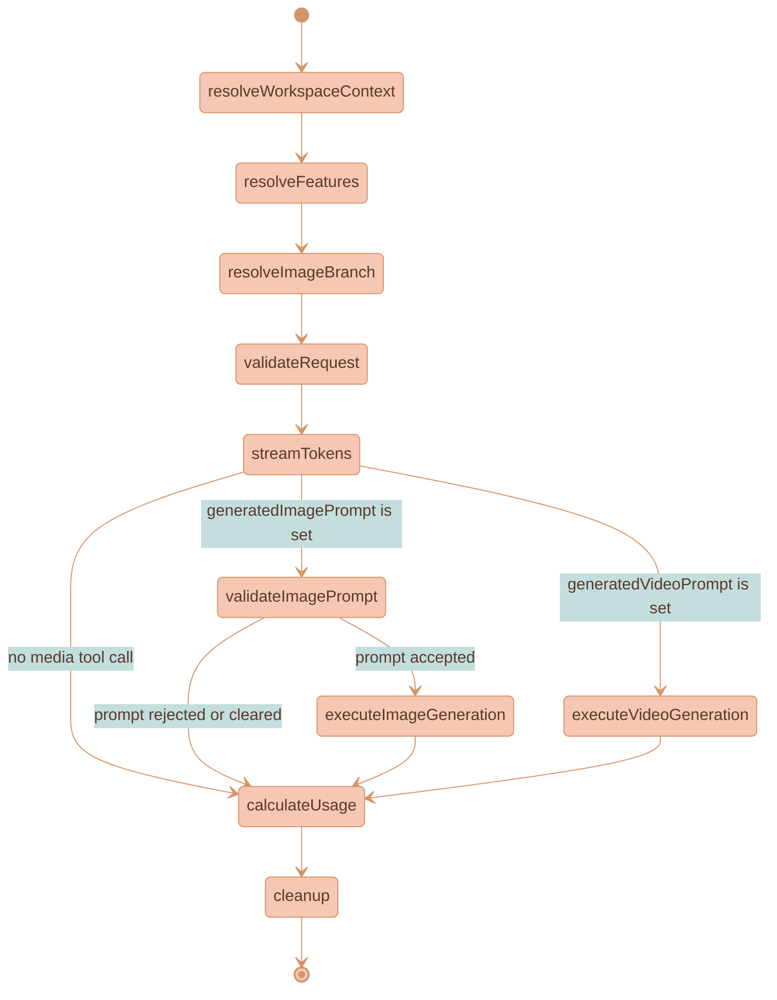
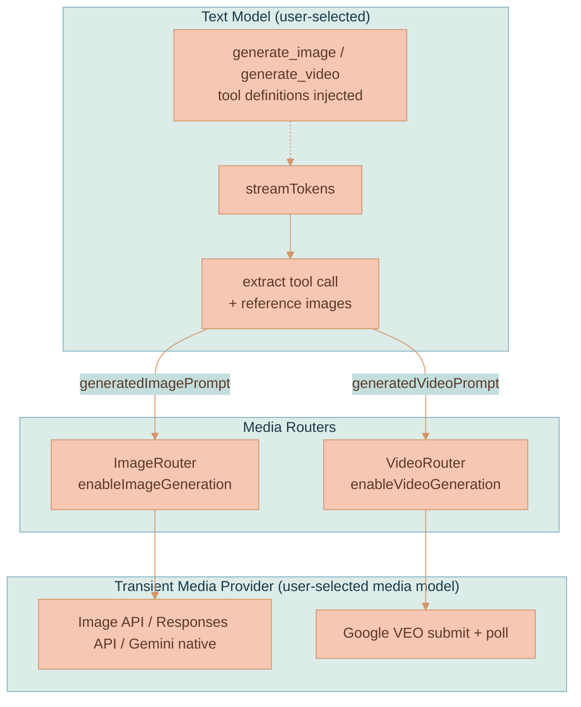
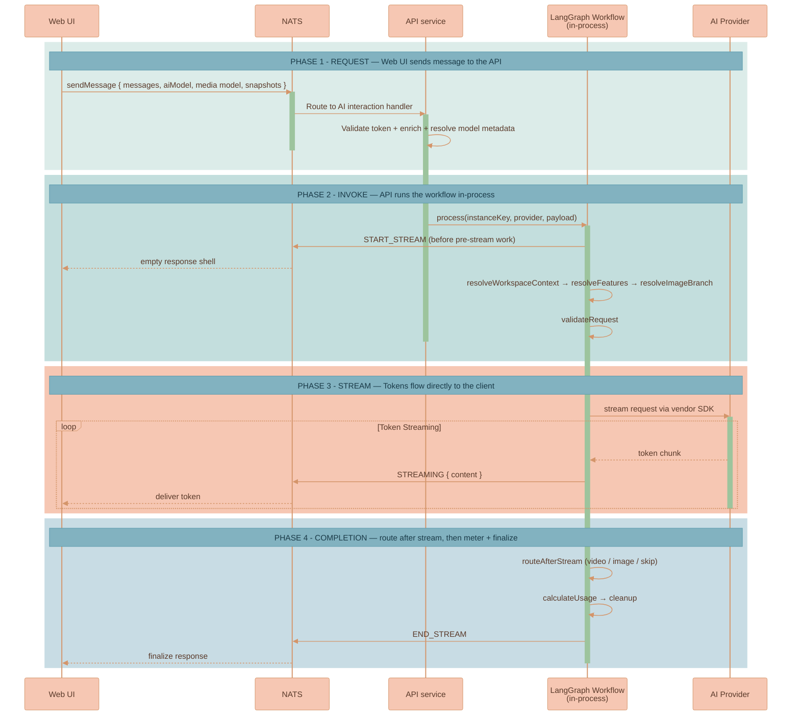

# AI Generation Pipeline

Every AI request in Lixpi — a plain text answer, an image generation, or a video generation — runs through **one shared, provider-agnostic workflow**. There is no separate "image service" or "video service": text, image, and video are branches of a single LangGraph state machine. The API service hosts this workflow **in-process** (LangGraph TS, `@langchain/langgraph`), and each model vendor (Anthropic, OpenAI, Google) implements the same `BaseProvider` contract. The graph and the base provider both live in [`base-provider.ts`](../../services/api/src/llm/providers/base-provider.ts).

The headline design is **dual-model routing**. A user picks a *text model* and, independently, an optional *media model* (image and/or video). The text model never paints pixels or renders frames; it understands intent, writes a rich enhanced prompt, and emits a `generate_image` or `generate_video` tool call. The workflow then routes that enhanced prompt to a transient media provider through an `ImageRouter` or `VideoRouter`. This separation lets each model do what it is best at: language models excel at reading the conversation and writing exhaustive descriptions; image and video models excel at visual synthesis.

This page covers the workflow itself: its nodes, shared state, tool mechanism, media routers, stream lifecycle, and usage metering. It deliberately does **not** re-list the stream-event catalog — see [Streaming and Events](./STREAMING-AND-EVENTS.md) for the wire-level events these nodes emit. For the system-wide picture of how the API hosts this workflow, see [System Architecture](./SYSTEM-ARCHITECTURE.md).


LLM orchestration previously lived in a separate Python `services/llm-api/` task. It was absorbed into `services/api` once the TypeScript LangGraph package covered Lixpi's workflow needs. The workflow is stateless and scales horizontally with the rest of the API service.


## The Shared Workflow

The workflow processes every request through the same ordered nodes. Three **pre-stream resolver** nodes run first — they assemble workspace context, resolve `/use` features, and ground visual references before any token is generated. The text model then streams. A single 3-way router inspects the streamed result and sends the request down the video branch, the image branch, or straight to usage accounting. Every path converges on `calculateUsage` and `cleanup`.



The router after `streamTokens` is the authoritative **3-way `routeAfterStream`**. Its precedence is fixed: a video prompt wins, then an image prompt, then skip. The image branch has an extra `validateImagePrompt` step that the video branch does not — VEO prompts have no strict length limit, so there is no video prompt-validation node.

## Frontend Boundary

The API owns AI-generation decisions. Do not put model routing, reasoning fanout, context relevance, image/video branch resolution, media lineage topology, fork/origin marker creation, generated-media parentage, provenance, usage, authorization, or persistence ownership in `services/web-ui`.

The browser can send user input and non-authoritative snapshots, then render API stream events and persisted state. If the UI needs a new decision to render correctly, add a typed API state field or stream event. Do not infer it in Svelte, ProseMirror plugins, canvas stores, `WorkspaceCanvas.ts`, or web-ui services.

### Node Responsibilities

The pre-stream resolvers and planner are large features in their own right; each gets a one-line description here and a link to its dedicated page. The streaming, routing, execution, usage, and cleanup nodes are fully described below.

| Node | Job |
|------|-----|
| `resolveWorkspaceContext` | Ranks the descriptors-only workspace snapshot, force-includes explicit chips and edge-connected nodes, self-heals weak descriptors once, and narrows the media candidate set. Runs on every text, image, and video turn. See [Context Relevance](../ai-chat/CONTEXT-RELEVANCE.md). |
| `resolveFeatures` | Always-on pre-stage. Resolves `/use` feature references at send time, fetching each feature (ACL-checked) and injecting its instructions, parameters, and content-free source crops as system context. See [Using Features](../library/USING-FEATURES.md). |
| `resolveImageBranch` | Structured VLM resolver that assigns visual roles (target, base-context, style-reference, comparison-target, excluded) to the narrowed candidate media. Shared by image *and* video; a no-op when no media model is selected. See [Branch Lineage](../media-generation/BRANCH-LINEAGE.md). |
| `planMediaBranchLineage` / `MediaBranchLineagePlanner` | API-side planner used after branch resolution for media-enabled requests. It assigns branch origin/fork marker IDs, lineage parent IDs, neutral branch-root provenance, and per-run lineage assignments before reasoning/media fanout. Matrix requests run the same planner once in shared preflight and pass the plan to every child run. |
| `validateRequest` | Validates required request fields and extracts model metadata (text model, and any image/video model pricing + capabilities) before streaming begins. |
| `streamTokens` | Runs the text model's `_stream_impl()`. Injects the media tool(s) and augments the system prompt when a media model is selected, streams the response (text chunks to the browser), then extracts any `generate_image` / `generate_video` tool call into state. |
| `routeAfterStream` | The post-stream conditional. Precedence: `generatedVideoPrompt` → video branch; else `generatedImagePrompt` → image branch; else `skip` to usage. The model normally emits at most one media tool call per turn. |
| `validateImagePrompt` | Image-branch-only gate. Re-checks the extracted image prompt (e.g. provider length limits); if rejected or cleared, the graph skips generation and proceeds to usage. |
| `executeImageGeneration` | Conditional node. Builds an `ImageRouter` that instantiates a fresh provider for the image model and calls `provider.process()`. Publishes the image generation trace before invoking the media provider. |
| `executeVideoGeneration` | Conditional node. Publishes `VIDEO_GENERATION_TRACE` (tool prompt + selected/excluded references) **before** running — so chat history can render the trace even if VEO later fails — then calls `runVideoRouter`. On error it publishes `VIDEO_ERROR`. |
| `calculateUsage` | Computes per-token, per-image-tier, and per-second-video costs from the streamed/generated metrics. |
| `cleanup` | Finalizes the run and publishes the final usage report via NATS. |


`resolveImageBranch` keeps its image-centric name even though it now grounds references for video too. Its gate runs whenever an image **or** video model is selected, and it requires the browser-built `imageBranchCandidateSnapshot`; a missing snapshot for a media-enabled request fails the graph visibly rather than guessing.

Empty candidate snapshots are valid. The resolver synthesizes a fresh-branch resolution in the API without calling the VLM, then `planMediaBranchLineage` assigns the branch topology.

For media-enabled requests, branch resolution is immediately followed by API lineage planning. The planner emits `MEDIA_LINEAGE_PLANNED` and copies each run's `MediaRunLineageAssignment` into `generationRun.lineageAssignment`, so browser code applies topology instead of deriving branchOrigin/branchFork decisions from local state. Matrix requests run this once in shared preflight; single media requests run it as the `planMediaBranchLineage` graph node. Only existing AI-generated branch members can become generated-media parents; uploaded/source/reference media are references and placement anchors, not connector parents.

`MediaGenerationRunPlanner` is the shared run metadata layer for single requests, matrix reasoning runs, image routers, and video routers. It assigns stable reasoning/media run IDs and attaches the API lineage assignment to each concrete media run. Provider-specific image/video code must not implement separate branching, parent selection, or marker-topology logic.

**Shared-preflight propagation invariant.** Matrix requests run the three resolver pre-stages and lineage planning once in a shared preflight, then dispatch every reasoning child with `preflightResolved: true`, which makes each child's provider graph skip those nodes. So the orchestrator forwards the **complete** resolved patch — workspace context, `/use` feature output (`featureReferenceImages`, `featureUsagePrompt`, and the rewritten `messages`), branch resolution (including the video first-frame / reference images), and the lineage plan — to every child rather than a hand-picked subset. This is enforced at the pipeline level, not per media type: `runSharedPreflight` returns exactly the accumulated resolver patches and the fanout spreads them, so reference inputs for images, video, and any media modality added later propagate to every child uniformly. Any field a resolver emits but the fanout drops is invisible to matrix children — for video that collapses generation to text-to-video — so the contract is to forward the whole patch and never re-enumerate fields. `/use` feature references therefore reach every selected image and video model the same way: `resolveFeatures` produces them once, the preflight forwards them, and each router applies them in its provider's reference format (image input blocks; VEO/Seedance reference images, capped per model and mutually exclusive with first-frame/extension inputs).


## Provider State

The workflow's state is a `TypedDict` (`ProviderState`) that flows through every node, defined alongside the channel reducers in [`state.ts`](../../services/api/src/llm/graph/state.ts). The video fields mirror the image fields and use the same **"keep if undefined"** channel reducers, so a node that does not touch a field leaves it intact. VLM branch resolution is **shared** between image and video, so there is no separate video resolution field.

### Shared Fields

| Field | Type | Purpose |
|-------|------|---------|
| `messages` | `list` | Raw conversation messages from the frontend (OpenAI-like `input_image` blocks, etc.). |
| `model_version` | `str` | Text model ID (e.g. `claude-sonnet-4-20250514`). |
| `workspaceContextSnapshot` | `WorkspaceContextSnapshot?` | Descriptors-only workspace index consumed by `resolveWorkspaceContext`. |
| `workspaceContextResolution` | `WorkspaceContextResolution?` | Selected context nodes, improved descriptors, and narrowed media IDs. |
| `imageBranchCandidateSnapshot` | `ImageBranchCandidateSnapshot?` | Image/video still candidates (narrowed by workspace relevance) consumed by the shared structured VLM resolver. |

### Image-Specific Fields

| Field | Type | Purpose |
|-------|------|---------|
| `enable_image_generation` | `bool` | `True` when this provider is invoked as the image model by `ImageRouter`. |
| `image_model_version` | `str` | Selected image model ID (e.g. `gpt-image-1.5`). |
| `image_provider_name` | `str` | Image model provider (`OpenAI`, `Google`). |
| `image_model_meta_info` | `dict` | Image model pricing and metadata. |
| `generated_image_prompt` | `str` | Enhanced prompt extracted from the text model's `generate_image` tool call. |
| `reference_images` | `list[str]` | Data URLs of selected reference images, extracted after the tool call. |
| `image_size` | `str` | Requested size (`1024x1024`, `auto`, etc.). |
| `image_usage` | `dict` | Image generation usage stats for billing. |

### Video-Specific Fields

| Field | Type | Purpose |
|-------|------|---------|
| `enableVideoGeneration` | `boolean` | `true` when this provider is invoked as the video model by `VideoRouter`. |
| `videoModelVersion` | `string` | Selected video model ID (e.g. `veo-3.0-generate-001`). |
| `videoProviderName` | `ProviderName` | Video model provider (`Google`). |
| `videoModelMetaInfo` | `AiModelMetaInfo` | Video model pricing + metadata (resolved by the gateway). |
| `videoAspectRatio` | `string` | `16:9` \| `9:16`. |
| `videoResolution` | `string` | `720p` \| `1080p` \| `4k`. |
| `videoDurationSeconds` | `number` | Selected duration from the synced model metadata (VEO dropdowns currently expose `8`, because reference images, extension, and higher resolutions require 8 seconds). |
| `generatedVideoPrompt` | `string` | Enhanced prompt extracted from the text model's `generate_video` tool call. |
| `videoFirstFrameImage` | `string` | VLM-selected first frame, as a data URL (image-to-video). |
| `videoReferenceImages` | `string[]` | VLM-selected style/content references (≤3). |
| `videoSourceForExtension` | `string` | `nats-obj://…` URI of a source MP4 to extend (multi-turn). |
| `generatedVideos` | `string[]` | Resulting video URLs/ids. |
| `videoUsage` | `VideoUsage` | `{ durationSeconds, resolution, aspectRatio }` for billing. |

## Dual-Model Architecture

The user selects a text model and an optional media model **independently**, per AI thread. The two selections behave differently:

- The **image model** dropdown auto-selects a sensible default, so image generation is available without extra configuration.
- The **video model** dropdown is **opt-in** — it stays on its "Video Model" placeholder until the user explicitly picks one. While no video model is selected, the `generate_video` tool is never injected, so existing text-only and image-only flows are unchanged.

When a media model is selected, the text model's request is augmented with the matching tool definition and the matching system-prompt instructions (`image_generation_instructions.txt` and/or `video_generation_instructions.txt`). The text model writes the enhanced prompt, shows it to the user, and emits the tool call. The workflow extracts that prompt and routes it to a **transient** media provider — a fresh provider instance for the media model, separate from the text model that requested it.



## Shared Tool Mechanism

Image and video share one tool-calling mechanism. The tool definitions live in [`image-generation.ts`](../../services/api/src/llm/tools/image-generation.ts) and [`video-generation.ts`](../../services/api/src/llm/tools/video-generation.ts).

### Injection Rules

A media tool is injected into the text model's request **only when** a media model of that kind is selected **and** the current provider is not already running as a transient media provider. The guard for video is representative:

```text
injectVideoTool = hasVideoModel && !enableImageGeneration && !enableVideoGeneration
```

This is what prevents **infinite recursion**: a transient image or video provider must never see the media tools, or it could call itself. Both `generate_image` and `generate_video` can be injected in the **same turn** when both an image and a video model are selected; the text model then picks the tool matching intent (`generate_video` for motion/clips, `generate_image` for stills).

### Tool Schema

Both tools share a single, minimal schema — one required `prompt` string. (`generate_video` has no per-model `maxChars` machinery, since VEO prompts have no strict length limit.)

```jsonc
{
  "type": "object",
  "properties": {
    "prompt": {
      "type": "string",
      "description": "A detailed, descriptive prompt for image/video generation…"
    }
  },
  "required": ["prompt"]
}
```

The schema is wrapped differently per provider:

| Provider | Format key | Schema key |
|----------|-----------|------------|
| OpenAI | `type: "function"` | `parameters` |
| Anthropic | — | `input_schema` |
| Google | — | `parameters` (wrapped in a `FunctionDeclaration`) |

### Per-Provider Tool-Call Extraction

After the text model finishes, each provider extracts the tool call from its own response shape:

| Provider | Where the call lives | What it matches |
|----------|----------------------|-----------------|
| OpenAI | `response.output[*]` | `type: 'function_call'`, `name: 'generate_image'` / `'generate_video'` |
| Anthropic | `finalMessage.content[*]` | `type: 'tool_use'`, `name: 'generate_image'` / `'generate_video'` |
| Google | `response.candidates[*].content.parts[*]` | `functionCall` with `name: 'generate_image'` / `'generate_video'` |

### Reference Image Extraction (Image)

When an image tool call is detected, `extractReferenceImages()` scans the **already-resolved** user messages (after NATS object-store refs have been converted to data URLs) for attached images, handling all three provider block formats:

| Format | Block type | Image data location |
|--------|-----------|---------------------|
| OpenAI | `input_image` | `block.image_url` (data URL string) |
| Anthropic | `image` | `block.source.data` (base64) + `block.source.media_type` |
| Google | `inline_data` | `block.data` (base64) + `block.mime_type` |

For image branches, the reference set the text model writes against is the exact VLM-approved set produced by `resolveImageBranch` — branch resolution runs *before* `streamTokens` precisely so the prompt is written against approved references. See [Branch Lineage](../media-generation/BRANCH-LINEAGE.md).

### System Prompt Enhancement

When a media model is selected, the text model's system prompt is augmented (`get_system_prompt(include_image_generation=…, includeVideoGeneration=…)`), appending the matching instructions file. In both cases the model is told to **always use the tool** for visual/motion requests (never describe media in prose) and to **show the enhanced prompt** to the user. The two flows diverge in how the prompt is displayed: images use a `>` quote block; video uses `<video_prompt>…</video_prompt>` XML tags (a deliberate divergence so the stream publisher can wrap each correctly — see [Streaming and Events](./STREAMING-AND-EVENTS.md)).

## ImageRouter and VideoRouter

The routers bridge the text model's tool call to the transient media provider. They are siblings: `ImageRouter` ([`image-router.ts`](../../services/api/src/llm/tools/image-router.ts)) and `VideoRouter` ([`video-router.ts`](../../services/api/src/llm/tools/video-router.ts)).

Both routers receive already-planned run metadata from `MediaGenerationRunPlanner`. They may choose provider-specific request fields, but they must not implement separate branch/source/fork decisions or rewrite lineage assignments themselves.

Each router:

1. Reads the relevant state — for image: `generated_image_prompt`, `reference_images`, `image_provider_name`, `image_model_version`; for video: `generatedVideoPrompt`, the resolved first-frame/reference/extension inputs, `videoProviderName`, `videoModelVersion`.
2. Instantiates a **fresh provider** for the media model.
3. Builds a request with the enhanced prompt as the user message and any reference images as content blocks.
4. Calls `provider.process(request)` with `enableImageGeneration: true` / `enableVideoGeneration: true`.

That `enable…` flag is what makes the transient provider **skip its own stream lifecycle** (no second `START_STREAM` / `END_STREAM`) and route to the correct media generation path instead of the normal text path. The text model owns the stream; the media provider only publishes media events.

## Stream Lifecycle

Top-level (user-facing) requests publish `START_STREAM` **before** the pre-stream resolver work runs. This creates the empty assistant-response shell immediately, so the browser enters a receiving state and does not look frozen while workspace relevance, feature resolution, image-URL normalization, and the branch VLM call execute. Real text tokens still wait until branch resolution completes, because the text model must receive the VLM-approved reference set.

The `StreamPublisher` ([`stream-publisher.ts`](../../services/api/src/llm/graph/stream-publisher.ts)) makes `start()` and `end()` **idempotent**:

- A provider can call `publisher.start()` when its own stream begins without emitting a duplicate `START_STREAM`.
- `END_STREAM` is ignored if it arrives before `START_STREAM`.
- A pre-stream error publishes `ERROR` and then `END_STREAM`, so the browser never gets stuck receiving.
- Transient media providers invoked through the routers skip their own lifecycle entirely — the parent chat stream owns it.

A **circuit breaker** bounds every request: `LLM_TIMEOUT_MS` (default 20 minutes) plus a shared `AbortController`. This matters most for video: a VEO submit+poll loop occupies a worker for minutes with no token traffic, so the poll loop publishes a `VIDEO_GENERATING` keepalive on a fixed interval to keep the browser informed while staying inside the breaker.


This page intentionally does not enumerate the stream events. The complete catalog — `START_STREAM`, `STREAMING`, `END_STREAM`, `ERROR`, the image/video/branch/relevance events, and the collapsible wrappers — with their payloads and browser handling lives in [Streaming and Events](./STREAMING-AND-EVENTS.md).


## Request-to-Stream Sequence

The end-to-end path for a text request: the browser publishes a message, the API validates and enriches it, then invokes the in-process workflow, which streams tokens directly back over NATS. (When the text model emits a media tool call, the image/video branch executes between the stream and usage accounting — see the branch detail on [Image Generation](../media-generation/IMAGE-GENERATION.md) and [Video Generation](../media-generation/VIDEO-GENERATION.md).)



## Usage Metering

`calculateUsage` computes cost per request, dispatching on what actually ran:

- **Text** — per-token cost from the streamed token counts.
- **Image** — per-image-tier cost from `image_usage` (tier by resolution/quality).
- **Video** — `reportVideoUsage` ([`usage-reporter.ts`](../../services/api/src/llm/usage/usage-reporter.ts)) computes per-second cost from the model's video pricing metadata and returns a `VideoUsageReport`.


Usage is computed by the reporter and, when billing is enabled (`BILLING_ENABLED=true`), published to NATS as `metrics.usage.ai` usage events — one per modality, keyed by the run's `workflowId` with a 1-based `workflowSeq`. The publish happens in `calculateUsage` ([`base-provider.ts`](../../services/api/src/llm/providers/base-provider.ts)) via the billing client ([`services/api/src/billing/`](../../services/api/src/billing/)); it is fire-and-forget and never on the response latency path. `END_STREAM` still does not carry usage — usage travels on the billing subject, not the token stream. When billing is disabled the reporter still computes and logs, with no publish.


## Adding a Provider

Adding a new model vendor means implementing the `BaseProvider` class in [`services/api/src/llm/providers/`](../../services/api/src/llm/providers/). The provider supplies the vendor-specific streaming, tool-call extraction, and (where applicable) media generation paths; the shared workflow, state, routers, stream lifecycle, and usage accounting are inherited unchanged. Every AI request sends the full conversation history — no provider-specific session IDs are stored — so a user can switch between Claude, GPT, and Gemini mid-conversation. This provider-agnostic design is described further in [System Architecture](./SYSTEM-ARCHITECTURE.md).

## Related Pages

- [Streaming and Events](./STREAMING-AND-EVENTS.md) — the wire-level event catalog these nodes emit and how the browser renders them.
- [System Architecture](./SYSTEM-ARCHITECTURE.md) — how the API hosts this workflow and scales it.
- [Context Relevance](../ai-chat/CONTEXT-RELEVANCE.md) — the `resolveWorkspaceContext` resolver.
- [Branch Lineage](../media-generation/BRANCH-LINEAGE.md) — the shared `resolveImageBranch` structured VLM resolver.
- [Using Features](../library/USING-FEATURES.md) — the `resolveFeatures` `/use` pre-stage.
- [Image Generation](../media-generation/IMAGE-GENERATION.md) — the image branch detail (providers, partial streaming).
- [Video Generation](../media-generation/VIDEO-GENERATION.md) — the video branch detail (VEO submit/poll, playback).
