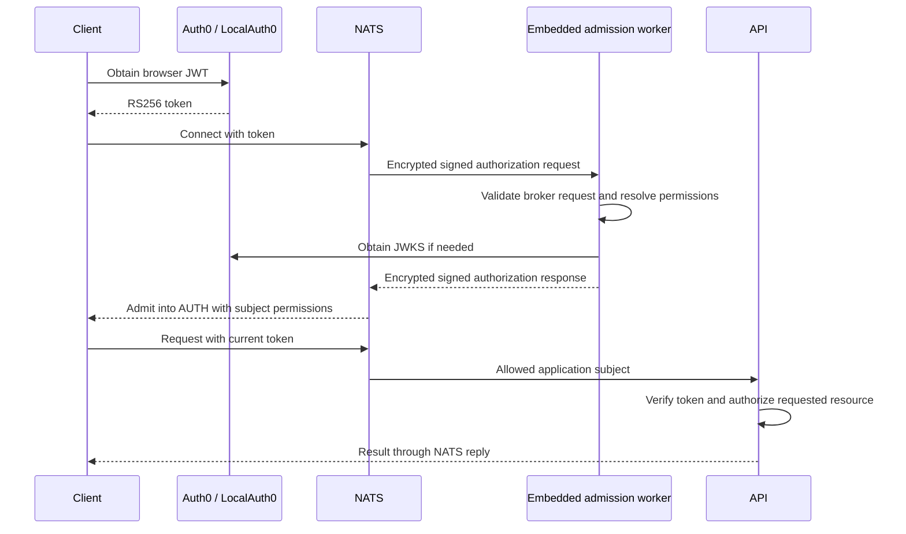

# Authentication

NATS connection admission runs inside each [Go broker](../../services/nats/README.md). It uses the upstream encrypted auth-callout protocol over an in-process NATS connection. The API separately verifies the user JWT on each browser request and authorizes access to the requested resource. A connection grant for `workspace.get` does not authorize every workspace.

The main SPA and user portal share identity behavior through `@lixpi/auth-client`. Each creates its own auth client and NATS connection through `@lixpi/web-client-service-factory`. Production serves the main application and `user-portal.<domain>` from separate origins. Each origin has its own Auth0 SDK cache, while both use the same Auth0 application and Universal Login session. Opening the portal can complete silent authorization without asking an already signed-in user for credentials again.

Auth0 must list the portal in Allowed Callback URLs, Allowed Logout URLs, and Allowed Web Origins. NATS WebSocket `allowed_origins` must include both clients; Pulumi adds both origins for AWS stacks.

## Credential verification

| Client | Credential | Verification |
|---|---|---|
| Browser | Auth0 or LocalAuth0 RS256 JWT | Bounded provider JWKS cache in the broker |
| Internal TypeScript/Python service | Self-issued Ed25519 JWT | Registered NKey, exact issuer/subject, and time claims |
| Native NATS tool | NKey signature over the broker nonce | Registered public user NKey |
| Embedded dispatcher | Restricted bootstrap password | Broker configuration, in-process connection only |

The Go verifier handles connection credentials. `@lixpi/auth-service` supplies service token creation and the API's browser verifier. Native NEX, backup, and operator clients use the raw challenge path. The broker's native NKey entries enable nonce advertisement; the embedded worker makes the final application admission decision.

Service verification does not require Auth0 or JWKS. Browser verification uses cached provider keys where available and denies admission if the needed key cannot be obtained.

## Connection flow

Auth verifies the server NKey signature and matching server identity, request audience/account subject, protocol type/version, signed XKey/header agreement, user NKey, and time claims. It bounds credential processing by the broker request's expiry. A successful response contains the signed user JWT and is itself signed and XKey-encrypted to the requesting server.

XKey protects the callout payload independently of transport TLS. The configured internal client listener on 4222 uses `nats://`; browser connections use `wss://` on the WebSocket TLS listener. TLS does not grant permission to publish callout replies. See [NATS Cluster](deployment/NATS-CLUSTER.md).

## Accounts and secret ownership

CALLOUT contains the restricted embedded dispatcher identity and has no application JetStream storage. It may consume `$SYS.REQ.USER.AUTH` in queue `nats-auth`, exchange scoped peer messages, and send bounded replies. The bootstrap user accepts only upstream NATS `IN_PROCESS` connections. TCP and WebSocket clients cannot use it, even with its password. Each broker receives the private account issuer and XKey seeds through ECS secret references; API and workload tasks receive neither those seeds nor the bootstrap password.

AUTH contains browser, API, conversion, fidelity, backup, and operator identities and retains application Object Store buckets and streams. NEX keeps its separate account. SYS, CALLOUT and REGISTRATION are forbidden targets for ordinary service registrations. REGISTRATION stores signed declarations in native JetStream KV. Application accounts are supplied through the deployment authority's allowed-account configuration.

The accepting broker retains its native callout locally and can send credential evaluation to a compatible peer on an operational failure. An explicit denial is terminal, and peer retry cannot rescue a client socket after its broker process dies. [Broker and Admission Architecture](../../services/nats/documentation/ARCHITECTURE.md) defines route isolation, signed membership, reply binding, capacity/deadline limits and supervision. [Service Operations](../../services/nats/documentation/OPERATIONS.md) defines health and metrics; provider availability remains separate from structural broker health.

## Shared permission contracts

`@lixpi/nats-subject-registry` owns data-only endpoint metadata, endpoint `permissions`, and built-in service permission profiles. `@lixpi/constants` owns subject names and wire values; its typed `getNatsSubjectPath()` selector supplies contract identifiers and handler-map keys. The explicit active groups preserve request subjects, payload formats, queue names, event-only grants, private endpoints, and generic portal extensions. `createNatsSubscriptions()` attaches API handlers and rejects missing or extra entries. Auth consumes the same declarations without importing handlers, DynamoDB, Capability execution, or LLM code. Endpoint permissions and `portalPermissions` form the shared `permissionTemplates` used for user admission; service identities use their separate profiles.

The application registration builder includes the verified identity's `_INBOX.<hex-user-id>.>` template. The generic broker expands identity placeholders and deduplicates subjects. Browser clients set the matching inbox prefix. A policy of `none` declares a private endpoint; event-only grants do not imply request publication. Built-in service allowlists live in `@lixpi/nats-subject-registry/service-permissions`. Deployment setup binds them to public keys and accounts, then signs the resulting manifest. Service profiles are independent allowlists, not browser policy with publish and subscribe reversed.

The application registry exposes schema 3 and a diagnostic digest. The broker consumes signed runtime-registration schema 1 over its restricted bootstrap connection, without compiling application declarations into its image. It validates the authority, owner, account scope, version and permissions before committing the complete owner manifest. Admission reads the registry stream leader and pins the returned snapshot. Peer work must use that same revision. Neither a transport grant nor a service registration replaces resource authorization.

## Additional service registrations

Add deployment-owned identities to `NATS_SERVICE_AUTH_REGISTRATIONS` in the environment file. Each entry declares `userId`, `publicKey`, `account` and explicit publish/subscribe permissions. Saving that file through the normal [init-config partial-update flow](../../dev-tools/config-utils/README.md) derives and signs the complete manifest. API startup submits it automatically. This setting is input to application deployment tooling; it is not passed to the broker.

A separate application may use its own authority, owner and allowed accounts. Its initializer submits its signed manifest through the same restricted registration client. The authority signature approves the grant, so possession of a service seed or bootstrap password does not permit self-assigned access. The generic validator accepts valid NATS wildcard patterns and rejects missing permission directions unless they explicitly deny all.

See the [registration protocol](../../services/nats/documentation/CONFIGURATION.md#registration-protocol) for wire fields, compare-and-swap behavior and size limits, and the [internal service guide](../knowledge/INTERNAL-SERVICE-NATS-AUTH-PATTERN.md) for client wiring.

## Request authorization and session lifetime

API NATS middleware requires the current application JWT, replaces caller-supplied identity with the verified subject, and removes the raw token before invoking a handler. It has no callout exemption; the API never subscribes to that protocol subject. Workspace, Asset, and Capability handlers perform their own membership and resource checks.

Input credentials and broker request time claims are validated at admission. The issued NATS user JWT has no expiry. This implementation does not periodically disconnect clients or renew established sessions; changing a registration affects subsequent admissions. Request JWT expiry remains enforced independently.

## LocalAuth0

LocalAuth0 issues real RS256 JWTs and exposes JWKS, exercising the production verifier path without an Auth0 account. Its keys, user record, custom claims, and permissions persist in the `localauth0-data` volume. The default test user is `test@local.dev` (`local|test-user-001`). Mock authentication is restricted to `ENVIRONMENT=local`.

See the [LocalAuth0 guide](../../services/localauth0/README.md), [broker operations](../../infrastructure/pulumi/src/resources/NATS-cluster/README.md), and [Go verification guide](../code-quality/testing/GO.md).
