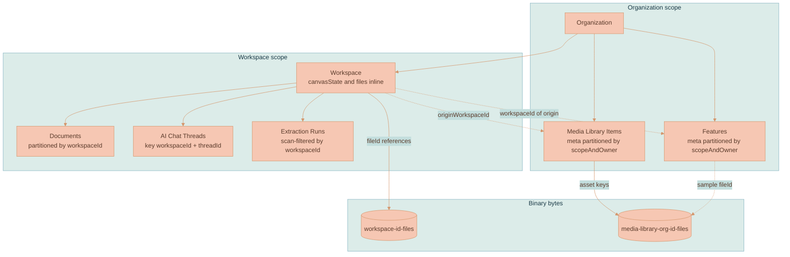

# Data Storage

This page explains where each kind of item a user sees inside a workspace lives, how those records are keyed, and how binary media is stored separately from structured metadata. It complements the [Workspace Model](../canvas/WORKSPACE-MODEL.md), [Feature Storage](../library/FEATURE-STORAGE.md), and [Media Library](../library/MEDIA-LIBRARY.md) pages, which each go deeper on one item type; this page is the cross-cutting view of the persistence layer.

Fact-check anything here against the models in [`services/api/src/models/`](../../services/api/src/models), the shared access layer in [`packages/lixpi/dynamodb-service/`](../../packages/lixpi/dynamodb-service), and the table definitions in [`infrastructure/pulumi/src/resources/db/DynamoDB-tables.ts`](../../infrastructure/pulumi/src/resources/db/DynamoDB-tables.ts) before repeating it.

## Two-Tier Storage

Every item splits into **structured metadata** and **binary bytes**, held in two different systems.

| Storage | Technology | What it holds |
|---------|-----------|---------------|
| **DynamoDB** | AWS DynamoDB (DynamoDB Local in development) | Structured records: workspaces, canvas state, documents, chat threads, features, extraction runs, and the file IDs that reference binary assets |
| **Object Store** | NATS JetStream Object Store | Binary bytes: uploaded files, generated images and videos, posters, media-library assets |

DynamoDB records store only the **keys** that address objects in the object store (a canvas image node's `fileId`, a workspace's inline `files[]` registry, a feature's `sampleImages[].fileId`). The raw bytes are never stored in DynamoDB.

The DynamoDB access layer is a single shared class, [`DynamoDBService`](../../packages/lixpi/dynamodb-service/src/dynamodb-service.ts), used by every model through a global `dynamoDBService`. Physical table names are computed by `getDynamoDbTableStageName('LOGICAL_NAME', ORG_NAME, STAGE)`, which maps a logical key to a stage-scoped physical name such as `Workspaces-<org>-<stage>`. Tables use `PAY_PER_REQUEST` billing, and outside a custom local provider they enable DynamoDB Streams with `NEW_AND_OLD_IMAGES`.

## Keying Rules

Two rules govern how tables are keyed and written. They are the contract for any new item type.

### The Partition Key Is the Thing You List By

If an access pattern lists items within a scope, the table serving that list is partitioned by that scope. Listing a workspace's documents is `Query(Documents, workspaceId = ...)`; listing an organization's media is `Query(Media-Library-Items-Meta, scopeAndOwner = ...)`. Every list read is a single-partition `Query` — never a full-table `Scan` (the one deliberate exception is `Extraction-Runs`, whose tiny volume suits a scan) and never a secondary index.

The canonical pattern is `AI-Chat-Threads`: PK `workspaceId`, SK `threadId`. Point operations address a row with the scope id plus the item id, both of which every caller carries.


Do not add DynamoDB Global Secondary Indexes. A GSI is a second physical copy of the table with its own write capacity, its own eventual-consistency lag, and its own failure mode — a write that lands in the base table but not yet in the index produces a stale list. If a list query seems to need a GSI, the base-table key is wrong: partition the table by the scope instead. Reach for a GSI only if it is absolutely essential and no key redesign can serve the access pattern — and treat that as a design escalation, not a default. Local Secondary Indexes are acceptable; they share the base table's partition key and carry none of the second-copy cost.


Range keys are immutable ids. Never put a mutable attribute (such as `updatedAt`) in a primary key — every update would become a delete-plus-put with a partial-failure window. Recency ordering is an in-memory sort over an already-small partition.

### More Than One Table Modified Means One Transaction

Any model method that writes to two or more tables issues exactly one `transactWrite` call — the typed transaction API on `DynamoDBService` that accepts the same operation shapes as `putItem` / `updateItem` / `deleteItems` and commits up to 100 actions atomically. Either every row of the Main / Meta / Access-List triad lands, or none does.

Sequential awaits across tables, and compensating rollbacks that imitate atomicity, are both forbidden shapes; a reviewer can reject any diff that contains either. Single-table operations stay on the non-transactional methods — a transaction of one item buys nothing.

Per-item conditions still work inside a transaction (canvas saves keep their optimistic-concurrency `conditionExpression`); a failed condition cancels the whole transaction and surfaces through `isTransactionConditionalCheckFailure`, which the retry loops check.

## The Workspace Is a Peer, Not a Physical Container

In the UI a workspace feels like a folder that holds documents, threads, and media. In storage it is not a nested container:

- The **workspace record** is one DynamoDB item that embeds the canvas (`viewport`, `nodes[]`, `edges[]`) and a `files[]` reference registry inline.
- **Documents, AI chat threads, and extraction runs** live in their own tables, scoped to their workspace.
- **Media-library items and features** are **organization-scoped**. They record which workspace they originated from (`originWorkspaceId` / `workspaceId`) but are readable across every workspace in the owning organization.

## Entity Relationships

## The Main / Meta / Access-List Triad

Most item types split across three tables so that listing a sidebar never reads a heavy body.

| Table role | Suffix | Holds |
|------------|--------|-------|
| Main | (none) | The full heavy record — content, canvas state, instructions |
| Meta | `-Meta` | A lightweight projection (name, title, timestamps, preview key) for list views |
| Access list | `-Access-List` | Who can see the item, keyed by user or principal |

Creates fan out to all three tables in a single transaction: `createWorkspace` writes `Workspaces`, `Workspaces-Meta`, and `Workspaces-Access-List` as one `transactWrite`, and the media-library and feature creates do the same for their triads.

Where a Meta table serves the org-scoped list, it is the table partitioned by the scope (`scopeAndOwner` = `${scope}#${scopeOwnerId}`), and it carries the projection fields list views and save-time dedup need — the Main table stays a pure point-access body store.

## Per-Item Storage

### Workspace

Defined in [`models/workspace.ts`](../../services/api/src/models/workspace.ts). Tables: `Workspaces` / `Workspaces-Meta` / `Workspaces-Access-List`.

- Key: `workspaceId` (hash only).
- Embeds `canvasState` (`{ viewport, nodes[], edges[] }`) and a `files[]` array of `DocumentFile` references directly in the item.
- Canvas writes use optimistic concurrency. A `canvasStateUpdatedAt` token guards every write through a DynamoDB `conditionExpression` inside the Main+Meta transaction; a stale token returns `STALE_CANVAS_STATE`. `mutateCanvasState` retries up to five times on a conditional-check failure.
- `addFile` uses an atomic `list_append` so concurrent AI-generated images do not clobber each other. `removeFile` and `setFileCanonical` use read-modify-write with conditional retries. These are single-table writes and stay non-transactional.
- `mergeApiLineageForFullCanvasSave` protects API-generated media nodes and branch-marker nodes from being dropped by a full client canvas save. See [API-Owned Media Lineage Planning](../knowledge/API-OWNED-MEDIA-LINEAGE-PLANNING.md).

### Documents

Defined in [`models/document.ts`](../../services/api/src/models/document.ts). Tables: `Documents` / `Documents-Meta` / `Documents-Access-List`.

- Key: `workspaceId` (hash) + `documentId` (range) — one row per document. "All documents in this workspace" is one partition `Query` returning full bodies.
- `Documents-Meta` stays keyed by `documentId` alone so tag operations, whose payloads carry only the document id, address it directly.
- Delete removes the Main row and the Meta row in one transaction.
- ProseMirror content is stored inline as `content`.

### AI Chat Threads

Defined in [`models/ai-chat-thread.ts`](../../services/api/src/models/ai-chat-thread.ts). Table: `AI-Chat-Threads`.

- Composite key `workspaceId` (hash) + `threadId` (range), so a workspace's threads are a single efficient query. No separate meta table.
- Stores ProseMirror `content`, `aiModel`, and a `status` field.

### Media Library Items

Defined in [`models/media-library-item.ts`](../../services/api/src/models/media-library-item.ts). Tables: `Media-Library-Items` / `Media-Library-Items-Meta` / `Media-Library-Items-Access-List`.

- Main key: `itemId` (hash) + `version` (range) — point access only.
- Meta key: `scopeAndOwner` (hash, `organization#<orgId>`) + `itemId` (range). The meta partition serves both the library list and save-time dedup: the projection carries `sourceFileId`, so re-saving the same source file finds the existing meta row and point-reads the body instead of duplicating the item.
- Records are kind-discriminated (`image`, `video`, `audio`, `document`) and carry `originWorkspaceId` for provenance. See [Media Library](../library/MEDIA-LIBRARY.md).

### Features

Defined in [`models/feature.ts`](../../services/api/src/models/feature.ts). Tables: `Features` / `Features-Meta` / `Features-Access-List`.

- Main key: `featureId` (hash) + `version` (range) — point access only.
- Meta key: `scopeAndOwner` (hash) + `featureId` (range). Listing an organization's features queries the meta partition and sorts by `updatedAt` in memory.
- Records the origin `workspaceId` only; reads are allowed for any member of the owning organization. See [Feature Storage](../library/FEATURE-STORAGE.md).

### Extraction Runs

Defined in [`models/extraction-run.ts`](../../services/api/src/models/extraction-run.ts). Table: `Extraction-Runs`.

- Key: `extractionRunId` (hash) + `workspaceId` (range). Listing a workspace's runs does a full table scan filtered in memory, which suits the run volume.
- Accumulates streaming state through incremental updates: `transcriptJson`, `stageReasoning`, a `trace[]` event log, and the final `featureCard`.

## Where the Binary Bytes Live

Binary content is stored in NATS JetStream Object Store buckets, not in DynamoDB and not in S3.

| Bucket | Named by | Created |
|--------|----------|---------|
| `workspace-<workspaceId>-files` | `Workspace.getBucketName` | With the workspace lifecycle |
| `media-library-<scope>-<scopeOwnerId>-files` | `getMediaLibraryBucketName` in [`services/media-library-storage.ts`](../../services/api/src/services/media-library-storage.ts) | Lazily, on the first save into an organization |

DynamoDB records store the file IDs that address objects in these buckets. Deleting a workspace tears down both its DynamoDB records and its object-store bucket.


The object store is part of the NATS backbone. For how buckets are opened, created, and replicated, see [System Architecture](SYSTEM-ARCHITECTURE.md) and the storage sections of [Video Generation](../media-generation/VIDEO-GENERATION.md).

