# Streaming and Events

Lixpi uses NATS for the live AI generation path and JetStream for resumability while a response is active. The in-process LangGraph workflow publishes live chat pipeline events onto an internal per-pipeline subject, writes the same pipeline events to a workspace JetStream log before live publish, and mirrors AI chat document mutations into the conversation Asset's organization-scoped ProseMirror step log. Authorized API relays copy canonical live traffic to per-user browser subjects. A refreshed browser can therefore recover both pieces of active state it needs:

- non-ProseMirror pipeline events such as branch resolution, lineage planning, image/video progress, traces, and errors through `CHAT_PIPELINE_RESUME`
- rendered AI chat text and generated-media transcript nodes through `asset.document.resume` plus a per-user Asset-document event relay

The AI live path has no polling loop and no separate streaming server. Live latency is still the direct NATS WebSocket path; durability is provided by bounded JetStream streams that can replay missed events after a refresh or second-tab mount. Asset metadata/rendition cache synchronization uses tokenized Asset events plus a low-frequency reconciliation poll because those mutation notifications are invalidations, not a durable replay log.

This page documents the wire shape: live subjects, replay subjects, event statuses, and browser render paths. For which workflow nodes emit these events and why the lifecycle is shaped this way, see [AI Generation Pipeline](./AI-GENERATION-PIPELINE.md). For the system-wide messaging picture, see [System Architecture](./SYSTEM-ARCHITECTURE.md).

## Subject Families

AI generation uses one request subject, internal canonical live subjects, authorized per-user live relays, one durable pipeline-event subject family, and the shared Asset-role ProseMirror step subject family:

```text
ai.interaction.chat.sendMessage
ai.interaction.chat.receiveMessage.{scopeId}.{pipelineId}
ai.interaction.chat.receiveMessage.{userIdToken}.{scopeId}.{pipelineId}
ai.interaction.chat.pipelineResume
ai.interaction.chat.pipelineEvents.{workspaceId}.{pipelineId}
asset.document.resume
asset.document.steps.{organizationId}.{assetId}.{role}
asset.document.events.{userIdToken}.{organizationId}.{assetId}.{role}
asset.events.{created|updated|deleted|renditionUpdated}
asset.events.{created|updated|deleted|renditionUpdated}.{userIdToken}
capability.catalog.{search|list|get|create|update|delete|grant|revoke|save}
capability.catalog.changed
capability.modules.{list|get}
prompt.reference.list
ai.interaction.capability.run.{start|stop|resume|get|replay}
ai.interaction.capability.run.events.{workspaceId}.{runId}
ai.interaction.capability.run.status.{userIdToken}.{workspaceId}.{runId}
```

| Direction | Subject | Side |
|-----------|---------|------|
| Request | `ai.interaction.chat.sendMessage` | Browser publishes; the API AI-interaction handler subscribes in the `aiInteraction` queue group. |
| Canonical live pipeline events | `ai.interaction.chat.receiveMessage.{scopeId}.{pipelineId}` | API publishers write to this internal-only subject. Conversation pipelines use the conversation Asset's organization as the scope. |
| Browser live pipeline events | `ai.interaction.chat.receiveMessage.{userIdToken}.{scopeId}.{pipelineId}` | An API relay is activated only after the user is authorized for the conversation Asset and originating Workspace. Keepalive authorization point-reads only that Workspace, its Organization, and the conversation Asset; it does not rebuild account-wide requester context. `AiInteractionService` subscribes under its own tokenized prefix. |
| Pipeline replay request | `ai.interaction.chat.pipelineResume` | Browser requests missed pipeline events after `pipelineLocalStreamSeq`; API reads JetStream and replies. |
| Durable pipeline log | `ai.interaction.chat.pipelineEvents.{workspaceId}.{pipelineId}` | `PipelineEventLog` stores events before live publish. `pipelineId` is the conversation Asset ID for chat requests. |
| Asset-role replay request | `asset.document.resume` | `ProseMirrorAuthorityService` requests a small authenticated HTTP snapshot reference plus a byte-bounded page of missed Asset-role stream events. Snapshot JSON stays in Object Store and never crosses core NATS. |
| Canonical Asset-role steps | `asset.document.steps.{organizationId}.{assetId}.{role}` | API publishes durable ProseMirror `START` / `STEP` / `END` / `ERROR` events. Browsers cannot subscribe directly. |
| Browser live Asset-role events | `asset.document.events.{userIdToken}.{organizationId}.{assetId}.{role}` | `asset.document.resume` authorizes the Asset and, when `activateLiveRelay: true`, requires the originating `workspaceId`, activates a per-user relay, and returns replay state plus the exact live subject. The relay point-checks Asset/ACL access for every event and refreshes only that Workspace and Organization at most five seconds after membership changes; it never expands every Workspace in the account. Snapshot-only loads do not create relays. |
| Canonical Asset invalidations | `asset.events.{created|updated|deleted|renditionUpdated}` | API Asset/maintenance/rendition writers publish organization-tagged invalidations. Browsers cannot subscribe directly. |
| Browser Asset invalidations | `asset.events.{created|updated|deleted|renditionUpdated}.{userIdToken}` | Every active API replica re-evaluates current organization, scope/reference, and ACL authorization before relaying. Authorization point-reads only the event Organization and the Workspaces referenced by that Asset; it never rebuilds the user's account-wide Workspace catalog. The browser's resulting `asset.get` refresh includes the active Workspace and uses the same point-scoped authorization. Previously authorized IDs are remembered so revocation/deletion can remove cache entries; duplicate/out-of-order refreshes are revision-guarded. |
| Capability catalog commands | `capability.catalog.*` | Browser commands reach authenticated API handlers. Search and list return thin authorized metadata; full manifests and resources require separate authorization. |
| Capability catalog invalidation | `capability.catalog.changed` plus user-tokenized relay | Catalog mutations invalidate affected user, organization, global, and explicit-principal query caches. |
| Capability module reads | `capability.modules.{list|get}` | Workspace-authorized source-registry reads return top-level module metadata and entry identity. They never serialize module-internal Tool or Skill packages as standalone rows. |
| Prompt-reference catalog | `prompt.reference.list` | Workspace-authorized category search for Media, Capability modules, standalone Tools, or standalone Skills. Empty queries merge per-user reauthorized recents. The internal `prompt.reference.acceptedUse` handler records only already-authorized references from an accepted submit. |
| Capability run commands | `ai.interaction.capability.run.{start|stop|resume|get|replay}` | Start validates ownership and Tool input. Stop requires the run owner. Resume authorizes the run, activates the live relay, and returns replay state plus the exact tokenized subject. |
| Durable Capability run events | `ai.interaction.capability.run.events.{workspaceId}.{runId}` | The runner writes safe ordered events before live publication. Raw prompts, resource bytes, and unrestricted action output are excluded. |
| Browser Capability run status | `ai.interaction.capability.run.status.{userIdToken}.{workspaceId}.{runId}` | Authorized per-user relay. The browser subscribes before replay, buffers live events, deduplicates by run sequence, then drains the buffer to close the replay/live race. |

Subject names live in [`nats-subjects.json`](../../packages/lixpi/constants/nats-subjects.json). AI stream status values live in [`ai-interaction-constants.json`](../../packages/lixpi/constants/ai-interaction-constants.json) (`STREAM_STATUS`).

Browser user JWTs grant publish permission for command subjects and subscribe permission for `_INBOX.>` plus tokenized live-event prefixes. They never grant subscribe permission on command subjects, canonical AI/document/Asset subjects, or cross-tenant Capability events; request payloads contain bearer tokens and must not be observable by another NATS client.

## Durable Logs

### Pipeline Event Log

`StreamPublisher` writes every chat pipeline event through [`PipelineEventLog`](../../services/api/src/llm/graph/pipeline-event-log.ts) before publishing the canonical live `receiveMessage` event. The stream is per workspace (`PIPELINE_EVENTS_{workspaceId}`), uses file storage, `allow_direct`, limits retention, and one subject per pipeline. When a chat-only or media response finishes, `StreamPublisher` drains every response and canvas write, persists and ends the conversation document, then immediately purges that pipeline subject. A failed purge is retried after one minute. The seven-day maximum age is only a crash/orphan backstop for a process that terminates before explicit cleanup succeeds. Generated output provenance is materialized from the persisted conversation Asset, so completed pipeline events are not retained for provenance. The browser never receives permission for the canonical subject; an API relay copies events to the authorized user-token subject.

Response publishing uses separate in-process queues for media runs. Events without a concrete `generationRun.mediaRunId` publish through the main response queue. Media trace, partial, complete, and error events with a `mediaRunId` publish through that run's queue, which preserves ordering for one generated image/video while allowing sibling variants to publish independently. A final `IMAGE_COMPLETE` for a run waits behind that run's earlier partials; it does not wait behind another run's partial upload or JetStream acknowledgement.

The persisted event envelope includes:

```typescript
type PipelineEventEnvelope = {
    kind: 'PIPELINE_EVENT'
    workspaceId: string
    pipelineId: string
    eventId: string
    payload: Record<string, any>
    publishedAt: number
    streamSequence: number
}
```

`AiInteractionService` tracks `pipelineEventId` for dedupe and `pipelineLocalStreamSeq` as its replay cursor. On mount it calls `CHAT_PIPELINE_RESUME`; for an active response, the API returns events after that stream sequence by reading direct JetStream messages with `last_by_subj` and `next_by_subj`. Replay pages expose `hasMore`, and the browser continues from its last applied stream sequence until the bounded subject is caught up. A finished response loads from its persisted conversation, Asset, provenance, and canvas state because its pipeline subject has already been purged.

### ProseMirror Step Log

AI chat text and generated-media transcript nodes are not reconstructed from raw token events in the browser. The API owns the headless ProseMirror state for the AI stream through [`AiChatProseMirrorStreamAssembler`](../../services/api/src/prosemirror/ai-chat-stream-assembler.ts). It runs `@lixpi/markdown-stream-parser`, applies the shared assembly rules from `@lixpi/prosemirror`, and publishes Asset-role events through [`AssetProseMirrorStepTransport`](../../services/api/src/prosemirror/asset-prosemirror-step-transport.ts).

The ProseMirror stream is per organization (`ASSET_STEPS_<organizationId>`), uses file storage, `allow_direct`, `allow_rollup_hdrs`, and one subject per Asset document role:

```text
asset.document.steps.{organizationId}.{assetId}.{role}
```

Events carry two cursors with different meanings:

| Cursor | Meaning |
|--------|---------|
| `version` / `finalVersion` | ProseMirror document version after applying document-changing steps. Browser freshness is based on this value. |
| `streamSequence` | JetStream stream sequence for replay. Browser resume uses this to avoid missing control messages that do not increment document version. |

`asset.document.resume` authorizes the Asset/Workspace/role and returns only persisted snapshot metadata plus an authenticated `/api/assets/:assetId/documents/:role/snapshot` URL. The browser fetches that JSON over HTTP; the API reads it from the Asset's Blob Object Store. Missed step events are returned in pages capped by a serialized-byte budget, with separate replayed and latest stream cursors, so a long active stream cannot exceed core NATS `max_payload`. Mounted authorities request `activateLiveRelay: true`; the API then activates the user relay and returns its exact live subject. Snapshot-only Asset loads omit the flag and create no relay. `ProseMirrorAuthorityService` subscribes to its predicted tokenized subject before resume to close the live/replay race, verifies the returned subject, and drains every replay page. With no pending local steps it can apply a newer snapshot directly; otherwise it requests events relative to its local version and rebases pending local steps. The server-authored AI chat assembler purges the conversation step subject immediately after its final snapshot and `END` event are persisted. General mutable-document settlement retains incorporated client-edit steps for a five-minute replay grace before purging through that sequence. Mutable roles require the current workspace lease; provenance is sealed and never accepts client steps.

JetStream publish CAS uses the last JetStream stream sequence returned for that document subject. The envelope's logical `subjectSeq` is ordering metadata and must never be passed as `lastSubjectSequence`; organization streams interleave many Asset subjects, so those values are intentionally different.


The live `START_STREAM` / `STREAMING` / `END_STREAM` payloads are pipeline lifecycle events used for receiving state and durable event ordering. AI chat text rendering uses the Asset-role ProseMirror step stream.


## Stream-Event Catalog

Every live pipeline message carries a `status` from `STREAM_STATUS` inside `content`. `AiInteractionService` maps non-ProseMirror statuses to browser chat segments or canvas handlers. Text statuses are mirrored by the API into the ProseMirror step log; the browser does not parse raw AI chat tokens into ProseMirror transactions.

| Status | Payload | Browser segment / handling | Purpose |
|--------|---------|----------------------------|---------|
| `START_STREAM` | — | Pipeline lifecycle; ProseMirror authority receives a separate `START` document event | Begin the top-level stream before pre-stream resolver work. Idempotent. |
| `STREAMING` | `{ text }` | Text is mirrored into ProseMirror steps by the API | A text delta from the provider path. Anthropic media tool `prompt` input deltas are decoded server-side and emitted through the generated-prompt text path before the final tool call is available. Tool progress uses `CAPABILITY_RUN_EVENT`. |
| `END_STREAM` | `{ text: '', aiProvider }` | Pipeline lifecycle; ProseMirror authority receives a separate `END` document event after final snapshot persistence | End the top-level stream. Usage is computed separately and is not currently included in the stream event. |
| `ERROR` | `{ error }` | Surface the error; end receiving state | Stream-level failure (including pre-stream errors). |
| `CONTEXT_RELEVANCE_RESOLVED` | `{ workspaceContextResolution }` | Panel/canvas: keep the authorized explicit selections scoped to the submitted turn | Deterministic result of `resolveWorkspaceContext`. Bypasses the markdown parser. |
| `CONTEXT_RELEVANCE_ERROR` | `{ error }` | Surface explicit-context expansion failure; the graph error path closes the stream | Authorization or content expansion failed. |
| `CAPABILITY_RUN_EVENT` | `{ runId, event }` with safe `CapabilityRunEvent` data | Shared Tool progress projection in the transcript; detached clients consume the tokenized run-status family directly | Mirrors a durable chat-originated Tool event after it has been appended to the run log. Step states include pending, running, completed, skipped, failed, and cancelled. |
| `MEDIA_BRANCH_RESOLVED` | `{ resolution }` | Canvas/media: store VLM-assigned roles for the explicit references | Result of `resolveMediaBranch` (image and video). Forwarded as an `image_branch_resolved` segment. |
| `MEDIA_LINEAGE_PLANNED` | `{ lineagePlan, generationRun }` | Canvas: apply API-declared branch origin/fork IDs, lineage parent, marker provenance, and run assignments | API-owned media lineage topology for media-enabled requests. Forwarded as a `media_lineage_planned` segment. |
| `MEDIA_BRANCH_RESOLUTION_ERROR` | `{ error }` | Surface branch failure; clear pending placement | Branch resolution failed, for example because the candidate snapshot is missing. Ambiguous target assignment falls back to a targetless branch instead. |
| `IMAGE_GENERATION_TRACE` | `{ imageGenerationTrace }` | `image_generation_trace` segment | Audit trace: image tool prompt plus explicit reference roles, published before the transient image provider runs. |
| `IMAGE_PARTIAL` | `{ imageUrl, assetId, partialIndex }` | Canvas media layer (bypasses markdown) | Empty `imageUrl` triggers the placeholder. Non-empty provider bytes are stored in the transient NATS Object Store; the event carries only an authenticated `/api/transient-media/...` URL. A replacement deletes the superseded object, and terminal completion/teardown deletes the last object. |
| `IMAGE_COMPLETE` | `{ imageUrl, assetId, responseId, revisedPrompt, imageModelId, imageModelProvider, canvasGeometry }` | Canvas media layer | Final bytes settle the preassigned Asset, and the API-authored canvas projection finalizes the node. |
| `VIDEO_GENERATION_TRACE` | `{ videoGenerationTrace }` | `video_generation_trace` segment | Audit trace: video tool prompt plus explicit reference roles, published before VEO runs (so the trace survives a later VEO failure). |
| `VIDEO_PENDING` | — | `video_pending` segment + placeholder node | Create the placeholder `VideoCanvasNode` and start the traveling outline. |
| `VIDEO_GENERATING` | — | `video_generating` segment | Keepalive ping during the VEO poll loop, so the browser never looks frozen. |
| `VIDEO_COMPLETE` | `{ videoUrl, assetId, durationSeconds, aspectRatio, hasAudio, responseId, revisedPrompt, videoModelId, videoModelProvider, canvasGeometry }` | `video_complete` segment | Final bytes settle the preassigned Asset. The API projection finalizes the node; playback and grounding resolve named renditions from that Asset. |
| `VIDEO_ERROR` | `{ error }` | `video_error` segment | Surface VEO failure and clean up the placeholder. |
| `COLLAPSIBLE_START` | `{ collapsibleTitle }` | ProseMirror assembler creates or updates the trace block | Open a generated-prompt trace block around `<image_prompt>...</image_prompt>` or `<video_prompt>...</video_prompt>`. |
| `COLLAPSIBLE_END` | — | ProseMirror assembler finalizes the trace block | Close the generated-prompt trace block. |


`IMAGE_PARTIAL`/`IMAGE_COMPLETE`, all `VIDEO_*` events, the `*_TRACE` events, the branch events, and the relevance events do not pass through the browser markdown parser. `AiInteractionService` recognizes their status and routes them to canvas, media, or panel handlers. The API-side ProseMirror assembler also mirrors trace and final media events into the AI chat document so persisted transcript projections contain the same details after reload. Matrix child media lifecycle events that enter a shared ProseMirror/canvas mirror are live-published once with ProseMirror mirroring disabled on that second hop, so the browser receives the canvas event without duplicating transcript mutations.


## Browser Render Paths

The browser has two AI-event render paths:

- ProseMirror document content arrives as document stream events handled by `ProseMirrorAuthorityService`.
- Non-ProseMirror pipeline side effects arrive through `AiInteractionService` and `SegmentsReceiver`.

```mermaid
%%{init: {'theme': 'base', 'themeVariables': { 'primaryColor': '#F6C7B3', 'primaryTextColor': '#5a3a2a', 'primaryBorderColor': '#d4956a', 'secondaryColor': '#C3DEDD', 'secondaryTextColor': '#1a3a47', 'secondaryBorderColor': '#4a8a9d', 'tertiaryColor': '#DCECE9', 'tertiaryTextColor': '#1a3a47', 'tertiaryBorderColor': '#82B2C0', 'lineColor': '#d4956a', 'textColor': '#5a3a2a'}}}%%
graph LR
    subgraph Provider["AI Provider"]
        LLMP[OpenAI / Anthropic / Google]
    end

    subgraph APIService["API Service"]
        LG[In-process LangGraph Workflow]
        Pub[StreamPublisher]
        Asm[AiChatProseMirrorStreamAssembler]
        PLog[PipelineEventLog]
        PMLog[AssetProseMirrorStepTransport]
    end

    subgraph NATSBus["NATS"]
        CanonicalLive["receiveMessage<br/>.{scopeId}.{pipelineId}"]
        UserLive["receiveMessage<br/>.{userIdToken}.{scopeId}.{pipelineId}"]
        Replay["pipelineEvents<br/>.{workspaceId}.{pipelineId}"]
        Steps["asset.document.steps<br/>.{organizationId}.{assetId}.{role}"]
        UserSteps["asset.document.events<br/>.{userIdToken}.{organizationId}.{assetId}.{role}"]
    end

    subgraph BrowserSide["Browser"]
        AIS[AiInteractionService]
        Auth[ProseMirrorAuthorityService]
        Plug[aiChatThreadPlugin]
        DOM[ProseMirror DOM]
        Media[Canvas / media / panel handlers]
    end

    LLMP -->|provider chunks / operation results| LG
    LG --> Pub
    Pub -->|pipeline payloads| PLog
    Pub -->|text + transcript media| Asm
    Asm --> PMLog
    PLog --> Replay
    Pub -->|canonical live payloads| CanonicalLive
    PMLog --> Steps
    CanonicalLive -->|authorized API relay| UserLive
    Steps -->|authorized API relay| UserSteps
    UserLive -->|WebSocket| AIS
    Replay -.->|CHAT_PIPELINE_RESUME| AIS
    UserSteps -->|live| Auth
    Steps -.->|Asset document resume replay| Auth
    Auth -->|Step.fromJSON| DOM
    AIS -->|media / branch / relevance segments| Plug
    Plug --> Media
```



| Stage | Responsibility |
|-------|----------------|
| `AiChatProseMirrorStreamAssembler` | Parses provider text with `@lixpi/markdown-stream-parser`, applies shared assembly rules, inserts trace/media transcript nodes, persists the final AI chat snapshot, and publishes ProseMirror stream events. |
| `AssetProseMirrorStepTransport` | Ensures the organization JetStream stream, publishes events with per-subject expectations, exposes current subject state, and replays events by direct subject reads. |
| `ProseMirrorAuthorityService` | Acquires and renews the workspace edit lease, subscribes to its per-user Asset-document event subject, calls `asset.document.resume`, verifies the returned live subject, applies snapshots and `STEP` events, rebases pending local document edits, and toggles AI receiving state on `START` / `END` / `ERROR`. |
| `AiInteractionService` | Subscribes to its per-user live receive subject, calls `CHAT_PIPELINE_RESUME` to authorize/activate relay and replay, dedupes by `pipelineEventId`, and forwards side-effect event families to `SegmentsReceiver`. |
| `aiChatThreadPlugin` | Owns chat NodeViews, request construction, receiving decorations, and media/canvas callback surfaces. Text document mutations come from the authority service. |

The markdown-to-ProseMirror assembly rules are covered in [Markdown Rendering](../conventions/MARKDOWN-RENDERING.md).

## Related Pages

- [AI Generation Pipeline](./AI-GENERATION-PIPELINE.md) - the workflow nodes that emit every event above, plus the stream-lifecycle reasoning.
- [System Architecture](./SYSTEM-ARCHITECTURE.md) — NATS as the communication backbone and how the browser connects over WebSocket.
- [Markdown Rendering](../conventions/MARKDOWN-RENDERING.md) - how streamed markdown becomes ProseMirror content.
