# Streaming and Events

Lixpi streams every AI response — text tokens, image partials, video lifecycle, context-relevance feedback, and branch-resolution results — from the API straight to the browser over **NATS**. There is no polling and no separate streaming server: the in-process LangGraph workflow publishes events onto a per-thread subject, and the browser is already subscribed to that subject through a WebSocket connection. Streaming latency is therefore dominated by the AI provider, not by Lixpi infrastructure.

This page documents **how events move and what each event means**: the per-thread subject, the stream-event statuses, and the browser render path that turns a token stream into rendered ProseMirror content. For *which workflow nodes emit* these events and *why the lifecycle is shaped this way*, see [AI Generation Pipeline](./AI-GENERATION-PIPELINE.md). For the system-wide messaging picture, see [System Architecture](./SYSTEM-ARCHITECTURE.md).

## The Per-Thread Subject

AI streaming uses a **per-thread receive subject** so that each open chat thread (one per browser tab/panel) only sees its own events:

```text
ai.interaction.chat.receiveMessage.{workspaceId}.{threadId}
```

The subject base (`ai.interaction.chat.receiveMessage`) is the `CHAT_SEND_MESSAGE_RESPONSE` constant; the workflow appends `.{workspaceId}.{aiChatThreadId}` when it publishes. Inbound requests travel the other direction on a single shared subject:

```text
ai.interaction.chat.sendMessage    # CHAT_SEND_MESSAGE — browser → API
```

| Direction | Subject | Side |
|-----------|---------|------|
| Inbound (request) | `ai.interaction.chat.sendMessage` | Browser publishes; the API AI-interaction handler subscribes (queue group). |
| Outbound (stream) | `ai.interaction.chat.receiveMessage.{workspaceId}.{threadId}` | The LLM workflow publishes via `StreamPublisher`; one subscription per open thread. |

On the **publish side**, the LLM workflow's `StreamPublisher` ([`stream-publisher.ts`](../../services/api/src/llm/graph/stream-publisher.ts)) builds the subject as `` `ai.interaction.chat.receiveMessage.${workspaceId}.${aiChatThreadId}` `` and emits every status below onto it.

On the **subscribe side**, each open thread constructs the same subject (`` `${CHAT_SEND_MESSAGE_RESPONSE}.${workspaceId}.${aiChatThreadId}` ``) and subscribes through `AiInteractionService` ([`ai-interaction-service.ts`](../../services/web-ui/src/services/ai-interaction-service.ts)). Subscriptions are scoped per thread — re-subscribing one thread does not tear down the subscriptions of other open threads.


Subject names live in [`nats-subjects.json`](../../packages/lixpi/constants/nats-subjects.json) and the stream-event status values live in [`ai-interaction-constants.json`](../../packages/lixpi/constants/ai-interaction-constants.json) (`STREAM_STATUS`). Both are shared across the API and the browser, so the publisher and the subscriber agree on every string.


## Stream-Event Catalog

Every message on the per-thread subject carries a `status` from `STREAM_STATUS`. `AiInteractionService` maps each status to a browser chat segment or handler. Text statuses feed the markdown render path; media, branch, and relevance statuses **bypass** the markdown parser and go to canvas/media/panel handlers directly.

| Status | Payload | Browser segment / handling | Purpose |
|--------|---------|----------------------------|---------|
| `START_STREAM` | — | Open the empty assistant-response shell | Begin streaming. Published by the top-level request before pre-stream work, so the UI is not frozen. Idempotent. |
| `STREAMING` | `{ content }` | `MarkdownStreamParser` → ProseMirror | A streaming text delta. |
| `END_STREAM` | `{ text: '', aiProvider }` | Finalize the response | End streaming. Ignored if it arrives before `START_STREAM`. Usage is computed separately and is not currently included in the stream event. |
| `ERROR` | `{ error }` | Surface the error; end receiving state | Stream-level failure (including pre-stream errors). |
| `CONTEXT_RELEVANCE_RESOLVED` | `{ workspaceContextResolution }` | Panel/canvas: keep selections scoped to the submitted turn, patch improved descriptors, narrow media candidates | Result of `resolveWorkspaceContext`. Bypasses the markdown parser. |
| `CONTEXT_RELEVANCE_ERROR` | `{ error }` | Surface relevance failure; the graph error path closes the stream | Relevance resolution failed. |
| `IMAGE_BRANCH_RESOLVED` | `{ resolution }` | Canvas/media: store VLM-selected references | Result of `resolveImageBranch` (image and video). Forwarded as an `image_branch_resolved` segment. |
| `MEDIA_LINEAGE_PLANNED` | `{ lineagePlan, generationRun }` | Canvas: apply API-declared branch origin/fork IDs, lineage parent, marker provenance, and run assignments | API-owned media lineage topology for media-enabled requests. Forwarded as a `media_lineage_planned` segment. |
| `IMAGE_BRANCH_RESOLUTION_ERROR` | `{ error }` | Surface branch failure; clear pending placement | Branch resolution failed (e.g. missing candidate snapshot). |
| `IMAGE_GENERATION_TRACE` | `{ imageGenerationTrace }` | `image_generation_trace` segment | Audit trace: image tool prompt + selected/excluded references, published before the transient image provider runs. |
| `IMAGE_PARTIAL` | `{ imageUrl, fileId, partialIndex }` | Canvas media layer (bypasses markdown) | Empty `imageUrl`/`fileId` triggers the PIXI animated-border placeholder; non-empty partials have already been stored in the workspace Object Store and replace the same preview sprite in place. |
| `IMAGE_COMPLETE` | `{ imageUrl, fileId, responseId, revisedPrompt, imageModelId, imageModelProvider }` | Canvas media layer | The finished image; PIXI renders it from the stored URL and clears the traveling outline. |
| `VIDEO_GENERATION_TRACE` | `{ videoGenerationTrace }` | `video_generation_trace` segment | Audit trace: video tool prompt + selected/excluded references, published before VEO runs (so the trace survives a later VEO failure). |
| `VIDEO_PENDING` | — | `video_pending` segment + placeholder node | Create the placeholder `VideoCanvasNode` and start the traveling outline. |
| `VIDEO_GENERATING` | — | `video_generating` segment | Keepalive ping during the VEO poll loop, so the browser never looks frozen. |
| `VIDEO_COMPLETE` | `{ videoUrl, fileId, posterUrl, posterFileId, frameUrl, frameFileId, durationSeconds, aspectRatio, hasAudio, responseId, revisedPrompt, videoModelId, videoModelProvider }` | `video_complete` segment | Finalize the node: PIXI renders the poster behind the browser-composited `<video>`; `frameFileId` enables cheap re-grounding of later edits. |
| `VIDEO_ERROR` | `{ error }` | `video_error` segment | Surface VEO failure and clean up the placeholder. |
| `COLLAPSIBLE_START` | `{ collapsibleTitle }` | `collapsible_start` segment | Open a collapsible block around the enhanced prompt. Wraps `<image_prompt>…</image_prompt>` (and `<video_prompt>…</video_prompt>`); `collapsibleTitle` defaults to "Image generation prompt". |
| `COLLAPSIBLE_END` | — | `collapsible_end` segment | Close the collapsible block. |


`IMAGE_PARTIAL`/`IMAGE_COMPLETE`, all `VIDEO_*` events, the `*_TRACE` events, the branch events, and the relevance events **do not pass through the markdown stream parser**. `AiInteractionService` recognizes their `status` and routes them to canvas, media, or panel handlers instead of treating them as text. Only `STREAMING` text deltas drive the markdown path below.


## Browser Render Path (Text)

Text tokens take a fixed pipeline from the NATS subject to the editor DOM. `AiInteractionService` receives raw token text and feeds it to a streaming markdown parser, which emits structured segments; a ProseMirror plugin turns those segments into editor transactions through a streaming inserter.

```mermaid
%%{init: {'theme': 'base', 'themeVariables': { 'primaryColor': '#F6C7B3', 'primaryTextColor': '#5a3a2a', 'primaryBorderColor': '#d4956a', 'secondaryColor': '#C3DEDD', 'secondaryTextColor': '#1a3a47', 'secondaryBorderColor': '#4a8a9d', 'tertiaryColor': '#DCECE9', 'tertiaryTextColor': '#1a3a47', 'tertiaryBorderColor': '#82B2C0', 'lineColor': '#d4956a', 'textColor': '#5a3a2a'}}}%%
graph LR
    subgraph Provider["AI Provider"]
        LLMP[OpenAI / Anthropic / Google]
    end

    subgraph APIService["API Service"]
        LG[In-process LangGraph Workflow]
        Pub[StreamPublisher → NATS Publish]
    end

    subgraph NATSBus["NATS"]
        Subj["ai.interaction.chat<br/>.receiveMessage<br/>.{workspaceId}.{threadId}"]
    end

    subgraph BrowserSide["Browser"]
        AIS[AiInteractionService]
        MSP[MarkdownStreamParser]
        Plug[aiChatThreadPlugin]
        SI[StreamingInserter]
        DOM[ProseMirror DOM]
        Media[Canvas / media / panel handlers]
    end

    LLMP -->|SSE tokens / operation results| LG
    LG --> Pub
    Pub -->|STREAMING chunks| Subj
    Subj -->|WebSocket| AIS
    AIS -->|raw text| MSP
    MSP -->|structured segments| Plug
    Plug -->|ProseMirror transactions| SI
    SI --> DOM
    AIS -.->|media / branch / relevance events bypass parser| Media
```



| Stage | Responsibility |
|-------|----------------|
| `AiInteractionService` | Subscribes to the per-thread subject, dispatches each event by `status`: text → parser, everything else → media/branch/panel handlers. |
| `MarkdownStreamParser` | Converts raw token text into structured segments (headers, paragraphs, code blocks, inline marks) as tokens arrive. |
| `aiChatThreadPlugin` | The ProseMirror plugin that consumes segments and the bypassed media/branch/collapsible segments. |
| `StreamingInserter` | Translates segments into ProseMirror transactions that insert content into the editor DOM in real time. |
| ProseMirror DOM | The rendered AI response in the chat thread. |

The exact markdown-to-ProseMirror conversion rules are covered separately in [Markdown Rendering](../conventions/MARKDOWN-RENDERING.md).

## Related Pages

- [AI Generation Pipeline](./AI-GENERATION-PIPELINE.md) — the workflow nodes that emit every event above, plus the stream-lifecycle reasoning (early `START_STREAM`, idempotent `StreamPublisher`, the 20-minute circuit breaker).
- [System Architecture](./SYSTEM-ARCHITECTURE.md) — NATS as the communication backbone and how the browser connects over WebSocket.
- [Markdown Rendering](../conventions/MARKDOWN-RENDERING.md) — how streamed markdown becomes ProseMirror content.
