# Streaming and Events

Lixpi uses NATS for the live AI generation path and JetStream for resumability. The in-process LangGraph workflow publishes live chat pipeline events onto a per-thread subject, writes the same pipeline events to a workspace JetStream log before live publish, and mirrors AI chat document mutations into a per-document ProseMirror step log. A refreshed browser can therefore recover both pieces of state it needs:

- non-ProseMirror pipeline events such as branch resolution, lineage planning, image/video progress, traces, and errors through `CHAT_PIPELINE_RESUME`
- rendered AI chat text and generated-media transcript nodes through `DOC_RESUME` plus the document step subject

There is no polling loop and no separate streaming server. Live latency is still the direct NATS WebSocket path; durability is provided by short-lived JetStream streams that can replay missed events after a refresh or second-tab mount.

This page documents the wire shape: live subjects, replay subjects, event statuses, and browser render paths. For which workflow nodes emit these events and why the lifecycle is shaped this way, see [AI Generation Pipeline](./AI-GENERATION-PIPELINE.md). For the system-wide messaging picture, see [System Architecture](./SYSTEM-ARCHITECTURE.md).

## Subject Families

AI generation uses one request subject, one live per-thread subject, one durable pipeline-event subject family, and the shared ProseMirror document-step subject family:

```text
ai.interaction.chat.sendMessage
ai.interaction.chat.receiveMessage.{workspaceId}.{threadId}
ai.interaction.chat.pipelineResume
ai.interaction.chat.pipelineEvents.{workspaceId}.{pipelineId}
document.resume
document.steps.{workspaceId}.{docType}.{docId}
```

| Direction | Subject | Side |
|-----------|---------|------|
| Request | `ai.interaction.chat.sendMessage` | Browser publishes; the API AI-interaction handler subscribes in the `aiInteraction` queue group. |
| Live pipeline events | `ai.interaction.chat.receiveMessage.{workspaceId}.{threadId}` | `StreamPublisher` publishes; each mounted `AiInteractionService` subscribes to its own thread. |
| Pipeline replay request | `ai.interaction.chat.pipelineResume` | Browser requests missed pipeline events after `pipelineLocalStreamSeq`; API reads JetStream and replies. |
| Durable pipeline log | `ai.interaction.chat.pipelineEvents.{workspaceId}.{pipelineId}` | `PipelineEventLog` stores events before live publish. `pipelineId` is the AI chat thread id for chat requests. |
| Document replay request | `document.resume` | `ProseMirrorAuthorityService` requests the persisted snapshot plus missed document stream events. |
| Durable/live document steps | `document.steps.{workspaceId}.{docType}.{docId}` | API publishes ProseMirror `START` / `STEP` / `END` / `ERROR` events; browser authority services subscribe and replay. |

Subject names live in [`nats-subjects.json`](../../packages/lixpi/constants/nats-subjects.json). AI stream status values live in [`ai-interaction-constants.json`](../../packages/lixpi/constants/ai-interaction-constants.json) (`STREAM_STATUS`).

## Durable Logs

### Pipeline Event Log

`StreamPublisher` writes every chat pipeline event through [`PipelineEventLog`](../../services/api/src/llm/graph/pipeline-event-log.ts) before publishing the live `receiveMessage` event. The stream is per workspace (`PIPELINE_EVENTS_{workspaceId}`), uses file storage, `allow_direct`, limits retention, and one subject per pipeline/thread.

The persisted event envelope includes:

```typescript
type PipelineEventEnvelope = {
    kind: 'PIPELINE_EVENT'
    workspaceId: string
    pipelineId: string
    eventId: string
    payload: Record<string, any>
    publishedAt: number
    streamSequence: number
}
```

`AiInteractionService` tracks `pipelineEventId` for dedupe and `pipelineLocalStreamSeq` as its replay cursor. On mount it calls `CHAT_PIPELINE_RESUME`; the API returns events after that stream sequence by reading direct JetStream messages with `last_by_subj` and `next_by_subj`.

### ProseMirror Step Log

AI chat text and generated-media transcript nodes are not reconstructed from raw token events in the browser. The API owns the headless ProseMirror state for the AI stream through [`AiChatProseMirrorStreamAssembler`](../../services/api/src/prosemirror/ai-chat-stream-assembler.ts). It runs `@lixpi/markdown-stream-parser`, applies the shared assembly rules from `@lixpi/prosemirror`, and publishes document events through [`ProseMirrorStepTransport`](../../services/api/src/prosemirror/prosemirror-step-transport.ts).

The ProseMirror stream is per workspace (`PM_STEPS_{workspaceId}`), uses file storage, `allow_direct`, `allow_rollup_hdrs`, and one subject per document:

```text
document.steps.{workspaceId}.{docType}.{docId}
```

Events carry two cursors with different meanings:

| Cursor | Meaning |
|--------|---------|
| `version` / `finalVersion` | ProseMirror document version after applying document-changing steps. Browser freshness is based on this value. |
| `streamSequence` | JetStream stream sequence for replay. Browser resume uses this to avoid missing control messages that do not increment document version. |

`DOC_RESUME` returns a persisted snapshot when one is newer than the browser document, the latest document version, the latest stream sequence, and missed events after `localStreamSeq`. `ProseMirrorAuthorityService` applies snapshots first, then applies `STEP` events with `Step.fromJSON(view.state.schema, event.step)`, buffers gaps, and holds `END` until the local document version has caught up to `finalVersion`.


The live `START_STREAM` / `STREAMING` / `END_STREAM` payloads still exist as pipeline lifecycle events. They are useful for receiving state, compatibility, and durable event ordering, but AI chat text rendering uses the ProseMirror document step stream.


## Stream-Event Catalog

Every live pipeline message carries a `status` from `STREAM_STATUS` inside `content`. `AiInteractionService` maps non-ProseMirror statuses to browser chat segments or canvas handlers. Text statuses are mirrored by the API into the ProseMirror step log; the browser does not parse raw AI chat tokens into ProseMirror transactions.

| Status | Payload | Browser segment / handling | Purpose |
|--------|---------|----------------------------|---------|
| `START_STREAM` | — | Pipeline lifecycle; ProseMirror authority receives a separate `START` document event | Begin the top-level stream before pre-stream resolver work. Idempotent. |
| `STREAMING` | `{ text }` or structured progress fields | Text is mirrored into ProseMirror steps by the API; extraction/stage/feature fields remain pipeline events | A text delta or structured progress payload from the provider path. Anthropic media tool `prompt` input deltas are decoded server-side and emitted through the generated-prompt text path before the final tool call is available. |
| `END_STREAM` | `{ text: '', aiProvider }` | Pipeline lifecycle; ProseMirror authority receives a separate `END` document event after final snapshot persistence | End the top-level stream. Usage is computed separately and is not currently included in the stream event. |
| `ERROR` | `{ error }` | Surface the error; end receiving state | Stream-level failure (including pre-stream errors). |
| `CONTEXT_RELEVANCE_RESOLVED` | `{ workspaceContextResolution }` | Panel/canvas: keep selections scoped to the submitted turn, patch improved descriptors, narrow media candidates | Result of `resolveWorkspaceContext`. Bypasses the markdown parser. |
| `CONTEXT_RELEVANCE_ERROR` | `{ error }` | Surface relevance failure; the graph error path closes the stream | Relevance resolution failed. |
| `IMAGE_BRANCH_RESOLVED` | `{ resolution }` | Canvas/media: store VLM-selected references | Result of `resolveImageBranch` (image and video). Forwarded as an `image_branch_resolved` segment. |
| `MEDIA_LINEAGE_PLANNED` | `{ lineagePlan, generationRun }` | Canvas: apply API-declared branch origin/fork IDs, lineage parent, marker provenance, and run assignments | API-owned media lineage topology for media-enabled requests. Forwarded as a `media_lineage_planned` segment. |
| `IMAGE_BRANCH_RESOLUTION_ERROR` | `{ error }` | Surface branch failure; clear pending placement | Branch resolution failed (e.g. missing candidate snapshot). |
| `IMAGE_GENERATION_TRACE` | `{ imageGenerationTrace }` | `image_generation_trace` segment | Audit trace: image tool prompt + selected/excluded references, published before the transient image provider runs. |
| `IMAGE_PARTIAL` | `{ imageUrl, fileId, partialIndex }` | Canvas media layer (bypasses markdown) | Empty `imageUrl`/`fileId` triggers the PIXI animated-border placeholder; non-empty partials have already been stored in the workspace Object Store and replace the same preview sprite in place. |
| `IMAGE_COMPLETE` | `{ imageUrl, fileId, responseId, revisedPrompt, imageModelId, imageModelProvider }` | Canvas media layer | The finished image; PIXI renders it from the stored URL and clears the traveling outline. |
| `VIDEO_GENERATION_TRACE` | `{ videoGenerationTrace }` | `video_generation_trace` segment | Audit trace: video tool prompt + selected/excluded references, published before VEO runs (so the trace survives a later VEO failure). |
| `VIDEO_PENDING` | — | `video_pending` segment + placeholder node | Create the placeholder `VideoCanvasNode` and start the traveling outline. |
| `VIDEO_GENERATING` | — | `video_generating` segment | Keepalive ping during the VEO poll loop, so the browser never looks frozen. |
| `VIDEO_COMPLETE` | `{ videoUrl, fileId, posterUrl, posterFileId, frameUrl, frameFileId, durationSeconds, aspectRatio, hasAudio, responseId, revisedPrompt, videoModelId, videoModelProvider }` | `video_complete` segment | Finalize the node: PIXI renders the poster behind the browser-composited `<video>`; `frameFileId` enables cheap re-grounding of later edits. |
| `VIDEO_ERROR` | `{ error }` | `video_error` segment | Surface VEO failure and clean up the placeholder. |
| `COLLAPSIBLE_START` | `{ collapsibleTitle }` | ProseMirror assembler creates or updates the trace block | Open a generated-prompt trace block around `<image_prompt>...</image_prompt>` or `<video_prompt>...</video_prompt>`. |
| `COLLAPSIBLE_END` | — | ProseMirror assembler finalizes the trace block | Close the generated-prompt trace block. |


`IMAGE_PARTIAL`/`IMAGE_COMPLETE`, all `VIDEO_*` events, the `*_TRACE` events, the branch events, and the relevance events do not pass through the browser markdown parser. `AiInteractionService` recognizes their status and routes them to canvas, media, or panel handlers. The API-side ProseMirror assembler also mirrors trace and final media events into the AI chat document so persisted transcript projections contain the same details after reload.


## Browser Render Paths

The browser has two AI-event render paths:

- ProseMirror document content arrives as document stream events handled by `ProseMirrorAuthorityService`.
- Non-ProseMirror pipeline side effects arrive through `AiInteractionService` and `SegmentsReceiver`.

```mermaid
%%{init: {'theme': 'base', 'themeVariables': { 'primaryColor': '#F6C7B3', 'primaryTextColor': '#5a3a2a', 'primaryBorderColor': '#d4956a', 'secondaryColor': '#C3DEDD', 'secondaryTextColor': '#1a3a47', 'secondaryBorderColor': '#4a8a9d', 'tertiaryColor': '#DCECE9', 'tertiaryTextColor': '#1a3a47', 'tertiaryBorderColor': '#82B2C0', 'lineColor': '#d4956a', 'textColor': '#5a3a2a'}}}%%
graph LR
    subgraph Provider["AI Provider"]
        LLMP[OpenAI / Anthropic / Google]
    end

    subgraph APIService["API Service"]
        LG[In-process LangGraph Workflow]
        Pub[StreamPublisher]
        Asm[AiChatProseMirrorStreamAssembler]
        PLog[PipelineEventLog]
        PMLog[ProseMirrorStepTransport]
    end

    subgraph NATSBus["NATS"]
        Live["receiveMessage<br/>.{workspaceId}.{threadId}"]
        Replay["pipelineEvents<br/>.{workspaceId}.{pipelineId}"]
        Steps["document.steps<br/>.{workspaceId}.{docType}.{docId}"]
    end

    subgraph BrowserSide["Browser"]
        AIS[AiInteractionService]
        Auth[ProseMirrorAuthorityService]
        Plug[aiChatThreadPlugin]
        DOM[ProseMirror DOM]
        Media[Canvas / media / panel handlers]
    end

    LLMP -->|provider chunks / operation results| LG
    LG --> Pub
    Pub -->|pipeline payloads| PLog
    Pub -->|text + transcript media| Asm
    Asm --> PMLog
    PLog --> Replay
    Pub -->|live payloads| Live
    PMLog --> Steps
    Live -->|WebSocket| AIS
    Replay -.->|CHAT_PIPELINE_RESUME| AIS
    Steps -->|live + DOC_RESUME replay| Auth
    Auth -->|Step.fromJSON| DOM
    AIS -->|media / branch / relevance segments| Plug
    Plug --> Media
```



| Stage | Responsibility |
|-------|----------------|
| `AiChatProseMirrorStreamAssembler` | Parses provider text with `@lixpi/markdown-stream-parser`, applies shared assembly rules, inserts trace/media transcript nodes, persists the final AI chat snapshot, and publishes ProseMirror stream events. |
| `ProseMirrorStepTransport` | Ensures the workspace JetStream stream, publishes events with per-subject expectations, exposes current subject state, and replays events by direct subject reads. |
| `ProseMirrorAuthorityService` | Subscribes to document steps, calls `DOC_RESUME`, applies snapshots and `STEP` events, rebases pending local document edits, and toggles AI receiving state on `START` / `END` / `ERROR`. |
| `AiInteractionService` | Subscribes to the live receive subject, calls `CHAT_PIPELINE_RESUME`, dedupes by `pipelineEventId`, and forwards side-effect event families to `SegmentsReceiver`. |
| `aiChatThreadPlugin` | Owns chat NodeViews, request construction, receiving decorations, and media/canvas callback surfaces. Text document mutations come from the authority service. |

The markdown-to-ProseMirror assembly rules are covered in [Markdown Rendering](../conventions/MARKDOWN-RENDERING.md).

## Related Pages

- [AI Generation Pipeline](./AI-GENERATION-PIPELINE.md) - the workflow nodes that emit every event above, plus the stream-lifecycle reasoning.
- [System Architecture](./SYSTEM-ARCHITECTURE.md) — NATS as the communication backbone and how the browser connects over WebSocket.
- [Markdown Rendering](../conventions/MARKDOWN-RENDERING.md) - how streamed markdown becomes ProseMirror content.
