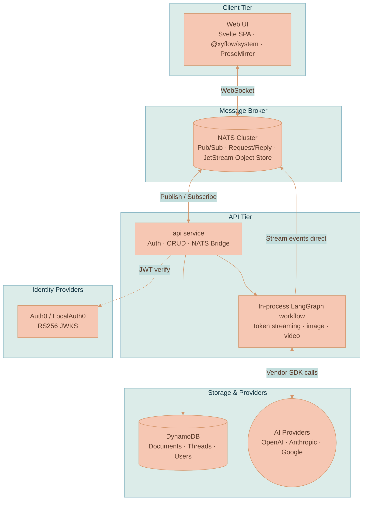
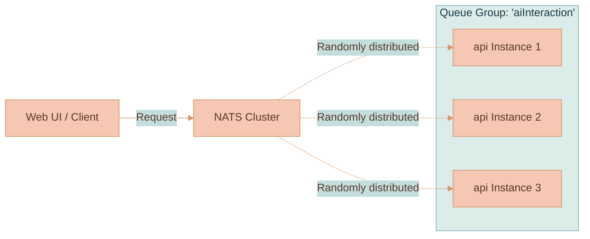

# System Architecture

Lixpi is a highly decoupled, message-driven system. Every component — the browser, the API, the LLM workflow, file storage, and authentication — communicates over a single [NATS](https://nats.io/) message bus. There is no REST polling for real-time data and no traditional API gateway or load balancer in the request path.

This page is the conceptual map of how the running system fits together: which services exist, how they talk, the design decisions that shaped them, and how the system scales. It is the spine that other documentation links back to instead of re-explaining the architecture.


This page covers the **runtime architecture**. For the AWS deployment topology (Pulumi, ECS/Fargate, CloudFront, the NATS cluster wiring), see [Infrastructure Overview](./deployment/INFRASTRUCTURE-OVERVIEW.md) and [Scaling & Operations](./deployment/SCALING-AND-OPERATIONS.md).


## Services

Lixpi runs as a small set of containerized services plus a managed datastore. Shared TypeScript packages live in `packages/lixpi/`; Infrastructure-as-Code lives in `infrastructure/pulumi/`.

| Service | Language | Path | Role |
|---------|----------|------|------|
| **web-ui** | Svelte / TypeScript | `services/web-ui/` | Browser SPA — canvas rendering, ProseMirror editors, AI chat UI, and client-side context extraction |
| **api** | Node.js / TypeScript | `services/api/` | API service — JWT auth, CRUD, DynamoDB persistence, NATS bridge, **and the in-process LangGraph LLM workflow** at `services/api/src/llm/` (token streaming, image generation, video generation, usage tracking) |
| **nats** | Go (3-node cluster) | `services/nats/` | Message bus — pub/sub, request/reply, JetStream Object Store for image and video storage |
| **localauth0** | Mock Auth0 | `services/localauth0/` | Mock Auth0 for zero-config offline development — RS256 JWT signing, JWKS, same OAuth flows as production |
| **DynamoDB** | AWS (local via Docker) | — | Document storage, user data, AI chat threads, AI model metadata |


**Historical note.** LLM orchestration used to live in a separate Python `services/llm-api/` Fargate task using the Python LangGraph package. It was absorbed into `services/api` once `@langchain/langgraph` (TypeScript) reached parity. The in-process LangGraph workflow now runs alongside the gateway logic in the `api` container. For the internal-service NATS auth pattern that the former Python service used — and that a future split would reuse — see [Internal Service NATS Auth Pattern](../knowledge/INTERNAL-SERVICE-NATS-AUTH-PATTERN.md).


### High-Level Architecture

Everything fans out from NATS. The browser connects to NATS over a WebSocket; the API connects to NATS over TLS; the LLM workflow runs inside the API process and publishes streaming events straight onto NATS subjects the browser is already subscribed to.



| Tier | Component | Responsibility |
|------|-----------|----------------|
| Client | Web UI | Renders the canvas, hosts ProseMirror editors, extracts context from the node graph, and connects to NATS over WebSocket |
| Broker | NATS Cluster | Carries every message: auth callouts, CRUD requests, and AI stream events; stores media in JetStream Object Store |
| API | api service | Validates tokens, performs CRUD against DynamoDB, and bridges browser requests to the in-process workflow |
| API | LangGraph workflow | Resolves features, streams the text model, routes image/video tool calls, and publishes results directly to NATS |
| Identity | Auth0 / LocalAuth0 | Issues RS256 user JWTs and exposes a JWKS endpoint for verification |
| Storage | DynamoDB | Persists documents, AI chat threads, users, and AI model metadata |
| Storage | AI Providers | External text, image, and video models invoked through vendor SDKs |

## NATS as the Backbone

All communication in Lixpi flows through NATS. This single decision shapes everything else:

- **End-to-end messaging** — Browser ↔ NATS ↔ backend services. The same bus carries browser requests and inter-service traffic.
- **Real-time streaming** — AI tokens, image partials, and video events stream directly to clients on per-thread subjects, with no intermediate buffering layer.
- **Centralized auth** — The NATS `auth_callout` delegates "can this connection happen, and what may it do?" to the API service. See [Authentication](./AUTHENTICATION.md).
- **Queue groups** — Multiple instances of a service subscribe under a shared queue-group name, and NATS load-balances messages across them automatically. No external load balancer required.

For the full token path from AI provider to rendered DOM, and the catalog of stream event types, see [Streaming & Events](./STREAMING-AND-EVENTS.md).

### Subject Naming Convention

Subjects follow a consistent hierarchical pattern so that domain, entity, and action are always legible from the subject string alone:

```
domain.entity.action[.qualifier]
```

| Example subject | Pattern | Meaning |
|-----------------|---------|---------|
| `user.get` | `domain.action` | Request: get user data |
| `workspace.document.create` | `domain.entity.action` | Request: create a document |
| `ai.interaction.chat.sendMessage` | `domain.entity.action.action` | Publish: browser → API |
| `ai.interaction.chat.receiveMessage.{workspaceId}.{threadId}` | `…action.qualifier.qualifier` | Subscribe: LLM workflow → browser (per-thread, direct) |

The trailing `{workspaceId}.{threadId}` qualifiers are what let the LLM workflow publish a stream straight to the one browser subscription that needs it, keeping streaming latency dominated by the AI provider rather than by Lixpi infrastructure.


Subjects are **not** ad-hoc strings scattered across the codebase. They are defined once in `packages/lixpi/constants/nats-subjects.json` — the single JSON source of truth consumed by both the browser and the API through `@lixpi/constants`. Adding or renaming a subject means editing that file, which keeps every producer and consumer in sync.


## Key Design Decisions

Four decisions define the shape of the system. Each is intentional and each is what makes a given subsystem replaceable without rippling through the rest.

### NATS-Native

The entire system runs through NATS — auth, messaging, file storage (JetStream Object Store), and streaming. The browser connects to NATS via WebSocket. Because the LLM workflow publishes streaming events directly onto the per-thread subjects the browser is already subscribed to, there is no extra hop between "token produced" and "token rendered." The message bus *is* the integration layer.

### Framework-Agnostic Canvas

The canvas engine (`WorkspaceCanvas.ts`) is pure vanilla TypeScript with zero framework imports. It receives DOM elements and callbacks; Svelte is only a thin binding layer. This insulates the canvas logic from framework changes and is why the rendering engine can stand on its own. See [Rendering Engine](../canvas/RENDERING-ENGINE.md).

### Provider-Agnostic AI

Every AI request sends the full conversation history — no provider-specific session IDs are stored. A user can start a conversation with Claude, switch to GPT, switch to Gemini, and switch back. Adding a new provider means implementing the `BaseProvider` class in `services/api/src/llm/providers/`. The shared LangGraph workflow resolves `/use` features and branch candidates, streams the text model, then conditionally routes `generate_image` and `generate_video` tool calls through transient media providers before calculating usage and cleaning up. See [AI Generation Pipeline](./AI-GENERATION-PIPELINE.md).

### Client-Side Context Extraction

When a user sends a message, the browser-side `AiChatThreadService` traverses the canvas edge graph, extracts content from connected nodes (documents, images, upstream threads), and assembles the multimodal payload. The API service forwards it without needing to understand the graph structure — the topology lives in the client. See [Context Relevance](../ai-chat/CONTEXT-RELEVANCE.md).

## Scalability & Load Balancing

The `api` service is **stateless** (it now hosts the LLM workflow in-process) and scales horizontally with zero configuration changes. Scaling out is a matter of starting more instances:

1. **Service registration** — A new instance connects to NATS and subscribes to its relevant subjects using a queue-group name (for example, `aiInteraction`).
2. **Automatic discovery** — NATS immediately recognizes the new subscriber as part of the group.
3. **Load distribution** — NATS delivers each message to **one** group member, chosen at random.
4. **Fault tolerance** — If an instance crashes, NATS detects the disconnection and reroutes traffic to the remaining healthy instances.

No routing configuration updates are needed — instances are added or removed dynamically.

### NATS Queue Groups

Instead of a traditional external load balancer (Nginx, AWS ALB), Lixpi leverages NATS **Queue Groups**. When multiple instances of a service subscribe to the same subject under the same queue-group name, NATS distributes messages among them. The load balancer *is* the message bus.



### Future Split: `llm-workers`

If LLM streaming workload grows enough to warrant deployment isolation from the gateway — so that an API deploy does not interrupt long-running streams — the LLM module's `getSubscriptions()` surface lets it be hosted by a separate `llm-workers` service. That service runs the **same Docker image** with a different CMD, joins the same NATS subjects, and authenticates as an internal service. See [`services/api/src/llm/README.md`](../../services/api/src/llm/README.md) for the future-split path, and [Scaling & Operations](./deployment/SCALING-AND-OPERATIONS.md) for how it maps onto AWS.

## Shared Infrastructure Packages

Shared packages in `packages/lixpi/` keep service contracts in sync so that the browser and the API can never drift on subjects, types, or auth logic.

| Package | Purpose |
|---------|---------|
| `@lixpi/constants` | NATS subjects (single JSON source of truth), shared types, AI model metadata with pricing |
| `@lixpi/nats-service` | TypeScript NATS client, JetStream Object Store helpers, NKey auth |
| `@lixpi/auth-service` | JWT verification (Auth0 RS256 + NKey Ed25519) used by both the API and the NATS Auth Callout |
| `@lixpi/nats-auth-callout-service` | NATS connection auth with per-service permission scoping |
| `@xyflow/system` (vendored) | Framework-agnostic pan/zoom/coordinate math — used at the low-level API, not React Flow or Svelte Flow |

## Where to Go Next

- [Authentication](./AUTHENTICATION.md) — the dual auth model, the NATS auth callout, and the two auth modes.
- [AI Generation Pipeline](./AI-GENERATION-PIPELINE.md) — the LangGraph workflow, providers, and tool-call routing.
- [Streaming & Events](./STREAMING-AND-EVENTS.md) — the full token path and the catalog of stream events.
- [Rendering Engine](../canvas/RENDERING-ENGINE.md) — the framework-agnostic canvas.
- [Context Relevance](../ai-chat/CONTEXT-RELEVANCE.md) — how the client assembles multimodal context.
- [Infrastructure Overview](./deployment/INFRASTRUCTURE-OVERVIEW.md) and [Scaling & Operations](./deployment/SCALING-AND-OPERATIONS.md) — the AWS topology, Pulumi, and production scaling.
