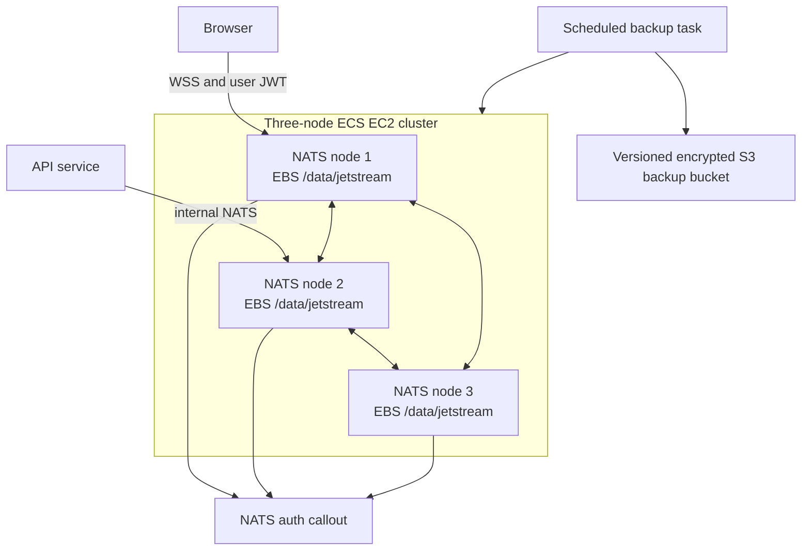

# NATS Cluster

Lixpi runs a three-node NATS cluster on ECS EC2. Each node has an encrypted gp3 EBS volume mounted at `/data/jetstream`, and the NATS daemon stores JetStream streams and Object Store data on that host volume. Task restarts and deployments reuse the same disk.

Browsers connect directly over WebSocket Secure. API services and internal workers use NATS for commands, events, and durable logs. Browser JWTs receive only the command publish permissions and tokenized event subscriptions that the API auth callout authorizes.

## Topology

The ECS service uses daemon scheduling so one NATS task runs on each cluster instance. Cloud Map and the service-discovery sidecar keep route membership current. The sidecar uses host networking and can fall back to the EC2 public address when ECS task attachment data is unavailable.

## EBS mounting

Each instance owns one non-ephemeral EBS volume. Bootstrap resolves the configured `/dev/xvdh` mapping through `ebsnvme-id`; it does not guess from unmounted disks. Startup fails closed if the expected volume is absent. The script avoids remounting an active filesystem and avoids duplicate `/etc/fstab` entries.

The volume resource is retained when an EC2 instance terminates. Replacing an instance therefore requires an explicit recovery procedure that attaches the intended volume or restores from backup. Do not treat Auto Scaling replacement as a transparent data migration.

## JetStream durability

Application streams and Object Store buckets use three replicas. Acknowledged data therefore has a copy on every cluster node under normal operation. EBS protects a node across task restarts, replication protects against one unavailable node, and S3 snapshots provide recovery outside the cluster.

The API checks existing streams at startup and raises their replica count to three. New capability event streams and Blob buckets are created with replicas set to three by their owning services.

## TLS and discovery

The public DNS and certificate automation remain deployment-owned infrastructure. NATS tasks load the current certificate material at startup, advertise their cluster route address, and expose WebSocket Secure to browser clients. Route membership comes from service discovery rather than a load balancer.

## Authentication boundary

The NATS auth callout verifies user JWTs and internal service identities. Canonical service subjects stay internal. The API relays authorized events to per-user tokenized subjects for Asset documents, chat pipelines, Capability catalog invalidation, and Capability run progress.

A browser cannot subscribe to canonical Capability events or read Object Store data directly. Capability resources are returned only through authenticated API reads after catalog and manifest authorization.

## Backup

An EventBridge schedule runs `services/nats/backup-streams.sh` every six hours. The task:

1. enumerates JetStream streams;
2. writes a `nats stream backup` snapshot for each stream;
3. records an inventory;
4. uploads the snapshot tree to a versioned, encrypted S3 bucket;
5. updates the `LATEST` marker only after upload succeeds.

Lifecycle rules retain recent restore points and expire older versions. Backup credentials are task credentials; they are not stored in scripts or NATS data.

## Restore

Use an isolated recovery cluster unless the incident procedure explicitly requires an in-place restore.

1. Stop application writers.
2. Select and record the snapshot ID.
3. Verify cluster capacity and credentials.
4. Run `services/nats/restore-streams.sh <snapshot-id>` from the NATS image with the backup bucket, prefix, NATS URL, and system credentials configured.
5. Compare stream names, subjects, message counts, replicas, and last sequences with the inventory.
6. Read one known Asset document replay, one Capability manifest/resource, and one Capability run replay through their authorized API paths.
7. Resume writers only after those checks pass.

Restoring a stream whose name already exists can conflict with the live cluster. The restore script fails rather than deleting or overwriting a stream implicitly.

## Failure behavior

| Failure | Expected behavior |
|---|---|
| NATS task restart | ECS restarts the task on the same host and reuses `/data/jetstream`. |
| One node unavailable | Three-replica streams remain available on the other nodes, subject to JetStream quorum. |
| Instance loss | Recover the retained EBS volume onto a replacement instance or restore the cluster from S3. |
| Missing expected EBS mapping | Bootstrap fails closed; it never formats an arbitrary disk. |
| Corrupt or incomplete backup | Inventory and authorized read checks fail; writers remain stopped. |
| Revoked browser access | API relays point-check authorization and stop forwarding canonical events. |

## Code map

- [`NATS-cluster.ts`](../../../infrastructure/pulumi/src/resources/NATS-cluster/NATS-cluster.ts)
- [`ECS-EC2-cluster.ts`](../../../infrastructure/pulumi/src/resources/ECS-EC2-cluster.ts)
- [`nats-service-discovery-sidecar.ts`](../../../infrastructure/pulumi/src/resources/NATS-cluster/nats-service-discovery-sidecar.ts)
- [`services/nats/backup-streams.sh`](../../../services/nats/backup-streams.sh)
- [`services/nats/restore-streams.sh`](../../../services/nats/restore-streams.sh)

Capability-specific storage, repair, and retirement rules live in [Capability Storage and Operations](../../library/CAPABILITY-STORAGE.md).
