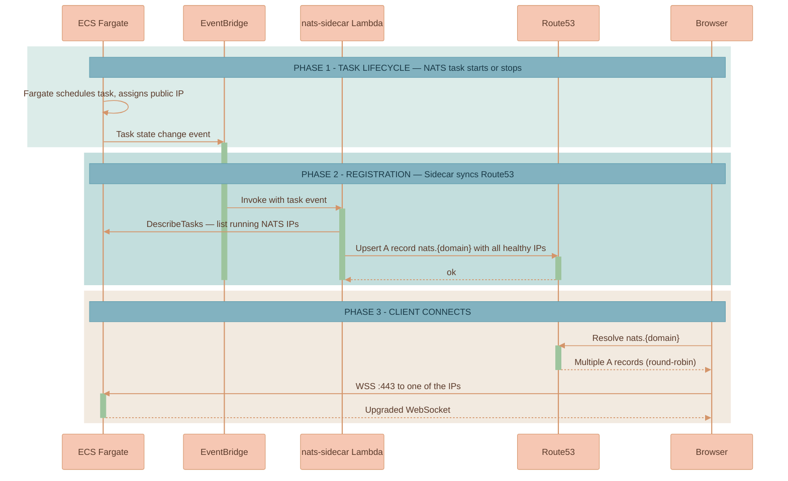
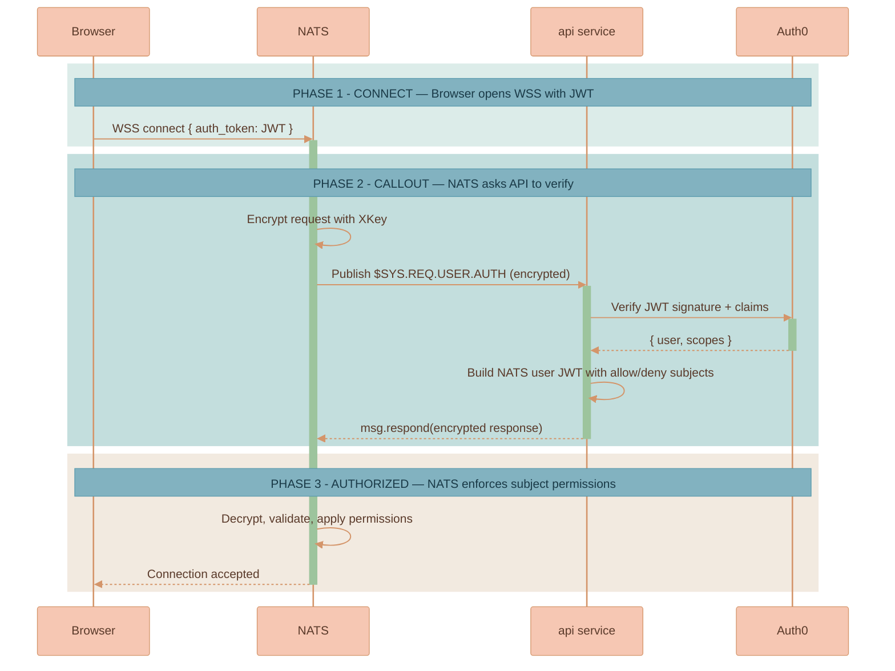

# NATS Cluster

NATS is where Lixpi makes its boldest design choice: **no load balancer, no API Gateway, browsers connect straight to Fargate tasks over WebSocket-Secure**. The whole thing is glued together by CloudMap, a Lambda sidecar, and a Caddy-based Lambda that owns the TLS certificate lifecycle.

This page documents the AWS wiring of that cluster. For the conceptual auth model — what a callout is and why NATS delegates identity to the API — see [Authentication](../AUTHENTICATION.md). For how the cluster fits into the wider AWS topology, see [Infrastructure Overview](./INFRASTRUCTURE-OVERVIEW.md). The full server configuration is documented in the [NATS cluster README](../../../infrastructure/pulumi/src/resources/NATS-cluster/README.md), and the resource definitions live in [`infrastructure/pulumi/src/resources/NATS-cluster/`](../../../infrastructure/pulumi/src/resources/NATS-cluster/).

## Ports

| Port | Purpose | Exposed to |
|------|---------|------------|
| `4222` | Native NATS client protocol | Internet (TCP) |
| `443` | NATS WebSocket (WSS) | Internet (browsers) |
| `6222` | Cluster routing (gossip) | VPC CIDR only |
| `8222` | HTTP management / `/healthz` | VPC CIDR only |

## Cluster Discovery

Internal node-to-node discovery uses the **private** CloudMap namespace. Each NATS task auto-registers its private IP under `nats.cloudmap.<domain>.internal` with a 10-second TTL and `MULTIVALUE` routing. On boot, every task seeds itself with a single route URL:

```
nats://sys:<password>@nats.cloudmap.<domain>.internal:6222
```

NATS gossip then discovers the other two peers, forming a full mesh.

## Public Client Access

Browsers need a real public DNS name with valid TLS. CloudMap's public namespace would work, but it ties DNS to AWS internals and makes certificate management awkward. Instead, Lixpi uses a **tiny Lambda sidecar** ([`nats-service-discovery-sidecar.ts`](../../../infrastructure/pulumi/src/resources/NATS-cluster/nats-service-discovery-sidecar.ts)):



So clients get the same load-balancing behavior as a proper ALB, but with roughly zero latency overhead and no ALB cost.

## TLS for NATS (Caddy in Lambda)

ACM can't issue certs for endpoints that aren't behind an AWS load balancer, so Lixpi runs its own ACME client. [`certificate-manager/`](../../../infrastructure/pulumi/src/resources/certificate-manager/) packages **Caddy** inside a Lambda container:

1. Pulumi creates a placeholder A record at `nats.{domain}` pointing at `8.8.8.8` so the domain exists in DNS (required for the ACME DNS-01 challenge).
2. Lambda runs Caddy with the Route53 DNS provider plugin.
3. Caddy talks to Let's Encrypt, solves DNS-01 by creating `_acme-challenge.*` TXT records, gets the cert.
4. The cert and key are written to Secrets Manager under a prefix like `nats-certs-<org>-<stage>`.
5. Each NATS Fargate task pulls the cert from Secrets Manager on boot via `certificate-helper.ts`.

The cert-manager Lambda has a 15-minute timeout and 1 GB of memory — plenty for issuance and renewal, cheap because it runs rarely.

## NATS Auth Callout — The Security Boundary

NATS doesn't store user passwords. Instead, the `api` service **is** the authority: when a browser connects with an Auth0 JWT, NATS asks the API "is this valid, and what can they subscribe to?" The conceptual model — credential types, signing, the shared verification library — is documented in [Authentication](../AUTHENTICATION.md); this section covers how that handshake is wired on AWS. See the [NATS cluster README](../../../infrastructure/pulumi/src/resources/NATS-cluster/README.md) for the full configuration.




**The `tls://` reply-path requirement.** A critical detail buried in the code: the API service **must** connect to NATS with `tls://`, not `nats://`. The auth callout reply path uses an internal NATS subject that only trusted (TLS) clients are allowed to publish to. Without TLS, subscriptions work but responses silently fail and browsers time out on connect.


## Related Pages

| Page | What it covers |
|------|----------------|
| [Infrastructure Overview](./INFRASTRUCTURE-OVERVIEW.md) | The high-level AWS topology, network layout, the `api` ECS service, Web UI, and DynamoDB |
| [Scaling & Operations](./SCALING-AND-OPERATIONS.md) | NATS cluster sizing, the realistic traffic ceiling, failure modes, and scaling steps |
| [Authentication](../AUTHENTICATION.md) | The conceptual dual-auth model and the auth callout |
