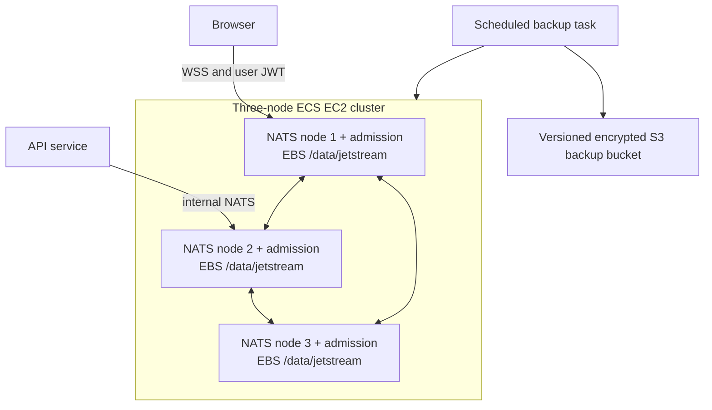

# NATS Cluster

The [NATS service guides](../../../services/nats/README.md) cover the embedded process, admission architecture, executable settings and maintenance commands. This page covers deployment topology, durable storage, discovery and host recovery.

Lixpi runs NATS on ECS EC2 with configurable host bounds, initially three nodes. Each node has an encrypted gp3 EBS volume mounted at `/data/jetstream`, and its daemon stores native JetStream streams and Object Store data on that host volume. Task restarts and deployments reuse the same disk. These streams and Object Store buckets persist application events, work queues and permanent Blob content.

## Why brokers use EC2

JetStream events, maintenance queues, organization Object Store bytes and NEX control data must outlive a container. ECS service-managed EBS volumes are deleted with their tasks, and a replacement ECS task cannot attach an existing EBS volume. EFS is persistent on Fargate but uses NFS, which NATS's published storage guidance advises avoiding for JetStream. EC2 gives each broker its own retained block-storage volume. Application services and the scheduled backup utility use Fargate. Admission runs inside the EC2 broker process. See [AWS EBS lifecycle](https://docs.aws.amazon.com/AmazonECS/latest/developerguide/ebs-volumes.html) and [NATS storage guidance](https://github.com/nats-io/nats.docs/blob/master/running-a-nats-service/configuration/README.md#jetstream-server-settings).

## Node size and storage budget

The default is three `t3.small` hosts, each with 2 vCPUs and 2 GiB RAM, using the ECS-optimized Amazon Linux 2023 AMI. The broker task gets 1 vCPU and 1 GiB RAM. ECS reserves 512 MiB for host processes, leaving additional headroom. JetStream memory storage is capped at 256 MiB and Go's soft memory limit is 768 MiB. Neither setting caps all process memory; the container limit is the final boundary. Instances below 2 GiB or without x86_64 support are rejected.

This is a minimum configured budget, not a measured production capacity claim. T3 CPU is burstable. Unlimited mode avoids credit-exhaustion throttling but can incur surplus-credit charges. Sustained CPU demand, many connections or streams, media transfers and replica recovery may require larger nodes or a non-burstable family. Changing `NATS_EC2_INSTANCE_TYPE` updates the launch template; existing hosts require the controlled replacement procedure below. [AWS T3 specifications](https://aws.amazon.com/ec2/instance-types/t3/).

Each host has a 150 GiB encrypted gp3 data volume by default and a separate encrypted 30 GiB root volume. `NATS_EBS_VOLUME_SIZE_GIB` may increase data capacity; values below 150 are rejected. JetStream's per-node file limit is 100 GiB, leaving room for filesystem and recovery overhead. With three replicas, three 100 GiB limits provide about 100 GiB of logical replicated storage, not 300 GiB. All JetStream-enabled accounts share the node's limits. Increasing EBS capacity alone does not increase the configured JetStream limit.

Browsers connect directly over WebSocket Secure. API services and internal workers use NATS for commands, events, and durable logs. Browser JWTs receive only the command publish permissions and tokenized event subscriptions that the embedded admission worker authorizes.

## Topology

The ECS service uses host networking and daemon scheduling for one broker per host. The Auto Scaling group uses three public subnets in distinct availability zones and balanced-only placement. It does not substitute another zone when capacity is unavailable. Adding the third subnet does not automatically move existing hosts.

`NATS_MIN_NODES`, `NATS_MAX_NODES` and `NATS_DESIRED_NODES` default to three. Raising the maximum permits CPU target tracking to add hosts; there is no hardcoded three-node ceiling. The default scale-out target is 60 percent CPU. A serialized scale-in controller requires sustained low CPU, healthy replicas and enough remaining zones. It fences new placement on one candidate, evacuates its streams and consumers, verifies recovery, removes its JetStream membership, then terminates that host. It fails closed if any check is inconclusive. Detailed settings and the required two-phase AZ-tag rollout for existing clusters are in the [resource README](../../../infrastructure/pulumi/src/resources/NATS-cluster/README.md).

The discovery Lambda reconciles private Cloud Map addresses for running broker tasks and public Route53 addresses only for broker tasks with healthy ECS status and authenticated admission readiness. It filters the exact broker task family, so scheduled backup tasks cannot become broker endpoints. ECS host networking does not support automatic A-record registration; the Lambda owns those registrations. State-change events and a one-minute reconciliation schedule repair missed transitions. Failures propagate for retry instead of replacing DNS from an incomplete inventory.

## EBS mounting

Each instance owns one non-ephemeral EBS volume. Bootstrap resolves the configured `/dev/xvdh` mapping through `ebsnvme-id`; it does not guess from unmounted disks. Startup fails closed if the expected volume is absent. The script avoids remounting an active filesystem and avoids duplicate `/etc/fstab` entries.

The data disk is retained when an instance terminates, but AWS does not automatically attach it to a replacement. ECS has a systemd mount dependency and cannot start without `/data/jetstream` mounted; a missing disk must not fall back to the root filesystem. The broker persists its server name on that disk so task recreation does not invent another identity.

Automatic instance refresh, AZ rebalancing and unhealthy-host replacement are disabled. This prevents infrastructure changes or a correlated health failure from replacing multiple data-bearing hosts with empty disks. It also means host failure requires operator intervention. Task restart on an intact host remains automatic. Scale-in protection is enabled, but it is not a substitute for backups or protection against manual termination.

## JetStream durability

Object Store creation defaults to three replicas; capability-run, media-generation and maintenance streams request three. A successful replicated write requires a majority, not confirmation that every replica is current. Three independent replicas tolerate one unavailable replica. EBS preserves each copy across task restarts; replication provides availability while one node is unavailable; snapshots provide a separate recovery mechanism. Application content and event recovery depend on these native JetStream copies and backups.

The maintenance stream reconciler also raises an existing stream to three replicas. Audit every deployed stream before a migration; defaults do not prove that older or manually created streams have the intended replica count.

The broker uses `sync_interval: always` to synchronize writes before acknowledgement. This reduces the acknowledged-write loss window from simultaneous OS crashes, at the cost of disk latency and throughput. It does not protect against deletion or loss of all three disks, nor does it create a transaction with DynamoDB. The Go build images and upstream server module are pinned; snapshot commands use the same embedded executable. [NATS synchronization guidance](https://github.com/nats-io/nats.docs/blob/master/nats-concepts/jetstream/README.md#syncing-data-to-disk).

## TLS and discovery

The public DNS and certificate automation remain deployment-owned infrastructure. The infrastructure adapter delivers certificate files and a JSON node configuration through a shared volume. The broker mounts that volume read-only, loads certificates at startup and checks the files every minute. Candidates are validated, switched atomically through the TLS certificate callback, and checked against the certificate actually served. Existing WebSocket connections stay open. Route membership comes from service discovery rather than a load balancer.

The internal 4222 listener uses `nats://` without TLS and is restricted to the VPC CIDR. Client reconnect advertisements and cluster route advertisements use the host's private IP, obtained through IMDSv2 by the infrastructure adapter and supplied to the broker as configuration. Only WebSocket port 443 is public. WebSocket advertisements use the public DNS name and port 443 through `NATS_WEBSOCKET_ADVERTISE`, separately from native-client addresses. Local Compose advertises `localhost:9222`, its published WebSocket endpoint. Cluster port 6222, monitoring port 8222 and admission health port 3020 are VPC-restricted. These CIDR restrictions are broader than per-workload security-group isolation.

Internal TCP and route traffic is not application-layer encrypted. T3 is not a substitute for TLS. XKey encryption protects only auth-callout messages. Enabling internal TLS requires a trust and certificate-name design for private addresses; merely changing URL schemes is insufficient. Certificate retrieval is restricted to the broker's certificate secret. A serialized Lambda checks renewal every six hours, preserving complete Caddy state in encrypted, versioned S3. Expiry, renewal errors, missing maintenance and broker delivery failures have CloudWatch alarms. Their exported SNS topics require a subscribed incident destination. See [certificate maintenance](../../../infrastructure/pulumi/src/resources/certificate-manager/README.md) for delivery, rollback, metrics and recovery.

## Authentication boundary

Each broker embeds a Go dispatcher and bounded credential workers in the isolated CALLOUT account. Its bootstrap identity accepts only in-process connections. Exact native callout interest stays local through route import/export denies; separate signed peer RPC carries overflow and bounded retry. Each broker receives the issuer and XKey seeds through ECS secret references. API and workloads have separate NKey identities; AUTH retains application storage and NEX retains its control account. Brokers receive registration authority public keys, allowed accounts and the restricted registration password. API startup submits deployment-signed application declarations into the isolated REGISTRATION account before opening its normal connection. Brokers can start with an empty registry; after initialization, new admissions read its native JetStream leader without depending on a running API or DynamoDB. A browser JWKS fetch is needed only for an uncached signing key.

The process exposes `/live`, `/broker`, authenticated `/ready` and authenticated `/metrics` on private port 3020. ECS checks broker health; public discovery additionally probes admission. Bounded supervision repairs a broken dispatcher, while worker saturation and JWKS outages leave the broker running. Canonical service subjects stay internal. The API relays authorized events to per-user tokenized subjects for Asset documents, chat pipelines, Capability catalog invalidation, and Capability run progress.

A browser cannot subscribe to canonical Capability events or read Object Store data directly. Capability resources are returned only through authenticated API reads after catalog and manifest authorization.

## Backup

An EventBridge schedule runs the infrastructure deployment adapter's backup task every six hours. The task:

1. invokes the vendor-neutral `/usr/local/bin/lixpi-nats backup` with NATS credentials and a local snapshot directory;
2. captures native snapshots, inventory and checksums into that directory;
3. waits for successful command completion;
4. uploads the completed snapshot tree to a versioned, encrypted S3 bucket through the infrastructure adapter;
5. publishes remote completion and `LATEST` markers only after upload succeeds.

Lifecycle rules retain recent restore points and expire older versions. The backup task receives `NATS_BACKUP_NKEY_SEED` through a secret reference. Its native NKey identity can list, inspect, and snapshot AUTH streams, but cannot restore or delete them.

## Restore

Use an empty, isolated AUTH recovery account. The Go restore command refuses a nonempty target and never deletes existing streams to make room.

1. Create an isolated recovery cluster or account. Keep production serving its existing storage while evaluating the recovery copy.
2. Select and record the snapshot ID.
3. Verify cluster capacity and credentials.
4. Download the selected snapshot directory using deployment storage tooling and mount it into the NATS image. Run `/usr/local/bin/lixpi-nats restore <snapshot-id>` with `NATS_SNAPSHOT_DIR`, `NATS_URL`, and `NATS_OPERATOR_NKEY_SEED` configured. Remote storage access stays outside the Go command.
5. The command requires a completion marker, verifies SHA-256 checksums before restoring, and compares restored counts, bytes, first/last sequences and consumer counts against snapshot metadata. Also inspect subjects, replica health and consumer positions.
6. Read one known Asset document replay, one Capability manifest/resource, and one Capability run replay through their authorized API paths.
7. Validate restored Object Store bytes and event histories against DynamoDB domain references before accepting the recovery copy. AUTH snapshots are per-stream images, not coordinated DynamoDB recovery points. Verify content hashes, document replay and pending work before routing application traffic to the recovery cluster.

Restoring a stream whose name already exists can conflict with the live cluster. The Go restore command fails rather than deleting or overwriting a stream implicitly.

Snapshots without `COMPLETE` and `SHA256SUMS` are incompatible with this automated restore path. Recover such snapshots manually into an isolated cluster and verify their content before admitting application writers; do not manufacture completion markers for unverified archives.

The scheduled backup utility runs on Fargate with 200 GiB scratch storage, away from broker root disks. It pages through AUTH streams, includes durable consumers, records each snapshot's own metadata and rejects a changed stream inventory. It uploads checksums and writes `COMPLETE` before advancing `LATEST`. Failed uploads cannot advance that pointer. Its task role is separate from the broker role. Backup staging capacity must be revisited if aggregate stored data grows beyond the configured budget.

After total loss of broker disks and replicas, recovery from the six-hour backup schedule can lose application content and events written since the last successful snapshot. AUTH backups do not cover NEX account state, account configuration or DynamoDB. Failed schedule invocations, task startup failures and nonzero exits trigger alerts. A missing-success alarm fires after eight consecutive hourly periods without a completed snapshot metric. The metric is emitted only after both the completion marker and latest pointer are stored. Set `NATS_OPERATIONAL_ALERT_EMAIL` and confirm its SNS subscriptions, or route the exported backup topic to the incident system. Overlapping long-running backups still require operational attention. Readable snapshots do not by themselves prove application-consistent recovery.

## Controlled host replacement

1. Verify all three nodes, metadata quorum, every required stream's replica count and zero replica lag. Record each server name, EC2 instance, availability zone and EBS volume ID. Create and verify recovery artifacts.
2. For an existing disk without `server-name`, record the running broker's actual server name there before task replacement. Do not invent a name for an existing store. Apply the mount dependency to existing hosts before relying on it; launch-template user data does not retrofit running instances.
3. Replace one host at a time. Stop its broker and ECS agent, retain its data disk, and recover onto a host in the same zone because EBS attachment is zonal. Never force-detach a live writer. Keep ECS stopped while swapping the replacement's empty disk for the intended retained disk, then verify the mount and identity before starting ECS.
4. If the disk is unavailable but two current replicas remain, admit a fresh peer and deliberately remove the failed peer from JetStream membership. Wait for full data and consumer replication before any other replacement. A running ECS task or fixed wait duration is insufficient evidence.
5. Confirm private discovery, public WSS, auth admission and authorized reads. Only then proceed to another host. Do not start an unrestricted Auto Scaling instance refresh.

An initial move to three-zone placement or smaller hosts follows this procedure. A volume cannot move directly between zones; use controlled replica replacement into the third zone or an explicitly planned snapshot recovery. Retain old disks until acceptance. A rollback after target writes begin requires reconciling those writes, not just switching DNS.

## Remaining operational limits

The shared VPC has one NAT gateway. Private Fargate services can lose external-provider and AWS API connectivity if its zone fails, even while the brokers retain quorum. Public broker IPs incur charges, DNS failover is not instantaneous, and existing WebSocket clients must reconnect. Broker health is separate from auth readiness. Measure replica catch-up and publish latency under failure before setting recovery-time targets.

Monitor broker RSS, CPU and CPU credits, disk free space, EBS queueing/latency, replica lag, leader availability, backup age and certificate expiry. The small-node default and synchronous disk writes have not been qualified against production media load. A region-wide or account-wide incident also needs independently protected recovery copies and a tested database/content recovery procedure.

## Failure behavior

| Failure | Expected behavior |
|---|---|
| Local worker unavailable | The accepting broker retries a compatible peer within the original admission deadline. |
| All reachable workers unavailable | New admissions fail; existing sessions are not automatically disconnected. |
| NATS task restart | ECS restarts the task on the same host and reuses `/data/jetstream`. |
| One node unavailable | Three-replica streams remain available on the other nodes, subject to JetStream quorum. |
| Instance loss | Recover the retained EBS volume onto a replacement instance or restore the cluster from S3. |
| Missing expected EBS mapping | Bootstrap fails closed; it never formats an arbitrary disk. |
| Corrupt or incomplete backup | The isolated restore is rejected; production is not redirected to it. |
| Revoked browser access | API relays point-check authorization and stop forwarding canonical events. |

## Code map

- [`NATS-cluster.ts`](../../../infrastructure/pulumi/src/resources/NATS-cluster/NATS-cluster.ts)
- [`ECS-EC2-cluster.ts`](../../../infrastructure/pulumi/src/resources/ECS-EC2-cluster.ts)
- [`nats-service-discovery-sidecar.ts`](../../../infrastructure/pulumi/src/resources/NATS-cluster/nats-service-discovery-sidecar.ts)
- [Go maintenance commands](../../../services/nats/cmd/lixpi-nats/maintenance.go)
- [Snapshot and restore implementation](../../../services/nats/internal/maintenance/backup.go)

Capability-specific storage, repair, and retirement rules live in [Capability Storage and Operations](../../library/CAPABILITY-STORAGE.md).
