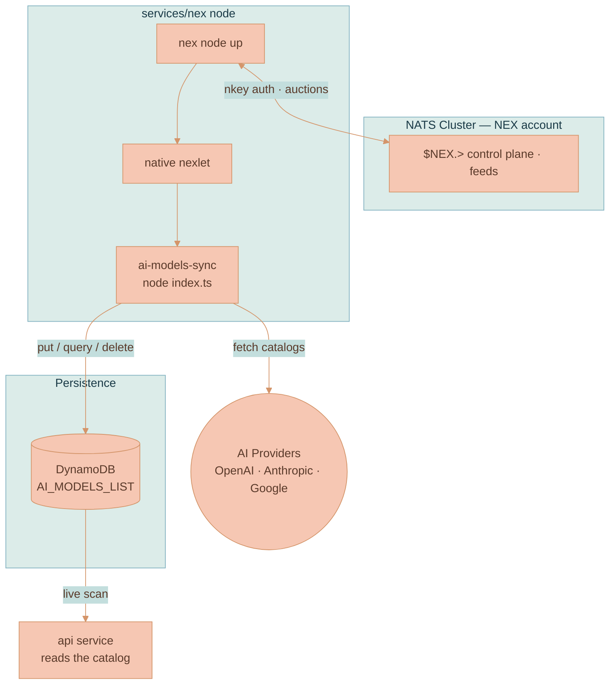

# NEX Execution Engine

Lixpi runs background work on the same bus everything else runs on. A [NATS NEX](https://github.com/synadia-io/nex) **node** — the `services/nex` service — connects to the NATS cluster as a client and supervises long-running jobs. Its first workload is the **AI-models catalog sync**, which runs every hour.

This page documents the Lixpi deployment and operation of that node. For how NEX itself works — nodes, nexlets, workloads, the Nexfile, the real container/Docker story — see [NATS NEX Execution Engine — How It Works](../../knowledge/NATS-NEX-EXECUTION-ENGINE-EXPLAINED.md). The node's operator guide lives in the [`services/nex` README](../../../services/nex/README.md), and the resource definitions are in [`services/nex/`](../../../services/nex) and [`infrastructure/pulumi/src/resources/nex-node/nex-node.ts`](../../../infrastructure/pulumi/src/resources/nex-node/nex-node.ts).

## What runs here

| Workload | Type · lifecycle | What it does |
|----------|------------------|--------------|
| `ai-models-sync` | `native` · `service` | Runs `AiModelsSync.synchronizeModels()` at boot and every hour, writing the `AI_MODELS_LIST` DynamoDB table. |
| `system-reporter` | `native` · `service` | A trivial smoke-test workload (echoes uptime every 30s). Deployed by hand to prove the substrate. |

The API reads the catalog straight from DynamoDB on each request ([`getAvailableAiModels`](../../../services/api/src/models/ai-model.ts) scans `AI_MODELS_LIST`), so the hourly write reaches the UI on its next fetch with no restart. After each run the workload also publishes a completion event the API subscribes to (see [Completion event](#completion-event)).



## The node, the nexlet, the workload

Three primitives, all on NATS:

- A **node** (`nex node up`) connects to NATS, runs placement auctions, and supervises workloads. It is a NATS *client* of the existing cluster, not another server.
- A **nexlet** is the runtime agent that executes a workload. NEX bundles one — the **native** nexlet, which runs an OS executable. (Containers, VMs, and WASM are a documented Go-SDK extension point, not something this node needs.)
- A **workload** is the unit of execution. `ai-models-sync` is a `native` `service`: the native nexlet launches `node --experimental-transform-types index.ts` and keeps it running.

The depth — auctions, the Nexfile schema, every way to run NEX — is in the [knowledge doc](../../knowledge/NATS-NEX-EXECUTION-ENGINE-EXPLAINED.md).

## Startup and the hourly loop

The container entrypoint ([`services/nex/entrypoint.sh`](../../../services/nex/entrypoint.sh)) does four things on boot:

1. `pnpm install` — resolves the workload's `@lixpi/*` and provider-SDK dependencies from the pnpm workspace, the same way the `api` container does.
2. `nex node up` — connects to the NATS `NEX` account with the node nkey and starts the native nexlet, in the background.
3. Deploys `ai-models-sync` — builds the workload's start-request and runs `nex workload start`, retrying until the node is accepting auctions.
4. Supervises the node in the foreground.

The workload wrapper ([`workloads/ai-models-synchronization/index.ts`](../../../services/nex/workloads/ai-models-synchronization/index.ts)) runs the sync once, then re-runs it on a self-scheduling timer (`LIXPI_SYNC_INTERVAL_MS`, current default one hour). Each run is wrapped in try/catch so a provider hiccup logs and waits for the next tick instead of killing the loop.

## The NEX account and credentials

The node authenticates into a dedicated **`NEX`** account in [`services/nats/nats-server.conf`](../../../services/nats/nats-server.conf), separate from the `AUTH` account that carries app traffic and the auth callout. It connects with a user nkey (`NATS_NEX_NODE_NKEY_SEED`/`_PUBLIC`, generated by the env setup alongside the other NATS keys) and uses that same nkey to mint scoped credentials for the nexlet and workloads.


**The node must be given an issuer nkey.** `nex node up` runs with `--issuer-nkey` / `--issuer-nkey-seed` set to the NEX node nkey. Without an issuer strategy, NEX falls back to a development-only minter that hands out empty credentials — and because the `NEX` account requires nkey auth, the embedded native nexlet's own connection would be rejected and no workload could start.


Keeping the node in its own account means its `$NEX.>` control plane and feeds stay isolated from application subjects, and the `AUTH`-scoped auth callout never applies to it — it authenticates by standard nkey verification, like the static `SYS`/`AUTH` backend users. For the conceptual auth model see [Authentication](../AUTHENTICATION.md).

## Completion event

After each run the workload publishes `aiModels.syncCompleted` (constant `AI_MODELS_SUBJECTS.MODELS_SYNC_COMPLETED`) with the run totals — `{ totalNew, totalUpdated, totalDeleted, totalProcessed, ranAt }` — using the NATS credentials the native nexlet mints for it, so the event originates in the `NEX` account.

Because the API runs in the `AUTH` account and NATS subjects are account-scoped, [`nats-server.conf`](../../../services/nats/nats-server.conf) bridges the boundary: the `NEX` account **exports** the `aiModels.syncCompleted` stream and the `AUTH` account **imports** it on the same subject. The API subscribes in [`ai-model-subjects.ts`](../../../services/api/src/NATS/subscriptions/ai-model-subjects.ts). Since the API reads the catalog from DynamoDB on demand, the event is a refresh/liveness signal, not the data path.

## Two things that surprise people


**The workload does not inherit the container environment.** The native nexlet starts the child process with only the environment declared in the workload's start-request — not the node container's env. So the entrypoint injects what the sync needs (`ORG_NAME`, `STAGE`, AWS config, `DYNAMODB_ENDPOINT`, provider API keys) into the start-request at deploy time. A committed Nexfile can't carry secrets, so it documents the contract while the entrypoint supplies the values.



**NEX has no built-in scheduler, and the node keeps no persisted state.** "Every hour" is implemented by the workload wrapper, not declared to NEX. State persistence (`--state kv`) is deliberately off: the entrypoint re-deploys the workload on every boot (idempotent), so persisting *and* replaying it as well would run the sync twice. One node, one workload instance.


## Local development

`docker compose --profile main up` starts the three NATS nodes and then `lixpi-nex-1`. The node connects over plain `nats://lixpi-nats-*:4222` — the client port is not TLS locally. Watch it with:

```bash
docker logs -f lixpi-nex-1     # node registration + "✅ ai-models sync done"
```

The fastest confirmation that the real workload ran is the `AI_MODELS_LIST` table being populated; set `LIXPI_SYNC_INTERVAL_MS` low to watch the loop tick. Operator commands (`nex node list`, `nex workload list`, the NEX feed subjects) are in the [`services/nex` README](../../../services/nex/README.md).

## On AWS

Pulumi provisions the node as an internal Fargate service ([`nex-node.ts`](../../../infrastructure/pulumi/src/resources/nex-node/nex-node.ts)), wired in by [`pulumiProgram.ts`](../../../infrastructure/pulumi/src/pulumiProgram.ts):

| Service | CPU | Memory | Subnets | Public IP | Inbound | Scale |
|---------|-----|--------|---------|-----------|---------|-------|
| `nex` | 512 | 1024 MB | Private | no | none (egress-only) | single instance |

The task role grants DynamoDB access to `AI_MODELS_LIST`, the same per-table pattern [`main-api-service.ts`](../../../infrastructure/pulumi/src/resources/main-api-service.ts) uses. The workload's AWS calls use the Fargate task-role credentials, which the entrypoint forwards into the start-request through the ECS credential-endpoint variable.


**The node connects with `nats://`, not `tls://`.** The NEX node uses the Go NATS client, which treats `tls://` as a hard requirement. The client port is plain, so on AWS the node is pointed at the cluster's internal CloudMap URL (`nats://nats.<cloudmap>.internal:4222`) rather than the `tls://` endpoint the browser-facing API uses. This is the mirror image of the API's [`tls://` reply-path requirement](./NATS-CLUSTER.md).


## Why not EventBridge + Lambda?

A managed cron plus a Lambda is the obvious alternative and costs effectively nothing at this scale. Lixpi avoids it for architectural fit, not price: the platform's stance is that anything expressible as a NATS client should not take on a cloud-vendor function runtime (see [Product Overview](../../PRODUCT-OVERVIEW.md)). NEX puts placement, supervision, and feeds on the bus Lixpi already operates. Lambda would be worth reconsidering only if Lixpi dropped the self-hosted-NATS posture.

## Adding a workload

Add `workloads/<name>/` under `services/nex/` with a thin entrypoint wrapper and a Nexfile, declare any new dependencies in `services/nex/package.json`, and point the entrypoint deploy at it. Heavy Node jobs run as `native` workloads, like the sync. The [`services/nex` README](../../../services/nex/README.md) has the step-by-step.

## Related Pages

| Page | What it covers |
|------|----------------|
| [NATS NEX Execution Engine — How It Works](../../knowledge/NATS-NEX-EXECUTION-ENGINE-EXPLAINED.md) | The general NEX reference: nodes/nexlets/workloads, the Nexfile, every way to run NEX |
| [NATS Cluster](./NATS-CLUSTER.md) | The cluster the node connects to — ports, discovery, TLS, the auth-callout boundary |
| [Infrastructure Overview](./INFRASTRUCTURE-OVERVIEW.md) | The wider AWS topology and the other Fargate services |
| [System Architecture](../SYSTEM-ARCHITECTURE.md) | How the services fit together on the NATS backbone |
