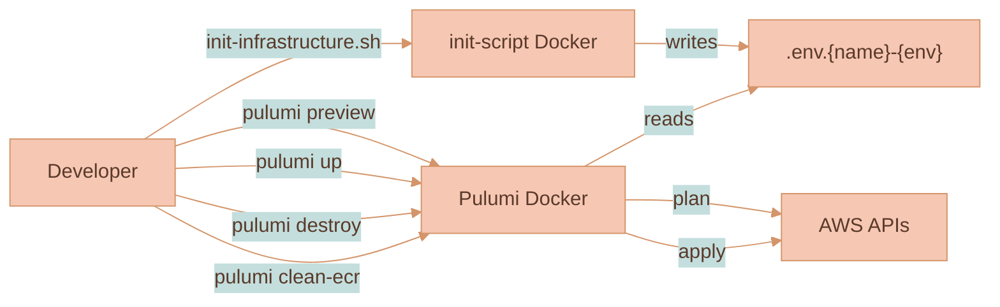

# Scaling & Operations

This page covers what happens as a Lixpi stack grows and how it is operated day to day: the horizontal scaling profile, NATS cluster sizing, the realistic traffic ceiling, the steps to scale up for real load, and how the system behaves when components fail. It then walks through environments and stacks, the operational workflow, and observability.

For the topology these pieces scale within, see [Infrastructure Overview](./INFRASTRUCTURE-OVERVIEW.md). For the NATS cluster internals, see [NATS Cluster](./NATS-CLUSTER.md). For the runtime architecture and queue-group model, see [System Architecture](../SYSTEM-ARCHITECTURE.md).

## Scaling and Capacity

### Horizontal Scaling Profile

| Service | Scaling mechanism | Notes |
|---------|-------------------|-------|
| `web-ui` | CloudFront edge cache | No origin scaling needed; global CDN |
| `api` | ECS desired count + NATS queue group `aiInteraction` | Stateless — add tasks freely. Hosts both the gateway logic and the in-process LangGraph LLM workflow. CPU-bound on token streaming. |
| `nats` | App Auto Scaling target (CPU 70%, memory 80%) + ECS desired count | The program provisions `minCount=3, maxCount=3` by default — see "NATS cluster sizing" below |
| `DynamoDB` | On-demand capacity mode (default) | No manual scaling; pay per request |
| `Lambda` (cert-manager, sidecar) | AWS-managed | Short-lived, invoked rarely |

The NATS cluster template already contains a full auto-scaling block (`appautoscaling.Target` + target tracking on CPU 70% / memory 80%) — it's only dormant because `minCount === maxCount` in the default config. Set them to different values in [`pulumiProgram.ts`](../../../infrastructure/pulumi/src/pulumiProgram.ts) and scaling goes live.

### NATS Cluster Sizing

The default deployment runs **three** Fargate tasks with `256 CPU units / 512 MB` each. That is deliberately modest — it's the smallest valid Fargate shape — and it is more than enough for small-to-medium workloads because NATS is astonishingly efficient:

- The NATS server is a single Go binary that typically uses **under 20 MB of RAM** per node (per [nats.io/about](https://nats.io/about/)).
- A single NATS node can sustain **millions of messages per second with sub-millisecond latencies** on commodity hardware.
- Unlike RabbitMQ, Kafka, or a traditional ALB, message routing in NATS is zero-copy and runs in a single-threaded I/O loop, which means throughput scales linearly with nodes and CPU cores.

### Realistic Traffic Ceiling of the Default Setup

Using published NATS performance characteristics and the default Fargate sizing, a back-of-envelope capacity picture for the default three-node cluster looks like this:

| Dimension | Default setup | Approximate ceiling |
|-----------|---------------|---------------------|
| Concurrent WebSocket clients | 3 nodes × 0.5 vCPU | **10,000–30,000 idle connections** per cluster (connections are cheap in NATS) |
| Messages/sec, cluster total | 3 nodes × 0.5 vCPU | **~500k–1M msgs/sec** for small payloads — far more than any chat workload needs |
| Latency (p50) | Same-region, intra-VPC | **< 1 ms** for NATS itself; end-to-end latency is dominated by the AI provider (seconds) |
| Concurrent in-flight AI streams | 1 × `api` @ 0.5 vCPU | ~25–50 concurrent streams per task; add tasks for more |
| DynamoDB throughput | On-demand | Scales automatically to table-level limits (40k RCU/WCU per table by default) |

In practice the **first bottleneck is `api` CPU** (token streaming parsing in the LangGraph workflow), not NATS. The second is **AI provider rate limits**, not AWS. NATS itself won't be the limiting factor until the cluster is pushed into the hundreds of thousands of simultaneous active users per region.

### Scaling Up for Real Load

If a stack needs to handle higher real-world load, the steps in order of impact are:

1. **Increase `api` desiredCount.** Each new task joins the NATS queue group and picks up work immediately. DynamoDB on-demand absorbs the extra read/write.
2. **Bump NATS task size or count.** Raise `cpu: 256 → 1024`, `memory: 512 → 2048`, and/or set `maxCount > minCount` to turn on auto-scaling. Three nodes is the sweet spot for HA; going beyond five starts to produce diminishing returns for core pub/sub because gossip traffic grows quadratically.
3. **Turn on JetStream replication for critical streams.** JetStream is enabled on the `AUTH` account and already backs the Object Store used for image storage. For higher durability, raise the replica count on streams that matter (R3 across the three cluster nodes) so that a single node failure doesn't drop data.
4. **Split the LLM workflow into a separate `llm-workers` ECS service.** Once `api` task density becomes the deployment bottleneck (an API deploy interrupts long-running streams), use the LLM module's `getSubscriptions()` surface to host the workflow in a dedicated service with separate scaling. See [`services/api/src/llm/README.md`](../../../services/api/src/llm/README.md).
5. **Add a second region** only when global latency becomes the dominant cost. NATS supports super-clusters and leaf nodes natively, but this is rarely worth the operational overhead before the 100k-MAU mark.

### Failure Modes and Recovery

| Failure | What happens |
|---------|--------------|
| One NATS task dies | ECS replaces it; Lambda sidecar removes the dead IP from Route53; surviving nodes carry traffic via gossip with no client disruption for existing connections in the other two nodes. Browsers reconnect transparently using the remaining A records. |
| AZ2 fails | NATS tasks in AZ1 keep serving traffic. `api` tasks in AZ1 keep running. |
| AZ1 fails | NATS tasks in AZ2 keep serving clients. Private-subnet tasks (`api`, Lambdas) in AZ2 remain healthy but **lose outbound internet egress** because there is only one NAT Gateway and it lives in AZ1. Full multi-AZ egress would require a second NAT Gateway (one per AZ). |
| `api` task dies | NATS queue group re-routes new messages to the surviving task. ECS replaces the dead task within ~60 seconds. Any in-flight LLM streams on the dead task are terminated; the browser sees a circuit-breaker timeout (20 min by default) and the user can retry. |
| Cert-manager Lambda fails | Existing certs keep working until they expire. Alarming on Lambda errors is the remediation path. |
| CloudFront origin S3 unavailable | Edge cache continues serving existing assets. New users hit stale cache until restored. |
| DynamoDB throttle | Retryable errors; `api` handles retries. On-demand mode makes this rare. |

## Environments and Stacks

Every developer and environment has its own full AWS copy — there are no shared environments. A stack is bootstrapped by the init-script ([`infrastructure/init-script/`](../../../infrastructure/init-script/)) which:

1. Prompts for a name and environment type (`local`, `dev`, `production`).
2. Generates fresh NATS NKeys + XKeys + passwords using `@nats-io/nkeys`.
3. Writes an `.env.<name>-<environment>` file at the repo root.
4. Optionally writes AWS SSO config.

From there the top-level scripts (`start.sh`, `init-infrastructure.sh`) pick up the env file and run the Pulumi Docker container with the right command.

## Operational Workflow

### Common Commands

| Command | Purpose |
|---------|---------|
| `pulumi preview` | Dry run — show what would change |
| `pulumi up` | Apply changes |
| `pulumi refresh` | Reconcile state with real AWS |
| `pulumi destroy` | Tear down everything in the stack |
| `pulumi force-destroy` | Clean ECR images first, then destroy (ECR repos refuse to delete while they hold images) |
| `pulumi clean-ecr` | Delete all images from the stack's ECR repos |
| `pulumi outputs` | Show stack outputs (endpoint URLs, IDs) |

## Observability

- **CloudWatch Logs** — Every ECS task streams to `/aws/ecs/<service-name>` with retention configured via `CLOUDWATCH_LOG_RETENTION_DAYS`.
- **Container Insights** — Opt-in per stack via `CLOUDWATCH_CONTAINER_INSIGHTS_ENABLED`. When on, ECS publishes CPU/memory/task-count metrics and you get per-task debugging in the console.
- **NATS monitoring** — Every NATS node exposes `/healthz` and `/varz` on port 8222 inside the VPC; the ECS health check uses `/healthz`. For deeper metrics, point the [Prometheus NATS exporter](https://github.com/nats-io/prometheus-nats-exporter) at the same endpoint.
- **DynamoDB metrics** — Native CloudWatch metrics cover throttles, latency, item counts per table.

## Related Pages

| Page | What it covers |
|------|----------------|
| [Infrastructure Overview](./INFRASTRUCTURE-OVERVIEW.md) | The high-level AWS topology, Pulumi, network layout, the `api` ECS service, Web UI, and DynamoDB |
| [NATS Cluster](./NATS-CLUSTER.md) | The NATS cluster internals: ports, CloudMap discovery, the Lambda sidecar, Caddy-in-Lambda TLS, and the auth callout |
| [System Architecture](../SYSTEM-ARCHITECTURE.md) | The runtime architecture, queue groups, and design decisions |
