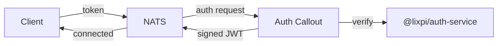

# NATS Auth Callout Service

Centralized authentication and authorization for NATS using the auth_callout mechanism. Validates all NATS connection attempts and issues short-lived user JWTs with appropriate permissions.

## Overview

NATS auth_callout delegates authentication decisions to this service. Every connection attempt is intercepted by NATS and forwarded here for verification.



**Steps:** Decrypt request → Verify token via `@lixpi/auth-service` → Build permissions → Sign user JWT → Return to NATS

## Authentication Modes

### Auth0 (Regular Users)

Web UI and API clients authenticate via Auth0 OAuth2 flow. The auth callout verifies tokens against Auth0's JWKS endpoint using `@lixpi/auth-service`.

- RS256 signature verification
- Token expiration enforced
- Permissions derived from subscription configs
- User-specific templating via `{userId}`

### NKey JWTs (Internal Services)

Internal services can authenticate using self-signed JWTs with Ed25519 NKey signatures. The auth callout checks `iss` against `serviceAuthConfigs`, verifies the signature, and issues the NATS user JWT with the configured permissions.

**Why NKeys instead of Auth0 for services?**
- Zero external dependency for internal communication
- Cryptographic Ed25519 signatures (more secure than passwords)
- Short-lived tokens (1 hour) with auto-rotation
- No Auth0 API costs or latency

### Raw NKey Clients (NATS-Native Tools)

Some NATS-native clients cannot send Lixpi's self-issued JWT in `auth_token`. The NEX CLI/node/workload path uses native NATS NKey auth instead: the client sends `nkey` + `sig`, NATS forwards that challenge response to the callout, and the callout verifies the nonce signature against the registered public key.

Use this for tools that already own the NATS nkey handshake, such as the `services/nex` execution-engine node. Register the public key in `serviceAuthConfigs` and set `account` when the issued user JWT should target a non-default NATS account like `NEX`.

For NEX specifically, `NATS_NEX_NODE_NKEY_SEED` stays only in the NEX runtime. `NATS_NEX_NODE_NKEY_PUBLIC` is passed to NEX for native client auth, to the NATS server config so the server advertises the nonce required by native NKey auth, and to the API for callout verification. The NATS static nkey user is not the final authorization decision under centralized auth_callout; it enables the NKey challenge, and the API callout returns the `NEX` account user JWT that NATS enforces.

## Usage

### Initialization

```typescript
import { startNatsAuthCalloutService } from '@lixpi/nats-auth-callout-service'

await startNatsAuthCalloutService({
    natsService: natsServiceInstance,
    subscriptions: [...],  // Your NATS subscription configs
    nKeyIssuerSeed: process.env.NATS_AUTH_NKEY_ISSUER_SEED,
    xKeyIssuerSeed: process.env.NATS_AUTH_XKEY_ISSUER_SEED,
    jwtAudience: process.env.AUTH0_API_IDENTIFIER,
    jwtIssuer: `https://${process.env.AUTH0_DOMAIN}/`,
    jwksUri: `https://${process.env.AUTH0_DOMAIN}/.well-known/jwks.json`,
    natsAuthAccount: 'AUTH',
    serviceAuthConfigs: [
        {
            publicKey: process.env.NATS_LLM_SERVICE_NKEY_PUBLIC,
            userId: 'svc:llm-workers',
            account: 'AUTH',
            permissions: {
                pub: { allow: ['ai.interaction.chat.receiveMessage.*'] },
                sub: { allow: ['ai.interaction.chat.process'] }
            }
        },
        {
            publicKey: process.env.NATS_NEX_NODE_NKEY_PUBLIC,
            userId: 'svc:nex-node',
            account: 'NEX',
            permissions: {
                pub: { allow: ['$NEX.>', '$JS.API.>', '$JS.lixpi.API.>', '_INBOX.>', 'aiModels.syncCompleted'] },
                sub: { allow: ['$NEX.>', '$JS.API.>', '$JS.lixpi.API.>', '_INBOX.>'] }
            }
        }
    ]
})
```

### Adding a New Service

1. **Generate NKey pair:**
   ```bash
   nsc generate nkey --user
   ```
   Output: seed (`SU...`) and public key (`UA...`)

2. **Add to environment:**
   ```bash
   NATS_MY_SERVICE_NKEY_SEED=SU...
   NATS_MY_SERVICE_NKEY_PUBLIC=UA...
   ```

3. **Register in auth callout:**
   ```typescript
   serviceAuthConfigs: [
       {
           publicKey: env.NATS_MY_SERVICE_NKEY_PUBLIC,
           userId: 'svc:my-service',
           account: 'AUTH',
           permissions: {
               pub: { allow: ['my.service.responses'] },
               sub: { allow: ['my.service.requests'] }
           }
       }
   ]
   ```

4. **Service creates JWT:**
   ```python
   # Python example for a future internal service
   jwt_payload = {
       "sub": "svc:my-service",
       "iss": public_key,  # Must match registered public key
       "iat": now,
       "exp": now + 3600
   }
   # Sign with NKey seed, send in NATS connect options
   ```

## Architecture

**Key design principle:** The auth callout is generic. It knows nothing about specific services—all service configurations are passed at initialization. Adding a service requires zero code changes to auth callout.

## Permission Resolution

For **regular users**, permissions come from subscription definitions:
```typescript
{
    subject: 'asset.get',
    permissions: {
        pub: { allow: ['asset.get'] },
        sub: { allow: ['asset.events.updated.{userIdToken}'] }
    }
}
```

The `{userIdToken}` placeholder is replaced with the authenticated user's
subject-safe token; `{userId}` remains available for subjects that explicitly
use the raw authenticated ID.
When multiple subscription definitions need the same event or wildcard subject,
the first occurrence in the API subscription list is kept and later duplicates
are omitted. This preserves the explicit startup/group order without sorting the
permission lists after assembly.

For **services**, permissions are defined in `serviceAuthConfigs`:
```typescript
{
    publicKey: 'UA...',
    userId: 'svc:llm-workers',
    account: 'AUTH',
    permissions: {
        pub: { allow: ['ai.interaction.chat.receiveMessage.*'] },
        sub: { allow: ['ai.interaction.chat.process'] }
    }
}
```

`account` is optional and defaults to the auth-callout's `natsAuthAccount`. Set it for service clients that must connect into another configured NATS account.

## Security

### NKey Management

- **Seeds are secrets** — store in env vars or secrets manager, never commit
- **Public keys are safe** — distributed to services that verify signatures
- **Rotation**: Update both seed and public key every 90 days or on compromise

### Monitoring

Watch for:
- Failed auth attempts from `svc:*` identities
- JWT signature verification failures
- Permission violations
- Unexpected connection sources

## Dependencies

- `@lixpi/auth-service` — JWT and NKey verification
- `@lixpi/nats-service` — NATS connection management
- `@nats-io/jwt` — NATS JWT encoding
- `@nats-io/nkeys` — Ed25519 key operations
