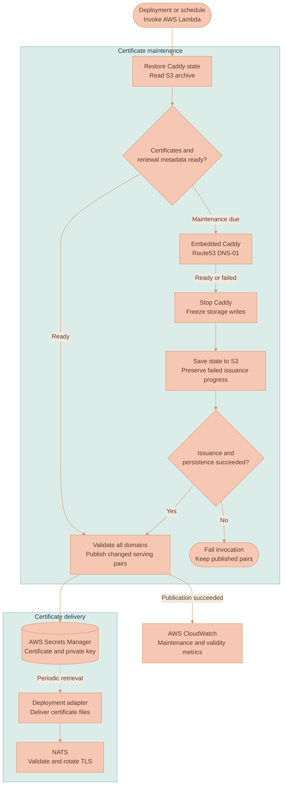

# Caddy Certificate Architecture

The certificate manager runs bounded maintenance jobs. Caddy owns the certificate protocol and renewal machinery; the surrounding Go code decides when a job has produced usable serving material and where to persist it. The broker is a separate process and continues serving its installed certificate while this job runs.

## Public maintenance

The job restores authority state before issuance and saves any progress before publishing serving material. Certificate delivery continues outside the invocation.

| Component | Responsibility |
|---|---|
| Maintenance manager | Restore state, check readiness, bound issuance and stop publication after an issuance or persistence failure |
| Embedded Caddy and Route53 | Issue and renew certificates through DNS-01, then freeze storage mutations at shutdown |
| S3 state archive | Preserve accounts, keys, certificates and renewal metadata across invocations, including progress from failed issuance |
| Secrets Manager | Hold each validated serving pair in one JSON value; unchanged pairs need no new version |
| Deployment adapter and NATS | Deliver files independently of issuance, then validate and install the certificate in the broker |
| CloudWatch | Record successful maintenance and the shortest remaining certificate lifetime after publication |

Every invocation gets a fresh temporary directory. The service reads `caddy-state.tar.gz` from the configured bucket and restores its filesystem layout. An explicit S3 `NoSuchKey` response means first issuance. Access denial, network failure, corrupt gzip data and invalid archive entries stop the job. Reusing a warm Lambda's temporary files after a failed restore could silently use stale account state, so invocations do not share their working directory.

A certificate is ready when its chain is trusted, its private key matches, its hostname matches and its validity period includes the current time. It must also be outside the final third of its lifetime. Persisted ACME Renewal Information, or ARI, can bring maintenance forward: either `_selectedTime` or `_retryAfter` within the next minute makes maintenance due. The latter can require a metadata refresh without requiring a different certificate.

If every domain is ready, the job skips Caddy startup and proceeds to publication. Otherwise it starts the TLS application with an `automate` certificate loader, the configured names and DNS-01 automation policies. Caddy retains its default public issuer order, including the ZeroSSL fallback when an email is configured. Each issuer gets the same email and Route53 settings. The provided hosted-zone ID is passed into the DNS provider.

The service checks readiness once per second. Caddy's renewal-check interval is one minute. A public job normally waits up to 780 seconds; when the Lambda deadline is nearer, it reserves the final minute for shutdown and persistence. The AWS Go runtime supplies invocation deadlines and sends returned errors to Lambda's error endpoint.

## Shutdown and persistence

The service stops Caddy before creating the archive. Its filesystem storage module delegates to CertMagic's file storage and serializes mutations. Caddy's cleanup freezes further stores and deletes, so an asynchronous certificate task cannot write into an archive while it is being created. Existing reads remain possible. Lock files are excluded from snapshots and ignored when restoring an older snapshot because they describe an individual invocation's ownership, not durable certificate state.

The archive retains certificate authority accounts, keys, certificate chains, issuer metadata and renewal information. It uses the existing tar.gz layout and object key. Restoration rejects paths outside the temporary directory, symlinks, hard links and special files. Restored directories use mode `0700`, and restored files use `0600`. The reader limits compressed state to 64 MiB and expanded file content to 256 MiB.

Maintenance failure still triggers a state upload. For example, an ACME account created before a challenge fails should be available to the next invocation. Persistence uses a separate context with a one-minute limit so an expired issuance context does not discard that progress. A failed issuance or failed upload prevents serving-secret publication. An abrupt Lambda termination can still interrupt this work; its timeout must leave the documented reserve.

Pulumi limits the function to one concurrent execution. That serialization matters because S3 stores a snapshot of the whole tree, rather than individual coordinated Caddy storage operations. Do not run another manager against the same bucket concurrently.

## Publication and delivery

The manager validates all configured domains before it starts publishing. A secret contains the full certificate chain and matching private key in one JSON value. The AWS adapter checks paginated secret-version listings for `AWSCURRENT`, reads the current pair and skips the write if both PEM strings match. The SDK generates a token for each write and reuses it across request retries. A token derived from certificate content could refer to a historical version and leave `AWSCURRENT` unchanged when republishing restored state, so the service does not use that scheme. See the [Secrets Manager idempotency contract](https://docs.aws.amazon.com/secretsmanager/latest/apireference/API_PutSecretValue.html).

Secret reads fail closed. A failed read or malformed published value does not become an instruction to overwrite it. For multiple domains, Secrets Manager writes are separate operations: a later failure can leave earlier domains updated. The next invocation safely retries them. Metrics are sent only after the publication loop succeeds.

The deployment adapter polls Secrets Manager and supplies certificate files to NATS. The broker checks its own hostname, trust, remaining lifetime and key match, then switches the installed pair and verifies the served fingerprint. That delivery and rotation path is described in [NATS operations](../../nats/documentation/OPERATIONS.md) and the [Pulumi resource manual](../../../infrastructure/pulumi/src/resources/certificate-manager/README.md).

## Local development

Local mode keeps Caddy's state in the mounted certificate directory. Caddy's internal CA issues a certificate for `localhost`; the intermediate lifetime is 3000 days and the requested leaf lifetime is 2500 days. These long lifetimes are for local development. Public mode uses public issuers and their lifetimes.

After issuance, the service verifies the certificate against the generated root and exports the three filenames consumed by Compose. Public CA and certificate files use `0644`; the private key uses `0600`. A repeated run reuses a valid certificate and the same CA. Startup dependencies wait for successful service completion before starting consumers. Installing the public CA in a developer's trust store is a separate action.

## Upstream contracts

The implementation uses [Caddy's Go lifecycle API](https://pkg.go.dev/github.com/caddyserver/caddy/v2), [TLS automation configuration](https://caddyserver.com/docs/json/apps/tls/), and the [Route53 module](https://github.com/caddy-dns/route53). Caddy's [source-build guide](https://github.com/caddyserver/caddy#build-from-source) describes a separate Go module with pinned Caddy and plugin dependencies. `xcaddy` automates assembly of a standard Caddy command; this service has its own command and embeds the required modules directly.
