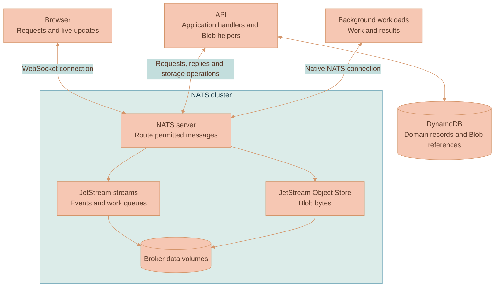

# NATS Service

This service is Lixpi's message broker and native JetStream storage server. The browser, API and background workloads connect to it to send requests, receive live updates, replay events and store file bytes. It also checks each client's credentials when that client connects and gives the connection a specific set of messaging permissions.

The executable is `lixpi-nats`. It runs the upstream NATS server inside a Go process alongside Lixpi's authentication code. NATS itself handles message routing, subscriptions, stream replication and Object Store data. The code in this directory supplies authentication, process startup and shutdown, certificate refresh, and backup/restore commands.

## What passes through this service

A NATS *subject* is a message address. A client publishes to a subject, and NATS delivers the message to permitted subscribers. Lixpi uses that mechanism in three ways:

- **Requests and live updates.** A browser request reaches an API subscription through NATS. The API replies through the request's reply inbox. Live updates use subscriptions too. Ordinary pub/sub does not create a saved event log.
- **Events and work queues.** JetStream stores messages in streams so consumers can read them later, resume from a position or acknowledge completed work. The application chooses which messages to retain and how consumers process them.
- **File bytes.** JetStream Object Store stores objects as stream data. Lixpi's Blob helpers put bytes in organization buckets such as `blobs-<organizationId>-files`. The API keeps the corresponding domain records and Blob references in DynamoDB.

For example, [the API Blob helper](../api/src/services/blob-storage.ts) computes a content hash and writes the bytes through the NATS Object Store API. The bytes live on broker storage; a database reference alone cannot recover them. [Data Storage](../../documentation/platform/DATA-STORAGE.md) describes the application model, while [Operations](documentation/OPERATIONS.md) explains how the broker's stream data is backed up.

## Why authentication runs inside the broker

Browsers arrive with identity-provider JWTs. Internal services prove a registered service identity with an NKey signature or a service JWT. Lixpi needs to turn those different credentials into NATS accounts and publish/subscribe permissions before the connection can send application messages.

NATS provides an authentication request/reply protocol called *auth callout*. When a client connects, the server asks Lixpi's authentication code whether to admit it. Here, the server and that code run in the same process and communicate through NATS's in-memory connection transport. Local authentication therefore needs no second service or loopback TCP connection, while NATS still checks the signed response and enforces the resulting permissions.

Each broker first tries its own verifier. If that verifier is busy or cannot finish, the accepting broker can ask a compatible peer to verify the same request before the connection deadline expires. A rejected credential stays rejected. This retry helps with unavailable verification capacity; it cannot preserve a client socket after its accepting broker dies.

Embedding also puts authentication and message storage in the same process. They share CPU, memory and process failures. The worker limits and deadlines keep a wave of new connections from creating unlimited verification work. They do not establish a safe production capacity by themselves; broker traffic and authentication load need to be measured together. [Architecture](documentation/ARCHITECTURE.md) explains that tradeoff and follows a connection through the code.

## What the authentication decision permits

Admission means accepting a connection into an account with a subject allowlist. `AUTH` contains application traffic and storage. `NEX` separates execution-engine control traffic. `SYS` is for server administration, and `CALLOUT` carries the internal authentication protocol.

Connecting successfully does not grant access to every workspace or file. NATS checks whether the connection may publish or subscribe to a subject. The API separately verifies request tokens and applies resource authorization when handling application requests. [Authentication](../../documentation/platform/AUTHENTICATION.md) explains both checks.

Application subject names and permissions belong to [constants](../../packages/lixpi/constants/README.md) and the [NATS subject registry](../../packages/lixpi/nats-subject-registry/README.md). Deployment setup signs those declarations, including the service public keys and browser issuer settings. The API submits that signed registration before opening its normal application connection. The broker checks the signature against deployment-supplied authority keys and stores the declaration in a protected JetStream KV account. Its executable contains the registration and transport protocol, without application service names or subject lists.

The authority's private signing key stays with deployment tooling. Possessing the bootstrap password lets a service deliver a signed declaration; it cannot change the declared grants. Another application can register different identities, accounts and subjects through the same protocol using the same broker image. [Architecture](documentation/ARCHITECTURE.md#runtime-registration) explains that boundary and the first-start sequence.

## What the container needs

The serving process needs its authentication settings, a writable JetStream volume, readable certificate/key files and a writable directory for installed certificates. Node name, placement zone and advertised address come from explicit settings or a supplied JSON file. The broker reads these inputs directly; it does not discover an EC2 host or fetch certificates from a cloud service.

Local Compose supplies certificate files through its Caddy volume. Deployment tooling can supply the same files in another environment. Certificate issuance, DNS, host lifecycle and off-host snapshot transport sit outside this service. The broker's maintenance code deals with NATS, PEM files and directories, with no S3 or cloud SDK dependency.

The binary has separate command paths. `serve` runs the broker; `health` and `fence` contact a running local process. `backup` and `restore` are NATS clients that exchange native snapshots with a mounted directory. Shipping those commands together keeps their protocol and format versions aligned, but running a backup does not start another broker.

## Reading and changing the service

| If you need to understand... | Read |
|---|---|
| How a connection is authenticated, why local verification can use a peer, and what happens on failure | [Architecture](documentation/ARCHITECTURE.md) |
| Why `broker`, `admission`, `auth`, `policy` and `maintenance` are separate, and where a change belongs | [Modules and Code Responsibilities](documentation/MODULES.md) |
| Which credentials, files, mounts and environment values each command needs | [Configuration](documentation/CONFIGURATION.md) |
| Health checks, certificate rotation, retained volumes, backup, restore and failure diagnosis | [Operations](documentation/OPERATIONS.md) |
| Cluster hosts, replica placement, discovery and deployment-specific adapters | [NATS Cluster deployment](../../documentation/platform/deployment/NATS-CLUSTER.md) |

Builds, dependency installation, formatting and tests run inside Docker. The [Go Testing and Tooling guide](../../documentation/testing/Go/TESTING-GUIDE.md) has the commands. Test runners mount source read-only and keep module/build caches in Docker volumes; the quality runner mounts the directories it needs to edit. The production [Dockerfile](Dockerfile) compiles Go and ships the executable, NATS configuration and CA roots. Application registrations come from initialization, and Go tooling stays in build/development images.
