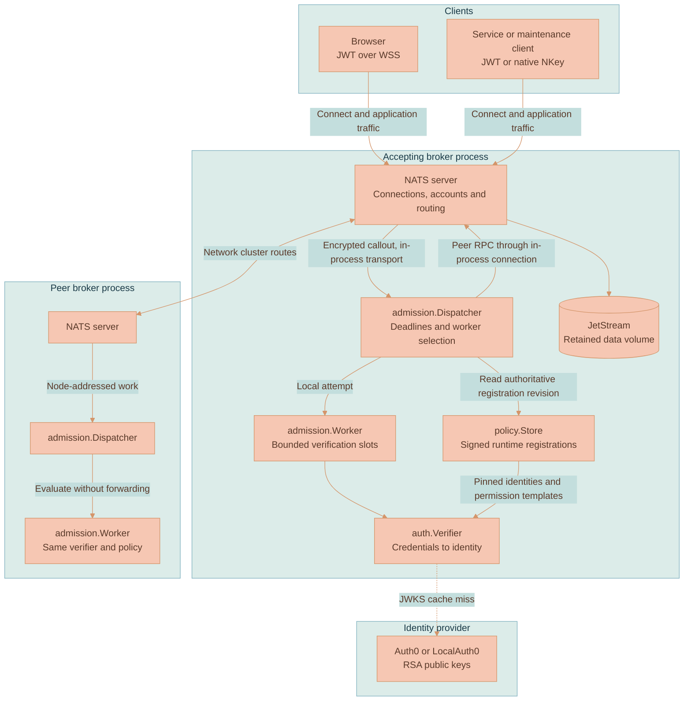
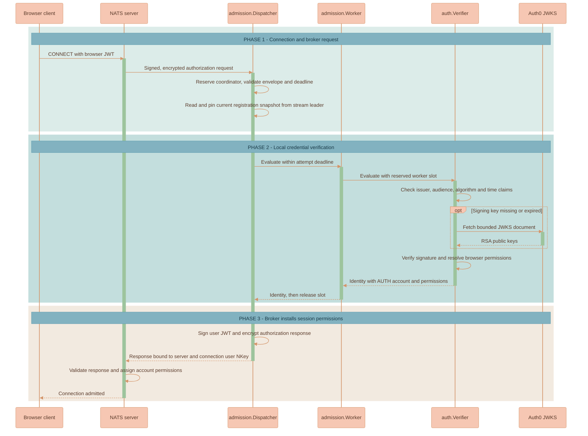
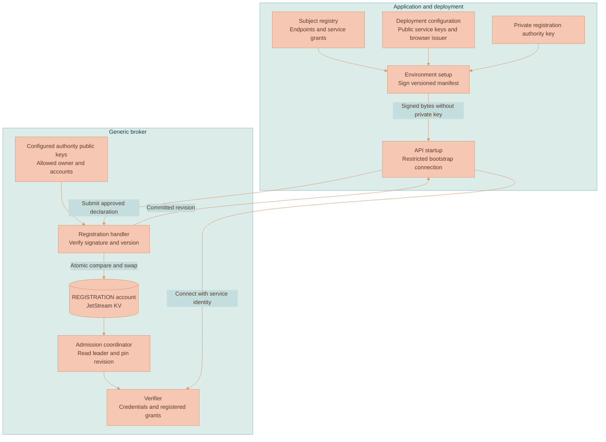
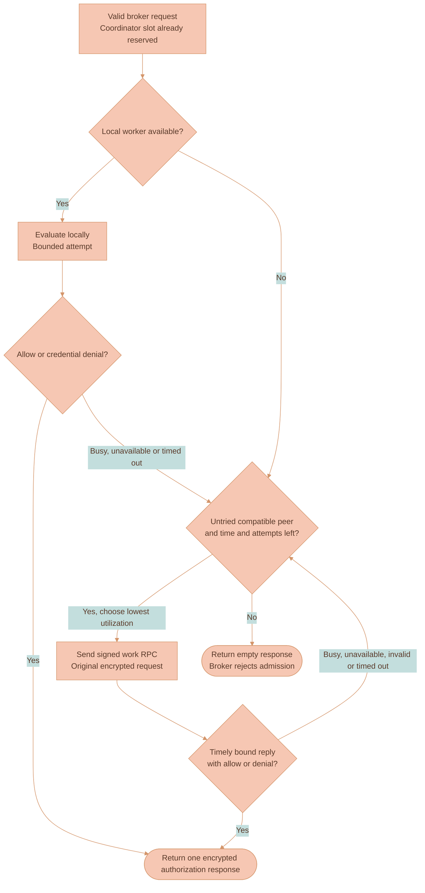

# NATS Broker and Admission Architecture

There are two paths through the [NATS service](../README.md). When a client connects, Lixpi verifies its credentials and returns an account and subject permissions. Once that connection is admitted, the upstream NATS server routes its messages and performs JetStream operations. Authentication is a connection setup step; it is not a proxy through which every message or stored byte passes.

The server is the upstream Go library, embedded in `lixpi-nats`. Using its public APIs lets Lixpi manage the server's lifecycle and attach an authentication responder while retaining NATS's protocol, account enforcement and storage implementation. The responder speaks NATS's normal auth-callout request/reply protocol over an in-memory connection. It doesn't bypass the broker's permission checks or require a custom NATS server fork.

This page follows the running system. [Modules and Code Responsibilities](MODULES.md) connects each part to its implementation; [Operations](OPERATIONS.md) covers certificates and stored-data recovery.

## Process and account boundaries

Every broker has its own server, dispatcher and verifier. A *dispatcher* coordinates pending connections: for each request it tracks the deadline, chooses a worker and returns the answer to NATS. A *worker* limits how many credential checks can run at once. The *verifier* performs the actual signature and identity checks. These are objects inside one Go process.

The diagram shows a client arriving at one broker and a second broker that can help verify its credentials. The in-process connection ends at the local server. Reaching the other broker still uses network cluster routes, which are the connections NATS uses between cluster members.

The client stays connected to the accepting broker even if a peer verifies it. The peer returns a decision, not a replacement connection. After admission, application subscribers can be attached to other cluster members and NATS routes the permitted messages between them. That ordinary routing is separate from choosing a peer to help with authentication.

A NATS account separates subjects and JetStream state from other accounts. It is not a Lixpi organization: application organizations share AUTH, with isolation enforced through subject permissions and application authorization. AUTH and NEX come from Lixpi's deployment authority scopes and signed registrations; they are not built into the Go verifier.

| Account | Purpose | Admission boundary |
|---|---|---|
| SYS | Server administration and system operations | Configured system credentials |
| CALLOUT | Embedded dispatchers and peer verification | Bootstrap user restricted to `IN_PROCESS` connections |
| REGISTRATION | Signed runtime declarations in native JetStream KV | Restricted network submission user and in-process store user |
| AUTH | Browser, API, workload, backup and operator traffic | Browser JWT, registered service JWT or native NKey verification |
| NEX | NEX node control traffic and its JetStream state | Registered NEX identity |

The responder needs a connection before it can authenticate anyone else. Its `auth_callout` bootstrap user is therefore exempt from callout; otherwise startup would ask the responder to authenticate its own not-yet-established connection. That exemption is narrow: the user can connect only through `IN_PROCESS`, subscribe to the authentication subjects and send the permitted replies. A TCP or WebSocket client cannot use that identity even with its password. Ordinary service registrations cannot select SYS, CALLOUT or REGISTRATION. REGISTRATION isolates the runtime declaration store. Its network bootstrap user can submit signed registrations and receive replies, while its store connection is restricted to in-process use.

Embedding saves the separate local authentication connection and process, but also means a process failure takes down both the broker and its verifier. They share CPU, memory and the Go garbage collector. Each broker holds the private issuer key used to sign authorization responses and the XKey used to encrypt/decrypt callout traffic. Account restrictions protect messaging access; they do not isolate those keys from compromised code in the same process. Application, backup and operator clients use their own identities and receive neither issuer seed.

## One connection attempt

The browser has already obtained its login token before this sequence starts. It sends that token in NATS CONNECT over WebSocket TLS. NATS pauses admission and sends a signed, encrypted callout containing the credentials and connection details. The accepting broker's dispatcher takes responsibility for answering it.

This example has a free local worker slot. The verifier checks the browser token against the configured issuer and audience. It fetches a JSON Web Key Set (JWKS) only when the token's signing key is absent or expired in its cache. Service JWTs and native NKey challenge responses use registered public keys and need no JWKS request.

There are two different JWTs in this flow. The browser presents its identity-provider JWT to prove who it is. Lixpi then creates a NATS user JWT that binds the selected account and subject permissions to this connection's user NKey. The server validates that answer before admitting the connection. The session JWT has no expiry, so an established connection is not periodically forced to reconnect by this mechanism. The API still checks request tokens and resource access when it handles application requests.

The callout itself is also authenticated. `auth.Protocol` verifies the broker signature, server identity, intended issuer, protocol type/version, connection user NKey, signed XKey binding and time claims. Those checks stop an answer from being attached to a different connection or an expired request. [Credential verification](MODULES.md#credential-verification) explains the three credential forms and their decision order.

### Why the original callout stays on one broker

The accepting dispatcher must remain responsible for the deadline and final reply, including when another worker stalls. A queue subscription alone does not provide that coordination after a worker has received a request. The generated route restrictions therefore block the exact native `$SYS.REQ.USER.AUTH` subject from crossing cluster routes.

Peer attempts use transport subjects defined by `internal/policy.Transport`. A dispatcher sends the original encrypted request to a particular peer and checks the reply against that attempt. The peer evaluates once and does not forward it. This gives the accepting broker control over retries without spreading the original callout among competing coordinators.

## Runtime registration

The broker knows how to validate a signature, match a verified identity and enforce NATS permissions. It does not decide which application endpoint a browser or worker should use. The application supplies those declarations, and deployment decides who may authorize them.

A signed manifest contains an owner, schema version, increasing application version, service registrations and browser verification profiles. A service entry binds a public NKey and service ID to an account and explicit permissions. A browser profile binds an issuer, audience and JWKS URL to an account and permission templates. The registration authority is separate from the broker's callout issuer: deployment holds the registration signing seed; the broker holds only its public key and allowed owner/account scope.

The application initializer connects as `registration`, using the bootstrap password. That identity can publish only to `$TRANSPORT.REGISTRATION.APPLY` and subscribe only to its registration reply prefix. It cannot read or write JetStream directly. The handler verifies the signed bytes and checks the owner's authority before changing the registry. Knowing a service seed or the bootstrap password does not let a client invent grants.

The registry uses one KV key containing all owners' declarations. Each owner replaces its whole manifest with a higher application version; omitting an identity removes it for future connections. A compare-and-swap revision prevents concurrent writers from silently replacing each other's changes. Retrying the same signed payload returns the existing committed revision. Reusing an older application version is rejected. Distinct owners cannot register the same service ID, public key or browser issuer.

The broker can start and advertise transport readiness before any application registration exists. Lixpi's API applies the deployment-signed manifest before connecting as `svc:api`; that manifest also initializes worker and browser registrations. Other services can deliver their own separately authorized manifests through the same client protocol. There is no dependency on an application-specific initializer in Go.

Each admission reads the registry through the stream leader's management API. The coordinator pins that immutable snapshot for the request. Peer work carries its digest, and the peer must read a matching revision before verification. A failed read or a changed peer revision prevents admission; a cached snapshot alone is not sufficient. Membership compatibility separately checks the transport protocol and configured registration trust.

Browser templates use `{subjectToken}` for a hex-encoded UTF-8 subject, or `{subject}` when the identity contains no NATS wildcard or separator characters. Reply inbox permissions are supplied by the application declaration. Empty permission directions must explicitly deny `>`, because NATS interprets an omitted allow list as unrestricted.

Registry updates affect new connections. They do not reauthorize or disconnect established sessions. For immediate revocation, an operator must also disconnect the affected clients. Restarts retain registrations in native JetStream storage. A full data loss requires submitting the latest deployment-signed manifests again; application-account backups do not contain this separate registry account.

[Configuration](CONFIGURATION.md) documents the wire fields and bootstrap settings. [Environment setup](../../../infrastructure/init-script/README.md) explains signing and refreshing Lixpi declarations.

## Capacity and peer selection

Peer retry handles a failed attempt to verify credentials, not a rejected identity. For example, one node may have all its worker slots occupied, or may be unable to fetch a signing key that another node still has cached. Asking the other node can finish the same connection attempt. Asking again after a bad signature cannot make that credential valid.

| Result | Coordinator action |
|---|---|
| Valid identity | Complete admission with its account and permissions |
| Explicit credential denial | Complete with denial; another worker cannot override it |
| Busy, unavailable, timeout or invalid peer reply | Try another eligible node within the original budget |
| No eligible node or exhausted budget | Fail the pending connection |

The defaults are defined by [serve.go](../cmd/lixpi-nats/serve.go):

| Limit | Default | Behavior |
|---|---|---|
| Local verification slots | 16, configurable through `NATS_AUTH_WORKERS` | A busy worker can cause peer fallback |
| Admission coordinators | 128 | Exhaustion rejects immediately rather than creating an application waiting queue |
| Distinct worker attempts | 4 | An attempted node is excluded from later selection |
| One worker attempt | 300 ms | Timeout is an operational failure |
| Total coordination | At most 1.5 seconds | Also bounded by the signed broker expiry |
| Response reserve | 50 ms | Leaves time inside that expiry for the broker response |

These limits protect different resources. Worker slots limit active credential checks; coordinator slots limit connections waiting for decisions. Cancelling a wait does not free a worker whose verifier is still running. Otherwise repeated timeouts could create new goroutines faster than old ones finish. Incoming peer handlers and NATS subscription pending queues have their own bounds too.

Each dispatcher announces its identity, a fresh instance ID, policy digest and available capacity in signed membership messages. A peer expires after 1.5 seconds without a fresh announcement. Stale or replayed messages, conflicting live instances of the same node and incompatible policy exclude it from selection. The coordinator chooses the lowest advertised utilization among eligible, untried peers and randomizes ties. An announcement does not reserve capacity, so the selected peer can still answer busy.

Replies identify the node instance, original request and particular attempt. A late answer from a timed-out worker cannot complete a later attempt. Once the deadline or attempt limit is exhausted, the pending connection fails. If the accepting process dies, the client must reconnect to another broker; peer verification cannot recover its socket.

## Startup and supervision

Startup must establish both a usable server and a working way to authenticate its clients. `serve` first validates policy, registrations and issuer keys, then resolves persistent identity and installs a valid certificate. It parses the broker configuration and starts NATS. Finally, the runtime creates the in-process dispatcher connection, installs its subscriptions and flushes them so subscription failures are detected.

This setup needs the supplied configuration and files. It does not ask the API, DynamoDB or JWKS endpoint for permission to start. That avoids a startup cycle where the API waits for NATS while NATS waits for the API, and lets cluster routes form during an identity-provider outage.

Starting successfully does not prove that every browser can authenticate. A cached usable signing key can serve a browser during a provider outage, while a missing or expired key can make that browser's admission fail. Service authentication can continue using its registered keys.

The dispatcher sends a probe through its own subscription path to check that it can still receive and answer messages. Runtime supervision checks that structural health every second. Three consecutive unhealthy observations trigger a dispatcher rebuild; after three rebuild attempts within a minute, another required recovery terminates the process. Readiness additionally requires local or compatible peer capacity. Busy workers and provider failures do not by themselves trigger the rebuild loop, because restarting the broker would also disrupt its healthy application connections.

The deployment makes the same distinction. Private discovery includes running broker tasks so the cluster can form before admission is ready. Public discovery additionally checks ECS health and authenticated admission readiness. [Operations](OPERATIONS.md) explains which endpoint to inspect for a failure; [NATS Cluster deployment](../../../documentation/platform/deployment/NATS-CLUSTER.md) explains discovery and replacement policy.

## Certificates and shutdown

Certificate renewal should change what the next TLS handshake sees without disconnecting everyone already using WebSockets. Maintenance validates and installs the candidate pair, then the runtime swaps the certificate returned by `tls.Config.GetCertificate`. A local TLS probe verifies the actual served fingerprint. Failure triggers an attempt to restore the prior pair. The [certificate diagram](OPERATIONS.md#certificate-refresh) shows that sequence.

A full NATS option reload also reauthorizes clients and can disconnect callout-assigned users. That makes it the wrong operation for routine certificate replacement. Placement fencing does use an option reload because it changes the node's placement tags, and may therefore cause reconnects.

SIGTERM and SIGINT start shutdown. The runtime first withdraws its advertised worker capacity, then asks NATS to enter lame-duck mode: stop accepting new connections and drain clients over a bounded interval. The dispatcher remains available for pending admissions during that drain. NATS receives an 80-second duration and a two-second grace period; the runtime forces shutdown if it has not finished after 90 seconds, then closes dispatcher and control listeners. Compose and ECS allow 120 seconds for termination. This is connection shutdown, not evacuation of stored stream replicas from a host.
