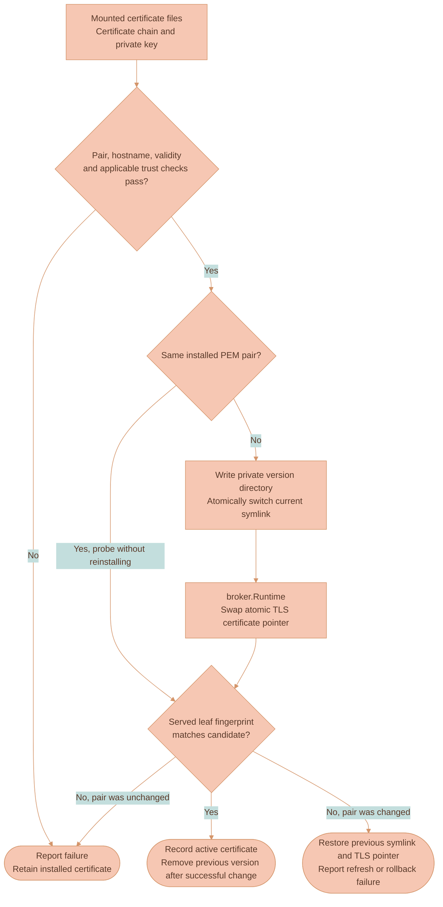
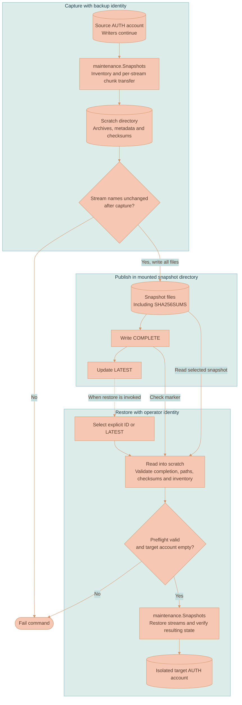

# NATS Service Operations

Operating this service means looking after two things: the live connections and the state needed after a restart or data loss. Health checks tell you whether the server and its authentication path can do their jobs. Certificate refresh changes future TLS handshakes. Backups recover stored streams and objects. These operations have different success conditions; a green process-health check does not prove that a backup exists or that a browser can obtain a signing key.

Commands below run inside Docker. The production image contains the Go executable and its runtime files, without a shell or maintenance CLIs. [Configuration](CONFIGURATION.md) lists the inputs, while [NATS Cluster deployment](../../../documentation/platform/deployment/NATS-CLUSTER.md) covers host placement, DNS and the deployment-specific tasks outside this service.

## Startup and local operation

Local Compose starts a one-shot Caddy job before the broker services. A broker cannot open its WebSocket TLS listener without a certificate, so the job populates the shared source volume even on a first start. Each broker reads that volume, validates the pair and installs its own copy. Its JetStream data lives on a separate per-broker volume.

Build and start the broker services from the repository root after the [environment setup](../../../documentation/platform/DEVELOPMENT.md):

```bash
docker compose --profile main up -d --build lixpi-nats lixpi-nats-2 lixpi-nats-3
docker compose --profile main exec -T lixpi-nats /usr/local/bin/lixpi-nats health ready
```

This command starts the configured application cluster and its certificate dependency. For development tests, use the synthetic isolated setup in [Go Testing and Tooling](../../../documentation/code-quality/testing/GO.md), which has its own credentials and volumes. API and NEX wait for broker admission readiness. NATS can start without the API, DynamoDB or a successful JWKS fetch, so those dependencies do not form a startup cycle.

## Applying registration changes

The normal [init-config wizard](../../../dev-tools/config-utils/README.md) derives and signs the application manifest whenever it saves a new configuration or a partial update. For an existing environment, choose **Edit existing** and **Partial update**; keep existing credentials unless you intend to replace them. After changing endpoint permission code, a partial save with every group skipped still prepares the updated declaration. API startup submits it automatically. The private registration authority seed stays in deployment configuration, outside the API and broker containers.

The broker accepts a repeated identical manifest without changing its revision. A changed declaration requires a higher application version and an atomic registry revision match. An older API replica cannot replace a newer declaration with its startup payload. Give replicas the same approved manifest during rollout; a replica carrying an obsolete manifest fails startup.

The broker can report ready while the registration store is empty or its stream leader is unavailable. Ready means the transport and dispatcher can accept work; it does not promise that an application identity will be admitted. Registration must commit before API initialization succeeds. New admissions fail if they cannot read the registry leader, even if a parsed snapshot remains cached.

Changing or removing grants affects new connections. To revoke access immediately, also disconnect existing clients. A permissions update itself does not reload the server or interrupt established sessions.

## What survives a container restart

`NATS_STORE_DIR` contains the native JetStream files and the saved node name. Reopening the intended volume preserves that broker's data and identity. Replacing the volume with an empty one creates a node without that state, even if the container has the same display name.

Replication and snapshots cover different failures. Replicas let JetStream keep data on multiple brokers according to each stream's configuration. A snapshot is a separate recoverable copy. Replication does not provide a historical version after an application deletion, and a backup taken earlier does not include every later write. The application requests replicated storage, but existing stream settings and actual replica health still need checking before a host is removed.

Installed TLS files have their own lifecycle. The broker requires a readable, valid source pair at startup and can install it into an empty `NATS_TLS_ROOT`. Losing that installed-copy directory is different from losing JetStream data. Keeping the two directories separate makes this distinction explicit.

## Health and metrics

| Endpoint on 3020 | Authentication | Meaning |
|---|---|---|
| `GET /live` | None | Embedded server is running |
| `GET /broker` | None | Server is running, not stopping, and upstream broker/JetStream health is OK |
| `GET /ready` | Bootstrap password as bearer token | Dispatcher subscriptions and probe work, with local or compatible peer verification capacity |
| `GET /metrics` | Bootstrap password as bearer token | JSON admission counters, worker capacity and certificate health |

The bundled health command reads its password from the container environment and probes loopback port 3020:

```bash
docker compose --profile main exec -T lixpi-nats /usr/local/bin/lixpi-nats health broker
docker compose --profile main exec -T lixpi-nats /usr/local/bin/lixpi-nats health ready
```

Use `/broker` to check whether the message broker can run, and `/ready` to check whether new connections have a working authentication path with available capacity. Existing clients can still exchange messages when `/ready` fails because the verifier is saturated. Restarting the broker solely for that condition would interrupt those clients and remove more capacity.

Readiness checks the dispatcher's connection and subscription probe, not an example browser token. A browser whose signing key is missing can still fail during a JWKS outage while a registered service connects successfully. The deployment therefore uses broker health for ECS, admission readiness for public discovery, and running broker tasks for private cluster bootstrap.

`/metrics` identifies the node with `serverName` and reports `ready`, `workerCapacity` and `workerInFlight`. Use those with the `local`, `remote`, `retry`, `denied`, `timeout` and `busy` counters to distinguish ordinary credential rejection from exhausted or unavailable verification. `completed` and `elapsedNanoseconds` record completed coordination and aggregate duration. They do not provide a latency percentile or queue-wait measurement. Dispatcher counters reset when that dispatcher is rebuilt.

Certificate-enabled runtimes also report `certificateRefreshHealthy` and `certificateValidBeyondSevenDays`. A false refresh result can coexist with a still-valid installed certificate. It means the next replacement needs attention, not that NATS has already stopped serving TLS. Standard broker monitoring on 8222 reports connections, routes and JetStream state. Keep monitoring and control listeners private.

Compare startup `protocol` and `trustDigest` when peers refuse to share admission work. These identify the transport protocol and configured registration authorities. Each admission also pins the current registry snapshot digest; peers reject work if their leader read returns a different revision. Do not print full environments, signing seeds, request JWTs or decrypted callouts while diagnosing a mismatch.

## Certificate refresh

There are three steps to renewal. External certificate tooling obtains a certificate and delivers its PEM chain and private key. `maintenance.Certificates` reads and validates those files. `broker.Runtime` changes the certificate used by the live listener. A successful delivery does not prove either that the pair is usable or that NATS is actually serving it, so the broker checks both.

The source paths are `NATS_CERT_FILE` and `NATS_KEY_FILE`. The broker keeps its installed versions under `NATS_TLS_ROOT`, with a `current` symlink selecting a complete pair. It does not overwrite the delivered files. This lets it keep serving a working certificate if a delivery contains a mismatched key, an expired certificate or the wrong hostname.



The diagram follows live refresh. The broker validates the key match, hostname, lifetime and applicable trust chain before installing anything. It writes both files into a new version directory, then switches the symlink. That avoids installing a new certificate with an old key. The runtime swaps its TLS certificate pointer and makes a local handshake to compare the served leaf fingerprint with the candidate.

If installation or the served-certificate check fails after a change, maintenance attempts to restore the previous symlink and TLS pointer. A rollback failure is reported too, and the version files are retained for diagnosis. Startup uses the same validation and file installation before a listener exists; it attaches the live replacement/probe callbacks after starting the server.

The watcher checks the files every minute by default. An unchanged pair still receives validation and a served-fingerprint check. A changed pair affects future handshakes; existing WebSocket connections stay open. The runtime deliberately avoids a full NATS options reload for renewal because that reload also reauthorizes clients and can disconnect callout-authenticated sessions.

On `certificate refresh failed; retaining installed certificate`, inspect the source files, hostname, trust roots and remaining validity before restarting anything. Use `certificateRefreshHealthy` and `certificateValidBeyondSevenDays` on `/metrics` to follow the result. External collectors publish those values to the deployment's monitoring system. Keeping the installed pair buys time to repair delivery; it cannot extend that certificate's expiry. A restart still requires readable, valid source files.

[Certificate management](../../../infrastructure/pulumi/src/resources/certificate-manager/README.md) explains the deployed issuance and delivery process. The broker itself needs only the files and trust configuration.

## Persistent identity and placement fencing

The data directory contains JetStream state, `server-name`, `placement-zone` and, when enabled, `scale-in-fenced`. The saved name lets a replacement container reopen the same broker identity. The fence marker prevents a restart from undoing a retirement already in progress.

Before removing a host, the scaling controller must stop new eligible placements onto it and move its stream/consumer replicas elsewhere. The local `fence` command handles only the placement part, through a mode-0600 Unix socket:

```bash
docker compose --profile main exec -T lixpi-nats /usr/local/bin/lixpi-nats fence enable
docker compose --profile main exec -T lixpi-nats /usr/local/bin/lixpi-nats fence disable
```

`enable` records the fence and removes the normal placement tags. `disable` restores them. If the change fails, the command attempts to preserve the prior state. A successful fence does not move existing data or prove that the disk is safe to discard. Unlike certificate refresh, it reloads server options and can cause authenticated clients to reconnect.

The [scaling controller](../../../infrastructure/pulumi/src/resources/NATS-cluster/README.md) chooses the host, verifies the placement fence, evacuates replicas and checks stream/consumer health before permitting termination. SIGTERM only drains connections; it does not perform that evacuation. Those separate steps are why stopping a container is not a host-removal procedure.

## Native backups

`backup` captures the AUTH account through native JetStream APIs and writes the result into `NATS_SNAPSHOT_DIR`. It includes the account's Object Store streams, so it captures Blob bytes as well as event and work streams. It runs as a separate client; `serve` does not run a scheduled backup loop.

Native snapshots preserve the server's stream and consumer format. They avoid copying live broker files while those files are changing. Each stream is captured at its own point while writers continue. The backup does not create a transaction across streams or a coordinated recovery point with DynamoDB.



Run `lixpi-nats backup` in the configured maintenance container or deployment task with `NATS_URL`, `NATS_BACKUP_NKEY_SEED` and `NATS_SNAPSHOT_DIR`. [Configuration](CONFIGURATION.md#backup-and-restore) explains these inputs. The command first lists the account's streams, transfers each native snapshot into scratch storage and records its metadata. Before publishing the files, it lists stream names again. A changed list rejects the run so an account backup is not marked complete with a known missing or extra stream. That check does not freeze the contents of those streams.

Each completed snapshot directory contains:

| File | Meaning |
|---|---|
| `inventory.jsonl` | Captured streams and snapshot metadata |
| `<stream>/backup.json` | Per-stream restore metadata |
| `<stream>/stream.tar.s2` | Native stream/consumer snapshot archive |
| `SHA256SUMS` | Checksums for the inventory and stream files |
| `COMPLETE` | Written after all snapshot files are stored successfully |
| `LATEST` at the snapshot-directory root | Pointer updated only after completion |

The completion markers are part of the recovery protocol. Archive files can exist after a failed run, so their presence alone does not identify a usable backup. `COMPLETE` is written after the snapshot files, and only then does the root `LATEST` pointer select that set. Individual file replacement is atomic. A failed archive write cannot replace the last completed backup's pointer.

Scratch and completed files coexist during publication, so reserve space for both. Mount the snapshot directory somewhere retained after the backup container exits, or arrange for external tooling to copy the completed set before removing it. The [deployment runbook](../../../documentation/platform/deployment/NATS-CLUSTER.md) describes off-host copies and retention. Those operations are outside the Go service.

The archive format is tested in both directions against the pinned NATS CLI. Only the test image includes that CLI; production captures and restores through Go NATS APIs.

After writing `COMPLETE` and updating `LATEST`, the command prints `NATS_BACKUP_COMPLETE <id>` and exits successfully. That confirms a completed set in the configured directory. It does not confirm that an external upload or off-host copy has finished; the transport must report its own result.

The runtime registration store lives in a separate REGISTRATION account. An AUTH-account backup does not include it. Retain the latest signed manifests and authority configuration with deployment records. After complete registry loss, submit those latest manifests before reconnecting application clients. Replaying an older manifest into an empty registry would recreate its older grants.

## Restore

Restore is intended for an isolated, empty AUTH account. It is not an in-place rollback command for a cluster still serving the application. An empty target lets the command create the captured streams without mixing recovered and live state.

Run `lixpi-nats restore <snapshot-id>` in the recovery container with `NATS_URL`, `NATS_OPERATOR_NKEY_SEED` and the recovered `NATS_SNAPSHOT_DIR`. Omitting the ID selects the directory's `LATEST` file. The command copies the selected files into scratch, checks completion and checksums, validates archive/metadata paths and rejects a nonempty target before its first stream restore. A damaged manifest or checksum fails before target mutation.

Preflight prevents known-bad files from being restored, but it cannot make several stream restores one transaction. If the connection fails after the first stream, that stream can exist while the next is missing. Keep a failed target isolated, inspect what completed, and prepare a deliberately empty target before retrying the complete recovery.

Before redirecting application clients, verify object payloads, stream/consumer state and replica placement. AUTH snapshots exclude NEX state, server/account configuration and DynamoDB. A restored Blob must match the database reference to it; replay positions and pending jobs also need to agree with application records. A successful stream restore alone cannot establish that cross-system consistency. Follow the [deployment recovery runbook](../../../documentation/platform/deployment/NATS-CLUSTER.md) for that acceptance.

## Diagnosing failures

| Symptom | Check |
|---|---|
| Startup rejects issuer keys | Public keys must match the injected issuer/XKey seeds; check secret references without printing their values |
| Startup cannot install a certificate | Mounted file paths and permissions, hostname, chain, matching private key and minimum remaining validity |
| `/broker` passes but `/ready` fails | Dispatcher recovery logs, pending/error state, available workers and compatible peer digests |
| Browser admissions fail while services connect | Token issuer/audience/time claims, provider JWKS reachability and whether the needed key is cached |
| Local work spills to peers or new admissions time out | Worker capacity and utilization, blocked verifiers, route connectivity and the original connection deadline |
| A peer never receives work | Membership expiry/conflicts, registration digest, advertised capacity and node-addressed subject permissions |
| Native maintenance client cannot connect | Its registered public NKey, corresponding private seed, target URL and final account/profile |
| Backup fails after writing files | `COMPLETE` and `LATEST`, scratch/snapshot space, file permissions and stream inventory changes |
| Fenced node remains after restart | The persistent marker is intentional until the controller safely cancels retirement or completes evacuation |

For development verification, use [Docker Go tests](../../../documentation/code-quality/testing/GO.md). The suite exercises worker stalls and loss, stale replies, provider outages, certificate rollback, continuing-writer backups and live scale-in. Hardware sizing still requires concurrent broker and auth load on the intended deployment hardware.
