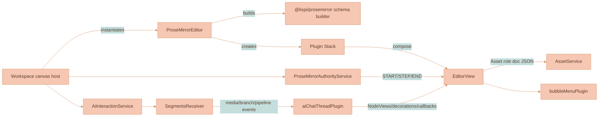
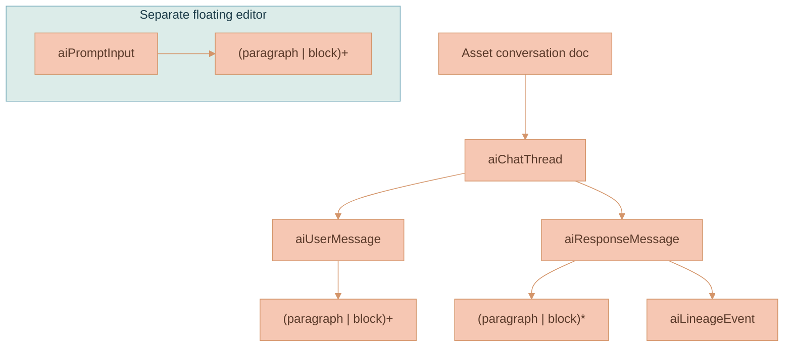
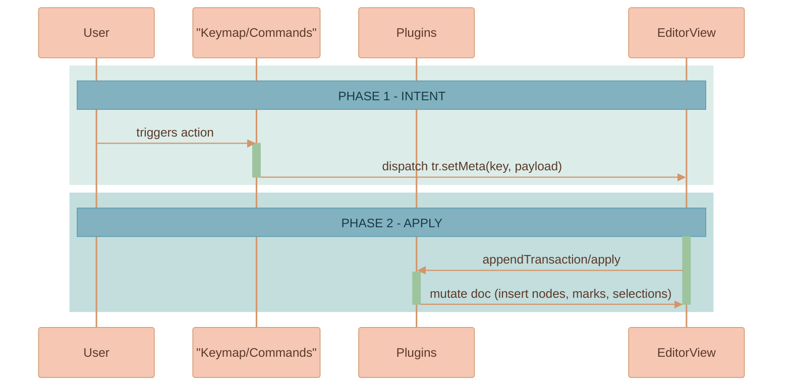
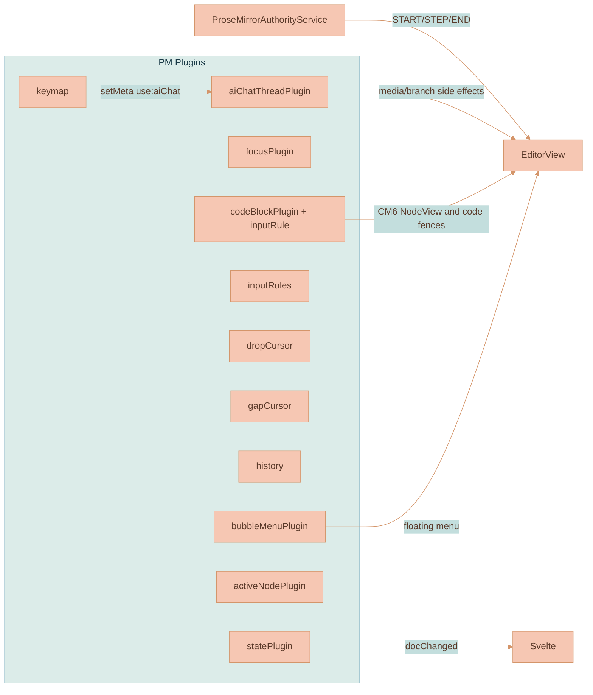
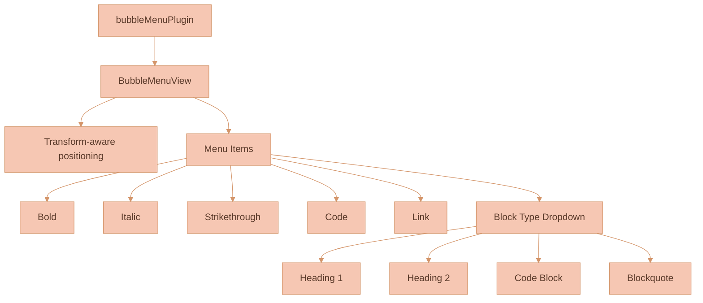
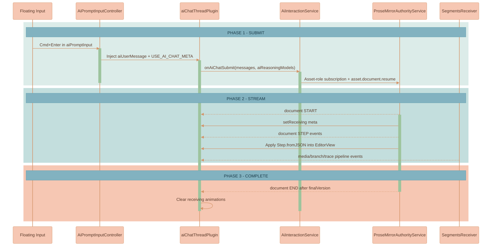
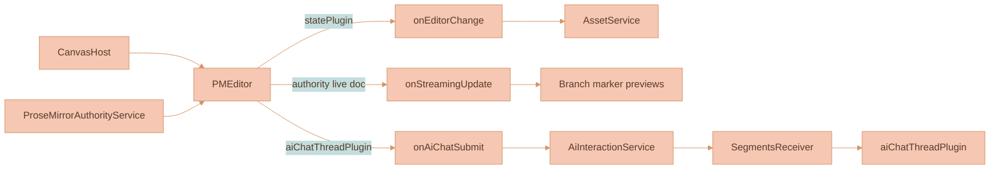

# ProseMirror UI Knowledge Base

This document is the canonical, deep-dive reference for the ProseMirror-based editor powering complex UI in this project. It explains schema composition, custom nodes and node views, plugins, input rules, keymaps, the top menu, and the AI chat pipeline with streaming. It's written for engineers and AI agents to reason about the system and extend it safely.


## High-level overview

- Workspace canvas hosts own editor lifecycle and join Asset metadata with role snapshots before instantiating the editor driver.
- `components/editor.ts` imports the shared ProseMirror schema factory from `@lixpi/prosemirror` and wires all editor plugins.
- A rich plugin stack handles state propagation, AI triggers, authority-backed step application, placeholders/menus, CodeMirror code blocks, and UX behaviors.
- Transaction meta flags (e.g., `use:aiChat`, `insert:<nodeType>`) are the core intra-plugin signaling mechanism.




## Schema and custom nodes

The schema contract lives in `packages/lixpi/prosemirror`. That package exports the base CommonMark-like schema, custom node specs, AI chat node specs, the AI prompt input node spec, model-selection attr normalizers, streaming segment assembly helpers, and the schema builder used by both browser and API code. Web-ui files under `components/schema.ts` and `customNodes/` are thin re-exports; they do not define a second schema.

The active Asset editor modes have different document shapes:

- Asset content (`documentType: 'assetContent'`): `block+`
- Asset conversation (`documentType: 'assetConversation'`): `aiChatThread+`
- Sealed Asset provenance (`documentType: 'assetProvenance'`): `aiChatThread+`, mounted read-only
- Registered Capability Artifact (`documentType: 'capabilityArtifact'`): module-owned document shape supplied through an injected schema and plugin set
- Asset title (`documentType: 'assetTitle'`): `documentTitle`, an ephemeral title-only editor used above media nodes
- Asset metadata (`documentType: 'assetMetadata'`): `documentTitle paragraph`, an ephemeral editor that maps edits to `Asset.title` and the media descriptor summary
- Floating prompt input (`documentType: 'aiPromptInput'`): `aiPromptInput`

The authoritative title is `Asset.title`; persisted Asset snapshots never contain `documentTitle`. The metadata editor uses `documentTitle` only as its editing surface and commits the value through Asset metadata APIs.

The shared schema builder does two important things:

- Adds *new* custom nodes before `paragraph` (so they behave like normal block nodes).
- Updates *existing* base nodes (e.g. `code_block`) **in place** to preserve the base schema order.

Custom nodes are intentionally split by responsibility:

- Inline prompt references use the typed `prompt_reference` atom. The shared schema also parses `capability_reference` atoms in stored drafts and conversation snapshots; insertion paths create only `prompt_reference`. One shared prompt-reference preview renderer resolves Asset identity, labels, authenticated media, and hover cards. Canvas hosts select its inline-popover mode so cards remain inside the canvas transform; ordinary app surfaces retain body-portaled placement.
- The `@` and `/` picker clients always send the active workspace identity. The API limits catalog partitions, recents, and final atom authorization to that workspace's Asset and Capability scope chain; the browser never receives sibling-workspace catalog rows to filter locally.

- Base custom nodes (exported by `@lixpi/prosemirror`, re-exported through `customNodes/index.js`):
  - `code_block` override (`codeBlockNode`): extends the base `code_block` with attrs (e.g. theme) used by the CodeMirror NodeView.
  - `taskRowNode`: placeholder for future Svelte-backed rendering.

- AI chat nodes (schema specs exported by `@lixpi/prosemirror`; browser NodeViews stay in `plugins/aiChatThreadPlugin/`):
  - `aiChatThreadNode` (`aiChatThread`): conversation container. Content expression: `(aiUserMessage | aiResponseMessage)+`. Pure conversation log — no inline composer.
  - `aiUserMessageNode` (`aiUserMessage`): sent user message bubble. Content: `(paragraph | block)+`. Attributes: `id, createdAt`.
  - `aiResponseMessageNode` (`aiResponseMessage`): assistant message. Content: `(paragraph | block)*` so it can start empty and be filled by streaming.
  - `aiReasoningSectionNode` (`aiReasoningSection`): per-reasoning-run section inside one media response message. Content: `(paragraph | block)*`.
  - `aiLineageEventNode` (`aiLineageEvent`): atom block for projected workflow events such as `Branch started` and `Branch fork created`. Live streamed content stores lineage ids on reasoning/media nodes; read-only canvas projections materialize only the lineage events that belong to the projected workflow node.

- AI prompt input (schema spec exported by `@lixpi/prosemirror`; browser NodeView stays in `plugins/aiPromptInputPlugin/`):
  - `aiPromptInputNode` (`aiPromptInput`): floating composer used to send messages to any selected canvas node. Content: `(paragraph | block)+`. Renders as a floating element below the active node.
  - Model controls reconcile the API-configured default into the node attrs before button submission and whenever restored prompt state clears a required selection; the label shown in the selector therefore matches the model IDs emitted in the submit payload.
  - Submission is rejected locally without clearing the draft when the required reasoning-model attr is still empty.



Notes
- Groups: Custom nodes belong to `block` and integrate seamlessly with base block nodes.
- NodeViews: AI chat thread NodeViews live inside `plugins/aiChatThreadPlugin/`. `code_block` node view is provided by the codeBlock plugin.


## Editor construction (`components/editor.ts`)

- Creates a `Schema` through `createProseMirrorSchema(documentType)` from `@lixpi/prosemirror`:
- Uses an explicitly injected registered Artifact schema when one is supplied; generic package modules do not add their document nodes to the global schema switch.
  - Regular documents use only base `customNodes`.
  - AI chat threads extend base `customNodes` with AI chat node specs from `aiChatThreadPlugin`.
- Initializes `EditorView` with:
  - Initial doc via `createInitialDocument(...)`:
    - Asset content: parse the title-free role snapshot or create a paragraph.
    - Asset conversation/provenance: parse the role snapshot or create a schema-valid `aiChatThread` using the Asset ID as `threadId`.
  - Plugin list (order matters):
    - `statePlugin`, `focusPlugin`, `bubbleMenuPlugin`, `linkTooltipPlugin`
    - `imageSelectionPlugin`
    - `buildInputRules`, `keymap(buildKeymap)`, `keymap(baseKeymap)`, `dropCursor`, `gapCursor`, `history`
    - `createCodeBlockPlugin` + `codeBlockInputRule` (CodeMirror integration and ``` fences)
    - `activeNodePlugin`
    - AI stack (Asset conversation and provenance roles): `createAiChatThreadPlugin`
    - Floating prompt stack: media-first `@` references, `/` Capability modules, then `createAiPromptInputPlugin`


## Transaction meta signaling: contract

Meta flags are string keys placed on transactions and observed by `appendTransaction` or `apply` in plugins.

- `insert:<nodeType>`: request a node insertion by a type-specific plugin (only if some plugin actually handles it).
  - Example: `insert:aiChatThread` when creating a new thread node on the canvas.
- `use:aiChat` with `{ threadId, nodePos }`: triggers AI chat flow in `aiChatThreadPlugin` for a specific thread.
- `stop:aiChat` with `{ threadId }`: stops streaming for a specific thread.
- `insertCodeBlock` (via code fence input rule): instructs codeBlock plugin to replace the current paragraph with a code_block.




## Plugins (behavioral map)



### statePlugin (`plugins/statePlugin.js`)
- Emits full doc JSON on any doc-changing transaction unless `skipDispatch` is set.
- Legacy titled schemas may detect first-child title changes. Asset `content`, `conversation`, and `provenance` roles are title-free; global titles update through Asset metadata.
- Skips persistence callbacks for AI chat thread documents. AI chat final snapshots are written by the API when the authoritative stream ends; the live callback still mirrors in-flight docs for canvas previews.
- Authority-backed editors call `asset.document.resume` on mount. The NATS reply contains only a small authenticated HTTP reference to the Object-Store snapshot plus a byte-bounded event page; the authority fetches snapshot JSON over HTTP and drains replay pages until its cursor reaches the returned latest sequence. Document freshness is tracked through role versions from step/control payloads. Disconnect is authoritative over in-flight lease acquisition: a late lease is released without notifying or remounting the destroyed editor.
- The server-authored AI response path purges its conversation step subject immediately after the final snapshot and `END` event are persisted. General mutable-document settlement keeps incorporated client-edit steps replayable for five minutes before purging through that sequence. When local steps are still pending, resume replays and rebases those events instead of replacing the editor with the newer settled snapshot.

### focusPlugin (`plugins/focusPlugin.js`)
- Listens to DOM focus/blur and sets plugin meta. Callback toggles `editable` prop based on `isDisabled`.

### activeNodePlugin (`plugins/activeNodePlugin.js`)
- Tracks `{ nodeType, nodeAttrs }` of the parent of current selection for UI state, styling, or debugging.


## Bubble Menu (`plugins/bubbleMenuPlugin/`)

A floating selection-based formatting menu with transform-aware positioning. Appears when text is selected and provides quick access to formatting commands.

### Features
- **Inline marks**: Bold, Italic, Strikethrough, Code
- **Link editing**: Inline URL input (not a modal)
- **Block formatting**: Headings (1-4), Code Block, Blockquote via dropdown
- **Mobile-first**: Touch-friendly with larger tap targets
- **Transform-aware positioning**: Works correctly inside zoomed/panned canvas viewports

### Architecture
- `bubbleMenuPlugin.ts` - Main plugin with `BubbleMenuView` class
- `bubbleMenuItems.ts` - Menu item definitions and command handlers
- `bubbleMenu.scss` - Mobile-first styles using project color system
- `index.ts` - Public exports




- `components/keyMap.js` binds:
  - Mod-Z/Shift-Mod-Z/Mod-Y for undo/redo, Backspace undoInputRule.
  - Navigation: Alt-ArrowUp/Down join siblings, Mod-[ lift, Escape select parent.
  - Mark toggles: Mod-B/Mod-I/Mod-`.
  - List bindings: Shift-Ctrl-8/9, Enter split list item, Mod-[ / Mod-] outdent/indent.
  - Block type bindings: Shift-Ctrl-0 paragraph, Shift-Ctrl-\\ code_block, Shift-Ctrl-(1..6) headings.
  - Mod-_ to insert horizontal rule.

- `components/inputRules.js` includes smart quotes, ellipsis, em-dash, blockquote, ordered/bullet lists, heading `#` levels.
- Code fences ``` are handled by `plugins/codeBlockPlugin.js`’s `codeBlockInputRule(schema)` replacing the current paragraph with a `code_block` and ensuring an empty line after.


## Code blocks with CodeMirror 6 (`plugins/codeBlockPlugin.js`)

- Provides a NodeView `CodeBlockView` wrapping a CM6 editor, supporting:
  - Theme via `node.attrs.theme` (defaults to gruvboxLight/dark mapping inside plugin).
  - Selection synchronization PM↔CM6:
    - `syncProseMirrorSelection`: if PM selection enters CM, mirror it inside CM.
    - `syncCodeMirrorSelection`: if CM selection hits boundaries, move PM selection before/after the node.
    - Global “Select All” behavior spans PM doc and all CM instances.
  - Keymap inside CM6: Mod-A (select all across doc), Mod-Enter exit code (exitCode), undo/redo fallthrough to PM.
  - `forwardUpdate`: writes CM doc edits into PM transaction using `changes.iterChanges`.
- Decorations: draws selection highlights across code blocks when PM selection intersects CM ranges.
- Input rule `codeBlockInputRule(schema)`: converts ``` line to code_block and inserts an empty paragraph after.

```mermaid
%%{init: {'theme': 'base', 'themeVariables': { 'noteBkgColor': '#82B2C0', 'noteTextColor': '#1a3a47', 'noteBorderColor': '#5a9aad', 'actorBkg': '#F6C7B3', 'actorBorder': '#d4956a', 'actorTextColor': '#5a3a2a', 'actorLineColor': '#d4956a', 'signalColor': '#d4956a', 'signalTextColor': '#5a3a2a', 'labelBoxBkgColor': '#F6C7B3', 'labelBoxBorderColor': '#d4956a', 'labelTextColor': '#5a3a2a', 'loopTextColor': '#5a3a2a', 'activationBorderColor': '#9DC49D', 'activationBkgColor': '#9DC49D', 'sequenceNumberColor': '#5a3a2a'}}}%%
sequenceDiagram
  participant PM as ProseMirror
  participant CM as CodeMirror NodeView
  %% ═══════════════════════════════════════════════════════════════
  %% PHASE 1: INIT
  %% ═══════════════════════════════════════════════════════════════
  rect rgb(220, 236, 233)
      Note over PM, CM: PHASE 1 - INIT
      PM->>CM: NodeView constructed with node.textContent
      activate CM
  end
  %% ═══════════════════════════════════════════════════════════════
  %% PHASE 2: SYNC EDITS
  %% ═══════════════════════════════════════════════════════════════
  rect rgb(195, 222, 221)
      Note over PM, CM: PHASE 2 - SYNC EDITS
      CM->>PM: forwardUpdate (changes) -> tr.replaceWith / delete
      activate PM
      deactivate PM
  end
  %% ═══════════════════════════════════════════════════════════════
  %% PHASE 3: SELECTION MIRRORING
  %% ═══════════════════════════════════════════════════════════════
  rect rgb(246, 199, 179)
      Note over PM, CM: PHASE 3 - SELECTION MIRRORING
      PM->>CM: syncProseMirrorSelection (when PM selection enters CM)
      CM->>PM: syncCodeMirrorSelection (when CM selection hits edges)
      deactivate CM
  end
  end
```


## Svelte component rendering (optional)

The generic `createSvelteComponentRendererPlugin` in `plugins/svelteComponentRenderer/` lets you mount a Svelte component as a NodeView for any node type. It provides a simple contract:

- Plugin factory: `createSvelteComponentRendererPlugin(SvelteComponent, nodeName, defaultAttrs)`
- In `appendTransaction`, listens for `insert:<nodeName>` meta to create and insert the node at the current selection.
- NodeView: uses `SvelteComponentRenderer.create(node, Component, node.attrs)` to mount into a DOM wrapper and stores the component instance on `node._svelteComponent` for cleanup.

Usage pattern
- Define a NodeSpec for `nodeName` in `customNodes`.
- Register the plugin in `createPlugins(...)`.
- Dispatch `tr.setMeta(
  `insert:<nodeName>`, attrs
)` to insert a component-backed node at the selection.

Note: The editor currently ships with the TaskRow Svelte renderer commented out in `components/editor.ts`. It can be re-enabled by providing the actual component and desired default attrs.


## AI interactions and streaming

### aiChatThreadPlugin (`plugins/aiChatThreadPlugin/`)

The main plugin orchestrating AI chat functionality. All AI chat logic is consolidated here.

**Schema nodes managed by this plugin:**
- `aiChatThread` - Container with content: `(aiUserMessage | aiResponseMessage)+` (pure conversation log)
- `aiUserMessage` - Sent user message bubble with `id` and `createdAt` attributes
- `aiResponseMessage` - AI response container with streaming animations; media matrix responses contain one `aiReasoningSection` per reasoning run
- `aiReasoningSection` - Per-model media response slice with its own prose, generation details, and generated thumbnail

**User input is handled separately by `aiPromptInputPlugin`** — a floating canvas element that renders below the selected node, with its own `ProseMirrorEditor` instance. An `AiPromptInputController` service coordinates message injection between the floating input and thread editors.

**Message submission flow:**
1. User types in the floating `aiPromptInput` and presses Cmd/Ctrl+Enter or clicks submit
2. `AiPromptInputController` extracts content, creates an `aiUserMessage` node in the target thread
3. Dispatches `USE_AI_CHAT_META` on the thread editor to trigger the AI request; this submit-seed transaction uses `skipDispatch` because the API receives the post-submit doc and persists the final authoritative snapshot
4. Plugin calls `onAiChatSubmit` callback with the message array

**Streaming response handling:**
- Subscribes to `SegmentsReceiver.subscribeToeceiveSegment()` for streaming events
- `ProseMirrorAuthorityService` subscribes to the live ProseMirror step subject and applies `Step.fromJSON(schema, step)` events from the API
- Conflict resume preserves pending local steps and rebases them over replayed authority events; it applies a newer snapshot directly only when there are no pending local steps
- The submit payload includes the post-placeholder thread doc JSON so API-authored step positions match the browser doc
- If a remote step is structurally invalid for a mounted editor, the authority service stops retrying that step and waits for a newer persisted snapshot to recover the document
- `SegmentsReceiver` remains for non-ProseMirror pipeline events such as media trace, lineage, partial, complete, and error events

See `plugins/aiChatThreadPlugin/README.md` for complete documentation.




## Commands

- `components/commands.js` exports helpers for programmatic document manipulation.


## Workspace host integration

- The Workspace canvas instantiates `ProseMirrorEditor` with an Asset role snapshot and callbacks:
  - `onEditorChange(json)`: local document projection and store mirroring. Authority-backed editors submit local transactions through `ProseMirrorAuthorityService`.
  - `onStreamingUpdate(json)`: live, non-persisting projection used by canvas branch marker previews while authority steps arrive.
  - `onAiChatSubmit(messages, aiReasoningModels, …)`: forwards to `AiInteractionService.sendChatMessage` (which feeds `SegmentsReceiver`).
  - `onAiChatStop()`: stops active AI streaming.
- It manages teardown on node removal and re-creation when the Asset coordinate changes.




## Bubble Menu UX specifics

- Block type dropdown label reflects current block context:
  - `paragraph` → "Text"
  - `heading[level]` → "Heading N"
  - `code_block` → "Code"
  - `blockquote` → "Quote"
- Active marks and block types are highlighted with `.is-active` class.
- Icons are inline SVG strings from `svgIcons/index.ts`.


## Styling hooks (non-exhaustive)

- Bubble menu: `.bubble-menu`, `.bubble-menu-content`, `.bubble-menu-button`, `.bubble-menu-dropdown`, `.bubble-menu-separator`.
- AI nodes: `.ai-chat-thread-wrapper`, `.ai-user-input-wrapper`, `.ai-user-input-content`, `.ai-user-message-wrapper`, `.ai-response-message(-wrapper)`, `.node-render-animation`.
- Code blocks: `.code-block-wrapper`; selection decorations apply `inline.selected` class.
- Placeholders: `.empty-node-placeholder[data-placeholder]` is applied as a node decoration.


## Developer recipes

- Insert a new block node via meta:
  - Dispatch `tr.setMeta('insert:<yourNodeType>', attrs)` and handle it in a plugin's `appendTransaction` to create and place the node.
- Extend the bubble menu:
  - Add a new item in `plugins/bubbleMenuPlugin/bubbleMenuItems.ts` and include it in `buildMenu()`.
- Add a NodeView:
  - Provide a function in `customNodes/index.js` and add it in a plugin under `props.nodeViews[<nodeType>]`.
- React to Mod+Enter differently:
  - Update `buildKeymap` or the `aiChatThreadPlugin` meta handling.
- Add a new AI streaming style:
  - Extend `packages/lixpi/prosemirror/src/stream-assembly.ts` so browser and server assembly stay identical.


## Edge cases and invariants

- Asset content shape: one or more `block` nodes, with no `documentTitle`.
- Asset conversation/provenance shape: one or more `aiChatThread` nodes, with no `documentTitle`.
- Thread shape: `aiChatThread` content is `(aiUserMessage | aiResponseMessage)+`. The thread is a pure conversation log with no inline composer.
- AI response document steps are authored by the API against the submitted post-placeholder thread document. The browser applies them through `ProseMirrorAuthorityService`; media matrix steps target the matching `aiReasoningSection` inside the shared response when the API run metadata declares one.
- **Multiple concurrent streams ARE supported**: Each thread can have independent AI streaming via `threadId` parameter. The plugin maintains a `Set<string>` of active `receivingThreadIds` to track concurrent streams across different threads.
- CodeMirror selection sync: Avoid infinite loops by guarding with `this.updating` and focus checks; keep `forwardUpdate` fast.
- Mod-A behavior intentionally excludes the title from "select all" when cursor isn't in the title; consider that in bulk ops.
- Fresh AI chat thread documents are created using ProseMirror's `createAndFill()` to satisfy the schema content expression and to attach the correct `threadId`.


## Deprecated code (for reference only)

- `plugins/DEPRECATED_DUMPSTER/` contains historical attempts: `aiIconPlugin.js`, `aiSuggestPlugin_old_version_with_.ai_decorator.js`, `editor_old_style_swap_content.js`. These demonstrate decoration widgets and earlier AI suggestion mechanics. Do not re-enable.


## File map

- Workspace host: `components/WorkspaceCanvas.svelte` and `infographics/workspace/WorkspaceCanvas.ts`
- Editor driver: `components/editor.ts`
- Prompt composer wrapper: `aiPromptComposer.ts`
- Shared schema package: `packages/lixpi/prosemirror`
- Schema compatibility export: `components/schema.ts`
- Bubble menu: `plugins/bubbleMenuPlugin/*`
- Keymap & rules: `components/keyMap.js`, `components/inputRules.js`, `components/prompt.js`, `components/commands.js`
- Custom nodes: `customNodes/*` and `customNodes/index.js`
- Plugins: `plugins/*.js` (active), `plugins/svelteComponentRenderer/*` (component NodeView helper), and `plugins/DEPRECATED_DUMPSTER/*` (inactive)


## Quick glossary

- NodeSpec: declarative description of doc structure and DOM serialization.
- NodeView: imperative DOM wrapper around a node for complex behavior (e.g., CodeMirror, animated avatars).
- Decoration: visual augmentation not stored in the document (placeholders, selection indicators across NodeViews).
- Transaction meta: side channel for signaling actions between UI, keymap, and plugins.


## Extensibility checklist

- Define your NodeSpec in `customNodes` and export via `customNodes/index.js`.
- Ensure the shared schema builder order places the node appropriately (before `paragraph` for blocks that must be early).
- If needed, add a NodeView via a plugin’s `props.nodeViews`.
- Define input rules and key bindings if your node needs text-based triggers.
- Add a menu entry if user-facing.
- If your feature flows through AI, produce/consume transaction meta consistently and consider streaming updates.

## Architecture Summary

**AI Chat Thread Document Structure**

The active conversation Asset structure uses a single AI chat thread container:
- The document contains one or more `aiChatThread` nodes and no `documentTitle`; `Asset.title` is authoritative metadata
- Thread content expression: `(aiUserMessage | aiResponseMessage)+` — pure conversation log
- `aiUserMessage` nodes represent sent user messages (injected by `AiPromptInputController`)
- `aiResponseMessage` nodes contain AI responses (created during streaming)

**Floating AI Prompt Input**

User input is handled by a separate `aiPromptInputPlugin` which renders in the bottom-center canvas composer:
- Remains a submit surface while earlier user-message runs are active
- Has its own `ProseMirrorEditor` with `documentType: 'aiPromptInput'`
- `aiPromptComposer.ts` wraps that editor for hosts that mount a reusable prompt surface
- Controls (model selector, image toggle, submit button) are generic reusable factories in `$src/components/aiModelControls/`
- Each submit creates a standalone hidden AI chat thread and a pending branch-lineage projection
- Each active branch-lineage marker shows its thread stop control at the right-center until every planned media branch has finished; the composer has no aggregate receiving/stop state

**Key design decisions**:
- Fresh documents are created using ProseMirror's `createAndFill()` which auto-populates required nodes based on schema
- The editor accepts a `threadId` parameter to ensure the `aiChatThread` node has the correct ID for streaming routing
- Live document step events and pipeline side-effect events are scoped by `threadId` for multi-thread support

---
This knowledge base is hand-audited against the current codebase (see paths above) and aims to be stable, specific, and actionable for future development.
