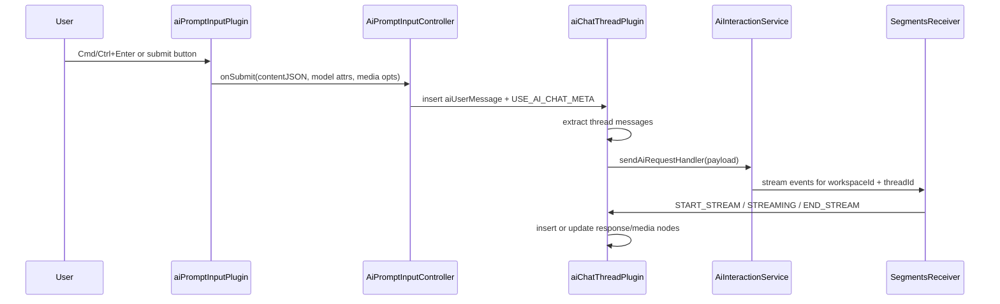

# AI Chat Thread Plugin

`aiChatThreadPlugin` powers the ProseMirror editor inside an AI chat thread canvas node. The thread editor is a conversation log and streaming target. Composer UI is provided by `aiPromptInputPlugin`.

## Input Flow

1. `aiPromptInputPlugin` owns the composer editor and model controls.
2. `AiPromptInputController` injects an `aiUserMessage` into the target thread editor.
3. The controller dispatches `USE_AI_CHAT_META` with `{ threadId, nodePos }`.
4. `aiChatThreadPlugin` extracts the thread messages, calls `sendAiRequestHandler`, and streams response nodes into the same thread.

## What It Does

- Registers chat-thread NodeViews for `aiChatThread`, `aiUserMessage`, `aiResponseMessage`, `aiReasoningSection`, `aiLineageEvent`, `aiCollapsibleBlock`, `aiGeneratedImage`, and `aiGeneratedVideo`.
- Parses `aiUserInput` through the schema compatibility path, then removes those children in `appendTransaction()`.
- Streams parsed text, image, video, context-resolution, branch-resolution, and trace events from `SegmentsReceiver`.
- Maintains receiving state per thread and per reasoning run so multiple model variants can stream without clearing sibling responses too early.
- Delegates generated-image and generated-video canvas side effects through callback surfaces registered by `createAiChatThreadPlugin`.
- Preserves API media-lineage assignments on durable response/media nodes, then projects those ids into reusable lineage-event markers for the live thread, branch-root panels, branch-fork panels, and generated-media provenance.
- Blocks paste inside thread logs. Users paste into the separate prompt input surface.
- Supports read-only generated-media provenance projections through the shared AI chat NodeViews without subscribing the preview editor to live stream events.

## Runtime Wiring

`ProseMirrorEditor` adds this plugin only for `documentType: 'aiChatThread'`.

```ts
createAiChatThreadPlugin({
    sendAiRequestHandler: val => this.onAiChatSubmit(val),
    stopAiRequestHandler: val => this.onAiChatStop(val),
    placeholders: {
        titlePlaceholder: 'New document',
        paragraphPlaceholder: 'I\'m your new document...',
    },
    onReceivingStateChange: this.onReceivingStateChange,
    renderContext: {
        readOnly: false,
        traceDetailsOptions: undefined,
        contextPreview: undefined,
    },
})
```

The factory also accepts optional `imageCallbacks` and `videoCallbacks`, which are stored through `setAiGeneratedImageCallbacks()` and `setAiGeneratedVideoCallbacks()`.
`renderContext.contextPreview` lets user-message NodeViews resolve stored explicit reference ids into shared context preview tiles; read-only provenance projections pass the same renderer so sent-message references match the live panel input previews.



## Schema Nodes

### `aiChatThread`

Container for the conversation log.

- Spec content: `(aiUserMessage | aiResponseMessage)*`
- Document mode: `doc -> documentTitle aiChatThread+`
- Main DOM: `div.ai-chat-thread-wrapper > div.ai-chat-thread-content`
- The NodeView auto-fills a missing `threadId` by dispatching `setNodeMarkup`.
- The NodeView ignores `style` attribute mutations so canvas-driven sizing avoids ProseMirror wrapper recreation.

Attrs declared in `aiChatThreadNode.ts`:

- `threadId`
- `status`
- `aiModel`
- `aiModels`
- `useMultipleModels`
- `useMultipleReasoningModels`
- `useMultipleImageModels`
- `useMultipleVideoModels`
- `aiImageModel`
- `aiImageModels`
- `imageGenerationEnabled`
- `imageGenerationSize`
- `imageGenerationConfigGroups`
- `previousResponseId`
- `aiVideoModel`
- `aiVideoModels`
- `videoAspectRatio`
- `videoResolution`
- `videoDuration`
- `videoGenerationConfigGroups`
- `sourceVideoNodeId`

### `aiUserMessage`

Sent user message bubble inserted by `AiPromptInputController`.

- Content: `(paragraph | block)+`
- Attrs: `id`, `createdAt`, `referenceNodeIds`
- DOM parse target: `div.ai-user-message`
- NodeView shell comes from `createAiUserMessageShell()`.
- Explicit composer references are stored in `referenceNodeIds` at submit time and render above the message text through `components/contextPreview` when `renderContext.contextPreview` is available; those tiles re-resolve the current canvas node on hover so late descriptor self-heal metadata appears without rebuilding the message.

### `aiResponseMessage`

Assistant response node created as the request is submitted, then filled by stream events.

- Content: `(paragraph | block)*`; multi-model media requests store one `aiReasoningSection` child per reasoning run.
- Attrs: `id`, `style`, `isInitialRenderAnimation`, `isReceivingAnimation`, `aiProvider`
- Request metadata attrs: `generationRequestId`
- Empty receiving responses show the shell ring loading indicator until the first content arrives; the empty content container keeps only a small bottom pad so the waiting bubble stays compact without clipping the spinner.
- Response nodes in the chat thread do not render an assistant avatar; model attribution lives on each generation-details collapsible.

### `aiReasoningSection`

Per-model section inside one `aiResponseMessage` for media-generation matrix requests.

- Content: `(paragraph | block)*`
- Attrs: `generationRequestId`, `reasoningRunId`, `reasoningModelId`, `reasoningIndex`, `branchOriginNodeId`, `branchForkNodeId`, `lineageProjectionScope`, `isReceivingAnimation`
- `branchOriginNodeId` and `branchForkNodeId` are persisted from the API lineage assignment. The NodeView asks the shared lineage-event projector which markers belong in the current scope. The live conversation scope can show `Branch started` on the first origin section and `Branch fork created` on forked sections; read-only branch-fork and media-run projections show only fork-local lineage events.
- Created as local placeholders on submit when the request includes image/video generation, then adopted by streamed `generationRun` metadata.
- Owns only that reasoning run's prose, generation-details collapsible, and generated media thumbnail, so canvas provenance/details can resolve by `reasoningRunId` or `mediaRunId`.

### `aiLineageEvent`

Atom block for a materialized workflow event in chat history or a projected chat transcript.

- Spec and NodeView live in `aiLineageEventNode.ts`; event labels and icon rendering live in `aiLineageEvents.ts`.
- Marker CSS mirrors the canvas branch-marker glyph ratio and per-shape SVG offsets so the same icon family stays optically centered at chat size.
- Attrs: `kind`, `branchOriginNodeId`, `branchForkNodeId`, `branchLineNodeId`
- `kind: 'branch-origin'` renders `Branch started`; `kind: 'branch-fork'` renders `Branch fork created`; `kind: 'branch-line'` renders `Branch continued`.
- Live streamed responses materialize these nodes directly from API `generationRun.lineageAssignment` when the response is not split into `aiReasoningSection` nodes. Matrix responses keep lineage ids on each `aiReasoningSection`; projections decide whether to render standalone events or section-local markers.

### `aiGeneratedImage`

Atom node for compact generated-image references in the thread log.

- Spec and exported NodeView live in `aiGeneratedImageNode.ts`.
- Generated-image rendering is owned by `imageSelectionPlugin`.
- `imageSelectionPlugin` owns the active `ImageNodeView` path so regular image selection, bubble-menu alignment, wrap controls, and the shared generated-media provider badge stay on the same visible surface.
- Complete nodes render an authenticated image URL and the provider badge below the image.
- Nodes keep `branchId`, `branchOriginNodeId`, `branchForkNodeId`, `branchLineNodeId`, `parentMediaNodeId`, and `lineageParentNodeId` from `generationRun.lineageAssignment`; the provider badge row remains model/provider-only.
- Generated media nodes share the same in-thread media width contract: full available width up to the chat media cap.
- Partial and complete stream events are matched primarily with `mediaRunId` when available, then by file, response, or partial identifiers.

### `aiGeneratedVideo`

Atom node for generated-video status and previews in the thread log.

- Pending/generating/error/complete events update the in-thread video node.
- Complete nodes render an authenticated video URL, the shared SVG `videoControls` bar as a scaled external row below the video, and the shared generated-media provider badge below the controls.
- Nodes keep the same lineage attrs as generated images; the provider badge row remains model/provider-only.
- Generated media nodes share the same in-thread media width contract: full available width up to the chat media cap.
- The canvas media info button is not rendered in chat history nodes.
- Poster file ids can be reused as still-image context when the thread log is converted into a later request.
- Carries the same run metadata shape as generated images.

### `aiCollapsibleBlock`

Disclosure block for generation traces.

- Content: `(paragraph | block)*`
- Attrs include `title`, `isOpen`, `isStreaming`, `imageGenerationTrace`, `imageGenerationTraceId`, `videoGenerationTrace`, and run metadata.
- Used for image and video generation details.
- The NodeView handles summary mouse/click events itself so thread focus handling does not steal the toggle.
- Trace rendering is shared through `imageGenerationTraceDetails.ts`; reference thumbnails resolve authenticated workspace/API URLs, retry the stored workspace file path when trace URLs fail, and render an unavailable state instead of browser broken-image chrome when a stored image cannot be loaded.
- The NodeView accepts `traceDetailsOptions` from `renderContext`, which lets generated-media provenance previews resolve canvas-only reference sources while still rendering the real `aiCollapsibleBlock` node.
- In read-only render context, summary toggles update the local `<details>` element only and do not dispatch `setNodeMarkup`.

### `aiUserInput`

Compatibility schema node.

- `editor.ts` adds `aiUserInputNodeSpec` to the AI chat thread schema for stored thread document parsing.
- `aiChatThreadPlugin.appendTransaction()` deletes `aiUserInput` children when they appear.
- Thread creation inserts conversation nodes through `AiPromptInputController`.
- The active composer lives in `aiPromptInputPlugin`.

## Request Construction

`handleChatRequest()` reads model and media attrs from the `aiChatThread` node after the controller injects the submitted user message.

The request payload includes:

- `messages`
- `aiModel`
- `aiModels`
- `threadId`
- `imageOptions`
- `videoOptions`
- `referencedFeatureIds`

Model-list attrs are JSON-like strings parsed with `parseAiModelSelectionAttr()`. `useMultipleModels` is accepted as an aggregate multi-model flag when section-specific flags are absent.

Media configuration group attrs are JSON strings parsed through `parseMediaGenerationConfigSelectionAttr()`. They come from the API-authored media generation config matrix and are forwarded to `mediaGenerationRequest.imageOptions.configGroups` / `videoOptions.configGroups`; thread code does not derive provider-specific controls from selected model metadata.

`ContentExtractor.getActiveThreadContent()` extracts only `aiUserMessage` and `aiResponseMessage` blocks. It preserves code blocks with triple backticks, converts hard breaks to newlines, collects inline generated-image references, reuses generated-video posters as image context, and collects `feature_reference` ids.

`ContentExtractor.toMessages()` maps `aiUserMessage` to `user`, `aiResponseMessage` to `assistant`, merges adjacent text-only messages with the same role, and emits multimodal message parts when image references are present:

```ts
{ type: 'image_url', image_url: { url: 'nats-obj://workspace-{workspaceId}-files/{fileId}' } }
```

## Streaming

The plugin subscribes through `SegmentsReceiver` and handles these event families:

- `START_STREAM`
- `STREAMING`
- `END_STREAM`
- stream errors
- `image_partial`
- `image_complete`
- `image_error`
- `image_branch_resolved`
- `image_branch_resolution_error`
- `media_lineage_planned`
- `image_generation_trace`
- `context_relevance_resolved`
- `context_relevance_error`
- `video_pending`
- `video_generating`
- `video_complete`
- `video_error`
- `video_generation_trace`
- `collapsible_start`
- `collapsible_end`

`generationRun` metadata scopes parallel model outputs:

- Matrix text responses are grouped by `reasoningRunId`.
- Media nodes are grouped by `mediaRunId`.
- Matrix generation trace collapsibles are grouped by `reasoningRunId`; scalar media traces stay in the plain response message.
- `receivingThreadIds` is thread-level, while `receivingRunKeysByThread` keeps sibling reasoning runs active independently.
- Local `aiReasoningSection` placeholders are created only for media-generation matrix requests. Scalar single-model media requests can still carry `generationRun` lineage metadata for canvas/media provenance, but they use a plain `aiResponseMessage` so the normal stream lifecycle owns the loading indicator.

## Positioning Helpers

`PositionFinder.findThreadInsertionPoint(state, threadId)` returns the end of the matching thread. A supplied `threadId` scopes the lookup to that thread.

`PositionFinder.findResponseNode(state, threadId, generationRun)` searches within the matching thread and resolves media matrix runs to `aiReasoningSection` targets. It prefers:

1. exact `reasoningRunId` section matches
2. provisional local section templates matching `reasoningModelId` and `reasoningIndex`
3. legacy receiving/initial-render responses, with newest winning ties

That scoping keeps concurrent streams routed to the correct thread and model variant.

## Decorations And Plugin State

Plugin state:

- `receivingThreadIds`
- `receivingRunKeysByThread`
- code-block stream parser state: `insideBackticks`, `backtickBuffer`, `insideCodeBlock`, `codeBuffer`
- `decorations`
- `collapsibleThreadIds`
- `collapsibleRunKeys`

Decoration output:

- title placeholder on empty `documentTitle`
- receiving-state class on `aiChatThread` nodes while any run in that thread is active

## Registered NodeViews

`aiChatThreadPlugin.ts` registers:

- `aiChatThreadNodeView`
- `aiResponseMessageNodeView`
- `aiReasoningSectionNodeView`
- `aiLineageEventNodeView`
- `aiUserMessageNodeView`
- `aiCollapsibleBlockNodeView`
- `aiGeneratedVideoNodeView`

Generated-image rendering is handled by `imageSelectionPlugin`.

## Read-Only Provenance Projections

`readOnlyAiChatThreadRenderer.ts` mounts a `ProseMirrorEditor` with `documentType: 'aiChatThread'`, `readOnly: true`, and an optional trace-details render context. `aiChatThreadContentUtils.ts` builds a scoped `doc` JSON projection for generated image/video provenance by cloning the producing `aiUserMessage` and `aiResponseMessage` from `AiChatThread.content`. Matrix media responses keep only the matching `aiReasoningSection`, selected by `responseMessageId`, `reasoningRunId`, `mediaRunId`, or `reasoningModelId`. Per-image/per-video provenance can additionally prune generated-media atom nodes to the exact `mediaRunId`, `fileId`, and `variantIndex`; branch-fork provenance leaves sibling media visible.

Lineage rendering is projection-scoped instead of panel-specific. `conversation` preserves the full live-thread view, `branch-origin` materializes a standalone `aiLineageEvent` for the branch root, `branch-fork` keeps only fork-local markers on the selected reasoning section, and `media-run` keeps run-local fork or continuation markers for generated-media panels. This keeps branch-root, branch-fork, and branch-line workflow nodes independently reconstructable from the same stored message pieces without copying ancestor events into child projections.

Read-only projections do not subscribe to `SegmentsReceiver`, do not call thread persistence callbacks, and reject document-changing transactions. NodeViews that own local controls guard direct dispatches with `view.editable`, so collapsible toggles, image resize, image/video selection, and focus writebacks do not mutate the projected document.

## Files

- `aiChatThreadPlugin.ts`: orchestration, stream handling, request construction, decorations, plugin state, NodeView registration.
- `aiChatThreadNode.ts`: thread schema and minimal wrapper NodeView.
- `aiUserMessageNode.ts`: sent-user-message schema and shell NodeView.
- `aiResponseMessageNode.ts`: assistant response schema, shell NodeView, and response-level metadata.
- `aiReasoningSectionNode.ts`: per-reasoning-run section schema and NodeView for one shared media response message.
- `aiLineageEvents.ts`: shared lineage-event projection, labels, and icon marker rendering.
- `aiLineageEventNode.ts`: standalone projected workflow event node.
- `aiGeneratedImageNode.ts`: generated-image schema and callback surface.
- `imageSelectionPlugin/imageNodeView.ts`: visible regular/generated image NodeView, authenticated image loading, resizing, and generated-media provider badge.
- `aiGeneratedVideoNode.ts`: generated-video schema, callback surface, in-chat video NodeView, controls mount, and generated-media provider badge.
- `aiCollapsibleBlockNode.ts`: trace disclosure schema and NodeView.
- `imageGenerationTraceDetails.ts`: shared trace detail renderer.
- `aiChatMessageShells.ts`: shared user/assistant message shells.
- `aiChatThreadContentUtils.ts`: helpers for generated-media provenance.
- `aiChatThreadPluginConstants.ts`: shared `PluginKey` and transaction meta constants.
- `aiChatThreadPositionUtils.ts`, `aiChatThreadSend.ts`, `aiChatThreadControls.ts`, `aiUserInputNode.ts`: compatibility/helper modules outside the active prompt-input path.
- `ai-chat-thread.scss`: thread-log, message, media, and compatibility styles.

## Transaction Meta

- `USE_AI_CHAT_META` (`use:aiChat`): starts request construction for a thread. Expected payload is `{ threadId, nodePos }`.
- `STOP_AI_CHAT_META` (`stop:aiChat`): calls `stopAiRequestHandler({ threadId })`.
- `insert:aiChatThread`: inserts an empty thread node for command-driven thread creation.
- Internal meta `setReceiving`: toggles receiving state per thread and run key.
- Internal meta `setCollapsible`: tracks active trace collapsibles per thread and run key.

## Extension Points

Add new streamed block types in `StreamingInserter.insertBlockContent()`.

Add new inline stream segment behavior in `StreamingInserter.insertInlineContent()`.

Add provider/model attribution in the generation-details summary or the shared shell helpers.

Add generated-media canvas behavior through `imageCallbacks` or `videoCallbacks` in the `createAiChatThreadPlugin()` call site.

## Debugging

`IS_RECEIVING_TEMP_DEBUG_STATE` can keep receiving styling active while inspecting CSS. Leave it `false` in normal development.
