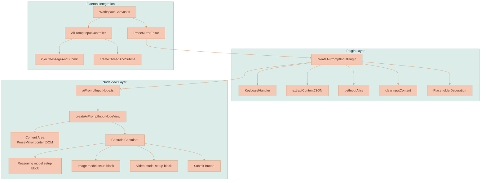
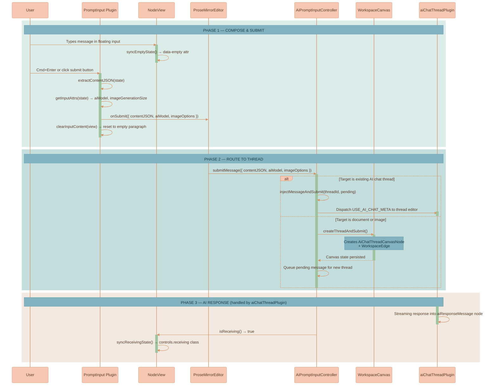

# AI Prompt Input Plugin

Provides the ProseMirror editor used by AI prompt input surfaces. It is a **separate, standalone editor** with its own `documentType: 'aiPromptInput'`, independent from the `aiChatThreadPlugin`. The active workspace composer lives in the AI Chat panel; the older detached canvas-node input path is deprecated.

## What it does

This plugin powers prompt input editors. It provides:
- A rich-text ProseMirror editor for composing messages
- Reasoning, image, and video model selectors that default to single-select
- Per-section multi-model toggles for reasoning/image/video fanout
- Selected-model tag rows under each section when multi-model mode is enabled
- Contextual help tooltips for the reasoning, image, and video model sections
- Optional injected context-preview strip for surfaces that need composer-owned context chrome
- A submit/stop button
- Placeholder text when the input is empty
- Keyboard shortcut support (Cmd/Ctrl + Enter to submit)

When a user types a message and submits:
1. The plugin extracts the content as JSON from the `aiPromptInput` node
2. Reads the scalar model attrs, serialized model-list attrs, and media option attrs
3. Calls the `onSubmit` callback with `{ contentJSON, aiModel, aiModels, useMultipleModels, useMultipleReasoningModels, useMultipleImageModels, useMultipleVideoModels, imageOptions, videoOptions }`
4. Clears the input content and resets the cursor

The plugin does **not** handle AI streaming, message routing, or thread management — that is the responsibility of the `AiPromptInputController` service and the `aiChatThreadPlugin`. In the workspace AI Chat panel, `WorkspaceCanvas.ts` persists each prompt editor document as a per-tab draft in `canvasState.aiChatPanel` and restores it on panel/tab reload; the plugin remains unaware of that storage policy.

## Technical Architecture



**Key Design Principles:**
- **Minimal schema:** The document consists of a single `aiPromptInput` node — no title, no conversation history
- **Decoupled from threads:** The plugin only handles input composition and extraction, never touches thread state or streaming
- **Adapter pattern:** NodeView controls bridge ProseMirror node attrs (`aiModel`, `aiModels`, per-section multi-model flags, `imageGenerationSize`) to UI controls via getter/setter adapters
- **Factory injection:** UI controls (dropdowns, buttons) are injected via factory functions, keeping the plugin framework-agnostic
- **Optional context chrome:** Host surfaces can inject draft-owned context previews into the white input area without making the plugin own context state. Submitted-turn resolver feedback belongs outside the composer.
- **Polling for external state:** Receiving state is synced via a 200ms polling interval since it's owned by external services, not plugin state

## Data Flow



### Schema Node

**`aiPromptInput`** — Floating composer for sending messages to any canvas node
- Content: `(paragraph | block)+`
- Group: `block`
- Draggable: `false`
- Selectable: `false`
- Isolating: `true` (prevents cursor from escaping)
- Attributes:
  - `aiModel: string` (default `''`) — Selected AI model (e.g., `"Anthropic:claude-3-5-sonnet"`)
  - `aiModels: string` (default `''`) — JSON-serialized ordered reasoning model ids for multi-model sends
  - `useMultipleModels: boolean` (default `false`) — Legacy aggregate multi-model flag
  - `useMultipleReasoningModels: boolean` (default `false`) — Enables multi-select mode for the reasoning model section
  - `useMultipleImageModels: boolean` (default `false`) — Enables multi-select mode for the image model section
  - `useMultipleVideoModels: boolean` (default `false`) — Enables multi-select mode for the video model section
  - `aiImageModel: string` (default `''`) — Selected image generation model (e.g., `"OpenAI:dall-e-3"`)
  - `aiImageModels: string` (default `''`) — JSON-serialized ordered image generation model ids for multi-model sends
  - `imageGenerationSize: string` (default `'auto'`) — Image generation resolution or aspect-ratio value, depending on the selected image model metadata
  - `aiVideoModel: string` (default `''`) — Selected video generation model
  - `aiVideoModels: string` (default `''`) — JSON-serialized ordered video generation model ids for multi-model sends
  - `videoAspectRatio: string` (default `''`) — Video generation aspect ratio
  - `videoResolution: string` (default `''`) — Video generation resolution
  - `videoDuration: string` (default `''`) — Video generation duration
- DOM: `div.ai-prompt-input-wrapper[data-ai-model][data-ai-models][data-use-multiple-models][data-use-multiple-reasoning-models][data-use-multiple-image-models][data-use-multiple-video-models][data-ai-image-model][data-ai-image-models][data-image-generation-size][data-ai-video-model][data-ai-video-models][data-video-aspect-ratio][data-video-resolution][data-video-duration]`
- Content hole: `0` (ProseMirror renders editable content inside)

The document schema for `documentType: 'aiPromptInput'` is:
```
doc → aiPromptInput
```

No title node, no other blocks — just the single input node.

## NodeView

The `createAiPromptInputNodeView` factory returns a ProseMirror NodeView with this DOM structure:

```
div.ai-prompt-input-wrapper [data-empty="true"|"false"]
├── [Optional context preview strip]   ← injected via createContextTray()
├── div.ai-prompt-input-content        ← contentDOM (editable)
└── div.ai-prompt-input-controls
    ├── button.ai-prompt-model-menu-trigger
    ├── [Submit Button]                ← injected via createSubmitButton()
    └── div.bubble-menu.ai-prompt-model-menu-info-bubble
        └── div.ai-prompt-model-menu-content
            ├── Reasoning model section ← title, help tooltip, multi-model switch, createModelDropdown(), selected tag row
            ├── Image model section     ← title, help tooltip, multi-model switch, createImageModelDropdown(), createImageSizeDropdown(), selected tag row
            └── Video model section     ← title, help tooltip, multi-model switch, createVideoModelDropdown(), aspect, resolution, duration, selected tag row
```

### Control Adapters

The NodeView uses an adapter pattern to bridge ProseMirror node attributes with UI controls. Each control receives getter/setter functions that read/write `aiModel`, `aiImageModel`, and `imageGenerationSize` via `setNodeMarkup` transactions:

```typescript
const modelControls: AiModelControls = {
    getCurrentAiModel: () => getNodeAttr(view, getPos, 'aiModel'),
    setAiModel: (aiModel) => setNodeAttr(view, getPos, 'aiModel', aiModel),
}
```

This keeps the controls stateless — the ProseMirror document is the single source of truth. The bottom control row only shows the model settings trigger and submit button by default; model dropdowns live in the shared `BubbleMenu` surface. Each model section header keeps the title and help tooltip together on the left, with the per-section multi-model switch on the right. When a section is in multi-model mode and has selected models, a content-tight tag-pill row is rendered below that section's controls grid, so video model options stay on their existing row while selected models can wrap horizontally beneath it. Section help uses the reusable `helpTooltip` TypeScript-html component, which positions its tooltip against the visible viewport instead of assuming there is room on one side. When `createContextTray()` is supplied, the returned element is inserted before the editable content so context previews occupy the white input area and increase composer height without changing the gradient border container.

### State Synchronization

- **Empty state:** `data-empty` attribute on the wrapper toggles placeholder visibility via SCSS. Updated on every `update()` call.
- **Placeholder owner:** The NodeView copies `placeholderText` onto `.ai-prompt-input-content`, so injected context previews can push the editable content down while the placeholder stays aligned with the text insertion point.
- **Receiving state:** The `receiving` CSS class on `.ai-prompt-input-controls` is polled every 200ms via `options.isReceiving()`. This external state comes from `AiPromptInputController.isReceiving()` which tracks which thread IDs are currently streaming.

### NodeView Lifecycle

- **`ignoreMutation()`** — Returns `true` for mutations inside the controls container, preventing ProseMirror from recreating the NodeView when dropdowns or buttons change.
- **`stopEvent()`** — Returns `true` for events targeting the controls container or injected context preview strip, preventing ProseMirror from stealing focus/clicks from dropdowns, buttons, and context preview remove controls.
- **`update()`** — Accepts updates only for `aiPromptInput` nodes. Syncs empty state, receiving state, and calls `update()` on every model dropdown.
- **`destroy()`** — Clears the receiving poll interval, destroys the model `BubbleMenu`, and calls `destroy()` on dropdowns.

## Plugin Internals

### Helper Functions

**`extractContentJSON(state)`** — Walks the document to find the `aiPromptInput` node, returns its children as a JSON array. Returns `null` if the node isn't found or has no text content.

**`getInputAttrs(state)`** — Reads model, image generation, and video generation attributes from the `aiPromptInput` node.

**`clearInputContent(view)`** — Replaces all content inside the `aiPromptInput` node with a single empty paragraph and positions the cursor at the start.

**`KeyboardHandler.isModEnter(event)`** — Returns `true` when Cmd+Enter (macOS) or Ctrl+Enter (Windows/Linux) is pressed.

### Plugin Configuration

```typescript
createAiPromptInputPlugin({
    onSubmit: (data) => { /* { contentJSON, aiModel, imageOptions } */ },
    onStop: () => { /* stop streaming */ },
    isReceiving: () => boolean,
    createContextTray: () => HTMLElement | null,
    createModelDropdown: (controls, dropdownId) => ({ dom, update, destroy }),
    createModelMultiSelect: (controls, dropdownId) => ({ dom, update, destroy }),
    createImageModelDropdown: (controls, dropdownId) => ({ dom, update, destroy }),
    createImageModelMultiSelect: (controls, dropdownId) => ({ dom, update, destroy }),
    createImageSizeDropdown: (controls, dropdownId) => ({ dom, update, destroy }),
    createVideoModelDropdown: (controls, dropdownId) => ({ dom, update, destroy }),
    createVideoModelMultiSelect: (controls, dropdownId) => ({ dom, update, destroy }),
    createVideoAspectDropdown: (controls, dropdownId) => ({ dom, update, destroy }),
    createVideoResolutionDropdown: (controls, dropdownId) => ({ dom, update, destroy }),
    createVideoDurationDropdown: (controls, dropdownId) => ({ dom, update, destroy }),
    createSubmitButton: (controls) => HTMLElement,
    placeholderText: 'Talk to me...',
})
```

The `create*MultiSelect` factories are optional fallbacks for hosts that have not wired multi-select controls yet. When a per-section switch is off, the NodeView mounts the single-select dropdown for that section. When the switch is on, it mounts the matching multi-select factory if supplied, otherwise it falls back to the single-select dropdown while preserving the ProseMirror multi-model attrs.

### Transaction Meta Signals

The plugin supports meta-driven submit/stop via `appendTransaction`:
- **`submit:aiPrompt`** (`SUBMIT_AI_PROMPT_META`) — Triggers content extraction and `onSubmit` callback when set on a transaction.
- **`stop:aiPrompt`** (`STOP_AI_PROMPT_META`) — Triggers the `onStop` callback.

These metas allow external code to programmatically submit or stop without simulating keyboard events.

### Decoration System

A single decoration layer: **placeholder decoration**. When the `aiPromptInput` node has no text content, a `Decoration.node` is applied with:
- Class: `empty-node-placeholder`
- Attribute: `data-placeholder` set to the configured `placeholderText`

The visible placeholder is rendered by `.ai-prompt-input-content::before`. The
NodeView copies `placeholderText` onto the content element so the placeholder
belongs to the editable text area, not to the wrapper that can also contain
injected context previews.

## Integration with WorkspaceCanvas

The workspace creates two types of floating input editors:

### AI Chat Panel Composer
The active composer lives in the workspace AI Chat panel. The detached prompt input that used to appear below selected canvas nodes is deprecated and hidden by `WorkspaceCanvas.ts`.

Legacy `aiPromptInput` schema and controller code still exists because older editor flows and tests depend on it, but current workspace chat sends from the panel composer rather than creating a new AI chat thread canvas node.

The active panel composer:
- Uses `documentType: 'aiPromptInput'` for the `ProseMirrorEditor`
- Receives the shared model, image, video, and submit controls from `primitives/aiControls/`
- Renders inside a `.ai-prompt-input-floating.workspace-ai-chat-floating-panel-prompt` container with optional shifting gradient background (controlled by `settings.aiPromptInput.useShiftingGradientBackground`; see [Visual Effects](../../../../../../../documentation/canvas/VISUAL-EFFECTS.md))
- Model settings menu colors, radii, divider styling, and shadows are configured through `settings.aiPromptInput.modelMenu.styles`. Layout mechanics such as grid shape, padding, width limits, z-index, and tooltip sizing stay in `ai-prompt-input.scss`.

## Styling

SCSS lives in `ai-prompt-input.scss`. Key class hierarchy:

```
.ai-prompt-input-floating            ← absolute-positioned floating container
├── .shifting-gradient-canvas         ← optional gradient background
└── .floating-input-editor            ← editor mount point
    └── .ai-prompt-input-wrapper      ← NodeView root (white glassmorphism card)
        ├── .ai-prompt-input-content  ← editable content area (flex: 1)
        └── .ai-prompt-input-controls ← controls bar (flex-end)
            ├── .ai-prompt-model-menu-trigger    ← opens model settings bubble menu
            ├── .ai-submit-button     ← submit/stop button (32px circle)
            │   ├── .button-default   ← send icon (normal state)
            │   ├── .button-hover     ← send icon (hover state)
            │   └── .button-receiving ← stop icon (streaming state)
            └── .ai-prompt-model-menu-info-bubble
                └── .ai-prompt-model-menu-content
                    └── .ai-prompt-model-menu-section
```

**State-driven styling:**
- `[data-empty="true"]` — Shows placeholder pseudo-element, dims controls
- `[data-empty="false"]` — Fills submit icon with `$nightBlue`, active dropdown text
- `.receiving` on controls — Swaps send icon for stop icon, shows receiving animation

**Visual Details:**
- White glassmorphism card: `rgba(255, 255, 255, 0.9)` with `backdrop-filter: blur(10px)`
- 4px margin creates a visible gradient "border" between the card and the floating container
- Content area: 250px max-height with overflow-y scroll
- Submit button: 32px circle with 3-layer state system (default → hover → receiving)
- Model menu positioning: shared `BubbleMenu` anchored to `.ai-prompt-model-menu-trigger`
- Dropdown positioning: `.info-bubble-wrapper.static-position` overrides InfoBubble's fixed positioning for canvas-embedded dropdowns inside the bubble menu

## Files in this plugin

- **`aiPromptInputNode.ts`** — Node spec and NodeView factory:
  - Exports `aiPromptInputNodeType`, `aiPromptInputNodeSpec`, `createAiPromptInputNodeView`
  - NodeView builds DOM with content area + controls bar
  - Adapter pattern bridges node attrs to UI control getter/setters
  - Polling-based receiving state sync (200ms interval)

- **`aiPromptInputPlugin.ts`** — Plugin orchestration:
  - Exports `createAiPromptInputPlugin`
  - Keyboard handler for prompt submission
  - Content extraction, attribute reading, and input clearing
  - Placeholder decoration system
  - Meta-driven submit/stop via `appendTransaction`
  - Wires NodeView to plugin via `editorViewRef`

- **`aiPromptInputPluginConstants.ts`** — Shared `PluginKey` and meta constants:
  - `AI_PROMPT_INPUT_PLUGIN_KEY` — Unique plugin key
  - `SUBMIT_AI_PROMPT_META` — `'submit:aiPrompt'`
  - `STOP_AI_PROMPT_META` — `'stop:aiPrompt'`

- **`ai-prompt-input.scss`** — All styling for the floating input and its contents

- **`index.ts`** — Barrel exports for all public APIs

- **`aiPromptInputPlugin.test.ts`** — Comprehensive test suite covering:
  - Node spec (content expression, attributes, parseDOM/toDOM)
  - NodeView (DOM structure, empty state, stopEvent, ignoreMutation, update, destroy)
  - Control adapters (ProseMirror attr read/write)
  - Plugin (creation, placeholder decorations, keyboard shortcuts, image options, meta handling)
  - SCSS visual expectations (class hierarchy, sizing, proportions)
  - Receiving state synchronization

## Related Components

- **`$src/services/ai-prompt-input-controller.ts`** — `AiPromptInputController` class that routes submitted messages to the correct thread. Handles target tracking, thread auto-creation, pending message queuing, and receiving state.
- **`$src/components/proseMirror/plugins/primitives/aiControls/`** — Factory functions for the reusable UI controls (model dropdown, image option dropdown, submit button).
- **`$src/components/proseMirror/plugins/aiChatThreadPlugin/`** — The thread plugin that handles AI streaming, response insertion, and conversation rendering. Receives messages from this plugin via `USE_AI_CHAT_META`.
- **`$src/infographics/workspace/WorkspaceCanvas.ts`** — Creates and positions the floating input editors, manages the `AiPromptInputController` lifecycle.
- **`$src/components/proseMirror/components/editor.js`** — `ProseMirrorEditor` class that instantiates the plugin with `documentType: 'aiPromptInput'`.
