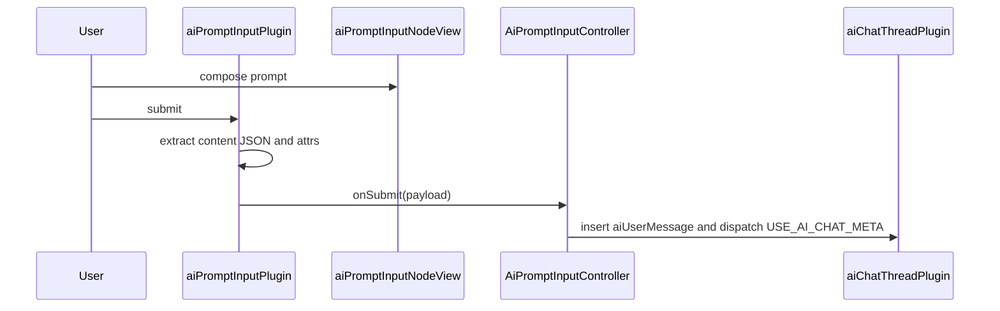

# AI Prompt Input Plugin

`aiPromptInputPlugin` provides the ProseMirror editor used by AI prompt composer surfaces. It runs with `documentType: 'aiPromptInput'` and a single `aiPromptInput` document node. Hosts provide model controls, media controls, context chrome, and submit behavior through plugin options.

## Input Flow

1. The user writes rich-text prompt content in the `aiPromptInput` node.
2. Cmd/Ctrl+Enter, the injected submit button, or `SUBMIT_AI_PROMPT_META` starts submission.
3. `extractContentJSON()` returns the input node children as ProseMirror JSON.
4. `getInputAttrs()` reads the explicit image/video mode, reasoning and media model rows, configuration-matrix selections, and multi-model attrs from the input node.
5. `onSubmit()` receives `{ contentJSON, mediaGenerationMode, aiReasoningModels, reasoningOptions, useMultipleReasoningModels, useMultipleImageModels, useMultipleVideoModels, imageOptions, videoOptions }`. `reasoningOptions.configGroups` carries the API-authored reasoning settings. `imageOptions.aiImageModels` and `videoOptions.aiVideoModels` are ordered arrays, and only the media options for `mediaGenerationMode` are included. Prompt wording never changes the selected media type. The three multi-model booleans are derived from the corresponding row count. Each selected reasoning or active media model keeps its own configuration selection. `contentJSON` retains typed `prompt_reference` atoms; the browser does not derive or send a second reference list.
6. Keyboard and button submission clear the input to one empty paragraph and place the cursor at the start.
7. The host routes the payload. The canvas-wide host creates a standalone hidden AI chat thread for the submitted user message and projects its pending branch marker. Capability-module atoms remain in the stored user message, and the marker renders them through the same `prompt-reference-chip-capability-module` factory used by the editable composer.

The plugin boundary is the submit callback surface. Run cancellation belongs to the branch-lineage marker projected from the submitted user message, not to the composer.

## Runtime Wiring

`ProseMirrorEditor` adds this plugin for `documentType: 'aiPromptInput'`.

When the host provides a `PromptReferenceCatalogClient`, the editor also mounts the per-instance prompt-reference pickers. `@` starts in Media and can switch to Capabilities, standalone Tools, or standalone Skills. `/` searches Capability modules only. Empty queries receive API-ordered, reauthorized recents before broader results; typed queries are debounced, cursor-paginated, and protected against stale responses.

```ts
createAiPromptInputPlugin({
    onSubmit: data => this.onPromptSubmit?.(data),
    createContextTray: this.promptControlFactories?.createContextTray,
    createModelDropdown: this.promptControlFactories?.createModelDropdown,
    createImageModelDropdown: this.promptControlFactories?.createImageModelDropdown,
    createImageSizeDropdown: this.promptControlFactories?.createImageSizeDropdown,
    createVideoModelDropdown: this.promptControlFactories?.createVideoModelDropdown,
    createVideoAspectDropdown: this.promptControlFactories?.createVideoAspectDropdown,
    createVideoResolutionDropdown: this.promptControlFactories?.createVideoResolutionDropdown,
    createVideoDurationDropdown: this.promptControlFactories?.createVideoDurationDropdown,
    createSubmitButton: this.promptControlFactories?.createSubmitButton,
    placeholderText: 'Talk to me...',
})
```



## Schema Node

### `aiPromptInput`

Prompt composer node.

- Content: `(paragraph | block)+`
- Group: `block`
- Draggable: `false`
- Selectable: `false`
- Isolating: `true`
- Document mode: `doc -> aiPromptInput`
- DOM: `div.ai-prompt-input-wrapper`

Attrs declared in `aiPromptInputNode.ts`:

- `aiReasoningModels`
- `reasoningGenerationConfigGroups`
- `mediaGenerationMode` (`image` or `video`; authoritative for the submitted media branch)
- `useMultipleReasoningModels`
- `useMultipleImageModels`
- `useMultipleVideoModels`
- `aiImageModels`
- `imageGenerationSize`
- `imageGenerationConfigGroups`
- `aiVideoModels`
- `videoAspectRatio`
- `videoResolution`
- `videoDuration`
- `videoGenerationConfigGroups`

`aiReasoningModels`, `aiImageModels`, and `aiVideoModels` are JSON-serialized ordered model-id arrays. Each entry maps to one model configuration row, and each section must keep at least one row. `reasoningGenerationConfigGroups`, `imageGenerationConfigGroups`, and `videoGenerationConfigGroups` persist that row's API-authored values. `parseAiModelSelectionAttr()` accepts array values or serialized arrays and filters empty entries. `serializeAiModelSelectionAttr()` deduplicates non-empty model ids.

The section-specific flags `useMultipleReasoningModels`, `useMultipleImageModels`, and `useMultipleVideoModels` remain in the document and API contracts, but the UI derives them from row count instead of exposing switches. Configuration groups remain stored per model so adding, removing, or changing rows does not merge settings for models from the same provider. Reasoning configuration is always submitted; only the active media mode is submitted.

## NodeView Structure

`createAiPromptInputNodeView()` creates the editable wrapper, optional context tray, controls row, model settings trigger, model settings `BubbleMenu`, model configuration rows, and injected submit button. A host may provide `mountMediaModeSwitch()` and `mountModelMenuControl()` to portal those controls into adjacent layout chrome; otherwise they remain children of the node view.

The media-mode control is a 76x40 ui-kit sliding switch. Its two 36x36 option values render `imageIcon` and `videoIcon` without visible text, so the sliding indicator and each value are perfect circles. The instance receives its restrained blue track and stronger light-blue selected circle from `settings.slidingSwitch.styles`. The inactive icon uses a translucent `colorPalette.nightBlue`, reaches the solid color on hover, and renders black when selected. It omits the shared indicator inset shadow so no highlight crescent is drawn. The selected mode stays on the right. Its complete slide-and-swap timeline takes 150 ms, with the swap starting during the final 30% of the initial movement. Each option keeps its explicit generation-mode ARIA label for keyboard and screen-reader use.

```text
div.ai-prompt-input-wrapper[data-empty]
├── [div.ai-prompt-media-mode-switch  Image / Video icon switch, unless externally mounted]
├── [context tray from createContextTray()]
├── div.ai-prompt-input-content
├── div.ai-prompt-input-controls
    ├── [button.ai-prompt-model-menu-trigger, unless externally mounted]
    └── [submit button from createSubmitButton()]
└── div.bubble-menu.ai-prompt-model-menu-info-bubble
    └── div.ai-prompt-model-menu-content
        ├── section.ai-prompt-model-menu-section  Reasoning model
        ├── section.ai-prompt-model-menu-section  Image model
        └── section.ai-prompt-model-menu-section  Video model
```

The reasoning section mounts an `Add model` action and one API-authored configuration row per selected reasoning model. Each row has its own single-select model dropdown, any synchronized reasoning controls, and a removal control.

The image section mounts an `Add model` action and one API-authored configuration row per selected image model. Each row has its own single-select sliding dropdown and removal control. It is visible only in image mode.

The video section mounts an `Add model` action and one API-authored configuration row per selected video model. Each row has its own single-select sliding dropdown and removal control. It is visible only in video mode.

## Control Adapters

Controls read and write ProseMirror node attrs through small adapter objects. Each model dropdown reads one index from the serialized model-list attr, while media controls read the configuration selection for that row's model id.

Every row adapter reads one array index and replaces only that index when its dropdown changes. Options already selected by another row are disabled. The `Add model` action appends the first available unselected model. Its label precedes a compact `$nightBlue` circle containing the white ui-kit `plusIcon`. `createModelConfigurationRow()` is the single renderer for reasoning, image, and video model rows. It owns the model field, optional configuration columns, and the right-aligned removal slot. Removal controls are omitted when the section contains only one model.

Model selectors use the ui-kit sliding dropdown. Every option renders its provider icon and a `Provider: Model` label in both selected and unselected states. The provider uses the dropdown's muted text color, while the model uses its darker active text color. Every model row renders a `Model` field label above the selector. Model rows remount their selectors after the host is connected and remeasure them after the model menu or a media section becomes visible, so closed width and chevron position use rendered SVG geometry instead of detached or hidden fallback estimates. Expanded selectors size to their longest model label instead of the shrink-wrapped model row. Open dropdowns use their own portaled native scroll surface, so the scrollable model-settings surface cannot clip them.

`MediaGenerationConfigMatrixView` reads `aiModelsStore.mediaGenerationConfigMatrix`, which is returned by the API model catalog. It renders one row per selected reasoning, image, or video model in selection order, including separate rows for models that share a provider and catalog group. Each row owns one `{ groupId, modelIds: [modelId], values }` selection so configuration values never leak between models. The shared model-menu gradient separates adjacent rows. Image and reasoning rows keep the model selector and every editable configuration dropdown on one non-wrapping primary row. Each configuration label and selected value share the same left edge within its column. Video aspect ratio, resolution, and duration controls use the existing three-column grid below the model selector. Every editable discrete setting uses the ui-kit sliding dropdown with initial measurement width, height, value typography, and horizontal padding from `settings.aiModelControls.styles.dimensionsDropdown`. Aspect ratios and image dimensions add a dimension glyph whose column width, content gap, and position come from the same settings. Closed controls measure the selected content, while expanded controls fit the longest option without extra width from that initial measurement. Other settings, including video resolutions, durations, output formats, image quality, background mode, and reasoning controls, use text-only dropdown rows. Every dropdown option with a description renders the shared help tooltip beside that option in both closed and expanded states; dropdown controls never render a separate description below the field. Seedance's fixed-camera, watermark, and return-last-frame settings share the next three-column row. Each control renders the shared help tooltip beside its label and aligns the toggle switch below the label. Pipeline-owned negative prompting, moderation policy, and output count are not configuration-matrix controls and are never exposed as composer inputs. The API validates every value against the synchronized controls. The frontend does not derive provider-specific controls.

## Model Settings Menu

The model settings button is created by `createModelMenuTrigger()` and opens a shared `BubbleMenu` anchored to the trigger. Its visible summary subscribes to the AI model catalog so asynchronously loaded model metadata and matrix defaults replace temporary raw ids. With one selected media model, the summary contains that model's provider icon, name, and configuration values. With multiple selected media models, it says `Using multiple models`, follows the label with one provider icon for each selected model, and omits configuration values. The adjacent Image / Video switch already shows the active media mode. Aspect ratios use the same proportional rectangle glyph as the matrix control, durations use `clockIcon`, the model boundary uses the fading vertical separator from the canvas node footer, and configuration values use dot separators. Hosts may mount the button outside the prompt wrapper while the menu remains owned and positioned by the NodeView. In the workspace right control rail, the mode switch and model settings button share one pill. Hovering or opening the model settings activates one full-pill backing element at the bottom of the rail's stacking order. Both controls render above it. The Image / Video panel keeps an opaque white base between that backing element and its translucent SVG switch, so the model hover cannot recolor or interfere with the switch. The model trigger keeps its ARIA label, and the ui-kit help-tooltip provider renders that label as visible hover or focus help without a browser `title` tooltip. Its `aria-expanded` state suppresses that tooltip while the model settings menu is open.

The menu content is built from three `ai-prompt-model-menu-section` blocks:

- `Reasoning model`
- `Image model`
- `Video model`

The bottom settings row summarizes the active media model and its primary configuration when one model is selected. With multiple selected models, it shows only the multi-model label and provider icons. The entire row opens the menu. Reasoning and active-media sections render model-specific groups from the API configuration matrix, and the inactive media section is hidden.

The menu opens above the settings trigger with its right edge aligned to the trigger's right edge. Its positioning parent is the stable prompt wrapper. Model and configuration changes trigger a new position measurement after the trigger summary and menu structure update.

The model settings surface is capped to the viewport space above its trigger. Its content scrolls when the configured model rows exceed that height. Sliding dropdowns use their portaled wheel and touch scroll surface.

Each section has a title, help tooltip, `Add model` action, and one or more removable model rows. The final row's removal control stays disabled.

`settings.aiPromptInput.modelMenu.styles` is copied to CSS custom properties on the NodeView root by `applyModelMenuStyleSettings()`. Layout rules stay in `ai-prompt-input.scss`.

The NodeView hides the model menu on document `mousedown` outside the controls row, model menu, and sliding-dropdown scroll surfaces/SVGs. It removes that listener in `destroy()`.

## Submit

Keyboard submission uses `KeyboardHandler.isModEnter(event)`, which accepts Cmd+Enter and Ctrl+Enter.

The injected submit button receives:

```ts
{
    onSubmit,
}
```

`handleSubmit()` exits when the input text is empty. For non-empty input it builds the submit payload, calls `onSubmit()`, replaces the input content with one empty paragraph, and sets the cursor at the paragraph start.

## Plugin State And Decorations

Plugin state stores a mapped `DecorationSet`.

Decoration output:

- `empty-node-placeholder` on empty `aiPromptInput`
- `data-placeholder` with the configured placeholder text

The visible placeholder is rendered by `.ai-prompt-input-content::before`. The NodeView also writes the placeholder text to `.ai-prompt-input-content` so injected context trays can occupy wrapper space without moving placeholder ownership away from the editable area.

The NodeView mirrors empty state with `data-empty="true"` or `data-empty="false"` on the wrapper. Inline `prompt_reference` atoms count as content even when no text is present, so reference-only prompts suppress the placeholder and enable the active controls.

## NodeView Lifecycle

- `ignoreMutation()` returns `true` for mutations inside the controls row, media-mode switch, and injected context tray.
- `stopEvent()` returns `true` for events inside the controls row, media-mode switch, and injected context tray.
- `update()` accepts `aiPromptInput` nodes, syncs empty state, and updates every mounted dropdown/tag row.
- `destroy()` removes the document mouse listener, destroys the model menu content, destroys the `BubbleMenu`, and destroys mounted toggles, dropdowns, and tag rows.

## Workspace Surfaces

`WorkspaceCanvas.ts` mounts this plugin in the bottom-center canvas composer. One pill in the right control rail contains the Image / Video switch followed by the current model-configuration control. The Media Library and upload/image controls occupy the in-flow left control rail. Every submit creates its own hidden standalone chat thread and pending branch-lineage marker. The composer always remains a send surface, including while other runs are active. The marker shows a persistent pause/stop button at its right-center until every planned media branch in that generation request has finished. Activating it cancels the request and removes the request's persisted canvas projection.

## Styling

SCSS lives in `ai-prompt-input.scss`.

```text
.ai-prompt-input-floating
├── .shifting-gradient-canvas
└── .floating-input-editor
    └── .ai-prompt-input-wrapper
        ├── [.ai-prompt-media-mode-switch when not externally mounted]
        ├── .ai-prompt-input-content
        └── .ai-prompt-input-controls
            ├── [.ai-prompt-model-menu-trigger when not externally mounted]
            ├── .ai-submit-button
            │   ├── .button-default
            │   ├── .button-hover
            └── .ai-prompt-model-menu-info-bubble
                └── .ai-prompt-model-menu-content
                    └── .ai-prompt-model-menu-section
```

State hooks:

- `[data-empty="true"]`: placeholder visible
- `[data-empty="false"]`: active submit and dropdown styling
- `.ai-prompt-model-menu-trigger.is-active`: model settings menu open
- `.ai-prompt-selected-model-tags-row[data-visible="true"]`: selected model tags visible

Settings hooks:

- `settings.aiPromptInput.useShiftingGradientBackground`
- `settings.aiPromptInput.modelMenu.styles`

## Transaction Meta

- `SUBMIT_AI_PROMPT_META` (`submit:aiPrompt`): extracts content and attrs from `newState`, then calls `onSubmit()`.

## Files

- `aiPromptInputPlugin.ts`: plugin creation, submit payload construction, content extraction, attr reading, clearing, placeholder decorations, keydown handling, meta handling.
- `aiPromptInputNode.ts`: node spec, attr parsing/serialization helpers, NodeView, model menu, control adapters, multi-model selectors, media config matrix rendering, selected tag rows, lifecycle handling.
- `aiPromptInputPluginConstants.ts`: `AI_PROMPT_INPUT_PLUGIN_KEY`, `SUBMIT_AI_PROMPT_META`.
- `ai-prompt-input.scss`: floating prompt input, wrapper, editable content, controls row, submit styling, model settings menu, and model configuration row styles.
- `index.ts`: public exports.

## Related Modules

- `$src/services/ai-prompt-input-controller.ts`: routes submitted prompt content to AI chat threads, creates threads for non-thread targets, queues pending messages, and tracks thread receiving state for transcript projection.
- `$src/components/aiModelControls/`: reusable model, media, and submit controls shared by prompt surfaces. Model selectors use `settings.aiModelControls.styles.modelDropdown`. Dimension controls use `settings.aiModelControls.styles.dimensionsDropdown`, while their glyph geometry uses `settings.aiModelControls.styles.dimensionsGlyph`; fixed ratios receive equal visual area so portrait and landscape options have matching weight.
- `$src/components/proseMirror/plugins/aiChatThreadPlugin/`: thread log and streaming response plugin.
- `$src/infographics/workspace/WorkspaceCanvas.ts`: mounts the bottom-center prompt composer, creates standalone message runs, and renders per-marker stop controls.
- `$src/components/proseMirror/components/editor.ts`: creates the `aiPromptInput` schema and plugin stack.
