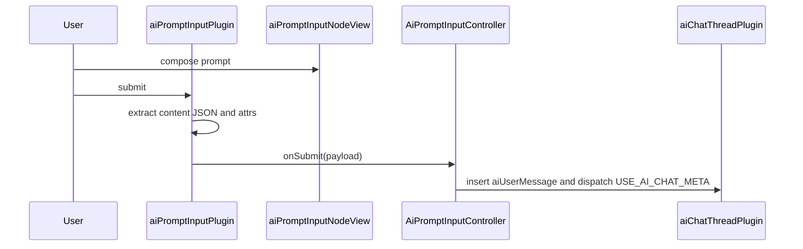

# AI Prompt Input Plugin

`aiPromptInputPlugin` provides the ProseMirror editor used by AI prompt composer surfaces. It runs with `documentType: 'aiPromptInput'` and a single `aiPromptInput` document node. Hosts provide model controls, media controls, context chrome, and submit behavior through plugin options.

## Input Flow

1. The user writes rich-text prompt content in the `aiPromptInput` node.
2. Cmd/Ctrl+Enter, the injected submit button, or `SUBMIT_AI_PROMPT_META` starts submission.
3. `extractContentJSON()` returns the input node children as ProseMirror JSON.
4. `getInputAttrs()` reads the explicit image/video mode, reasoning, media model, configuration-matrix, and multi-model attrs from the input node.
5. `onSubmit()` receives `{ contentJSON, mediaGenerationMode, aiReasoningModels, useMultipleReasoningModels, useMultipleImageModels, useMultipleVideoModels, imageOptions, videoOptions }` (where `imageOptions.aiImageModels` / `videoOptions.aiVideoModels` are ordered arrays). Only the media options for `mediaGenerationMode` are included. Prompt wording never changes the selected media type. Each section's array is collapsed to its first model when its multi flag is off. Media options include API-authored configuration matrix group selections for singular and multi-model requests. `contentJSON` retains typed `prompt_reference` atoms; the browser does not derive or send a second reference list.
6. Keyboard and button submission clear the input to one empty paragraph and place the cursor at the start.
7. The host routes the payload. The canvas-wide host creates a standalone hidden AI chat thread for the submitted user message and projects its pending branch marker. Capability-module atoms remain in the stored user message, and the marker renders them through the same `prompt-reference-chip-capability-module` factory used by the editable composer.

The plugin boundary is the submit callback surface. Run cancellation belongs to the branch-lineage marker projected from the submitted user message, not to the composer.

## Runtime Wiring

`ProseMirrorEditor` adds this plugin for `documentType: 'aiPromptInput'`.

When the host provides a `PromptReferenceCatalogClient`, the editor also mounts the per-instance prompt-reference pickers. `@` starts in Media and can switch to Capabilities, standalone Tools, or standalone Skills. `/` searches Capability modules only. Empty queries receive API-ordered, reauthorized recents before broader results; typed queries are debounced, cursor-paginated, and protected against stale responses.

```ts
createAiPromptInputPlugin({
    onSubmit: data => this.onPromptSubmit?.(data),
    createContextTray: this.promptControlFactories?.createContextTray,
    createModelDropdown: this.promptControlFactories?.createModelDropdown,
    createModelMultiSelect: this.promptControlFactories?.createModelMultiSelect,
    createImageModelDropdown: this.promptControlFactories?.createImageModelDropdown,
    createImageModelMultiSelect: this.promptControlFactories?.createImageModelMultiSelect,
    createImageSizeDropdown: this.promptControlFactories?.createImageSizeDropdown,
    createVideoModelDropdown: this.promptControlFactories?.createVideoModelDropdown,
    createVideoModelMultiSelect: this.promptControlFactories?.createVideoModelMultiSelect,
    createVideoAspectDropdown: this.promptControlFactories?.createVideoAspectDropdown,
    createVideoResolutionDropdown: this.promptControlFactories?.createVideoResolutionDropdown,
    createVideoDurationDropdown: this.promptControlFactories?.createVideoDurationDropdown,
    createSubmitButton: this.promptControlFactories?.createSubmitButton,
    placeholderText: 'Talk to me...',
})
```



## Schema Node

### `aiPromptInput`

Prompt composer node.

- Content: `(paragraph | block)+`
- Group: `block`
- Draggable: `false`
- Selectable: `false`
- Isolating: `true`
- Document mode: `doc -> aiPromptInput`
- DOM: `div.ai-prompt-input-wrapper`

Attrs declared in `aiPromptInputNode.ts`:

- `aiReasoningModels`
- `mediaGenerationMode` (`image` or `video`; authoritative for the submitted media branch)
- `useMultipleReasoningModels`
- `useMultipleImageModels`
- `useMultipleVideoModels`
- `aiImageModels`
- `imageGenerationSize`
- `imageGenerationConfigGroups`
- `aiVideoModels`
- `videoAspectRatio`
- `videoResolution`
- `videoDuration`
- `videoGenerationConfigGroups`

`aiReasoningModels`, `aiImageModels`, and `aiVideoModels` are JSON-serialized ordered model-id arrays — each section's single source of truth, with an array of length 1 meaning a singular selection. `parseAiModelSelectionAttr()` accepts array values or serialized arrays and filters empty entries. `serializeAiModelSelectionAttr()` deduplicates non-empty model ids.

The section-specific flags `useMultipleReasoningModels`, `useMultipleImageModels`, and `useMultipleVideoModels` control reasoning, image, and video sections independently. When a section switch is enabled and its model-list attr is empty, the scalar model attr is used as the single selected model for that section. When a section switch is disabled, its model-list attr is collapsed to the first model. Configuration groups remain stored per model so switching between modes or singular/multi-model selection preserves each model's settings; only the active mode is submitted.

## NodeView Structure

`createAiPromptInputNodeView()` creates the editable wrapper, optional context tray, controls row, model settings trigger, model settings `BubbleMenu`, injected dropdowns, selected-model tag rows, and injected submit button. A host may provide `mountMediaModeSwitch()` to portal the Image / Video switch into adjacent layout chrome; otherwise the switch remains a child of the node view.

```text
div.ai-prompt-input-wrapper[data-empty]
├── [div.ai-prompt-media-mode-switch  Image / Video, unless externally mounted]
├── [context tray from createContextTray()]
├── div.ai-prompt-input-content
├── div.ai-prompt-input-controls
    ├── button.ai-prompt-model-menu-trigger
    └── [submit button from createSubmitButton()]
└── div.bubble-menu.ai-prompt-model-menu-info-bubble
    └── div.ai-prompt-model-menu-content
        ├── section.ai-prompt-model-menu-section  Reasoning model
        ├── section.ai-prompt-model-menu-section  Image model
        └── section.ai-prompt-model-menu-section  Video model
```

The reasoning section mounts a model selector and a multi-model switch.

The image section mounts a model selector, an API-authored per-model configuration matrix, and a multi-model switch. It is visible only in image mode.

The video section mounts a model selector, an API-authored per-model configuration matrix, and a multi-model switch. It is visible only in video mode.

## Control Adapters

Controls read and write ProseMirror node attrs through small adapter objects. Each adapter exposes getter/setter callbacks for the scalar model attr, the serialized model-list attr, or the media option attr it controls.

Single-select controls update the scalar attr and serialize that value into the matching model-list attr.

Multi-select controls update the scalar attr to the first selected model and serialize the full ordered selection into the matching model-list attr.

`ModeAwareModelSelector` swaps between the single-select and multi-select dropdown for each section based on the section's multi-model flag. If a multi-select factory is omitted, the selector mounts the section's single-select dropdown.

Model selector popovers and open sliding-dropdown SVGs are mounted to `document.body` so the model settings panel's scroll container cannot clip them. The model settings menu treats those portaled controls as part of its interaction surface.

`SelectedModelTagsRow` subscribes to `aiModelsStore`, renders selected model tag pills while multi-model mode is enabled, and removes ids through the matching adapter when a tag is closed.

`MediaGenerationConfigMatrixView` reads `aiModelsStore.mediaGenerationConfigMatrix`, which is returned by the API model catalog. It renders only the per-model matrix groups for currently selected image or video model ids. Provider groups remain unboxed and use the model menu's gradient section dividers. Aspect ratios and resolutions use the compact ui-kit sliding dropdown. Every image and video matrix mount passes equal `66 × 66` width and height configuration, producing a circular closed control and preserving the circular selection frame while its tape is expanded. The matrix supplies the dropdown's custom option renderer, which draws a proportion frame above the option label. Resolution frames use their pixel dimensions or the group's selected aspect ratio. Other discrete settings use the ui-kit sliding switch with the same app-wide flat indicator appearance. Duration uses the ui-kit slider and keeps Seedance intelligent duration as an ordered slider value. Pipeline-owned negative prompting, moderation policy, output count, output format, and audio defaults are not configuration-matrix controls and are never exposed as composer inputs. User changes write a sanitized `imageGenerationConfigGroups` or `videoGenerationConfigGroups` attr containing `{ groupId, modelIds, values }`; the API validates every value against the synchronized controls. The frontend does not derive provider-specific controls.

## Model Settings Menu

The model settings button is created by `createModelMenuTrigger()` and opens a shared `BubbleMenu` anchored to the trigger.

The menu content is built from three `ai-prompt-model-menu-section` blocks:

- `Reasoning model`
- `Image model`
- `Video model`

The bottom settings row summarizes the active model and its primary configuration. The entire row opens the menu. Image and video setting sections render per-model groups from the API configuration matrix, and the inactive media section is hidden.

The menu opens above the settings trigger with its right edge aligned to the trigger's right edge. Its positioning parent is the stable prompt wrapper, so configuration-value changes cannot move the open menu. Changes to media mode, multi-model mode, or selected model ids trigger a new position measurement after the menu's structure updates.

The bounded menu content owns native vertical scrolling. Wheel and touch scrolling remain inside the menu instead of propagating into workspace canvas pan or zoom handling.

Each section has a title, help tooltip, section switch, one or more controls, and an optional selected-model tag row. Reasoning multi-select uses the section-level tag row; image and video multi-select tags render inside their API matrix provider groups.

`settings.aiPromptInput.modelMenu.styles` is copied to CSS custom properties on the NodeView root by `applyModelMenuStyleSettings()`. Layout rules stay in `ai-prompt-input.scss`.

The NodeView hides the model menu on document `mousedown` outside the controls row, model menu, model-selector popovers, and portaled sliding-dropdown scroll surfaces/SVGs. It removes that listener in `destroy()`.

## Submit

Keyboard submission uses `KeyboardHandler.isModEnter(event)`, which accepts Cmd+Enter and Ctrl+Enter.

The injected submit button receives:

```ts
{
    onSubmit,
}
```

`handleSubmit()` exits when the input text is empty. For non-empty input it builds the submit payload, calls `onSubmit()`, replaces the input content with one empty paragraph, and sets the cursor at the paragraph start.

## Plugin State And Decorations

Plugin state stores a mapped `DecorationSet`.

Decoration output:

- `empty-node-placeholder` on empty `aiPromptInput`
- `data-placeholder` with the configured placeholder text

The visible placeholder is rendered by `.ai-prompt-input-content::before`. The NodeView also writes the placeholder text to `.ai-prompt-input-content` so injected context trays can occupy wrapper space without moving placeholder ownership away from the editable area.

The NodeView mirrors empty state with `data-empty="true"` or `data-empty="false"` on the wrapper. Inline `prompt_reference` atoms count as content even when no text is present, so reference-only prompts suppress the placeholder and enable the active controls.

## NodeView Lifecycle

- `ignoreMutation()` returns `true` for mutations inside the controls row, media-mode switch, and injected context tray.
- `stopEvent()` returns `true` for events inside the controls row, media-mode switch, and injected context tray.
- `update()` accepts `aiPromptInput` nodes, syncs empty state, and updates every mounted dropdown/tag row.
- `destroy()` removes the document mouse listener, destroys the model menu content, destroys the `BubbleMenu`, and destroys mounted toggles, dropdowns, and tag rows.

## Workspace Surfaces

`WorkspaceCanvas.ts` mounts this plugin in the bottom-center canvas composer. Its Image / Video switch is mounted into the in-flow left control rail, between the composer and the upload/image action panel, so the mode panel occupies layout space and pushes the action panel left. Every submit creates its own hidden standalone chat thread and pending branch-lineage marker. The composer always remains a send surface, including while other runs are active. The marker shows a persistent pause/stop button at its right-center until every planned media branch in that generation request has finished. Activating it cancels the request and removes the request's persisted canvas projection.

## Styling

SCSS lives in `ai-prompt-input.scss`.

```text
.ai-prompt-input-floating
├── .shifting-gradient-canvas
└── .floating-input-editor
    └── .ai-prompt-input-wrapper
        ├── [.ai-prompt-media-mode-switch when not externally mounted]
        ├── .ai-prompt-input-content
        └── .ai-prompt-input-controls
            ├── .ai-prompt-model-menu-trigger
            ├── .ai-submit-button
            │   ├── .button-default
            │   ├── .button-hover
            └── .ai-prompt-model-menu-info-bubble
                └── .ai-prompt-model-menu-content
                    └── .ai-prompt-model-menu-section
```

State hooks:

- `[data-empty="true"]`: placeholder visible
- `[data-empty="false"]`: active submit and dropdown styling
- `.ai-prompt-model-menu-trigger.is-active`: model settings menu open
- `.ai-prompt-selected-model-tags-row[data-visible="true"]`: selected model tags visible

Settings hooks:

- `settings.aiPromptInput.useShiftingGradientBackground`
- `settings.aiPromptInput.modelMenu.styles`

## Transaction Meta

- `SUBMIT_AI_PROMPT_META` (`submit:aiPrompt`): extracts content and attrs from `newState`, then calls `onSubmit()`.

## Files

- `aiPromptInputPlugin.ts`: plugin creation, submit payload construction, content extraction, attr reading, clearing, placeholder decorations, keydown handling, meta handling.
- `aiPromptInputNode.ts`: node spec, attr parsing/serialization helpers, NodeView, model menu, control adapters, multi-model selectors, media config matrix rendering, selected tag rows, lifecycle handling.
- `aiPromptInputPluginConstants.ts`: `AI_PROMPT_INPUT_PLUGIN_KEY`, `SUBMIT_AI_PROMPT_META`.
- `ai-prompt-input.scss`: floating prompt input, wrapper, editable content, controls row, submit styling, model settings menu, selected-model tag row styles.
- `index.ts`: public exports.

## Related Modules

- `$src/services/ai-prompt-input-controller.ts`: routes submitted prompt content to AI chat threads, creates threads for non-thread targets, queues pending messages, and tracks thread receiving state for transcript projection.
- `$src/components/aiModelControls/`: reusable model, media, multi-select, and submit controls shared by prompt surfaces. Dimension glyphs use `settings.aiModelControls.styles.dimensionsGlyph`; fixed ratios receive equal visual area so portrait and landscape options have matching weight.
- `$src/components/proseMirror/plugins/aiChatThreadPlugin/`: thread log and streaming response plugin.
- `$src/infographics/workspace/WorkspaceCanvas.ts`: mounts the bottom-center prompt composer, creates standalone message runs, and renders per-marker stop controls.
- `$src/components/proseMirror/components/editor.ts`: creates the `aiPromptInput` schema and plugin stack.
