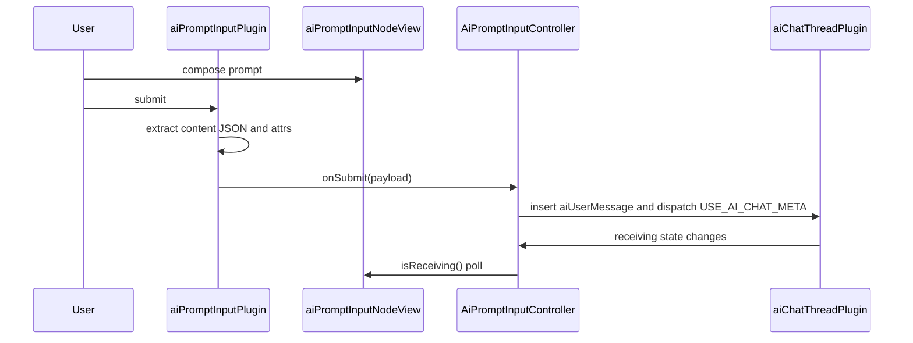

# AI Prompt Input Plugin

`aiPromptInputPlugin` provides the ProseMirror editor used by AI prompt composer surfaces. It runs with `documentType: 'aiPromptInput'` and a single `aiPromptInput` document node. Hosts provide model controls, media controls, context chrome, submit behavior, stop behavior, and receiving state through plugin options.

## Input Flow

1. The user writes rich-text prompt content in the `aiPromptInput` node.
2. Cmd/Ctrl+Enter, the injected submit button, or `SUBMIT_AI_PROMPT_META` starts submission.
3. `extractContentJSON()` returns the input node children as ProseMirror JSON.
4. `getInputAttrs()` reads reasoning, image, video, and multi-model attrs from the input node.
5. `onSubmit()` receives `{ contentJSON, aiReasoningModels, useMultipleReasoningModels, useMultipleImageModels, useMultipleVideoModels, imageOptions, videoOptions }` (where `imageOptions.aiImageModels` / `videoOptions.aiVideoModels` are ordered arrays). Each section's array is collapsed to its first model when its multi flag is off. Media options include API-authored configuration matrix group selections when image or video multi-model mode is active.
6. Keyboard and button submission clear the input to one empty paragraph and place the cursor at the start.
7. `AiPromptInputController` routes the submitted content to an existing AI chat thread or creates a thread and queues the submit until that thread editor is registered.

The plugin boundary is the submit/stop callback surface. `AiPromptInputController` handles target tracking, thread creation, `aiUserMessage` insertion, `USE_AI_CHAT_META`, and receiving-state updates.

## Runtime Wiring

`ProseMirrorEditor` adds this plugin for `documentType: 'aiPromptInput'`.

```ts
createAiPromptInputPlugin({
    onSubmit: data => this.onPromptSubmit?.(data),
    onStop: () => this.onPromptStop?.(),
    isReceiving: () => this.isPromptReceiving?.() ?? false,
    createContextTray: this.promptControlFactories?.createContextTray,
    createModelDropdown: this.promptControlFactories?.createModelDropdown,
    createModelMultiSelect: this.promptControlFactories?.createModelMultiSelect,
    createImageModelDropdown: this.promptControlFactories?.createImageModelDropdown,
    createImageModelMultiSelect: this.promptControlFactories?.createImageModelMultiSelect,
    createImageSizeDropdown: this.promptControlFactories?.createImageSizeDropdown,
    createVideoModelDropdown: this.promptControlFactories?.createVideoModelDropdown,
    createVideoModelMultiSelect: this.promptControlFactories?.createVideoModelMultiSelect,
    createVideoAspectDropdown: this.promptControlFactories?.createVideoAspectDropdown,
    createVideoResolutionDropdown: this.promptControlFactories?.createVideoResolutionDropdown,
    createVideoDurationDropdown: this.promptControlFactories?.createVideoDurationDropdown,
    createSubmitButton: this.promptControlFactories?.createSubmitButton,
    placeholderText: 'Talk to me...',
})
```



## Schema Node

### `aiPromptInput`

Prompt composer node.

- Content: `(paragraph | block)+`
- Group: `block`
- Draggable: `false`
- Selectable: `false`
- Isolating: `true`
- Document mode: `doc -> aiPromptInput`
- DOM: `div.ai-prompt-input-wrapper`

Attrs declared in `aiPromptInputNode.ts`:

- `aiReasoningModels`
- `useMultipleReasoningModels`
- `useMultipleImageModels`
- `useMultipleVideoModels`
- `aiImageModels`
- `imageGenerationSize`
- `imageGenerationConfigGroups`
- `aiVideoModels`
- `videoAspectRatio`
- `videoResolution`
- `videoDuration`
- `videoGenerationConfigGroups`

`aiReasoningModels`, `aiImageModels`, and `aiVideoModels` are JSON-serialized ordered model-id arrays — each section's single source of truth, with an array of length 1 meaning a singular selection. `parseAiModelSelectionAttr()` accepts array values or serialized arrays and filters empty entries. `serializeAiModelSelectionAttr()` deduplicates non-empty model ids.

The section-specific flags `useMultipleReasoningModels`, `useMultipleImageModels`, and `useMultipleVideoModels` control reasoning, image, and video sections independently. When a section switch is enabled and its model-list attr is empty, the scalar model attr is used as the single selected model for that section.
When a section switch is disabled, its model-list attr is collapsed back to the scalar model; image/video config group attrs are cleared for disabled media sections so stale provider-matrix values cannot be submitted or restored.

## NodeView Structure

`createAiPromptInputNodeView()` creates the editable wrapper, optional context tray, controls row, model settings trigger, model settings `BubbleMenu`, injected dropdowns, selected-model tag rows, and injected submit button.

```text
div.ai-prompt-input-wrapper[data-empty]
├── [context tray from createContextTray()]
├── div.ai-prompt-input-content
└── div.ai-prompt-input-controls
    ├── button.ai-prompt-model-menu-trigger
    ├── [submit button from createSubmitButton()]
    └── div.bubble-menu.ai-prompt-model-menu-info-bubble
        └── div.ai-prompt-model-menu-content
            ├── section.ai-prompt-model-menu-section  Reasoning model
            ├── section.ai-prompt-model-menu-section  Image model
            └── section.ai-prompt-model-menu-section  Video model
```

The reasoning section mounts a model selector and a multi-model switch.

The image section mounts a model selector, an API-authored provider configuration matrix, and a multi-model switch.

The video section mounts a model selector, an API-authored provider configuration matrix, and a multi-model switch.

## Control Adapters

Controls read and write ProseMirror node attrs through small adapter objects. Each adapter exposes getter/setter callbacks for the scalar model attr, the serialized model-list attr, or the media option attr it controls.

Single-select controls update the scalar attr and serialize that value into the matching model-list attr.

Multi-select controls update the scalar attr to the first selected model and serialize the full ordered selection into the matching model-list attr.

`ModeAwareModelSelector` swaps between the single-select and multi-select dropdown for each section based on the section's multi-model flag. If a multi-select factory is omitted, the selector mounts the section's single-select dropdown.

`SelectedModelTagsRow` subscribes to `aiModelsStore`, renders selected model tag pills while multi-model mode is enabled, and removes ids through the matching adapter when a tag is closed.

`MediaGenerationConfigMatrixView` reads `aiModelsStore.mediaGenerationConfigMatrix`, which is returned by the API model catalog. It renders only the matrix groups that contain currently selected image or video model ids. Each rendered provider/API group has a model-pill column for that group's selected models and a property-control column for that group's controls. User changes write a sanitized `imageGenerationConfigGroups` or `videoGenerationConfigGroups` attr containing `{ groupId, modelIds, values }`; untouched controls are left for the API to normalize against provider/model defaults. The frontend does not derive provider-specific controls from model metadata.

## Model Settings Menu

The model settings button is created by `createModelMenuTrigger()` and opens a shared `BubbleMenu` anchored to the trigger.

The menu content is built from three `ai-prompt-model-menu-section` blocks:

- `Reasoning model`
- `Image model`
- `Video model`

Image and video setting rows render provider/model groups from the API configuration matrix. When one provider group is selected, a single group row appears; when selected models span multiple API groups, each group gets its own controls.

Each section has a title, help tooltip, section switch, one or more controls, and an optional selected-model tag row. Reasoning multi-select uses the section-level tag row; image and video multi-select tags render inside their API matrix provider groups.

`settings.aiPromptInput.modelMenu.styles` is copied to CSS custom properties on the NodeView root by `applyModelMenuStyleSettings()`. Layout rules stay in `ai-prompt-input.scss`.

The NodeView hides the model menu on document `mousedown` outside the controls row. It removes that listener in `destroy()`.

## Submit And Stop

Keyboard submission uses `KeyboardHandler.isModEnter(event)`, which accepts Cmd+Enter and Ctrl+Enter.

The injected submit button receives:

```ts
{
    onSubmit,
    onStop,
    isReceiving,
}
```

`handleSubmit()` exits when the input text is empty. For non-empty input it builds the submit payload, calls `onSubmit()`, replaces the input content with one empty paragraph, and sets the cursor at the paragraph start.

`STOP_AI_PROMPT_META` calls `onStop()` through `appendTransaction()`.

## Plugin State And Decorations

Plugin state stores a mapped `DecorationSet`.

Decoration output:

- `empty-node-placeholder` on empty `aiPromptInput`
- `data-placeholder` with the configured placeholder text

The visible placeholder is rendered by `.ai-prompt-input-content::before`. The NodeView also writes the placeholder text to `.ai-prompt-input-content` so injected context trays can occupy wrapper space without moving placeholder ownership away from the editable area.

The NodeView mirrors empty state with `data-empty="true"` or `data-empty="false"` on the wrapper.

Receiving state is external. The NodeView polls `options.isReceiving()` every 200ms and toggles `.receiving` on `.ai-prompt-input-controls`.

## NodeView Lifecycle

- `ignoreMutation()` returns `true` for mutations inside the controls row and injected context tray.
- `stopEvent()` returns `true` for events inside the controls row and injected context tray.
- `update()` accepts `aiPromptInput` nodes, syncs empty state, syncs receiving state, and updates every mounted dropdown/tag row.
- `destroy()` clears the receiving poll interval, removes the document mouse listener, destroys the model menu content, destroys the `BubbleMenu`, and destroys mounted toggles, dropdowns, and tag rows.

## Workspace Surfaces

`WorkspaceCanvas.ts` mounts this plugin in three prompt surfaces.

### AI Chat Panel Composer

- Container: `.ai-prompt-input-floating.workspace-ai-chat-floating-panel-prompt.nopan`
- Host layout: `workspace-canvas.scss`
- Draft persistence: `canvasState.aiChatPanel.drafts`
- Context tray: `createAiChatPanelContextTrayElement`
- Receiving lookup: `promptInputController.isReceiving(panelThreadId ?? undefined)`
- Submit path: AI chat panel tabs call `promptInputController.submitMessage()`; feature extraction starts from the Features surface confirmation controls.

### Single Floating Input

- Container: `.ai-prompt-input-floating.nopan`
- Target: selected non-thread canvas node
- Position: below the selected node
- Submit path: `promptInputController.submitMessage()`
- Stop path: `promptInputController.stopStreaming()`

### Per-Thread Persistent Input

- Container: `.ai-prompt-input-floating.ai-prompt-input-thread-persistent.nopan`
- Target: one AI chat thread canvas node
- Position: below the thread node
- Submit path: sets controller target to that thread, then calls `promptInputController.submitMessage()`
- Stop path: sets controller target to that thread, then calls `promptInputController.stopStreaming()`
- Saved model attrs from the thread document are restored into the prompt input editor when supplied by the caller.

All three surfaces use `documentType: 'aiPromptInput'` and prompt control factories from `getPromptControlFactories()` or equivalent inline factory objects.

## Styling

SCSS lives in `ai-prompt-input.scss`.

```text
.ai-prompt-input-floating
├── .shifting-gradient-canvas
└── .floating-input-editor
    └── .ai-prompt-input-wrapper
        ├── .ai-prompt-input-content
        └── .ai-prompt-input-controls
            ├── .ai-prompt-model-menu-trigger
            ├── .ai-submit-button
            │   ├── .button-default
            │   ├── .button-hover
            │   └── .button-receiving
            └── .ai-prompt-model-menu-info-bubble
                └── .ai-prompt-model-menu-content
                    └── .ai-prompt-model-menu-section
```

State hooks:

- `[data-empty="true"]`: placeholder visible
- `[data-empty="false"]`: active submit and dropdown styling
- `.receiving` on controls: submit button displays the stop state
- `.ai-prompt-model-menu-trigger.is-active`: model settings menu open
- `.ai-prompt-selected-model-tags-row[data-visible="true"]`: selected model tags visible

Settings hooks:

- `settings.aiPromptInput.useShiftingGradientBackground`
- `settings.aiPromptInput.modelMenu.styles`

## Transaction Meta

- `SUBMIT_AI_PROMPT_META` (`submit:aiPrompt`): extracts content and attrs from `newState`, then calls `onSubmit()`.
- `STOP_AI_PROMPT_META` (`stop:aiPrompt`): calls `onStop()`.

## Files

- `aiPromptInputPlugin.ts`: plugin creation, submit payload construction, content extraction, attr reading, clearing, placeholder decorations, keydown handling, meta handling.
- `aiPromptInputNode.ts`: node spec, attr parsing/serialization helpers, NodeView, model menu, control adapters, multi-model selectors, media config matrix rendering, selected tag rows, lifecycle handling.
- `aiPromptInputPluginConstants.ts`: `AI_PROMPT_INPUT_PLUGIN_KEY`, `SUBMIT_AI_PROMPT_META`, `STOP_AI_PROMPT_META`.
- `ai-prompt-input.scss`: floating prompt input, wrapper, editable content, controls row, submit states, model settings menu, selected-model tag row styles.
- `index.ts`: public exports.

## Related Modules

- `$src/services/ai-prompt-input-controller.ts`: routes submitted prompt content to AI chat threads, creates threads for non-thread targets, queues pending messages, tracks receiving thread ids.
- `$src/components/aiModelControls/`: reusable model, media, multi-select, and submit controls shared by the prompt input and feature extraction.
- `$src/components/proseMirror/plugins/aiChatThreadPlugin/`: thread log and streaming response plugin.
- `$src/infographics/workspace/WorkspaceCanvas.ts`: mounts prompt surfaces and wires controller callbacks.
- `$src/components/proseMirror/components/editor.ts`: creates the `aiPromptInput` schema and plugin stack.
