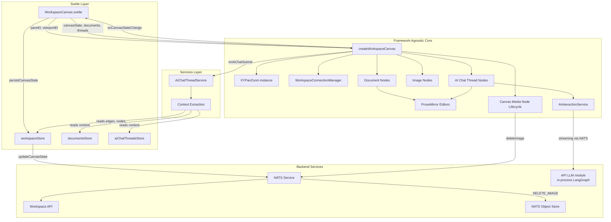
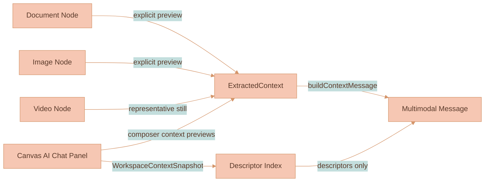
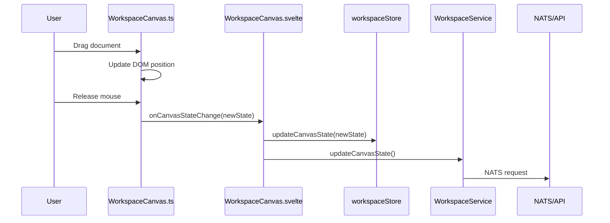

# Workspace Canvas

This module renders the main workspace view: a zoomable, pannable canvas where documents, images, videos, and branch lineage markers appear as draggable, resizable canvas nodes. The only AI prompt input is the screen-fixed composer at the bottom-center of the canvas; the right-side panel is a view-only surface for browsing and reopening past sessions (chat transcripts and feature-extraction runs). Persisted `aiChatThread` canvas records are accepted for compatibility, but normal chat sessions live in the right-side panel.

> **Where to look first.**
>
> - For the rendering architecture (DOM interaction layer + PIXI v8 media/edge layers), the LoD-tier loader, texture cache, decode pool, and remaining performance work, read [`documentation/canvas/RENDERING-ENGINE.md`](../../../../../documentation/canvas/RENDERING-ENGINE.md).
> - For collision resolution, viewport-centered insertion cleanup, and drag-release collision rules, read [`documentation/canvas/COLLISION-RESOLUTION.md`](../../../../../documentation/canvas/COLLISION-RESOLUTION.md).
> - For workspace data flow, persisted canvas shape, and workspace subjects, read [`documentation/canvas/WORKSPACE-MODEL.md`](../../../../../documentation/canvas/WORKSPACE-MODEL.md) and [`documentation/platform/SYSTEM-ARCHITECTURE.md`](../../../../../documentation/platform/SYSTEM-ARCHITECTURE.md).
> - For the shared canvas and in-chat video control bar, read [`documentation/media-generation/VIDEO-PLAYER-CONTROLS.md`](../../../../../documentation/media-generation/VIDEO-PLAYER-CONTROLS.md).
> - For context chips, automatic workspace relevance, reference-vs-lineage rules, generated-media provenance, and the balanced branch-tree layout, read [`documentation/ai-chat/CONTEXT-RELEVANCE.md`](../../../../../documentation/ai-chat/CONTEXT-RELEVANCE.md) and [`documentation/media-generation/BRANCH-LINEAGE.md`](../../../../../documentation/media-generation/BRANCH-LINEAGE.md).
> - This README documents the local code shape — file roles, DOM structure, click and selection rules, AI chat thread layout, edge connection UX.

> **Configuration rule.** Workspace-canvas values belong in [`settings.ts`](../../settings.ts) only when they are supported product configuration or theme tokens. Keep behavior flags, interaction thresholds, semantic sizing knobs, generated-media placement spacing, colors, shadows, borders, border radii, line styles, and line thicknesses there. Put theme-only values under the nearest `styles` key, and keep non-style configuration at that group root. Do not add CSS mechanics to settings: `display`, `position`, offsets, z-index, grid templates, background repeat/size, component-internal padding/gaps, and typography metrics that exist only to make the layout fit stay in SCSS or local component code.

## What It Does

When you open a workspace, you see a canvas. On that canvas are nodes (documents, images, or videos). You can:

- **Pan** the canvas by clicking and dragging empty space (or two-finger scroll on trackpad)
- **Zoom** with pinch gestures or Ctrl+scroll
- **Multi-select nodes** by dragging a marquee rectangle from empty canvas space
- **Toggle selection membership** with Mod-click (`Cmd` on macOS, `Ctrl` on other platforms)
- **Drag** nodes by grabbing the overlay (top bar for documents, anywhere for images/videos)
- **Drag selected groups** as a rigid set while preserving relative spacing
- **Resize** nodes from any corner by hovering that corner handle (images preserve aspect ratio)
- **Edit** document content directly—ProseMirror editors are embedded in document cards
- **Chat with AI** from the bottom-center composer; each submit creates a standalone session. The right-side panel opens as a view-only transcript of past sessions
- **Add images** via the toolbar button which opens an upload modal
- **Open the Media Library** from the independent bottom-right icon above the original zoom badge to browse Features, explicitly saved Images, or explicitly saved Videos; the canvas-owned full-height drawer shifts left when AI chat is open and covers its launcher while open
- **Save media for reuse** from an image or video bubble menu; saved Media Library items are independent Object Store copies that survive removal of the source canvas node. Saving confirms in place (no panel switch) and re-saving the same source media reuses the existing item instead of duplicating it
- **Connect nodes** by dragging from a handle, then use AI Chat composer context previews and workspace relevance to decide what the next prompt sees
- **Provide AI context** from explicit composer previews while also sending a compact workspace descriptor snapshot with each chat turn
- **Use the bottom-center canvas composer** to send prompts with context previews and workspace relevance
- **Extract a feature** from an image via the "Ask AI" bubble action: it opens the right-side panel on the Features surface, creates a local pending extracted-feature row, and shows a confirmation section with dedicated Reasoning model and Image model selectors. Confirming starts the extraction pipeline, writes the durable API-owned extraction run with that model config, and streams progress inside that feature placeholder until the saved Feature appears in the library.
- **Select edges** by clicking the connector line
- **Delete edges** using Delete/Backspace (when an edge is selected), or by dragging an endpoint to empty space

All of this happens without the Svelte component knowing the details. It just passes DOM refs, performs app/service integration, and gets callbacks when things change. Canvas behavior such as placement, collision resolution, drag/resize planning, and viewport-coordinate math belongs in this `infographics/workspace` module or its utilities, not in `services/web-ui/src/components/WorkspaceCanvas.svelte`.

## Node Types

### Document Nodes
- Contain embedded ProseMirror editors with `documentType: 'document'`
- Have a drag overlay at the top (20px)
- Free resize (no aspect ratio constraint)
- Support block-level content (paragraphs, headings, lists, etc.)

### Image Nodes
- Display uploaded images from workspace storage
- Have a full-area drag overlay
- Resize preserves aspect ratio (stored when image is uploaded)
- Request workspace-object cleanup when removed from canvas; the API deletes bytes only after canonical canvas state no longer references the file, and explicitly saved Media Library copies are separate objects and remain available
- Expose `Add to Media Library` in the bubble menu once their stored object is available; streaming generated-image placeholders hide the action until completion

### Video Nodes
- Display generated or media-library videos with a PIXI poster/placeholder behind a visible DOM `<video>` surface that is moved into the transformed chrome layer once the video handler creates the attached element
- Keep the node shell as interaction chrome only; completed playback, seeking, and fullscreen are driven by the browser-composited `<video>` element so connector edges are not tied to a PIXI video frame loop
- Use the shared SVG `components/videoControls` bar in the transformed media-chrome overlay, bound to that same attached `HTMLVideoElement`
- Render the control bar as an always-visible external row below the video surface, using the same bounded zoom-scaling pattern as other canvas chrome. The video surface mirrors node drag, click selection, and corner resize behavior; control hit areas stop their own pointer and click events so controls never trigger video-node drag, resize, selection, or playback toggles, while empty row space still allows canvas pan and zoom gestures
- Project generated-media provider/info chrome below the external control row for video nodes, so the model badge and info button stay below playback controls
- Scrubbing pauses at the pressed timestamp, moves the control position immediately, writes the first video seek immediately, then applies the latest drag target as soon as the active seek settles so paused video frames keep updating during drag; it resumes on release only when the video was already playing
- Support play/pause, seek, continuous speed, volume, and fullscreen without persisting playback state into `canvasState`
- Expose `Add to Media Library` once their stored MP4 is available; videos still polling through VEO hide the action until completion

### Branch Lineage Trees
- `WorkspaceCanvas.ts` is presentational for generated-media lineage. It applies live `IMAGE_BRANCH_RESOLVED` / `MEDIA_LINEAGE_PLANNED` events, reconciles API-persisted canvas projection, computes marker/media geometry, and re-tidies the visible tree. It may render transient preflight markers while the API is still resolving, but durable branch markers, final media nodes, generated lineage fields, and connector parentage are persisted by `services/api`. It must not decide branch IDs, branch-root creation, fork creation, lineage parentage, reasoning-model fanout, resolver outcomes, or marker provenance.
- Missing API lineage is a hard failure for generated-media topology. Do not add browser fallbacks, compatibility shims, edge-derived parents, existing-node recovery, model-count heuristics, or DOM-state recovery in `WorkspaceCanvas.ts`, `branchLineageState.ts`, `generatedMediaRebalancePipeline.ts`, `branchTreeLayout.ts`, marker renderers, or event handlers. Fix the API lineage plan, stream timing, or data migration instead.
- Generated images/videos that share a lineage form a **branch tree**; the first generated image/video is normally the branch root and carries the originating prompt + references in its own `generatedBy` metadata
- Branch origin, fork, and continuation markers render as labeled ovals with the marker action label, one-pixel grayscale fading dividers, and read-only text projected from the stored AI chat ProseMirror message. Once generated media descendants exist, the marker renders a separate right-side stack of brand-tinted shallow glass media-model circles whose DOM icons stay above the shared baked glass material, with a subtle SVG texture layer behind the glass. Circle size, icon color, stack gap, gap from the marker body, shadows, glass material, brand-color mixing, texture opacity, and the clipped texture inset are configured under `settings.mediaBranchLineage.mediaModelCircle`. Generated-media connectors keep the API-owned marker edge in state but render from the circle whose model matches the target media node's `generatedBy.mediaModelId`; the circle stack follows the current top-to-bottom generated-media row order, with variant and creation order as ties, so marker-source ports and target rows stay aligned. Clicking a marker opens the lineage provenance panel for explicitly provided references and branch-fork decision metadata. The panel anchors below the marker's live rendered bounds, uses the exact generated-media projection when it can, and falls back to the marker-scoped stored chat turn so the panel never collapses only because a generated-media locator is absent. Read-only chat projections remove composer-reserved bottom space.
- Reasoning-fanout media requests render one API-declared temporary `branchFork` marker per reasoning run. Generated media from that reasoning run persist API-assigned `generatedBy.branchForkNodeId` and edge from that fork, so one selected reasoning model produces one branch lineage node even when several image/video models are selected. The fork's media-model circles stack vertically and each generated-media edge visually starts from the matching circle. If there is an existing lineage source, the fork sits under that source; otherwise the fork itself is the visible root marker. Clicking a `branchFork` opens the generated branch provenance panel scoped to media under that fork so the chat reconstruction uses only the relevant reasoning model response.
- On every generated-media add/remove, `generatedMediaRebalancePipeline.ts` runs the deterministic pipeline: proxy pending media to its visible pre-frame geometry, add planned-media proxies for not-yet-started sibling markers, call `rebalanceBranchTreesAndResolve` in `branchTreeLayout.ts`, restore persisted node geometry, and report branch markers that now own generated media so stale live projection overrides can be cleared
- Branch tree parentage is read from API-assigned generated-media fields in order: `parentMediaNodeId`, `branchOriginNodeId`, then `branchForkNodeId` / `branchLineNodeId` when an API marker is the only visible lineage parent. It is not inferred from selected models, connector edges, existing nodes, or schema aliases.
- Removing the last generated image/video that references a `branchOrigin` or `branchFork` also removes the temporary marker and any incident lineage edges, so lineage chrome cannot remain as unreachable canvas nodes
- Depth spacing uses `settings.mediaBranchLineage.mediaToMediaGap`, plus `branchFanoutExtraGap` for each extra generated media node when a lineage forks; the first segment from a parentless root branch marker uses `rootToFirstMediaGap`, and the first segment from a temporary `branchOrigin` marker uses `branchOriginToFirstMediaGap`. `settings.mediaBranchLineage.nodeGap` is the minimum empty space reserved around every `branchOrigin`, `branchFork`, and `branchLine` marker during reference-root placement, on-canvas marker stacking, drag-release cleanup, and branch-tree rigid separation. Sibling spacing uses `branchRowGap` for generated media rows, while screen-projected preflight markers above the composer use `pendingMarkerInputGap` as their compact marker-to-marker gap. Pending stack reflow preserves the current top-to-bottom marker order and only runs for pending markers that do not already own generated-media children; branch-marker preview refresh follows the same rule and drops stale projection overrides for started markers, so stale pending metadata cannot pull a visible media connector off its midpoint. Completed fork/line markers stay on the connector midpoint to their generated-media children; completed markers do not run a post-layout separation pass that can unbalance generated media rows. The root keeps its anchor, generated media fan out symmetrically around its vertical center, and linear chains stay collinear. Before the first generated frame exists, tree placement uses the configured pre-frame circle size from `settings.mediaNode.inProgressOutlineAnimation.preFrameCircleScale` instead of the hidden full media box, so the visible pending node never sits farther away than the full generated media node will after frame arrival. Collision cleanup iterations and overlap thresholds are configured per canvas node type in `settings.workspaceCollision`; branch lineage marker margins are normalized from `nodeGap` so the same clearance applies across insertion, drag release, and generated-media rebalance. Final image/video aspect-ratio updates preserve the node center, then re-tidy the tree so resolved media proportions cannot collapse a fork back onto the predecessor center line
- The whole tree is then rigid-separated from neighbors by the unchanged resolver (one bounding box per tree), so a tree moves as a block and never loses its internal balance — see [`documentation/canvas/COLLISION-RESOLUTION.md`](../../../../../documentation/canvas/COLLISION-RESOLUTION.md)
- Dragging a tree node runs settings-backed overlap cleanup and does not snap back; branch-marker connector geometry keeps the live release bounds through the commit so edges do not render against stale marker dimensions, and moved branch markers are locked as manually positioned so stream-driven stack reflow cannot put them back on top of each other. The next add/remove re-tidies deterministically

### Media Library Panel
- Implemented in `mediaLibraryPanel.ts` and `media-library-panel.scss` inside this canvas module; Svelte supplies the independent bottom-right launcher above the zoom badge, and both bottom controls align to the same right side panel gap as the panel toggle when the panel is open.
- The top-level `Features` / `Media` / `AI Threads` switch is the shared mode control for the right side panel; body swaps and Media Library loading happen immediately while the live SVG switch is preserved long enough for its independent slide transition to finish.
- Renders `Features` through the established Feature subjects; promoted Feature samples copy to durable storage before scope changes and promoted samples are migrated before origin-workspace deletion.
- Feature extraction runs render as placeholder rows in the Features surface. Unconfirmed rows are local UI state and are not persisted into `canvasState`; confirmed, running, failed, and completed runs are loaded from the API `ExtractionRun` records and reconnected to their NATS stream when possible. The web UI only renders that API-owned state.
- Feature rows and extraction-run rows render through the same Feature Library row shell, share the same borderless light-blue hover/selection skin, and use section-level gradient dividers between groups. Rows open the inspector on click and opt out of the side-panel swipe-drag handler so card taps remain local to the library; the Use action inserts the feature into the active prompt and opens the same inspector.
- Live extraction inspectors keep their streaming DOM mounted while feature-created events update the library list; terminal extraction state refreshes the panel from the persisted run.
- Renders `Images` and `Videos` through generic media-library records whose Object Store bytes are copied on save and copied again when inserted back onto the canvas.
- Supports `Workspace`, `Mine`, `Organization`, `Public`, and `All available` filtering in one compact scope selector; new media saves start in the current workspace scope.
- Uses `settings.mediaLibrary` for its two-thirds width, is flush to the canvas top and bottom, and occupies the space immediately to the left of visible AI chat.
- Uses concise Feature browse cards with large previews and two-line summary previews; selection opens a full-detail inspector, or a focused detail view with Back at narrow widths.

### AI Chat Panel And Sessions

The canvas owns a singleton right side panel that hosts the view-only AI Chat surface — it has no prompt input of its own; all prompting happens in the bottom-center canvas composer. Its `SidePanel` instance owns the outside top-right toggle, using the panel collapse icon in both states; the closed state rotates it 180 degrees, and the open state moves it with the panel. It opens the panel with zero tabs if needed, without creating an `AiChatThread`. Open/closed panel state, ordered tabs, active tab, width, and explicit context chips are stored in `canvasState.aiChatPanel`. Opening a thread mounts it as a tab; opening an extraction run selects its placeholder row on the top-level Features surface. When more than one chat tab is open, tabs render through the shared SVG `components/slidingTabsSwitch` primitive, with geometry and slide timing configured by `settings.aiChatThread.panelTabs` and active-tab theming under `settings.aiChatThread.panelTabs.styles`; a single open tab renders only a section divider at the tab strip's top edge. The opened thread keeps a live ProseMirror transcript mounted for `DOC_RESUME`, document-step subscription, and receiving-state projection. When the active generated-media thread is not receiving, the panel displays the same read-only generated-media projection used by branch lineage and media info panels; open branch provenance, selected generated media, and the latest generated output are the projection target priority. Sent user-message reference previews, branch-origin provided-reference previews, and generation-trace reference items use the shared `components/contextPreview` tile renderer and stylesheet. Context preview hover cards use the shared `components/helpTooltip` primitive so placement stays clamped to the visible viewport while image and video previews fill their media container with normal sizing; portrait media places text beside the preview, and taller cards scroll after their bounded natural height. Their color, radius, border, and shadow tokens live in `settings.aiChatThread.contextPreview.styles`; canvas-only chip controls stay in `workspace-canvas.scss`.

The Sessions surface includes standalone chats and feature-extraction sessions. It is collapsed by default and toggled from the history icon in the panel control row; when expanded it renders directly under that row and above the tab strip when multiple chat tabs are open. Closing the active chat tab selects the tab to its right, or the new rightmost tab when the closed tab was already rightmost. Closing the last open chat tab clears the active tab and leaves the panel on its empty "reopen a session" state. Each history row shows a title, absolute update date plus relative recency, and session metadata such as chat message count, status, extraction provider, or source count. Its expanded state is persisted in `canvasState.aiChatPanel`. Closing any tab leaves its session reopenable. Standalone chats and extraction sessions can be deleted explicitly; deleting an extraction session does not delete a separately saved Feature.

Session history colors, row hover gradient, and thread marker colors live under `settings.aiChatThread.sessionHistory.styles`; the shared panel divider border lives under `settings.aiChatThread.styles`. Fixed control sizing stays in `workspace-canvas.scss`.

### Persisted AI Chat Thread Canvas Nodes
This section documents canvas-thread nodes that can exist in persisted workspace state. The workspace renderer does not create new `aiChatThread` canvas nodes; active chat sessions live in the right side panel.

- Compatibility records can mount embedded ProseMirror editors with `documentType: 'aiChatThread'`.
- Legacy canvas records keep their drag overlay, free-resize behavior, and visual chrome when restored.
- Mounted threads use `AiInteractionService` for live pipeline side events and `ProseMirrorAuthorityService` for API-authored transcript steps.
- Content is persisted separately from documents in the AI-Chat-Threads table after the authoritative stream finalizes.
- Context comes from explicit chips, workspace relevance, and supported edge-connected nodes when sending messages.
- New AI chat sessions have no on-canvas node. A thread is a transcript hosted in the canvas-owned right side panel, and all prompting happens in the bottom-center canvas composer. The former on-canvas thread node and its vertical connection rail have been removed.

- **Connector auto-alignment** — a connector's left-side anchor slides along the target node's left edge to align with its source, clamped to a top/bottom margin (`settings.connector.autoAlign.edgeMargin`). When the target node is shorter than `settings.connector.autoAlign.minSlideHeight` (default 120px) the anchor snaps to the vertical center instead of sliding. This applies to every node type.
- **Menu-driven connect snap** — the image-node “Connect to node” action snaps against target node geometry and only commits the edge on mouse release so the snap preview is visible before creation. The snap distance is configurable via `settings.connector.menuConnectionSnapRadius`
- **Floating panel resize and overlay** — the canvas-owned right side panel uses its `SidePanel` resize handle on the left edge as the horizontal resize target. Dragging that handle changes `--workspace-right-side-panel-width`, keeping the panel right edge fixed and preserving the zoom indicator offset. The same `SidePanel` instance owns the optional full-canvas overlay behind the panel and the pointer/touch swipe-to-close gesture. Dimensions, resize-handle geometry, toggle geometry, overlay behavior, drag thresholds, and slide timing are configured via `settings.rightSidePanel`.
- **AI-generated media** appears as independent canvas nodes positioned to the right of the API-declared thread source, generated-media parent, or lineage marker, with generous canvas-space breathing room. New thread-rooted branch rows are placed below the previous root branch using `settings.mediaBranchLineage.branchRowGap`, while descendants in the same lineage continue horizontally using `mediaToMediaGap` and remain vertically center-aligned with their preceding media. When a generated-media node forks, `branchFanoutExtraGap` adds more horizontal space for every extra generated media node, so a large fan pushes the whole media column and its descendants farther right during the same tree rebalance. Fresh/reference-only branches use the combined reference-media bounds to place the API-planned root marker; the marker preserves the configured first-media slot when it fits, but clamps after the reference group by at least `settings.mediaBranchLineage.nodeGap` so long prompt labels cannot overlap source media. Pending media without a frame is laid out through a temporary pre-frame circle proxy using the same configured circle scale that PIXI renders; connector anchors still use the visible outline bounds, including the configured outline gap, stroke width, and zoom-scaling behavior. Intrinsic image/video proportion updates preserve the resolved node center and re-run branch-tree layout instead of re-centering every generated media node on the predecessor, so final frames keep forks balanced. Their insertion dimensions are fixed canvas units regardless of the current zoom, so generated outputs arrive at the same logical size as a 100% zoom insertion. Generated outputs are connected by an edge with `sourceMessageId` only when the API plan continues a real thread or generated-media lineage; uploaded/source/reference/style media never become parent connectors by themselves. On every add/remove the lineage re-tidies into a balanced tree and is rigid-separated from neighbors through `generatedMediaRebalancePipeline.ts` and `branchTreeLayout.ts` (see [Collision Resolution](../../../../../documentation/canvas/COLLISION-RESOLUTION.md)); the first generated media node is the branch root and carries the originating prompt + references in its own provenance.
- Progressive partial previews update the same PIXI-backed canvas image node in real-time during generation, including across changing provider preview indices, and the finalized response inserts the revised prompt plus a small `aiGeneratedImage` thumbnail that references the same stored image (`imageUrl`, `fileId`, and `workspaceId`) as the canvas node. Standalone right side panel generations use explicit context chips, selected media, workspace relevance, and the image-branch resolver to anchor that placeholder on the canvas and persist the same `generatedBy` provenance as thread-rooted generations. While the reasoning model is preparing the media prompt, the same PIXI traveling outline renderer frames selected/reference media using canvas-state node bounds; the image/video generation trace clears those reference outlines when the request hands off to media models, leaving only generated placeholders/outputs outlined until their media run completes.
- The bottom-center canvas AI input creates a standalone hidden AI chat ProseMirror thread for each media-enabled submit, then immediately renders pending branch markers as spatial projections of that stored message. The marker starts with the user-message row only; pending markers add the horizontal separator and response row only after the assistant stream is receiving response text. The response row shows the last 50 normalized characters while the response or generated-media run is active, then the first 50 normalized characters after receiving completes. The progress indicator stays on the user row until the response row exists, then moves to the response row while assistant or prompt-enhancement text is still receiving; it becomes the prompt icon when receiving completes. Multi-reasoning submits create one stacked pending marker per reasoning model, each later promoting independently to its API-declared fork/line marker. Marker display geometry is a local projection of the stored ProseMirror content and does not persist derived preview state into `canvasState`. While preflight is waiting on the API lineage plan, each marker renders in a screen-fixed overlay above the composer, so canvas pan/zoom does not scale or resize it before it promotes into the resolved canvas position. If the page reloads before any marker has been promoted into `canvasState`, the canvas reattaches recent standalone `canvas-*` threads that contain a submitted user turn but no assistant response, replays the pipeline log, recreates the missing preflight marker from `MEDIA_LINEAGE_PLANNED`, and then runs the same API-planned promotion path. Promotion reuses the existing marker DOM to preserve active editors, so the append path must sync marker geometry from the rebalanced state before rendering connector edges.
- Multi-model media requests keep one shared pending placement group per `generationRequestId`, then track each image/video media run by `mediaRunId`. Trace events register expected media runs before media placeholders arrive, so one completed variant does not delete the shared lineage/reference placement while siblings are still running. Every generated sibling receives the same branch resolution plus its own run metadata in `generatedBy`, and branch-tree sibling order uses `variantIndex` before `createdAt` for deterministic fanout layout.
- Generated media model chrome renders in a screen-space chrome layer above the viewport DOM but below the PIXI media layer, so active generation outlines can pass over provider badges and info buttons. Before the first generated frame arrives, pending media renders the same provider icon without the text label in a separate centered icon layer above PIXI; after the first frame, the below-node strip appears. The strip is projected from the media node bounds and contains only the provider badge plus info button. It uses `settings.mediaNode.generatedMediaChrome.zoomScaling` through the shared adaptive bounded canvas-chrome curve: at 100% and higher zoom the icon uses its configured screen-pixel size, below 100% it shrinks with the low-zoom curve, and below the lower breakpoint the world-size compensation freezes so overview zooms keep thinning the strip. Layout and collision reserve the strip's configured `topGap + iconSize` below generated images, and add the external video controls height for videos, so generated media rows do not overlap another node's model badge or info icon; branch-tree layout reserves that asymmetric chrome with a centered layout box so media-to-media continuations still align to the visual media center. The strip matches the media node's projected width, shows the provider icon plus the pretty model title from the model catalog on the left, keeps the media info button aligned to the right edge of the media node, and uses `settings.mediaNode.generatedMediaChrome.topGap` for the top gap. Video nodes add the external playback-control row height before this projection so the strip sits below the controls. The info button remains clickable because the PIXI media layer ignores pointer events, and it opens a separate, fully decoupled info panel in `.workspace-generated-media-info-panel-layer`: the panel is anchored from the same media node bounds and uses the normal viewport transform, so it matches the configured `settings.mediaNode.generatedMediaInfoPanel` width proportion and zooms naturally with the canvas, but it is not nested in or transformed by the icon strip. That settings block controls the panel surface styling, radius, overflow, layer z-index, horizontal offset, media top offset, branch-marker top offset, and min/max width. The full provenance panel mounts a scoped read-only AI chat ProseMirror projection only from the producing stored thread turn, including the real chat message, reasoning, selected generated-media node, and generation-details NodeViews. Branch-fork provenance intentionally keeps sibling generated outputs visible. The compact Description section is separate descriptor chrome and only renders `source: analysis` summaries produced by the API VLM media-descriptor step; prompts and revised prompts are never used as media descriptions. Persisted media descriptors that load with `status: 'analyzing'` are reset to `failed` during canvas state normalization so a canceled or incomplete caption request cannot keep the info button pulsing across refreshes. The canvas provenance block expands to its full content height; it does not crop long prompts or reference metadata.
- Drag membership is planned by `workspaceDragPlan.ts`, so AI chat thread drags move only the thread node and real `parentId` descendants. Generated outputs remain independent branch nodes.
- Render-state reconciliation is planned by `workspaceRenderStatePlan.ts`. When the active right side panel emits a stale metadata render while a local canvas commit is still waiting for store acknowledgement, the canvas preserves the locally committed visual node/edge state until the store catches up. This includes generated-media connector edges whose target node may appear in metadata before the edge does.

## Architecture



## How It Works

### Initialization

1. Svelte mounts and binds `paneEl` and `viewportEl` refs
2. `createWorkspaceCanvas()` is called with these refs plus initial data
3. XYPanZoom attaches to the pane for viewport control
4. Document nodes are created as DOM elements and appended to viewport

### Viewport Transform

The viewport element uses CSS transforms for pan/zoom:

```
transform: translate(${x}px, ${y}px) scale(${zoom})
```

XYPanZoom fires `onTransformChange` on every pan/zoom. We update the CSS and notify Svelte via `onViewportChange`. The Svelte layer debounces and persists to backend.

During interaction, the live viewport inside `WorkspaceCanvas.ts` is the rendering source of truth. `onTransformChange` updates `currentCanvasState.viewport` immediately, and Svelte persistence is treated as an acknowledgement. If a later store render changes only `viewport` and disagrees with the live transform already on screen, `workspaceViewportStatePlan.ts` preserves the live viewport so a stale debounced save cannot replay an older pan position and make nodes appear to jump.

### Document Nodes

Each canvas node becomes a `div.workspace-document-node` with:

```
┌─────────────────────────────────────────┐
│ .document-drag-overlay (20px, cursor:move)
├─────────────────────────────────────────┤
│                                         │
│  .document-node-editor                  │
│  (ProseMirror lives here)               │
│                                         │
└─────────────────────────────────────────┘
  ↖ resize     resize ↗
  handle       handle

  ↙ resize     resize ↘
  handle       handle
```

### Image Nodes

Image nodes have a simpler structure:

```
┌─────────────────────────────────────────┐
│  .image-drag-overlay                    │
│   (covers entire image for dragging)    │
└─────────────────────────────────────────┘
  ↖ resize     resize ↗
  handle       handle

  ↙ resize     resize ↘
  handle       handle
```

Generated media model labels and info buttons do not live inside the image node shell. They render in `.workspace-generated-media-chrome-layer`, above the viewport DOM but below the PIXI media layer, so active generation outlines stay visually on top of the strip. Expanded provenance panels render in `.workspace-generated-media-info-panel-layer`, a separate viewport-transformed layer above the media layer.

Image pixels are drawn by **PIXI** (see `pixiMediaLayer.ts` and [Rendering Engine](../../../../../documentation/canvas/RENDERING-ENGINE.md)). Canvas image nodes do not create a DOM `` proxy. Progressive AI image partials and final stored images both update canvas state and render through PIXI. Completed video playback is the exception: `videoNodeHandler.ts` still loads the poster into PIXI for stable canvas geometry, but `WorkspaceCanvas.ts` moves the attached `<video>` into `.workspace-video-chrome` for visible playback and controls. While generation is active, the shared `PixiTravelingOutlineRenderer` draws a continuous tapered colored-glass droplet progress snake in `generatingBorderLayer`, above the media sprite, using the configured generation-border palette. Media corner rounding is configured through `settings.mediaNode.styles.borderRadius` and applied through the PIXI sprite mask or chrome surface.

New PIXI image entries must initialize their sprite position, size, and placeholder rectangle during the same first `sync()` that inserts them into the spatial index. They should not need a later viewport change, click, or store render before their pixels line up with the DOM node.

PIXI renderers must not destroy or replace GPU-backed buffers during ordinary canvas sync, selection, edge, or outline animation work. Edge and foreground `Graphics` objects hide/reuse instead of being recreated, and dynamic mesh renderers use fixed-size buffers with in-place updates so Pixi does not recreate WebGPU buffers when outline or glass geometry changes. The media layer disables Pixi's automatic renderer resource GC and wraps native `GPUBuffer.destroy()` with a short rAF deferral because Pixi can resize or unload internal batch buffers during the same render turn that submits WebGPU commands. This keeps WebGPU command buffers from referencing resources that a newer canvas update has already destroyed.

### PIXI Media Debug Dump

`pixiMediaLayer.ts` always installs `window.__lixpiPixiMediaDebugDump()` in the browser. Use it before reloading when images disappear, placeholders stay blank, WebGPU reports `Buffer used in submit while destroyed`, culling looks wrong after pan/zoom, or a texture-cache issue needs a reproducible snapshot.

Copy a dump from DevTools:

```js
copy(JSON.stringify(window.__lixpiPixiMediaDebugDump?.(), null, 2))
```

The dump contains the workspace id, renderer health, viewport, pane dimensions, cache counters, one snapshot per PIXI image entry, recent compact media-layer events, and native `GPUBuffer.destroy()` stack traces. URLs are sanitized so object-store auth tokens are not pasted into bug reports.

For verbose event payloads and live console streaming while reproducing a flaky case:

```js
localStorage.setItem('lixpi.debug.pixiMedia', '1')
```

Turn it off after capture:

```js
localStorage.removeItem('lixpi.debug.pixiMedia')
```

Read the dump in this order: `gpuBufferDestroys` first for WebGPU lifetime problems, `entries` next for sprite/renderable/texture state, then `recent events` for the sync or visibility action that led into the failure. A visible image with `sprite.renderable: true`, no `textureKey`, and no `requestedTier` points at request scheduling or culling. A stack in `gpuBufferDestroys` that mentions Pixi `Buffer.unload`, `setDataWithSize`, `GraphicsContextSystem`, or `BatcherPipe` points at renderer resource lifetime, not image fetch/decode.

Toolbar image insertion uses `settings.mediaNode.image.defaultInsertionWidth` as the canvas-unit width for new image nodes. The inserted height is derived from the natural image aspect ratio; if the client cannot probe dimensions, the inserted node is a square using that same configured width.

Image resize always preserves aspect ratio using the `aspectRatio` value stored when the image was uploaded.

Connector edges that enter or leave image nodes always anchor to the vertical midpoint of the image side. Image endpoints do not slide, fan out, or follow message-level source alignment; non-image endpoints can still use those behaviors.

On image load the client verifies the image's natural aspect ratio and will auto-correct the node's dimensions if a mismatch is detected (this helps self-heal nodes created by older clients). When a correction is necessary the client persists the corrected `dimensions` and updated `aspectRatio` via the normal canvas state persistence flow (`onCanvasStateChange` / `commitCanvasState`).

Resizing uses a stable diagonal-based calculation to preserve aspect ratio smoothly during diagonal drags and avoid axis-switching jumps that can cause jitter during resize. Resize handles are dynamically sized and positioned (computed from the current viewport zoom) so they remain a uniform screen-pixel size and precisely aligned to node corners inside the configured zoom band. Below the configured lower zoom breakpoint, their world size freezes so overview zooms thin them consistently with connector chrome. The handles are invisible hitboxes until their own corner is hovered; selecting or hovering the body of a node does not reveal every handle. This zoom-compensated sizing is controlled by `settings.mediaNode.useZoomCompensatedResizeHandleScaling`, with size, offset, minimum size, and breakpoint under `settings.mediaNode.resizeHandle`.

Empty AI chat thread parent containers preserve their persisted dimensions. Parent auto-expansion may still grow a thread container to fit children moved with it, but it must not reset an empty thread back to the default `300x200` size after a commit. When a child image or document belongs to a larger existing thread container, the thread keeps its existing size unless the child bounds plus padding exceed it.

AI chat currently renders in the singleton canvas-owned right side panel. Opening the panel itself does not select a node or create a conversation record. The panel is right-flush and full-height within the workspace shell. A non-interactive decorative underlay extends left behind the resize handle and applies a masked glass blur so canvas imagery fades gradually beneath the panel instead of ending at a hard blur boundary. Reduced-transparency mode replaces that blur with a faded opaque surface. When it is open, the zoom indicator remains logically bottom-right but offsets left by the right side panel width, and the global user avatar moves to the panel's bottom-left corner.

### Image Generation Visual Feedback

When an AI-generated image is being created, the canvas provides visual feedback before and during generation:

1. **Candidate snapshot** - On submit with an image model selected, the browser builds an `ImageBranchCandidateSnapshot` from selected workspace media, generated image nodes, lineage metadata, and thread transcript labels. Standalone panel submits include generated media from the active chat thread plus explicit panel references so deictic follow-ups stay scoped to that chat before workspace-wide relevance runs. If exactly one image node in the active thread context is selected, the snapshot marks it as `active-target` and records `activeTargetNodeId` so purely deictic prompts can continue the selected lineage. The selected image is not sorted ahead of other candidates; the API VLM must still inspect all candidate pixels and let explicit subject text override a conflicting selection. This snapshot is non-authoritative; it only gives the API VLM candidates to inspect.
2. **VLM branch resolution and lineage planning** — The API emits `IMAGE_BRANCH_RESOLVED` before image partials, then `MEDIA_LINEAGE_PLANNED` for media-enabled requests. `WorkspaceCanvas.ts` stores the resolution and applies the API lineage plan for marker IDs, lineage parent edge selection, and `generatedBy` lineage metadata. Preflight branch markers stay transient until the API plan arrives; once a marker is promoted to its API-planned identity and canvas position, that marker is persisted immediately so refreshes during the following LLM response can reload it. On reload, persisted pending markers are re-associated with their run from lineage node IDs, `reasoningRunId`, `mediaRunId`, or `generationRequestId`, because the in-memory pending marker map is empty after a page refresh. If reload happens before any pending marker was persisted, recent standalone `canvas-*` threads with a submitted user turn are reattached so `CHAT_PIPELINE_RESUME` can replay `MEDIA_LINEAGE_PLANNED`; the canvas recreates a transient marker from the API plan and immediately promotes it through the normal persisted lineage path. The later transition from pending marker to committed branch marker is also persisted when generated output starts or completes, so reloads cannot revive a completed spinner. Reference, style, and source-context media can anchor placement and receive temporary progress outlines, but only API-assigned generated branch targets/parents or planned lineage markers become generated-output connectors. Fresh/reference-only branches place their planned root marker from the full reference group bounds and clamp it to the right of that group before generated outputs chain from the marker. When the API identifies an existing generated candidate as the target/identity reference, placement follows that generated node and preserves its branch id even if the requested color palette or medium changes. `IMAGE_BRANCH_RESOLUTION_ERROR` clears pending placement and stops the generation path visibly.
3. **Early placeholder** — The backend emits an `IMAGE_PARTIAL` with an empty `imageUrl` as soon as OpenAI's `response.output_item.added` event fires (before any pixel data arrives). `buildImageSrc` converts the empty URL to a transparent 1×1 PNG data URI for the generated canvas node.
4. **Animated progress border** — `pixiMediaLayer.ts` feeds active generated-media and temporary reference-media bounds to the shared `PixiTravelingOutlineRenderer`, which draws a single-mesh continuous tapered colored-glass droplet snake traveling around the rounded media perimeter while the reasoning model is still preparing the media prompt. Generated-media placeholders render as a centered circular outline at `settings.mediaNode.inProgressOutlineAnimation.preFrameCircleScale` with the generated-media provider icon centered in the circle until the first non-empty frame URL arrives; after that the outline expands back to the media node perimeter for the rest of the run. The connection manager uses the visible pre-frame outline bounds for connector anchors, so edges meet the placeholder rather than the hidden full-size media box. The pre-frame circle scales its lap duration to the smaller perimeter so it keeps the same path speed as the full media-node outline. Motion follows the loop-safe `Easing.travelingOutlineTransition()` curve; snake palette, glass material, length, width, head rounding, tail taper, node gap, lap duration, adaptive bounded stroke scaling, and development flags are configured through `settings.mediaNode.inProgressOutlineAnimation`.
5. **Prompt handoff** — `IMAGE_GENERATION_TRACE` / `VIDEO_GENERATION_TRACE` marks the handoff from reasoning model to media model and clears the reference outlines. Later image partials replace only the generated node.
6. **Completion** — `onImageCompleteToCanvas` clears the tracker only after the final image arrives, which removes the generated-node PIXI progress outline. Media completion does not tear down the hidden ProseMirror-backed thread editor; teardown waits for the AI thread receive state to end so final LLM text can still resume into the branch marker after a refresh. Because the backend may persist the final AI-thread document after the media completion event, completion also schedules a short bounded refresh of the persisted AI thread before re-rendering branch marker previews. `IMAGE_ERROR` removes the matching partial node immediately, keyed by `mediaRunId` when present.

### Media Node Lifecycle

When a tracked media node is removed from the canvas, the `canvasMediaNodeLifecycle` tracker detects the change and triggers the configured deletion path. Image nodes route through `WORKSPACE_SUBJECTS.IMAGE_SUBJECTS.DELETE_IMAGE`; video nodes route through `WORKSPACE_SUBJECTS.VIDEO_SUBJECTS.DELETE_VIDEO` and best-effort poster cleanup. The API re-reads canonical canvas state and refuses storage deletion while any current node still references the file.

Workspace navigation and first non-empty workspace load reinitialize the media lifecycle tracker from the opened workspace's canvas state before local commits can run. The tracker must never compare media from one workspace against another workspace's node set, because a cross-workspace diff would turn a navigation render into destructive storage deletion.

Generated media stream callbacks also verify that the event's thread still belongs to the currently rendered workspace before they mutate canvas state. Late image/video events from a previously opened workspace must be ignored instead of inserted into the new workspace.

### Drag and Resize

Both drag and resize temporarily disable XYPanZoom's panning to prevent conflicts:

```typescript
panZoom.update({
    ...panZoomConfig,
    panOnDrag: false,
    userSelectionActive: true,
    connectionInProgress: true
})
```

After mouse-up, we re-enable panning and commit the new position/dimensions via `onCanvasStateChange`.

### Multi-Selection

Node selection is runtime-only UI state and is not persisted into `canvasState`.

#### Click Interactions

| Action | Result |
|---|---|
| Plain click on node (non-editor area) | Selects that node; no overlay appears |
| Plain click on empty space | Clears the selection |
| Mod-click on node | Toggles that node in/out of the selection |
| Click on ProseMirror editor content | Passes through to the editor — no selection change, no resize handles |
| Hover a node corner | Shows only that corner's resize handle |

**Editor content bypass:** The `nodeEl` click handler checks `isContentEditable`, `.ProseMirror`, and `.ai-chat-thread-wrapper` and bails out before reaching `selectNode`. This prevents clicks inside AI chat thread content from triggering node selection UI (resize handles, outline), which would block text editing. Mod-click still fires through the bypass to allow toggling selection.

**Media node shadows:** Image and video nodes use `settings.mediaNode.styles.defaultBoxShadow` in their default state and `settings.mediaNode.styles.selectedBoxShadow` when selected. The default shadow should stay subtler than the selected shadow so selection remains legible.

#### Marquee Selection

Empty-space drag draws a marquee rectangle and selects all overlapping nodes.

Persisted empty AI chat thread canvas nodes use special marquee-selection bounds so hidden thread shells do not create phantom selection areas. Visible workspace nodes use their own DOM bounds directly.

#### Selection Overlay Rules

The selection group overlay (z-index 10000) appears based on two conditions:

| Condition | Overlay visible? |
|---|---|
| 2+ nodes selected (any source) | Yes |
| 1 node selected via marquee | Yes |
| 1 node selected via plain click | **No** |
| 0 nodes selected | No |

This is controlled by the `selectionIsFromMarquee` flag. `setSelectedNodes(ids, fromMarquee)` stores the flag after filtering out non-selectable lineage chrome; `shouldShowSelectionGroupOverlay()` checks `size > 1 || selectionIsFromMarquee`. `branchOrigin` and `branchFork` markers are not selectable nodes and cannot become AI chat context chips.

#### Deferred Selection in Drag

`handleDragStart` does **not** select nodes immediately on mousedown. Instead it records `wasAlreadySelected` and defers selection:

- **On drag movement** — selects `resolvedNodeId` for group drag.
- **On mouseup without movement (click)** — selects the original `nodeId` (the image itself).

This prevents the selection overlay from appearing between mousedown and mouseup, which would intercept the mouseup event and break the image click flow.

The drag overlay passes `node.nodeId` (not pre-resolved) to `handleDragStart` so both code paths have access to the original ID.

#### Group Drag

Dragging any selected draggable node moves the entire selection together. During group drag:

- Persisted AI chat thread companion UI (vertical rail and floating input) stays attached to its thread when those nodes are present
- Collision resolution is skipped for multi-node moves to preserve rigid spacing
- The follow-up click event is suppressed so multi-selection is not collapsed to a single node after drag

#### Single-Target UI

Single-target canvas UI stays single-target:

- The image bubble menu appears only when exactly one image node is selected
- The only interactive composer is the screen-fixed bottom-center canvas composer; the right side panel is view-only
- Per-thread floating inputs remain attached only to persisted AI chat thread canvas nodes if those nodes are rendered

Selection colors (marquee border/background, overlay border/background, thread-input outline) are configurable via `settings.selection.styles` and applied as CSS custom properties on the pane element. Clicking outside the selected range clears the selection.

Note: viewport transforms are only re-applied when the saved viewport actually changes. This prevents temporary zoom/pan flashes when unrelated canvas updates (for example, image onload corrections) occur.

Rendering note: full re-renders are triggered when node structure or document load state changes; position/dimension updates are handled directly in the DOM during drag/resize to avoid unnecessary work.

### Workspace Edges

Edges are stored in `canvasState.edges` and rendered by the PIXI edge renderer. Connection interactions are handled by `WorkspaceConnectionManager.ts` using `@xyflow/system`'s `XYHandle`.

- Node DOM elements get left/right connection handles (target/source)
- Edge direction follows the drag direction (arrow points toward the node you dragged TO)
- **Proximity Connect**: Dragging a node near a connectable graph node shows a dashed ghost line; dropping creates the connection automatically (threshold configured via `settings.connector.proximityConnectThreshold`).
- **Zoom-compensated scaling**: Connector marker offsets and invisible hit areas use adaptive bounded inverse zoom in world units. PIXI connector stroke width and arrowhead size travel through render data as explicit screen-space base sizes, then the PIXI renderer applies the same adaptive bounded screen-size curve once. Pre-frame placeholder endpoints use the visible circle outline bounds but keep the same marker-offset math as regular nodes. Connector chrome is constant at 100% and above, shrinks with the shared low-zoom curve below 100%, and keeps thinning below the configured lower breakpoint. Connector scaling is controlled by `settings.connector.useZoomCompensatedScaling`; stroke width, marker size, marker offsets, hit-area width, and breakpoint live under `settings.connector.scaling`. Workspace connector pixels, hit testing, and edge bubble menu anchoring all use cached PIXI path data.
- **Pan-optimized rendering**: During pure panning (no drag, zoom, or edge changes), edge re-rendering is skipped because the PIXI edge layer can redraw from the current viewport transform. During zoom, `WorkspaceConnectionManager.ts` recomputes only the PIXI edge datum affected by zoom-compensated marker offsets, then the PIXI layer flushes immediately. Explicit data mutations (node drag, resize, edge add/remove) still trigger a full edge datum render. Resize handle updates remain zoom-gated.
- Clicking an edge selects it and shows a bubble menu below it with a Delete action
- Deleting an edge updates `canvasState.edges` via the normal persistence flow

### AI Chat Context Extraction

Standalone chat tabs and the screen-fixed canvas composer use composer context previews as explicit forced context for the next submitted message. The panel renders those previews inside its composer; the screen-fixed canvas composer renders them in a separate tray above the input pill. Preview node ids are resolved through the existing extraction service, each submit snapshots then clears the explicit set, and each submit also sends a `WorkspaceContextSnapshot`: a descriptors-only index of context-bearing workspace nodes with chip and edge-forced flags plus generated-media thread ownership for the API relevance stage. Media-generation submits also send the relevant branch candidate snapshot, even when the candidate list is empty, so workspace-wide auto relevance cannot pull an unrelated branch into the image-branch VLM. When the API streams `CONTEXT_RELEVANCE_RESOLVED`, the canvas uses those submitted-turn selections for generation placement/reference bookkeeping and commits any `improvedDescriptors` through the canvas metadata persistence path so descriptor chrome updates without a reload and survives refresh. Resolver-selected context never writes back into the draft composer.



The extraction flow:

1. **Context source** - Standalone tabs call `extractSelectedContext({ nodeIds })` for the explicit composer previews snapshotted on submit
2. **Content extraction** - Documents and AI threads have their ProseMirror content parsed; embedded images are collected. Image nodes are fetched and converted to base64; video nodes contribute their representative still (`frameFileId`, falling back to poster) for normal model context
3. **Workspace snapshot** - `buildWorkspaceContextSnapshot()` indexes all context-bearing nodes by descriptor summary/tags plus media object references, generated-media thread ownership, and force-include flags; it never embeds pixel data
4. **Resolution feedback** - `CONTEXT_RELEVANCE_RESOLVED` bypasses markdown parsing, keeps engine selections scoped to the submitted turn, and applies improved descriptors to the live canvas
5. **Message building** - `buildContextMessage()` formats explicit context as multimodal content blocks (`input_text` for text, `input_image` for images and video stills)
6. **Submission** - The context message is prepended to the user's messages, and the workspace snapshot is sent alongside the chat request

The context extraction logic lives in `AiChatThreadService`, not in the canvas module, since it's business logic rather than rendering.

### ProseMirror Integration

Each document node instantiates a `ProseMirrorEditor`. The editor container has `.nopan` so clicking inside doesn't pan the canvas. Canvas document editors use the ProseMirror authority transport for local edits; the API persists settled snapshots after the document-step debounce. The `onDocumentContentChange` fallback is debounced in the Svelte host before calling `DocumentService`. Plain document typing does not request text descriptors or VLM analysis; descriptor repair happens during API context self-heal when an AI turn needs a better descriptor.

## State Flow



## Canvas Bubble Menu

When an image node, video node, or edge is selected on the canvas, a bubble menu appears below it — the same shared `BubbleMenu` component used in ProseMirror editors. The menu provides context-specific actions for canvas elements.

### Image Node Actions
- **Create Variant** — dispatches a `canvas-create-image-variant` custom event on the viewport element
- **Download** — fetches the image as a blob and triggers a browser download via `downloadImage()` utility
- **Add to Media Library** — saves a completed stored image as an independent library copy
- **Delete** — removes the node and its associated edges from canvas state

### Video Node Actions
- **Replace** — uploads a new video through `/api/videos/:workspaceId`, swaps the MP4/poster IDs on the existing node, and keeps the node in place
- **Download** — downloads the stored MP4 through the Range-capable video route with `download=true`
- **Add to Media Library** — saves a completed stored video and poster as independent library copies
- **Connect to node** — starts the same menu-driven graph connection flow as images
- **Delete** — removes the node and its associated edges from canvas state

The bubble menu automatically hides during drag and resize operations, and repositions itself when the selected image or video moves. Media menus anchor to the canvas node box, not the inner pixel or video element, so the toolbar remains below the node while dragging or resizing.

The shared bubble menu measures layout size separately from visual scale when positioning. Its canvas visual scale uses the same adaptive bounded zoom curve as connector chrome, with the breakpoint configured at `settings.canvasBubbleMenu.zoomScaling` and the low-zoom curve supplied by the runtime adapter. This keeps media menus horizontally centered on first show, during movement, and throughout resize without making the toolbar visually grow while the canvas zooms out. Canvas media menus also opt out of parent-bound clamping and entrance motion, so the toolbar stays attached to the node when it moves past the visible canvas edge and does not drift during first-load display.

Menu items are defined in `canvasBubbleMenuItems.ts`. The core `BubbleMenu` class is from `$src/components/bubbleMenu/`.

## Files

| File | Purpose |
|------|---------|
| `WorkspaceCanvas.ts` | Canvas rendering and interaction mechanics: pan/zoom setup, node DOM/PIXI wiring, drag/resize handlers, bubble menu integration, and application of API-owned generation state |
| `WorkspaceConnectionManager.ts` | Edge connection logic: XYHandle integration, PIXI edge data feed, cached path hit-testing, bubble-menu anchoring, selection/deletion |
| `pixiMediaLayer.ts` | PIXI v8 media layer for image pixels, video posters/placeholders, and generated-image progress-outline synchronization: sprite registry, texture cache, LoD-tier loader, RBush-based visibility scanner, idle prefetch scheduler, mipmap config |
| `pixiMediaLayerLogic.ts` | Pure helpers used by the PIXI layer: tier ranking (`tierRank`), world-position math, source URL building, LoD `?size=` injection, world-rect computation |
| `../../utils/animations/gradients/pixiTravelingOutlineRenderer.ts` | Reusable PIXI traveling outline renderer: rounded-perimeter sampling, tapered snake paint, easing, active-only rAF lifecycle |
| `pixiImageDecoder.ts` | Six-worker decode pool. Round-robin dispatch with per-worker request tracking so a single worker crash does not nuke all in-flight requests |
| `pixiImageDecodeWorker.ts` | Web Worker body: `fetch` → `createImageBitmap` → transfer the bitmap back to the main thread |
| `rendering/pixiEdgeRenderer.ts` | Diffed PIXI edge renderer: reuses `Graphics` objects across renders; only repaints when an edge's path/colour/arrow fingerprint changes |
| `rendering/viewportBridge.ts` | Single call site that applies a viewport change to the DOM CSS transform and all viewport-aware PIXI worlds |
| `branchLineageState.ts` | Shared branch-lineage type guards and generated-media marker-state derivation used by drag, connector anchoring, tree layout, and generated-media rebalancing |
| `generatedMediaRebalancePipeline.ts` | Deterministic generated-media rebalance pipeline: pending-media proxying, planned sibling proxying, branch-tree layout invocation, persisted-geometry restoration, and started-marker reporting |
| `branchTreeLayout.ts` | Builds the generated-media branch forest, lays each lineage out as a balanced tidy tree (via pure `utils/layoutTree.ts`), and rigid-separates trees + loose nodes through the shared resolver |
| `rendering/mediaNodeRegistry.ts` | Dispatches non-image media nodes to specialized handlers. Image nodes are handled directly by `pixiMediaLayer`; video nodes route to `videoNodeHandler.ts` |
| `rendering/videoNodeHandler.ts` | Video renderer that owns PIXI poster/placeholder sprites and the authenticated `HTMLVideoElement` moved into DOM video chrome |
| `workspace-canvas.scss` | All styles for canvas, DOM interaction nodes, handles, edges, editors, and media chrome |
| `canvasMediaNodeLifecycle.ts` | Tracks configured media-node types and deletes orphaned workspace media from storage |
| `canvasBubbleMenuItems.ts` | Bubble menu item definitions for canvas elements (image and edge actions) |
| `imagePositioning.ts` | Computes viewport-normalized insertion dimensions and generated image placement positions next to source threads |
| `nodeLayering.ts` | Z-index management for bringing nodes to front |

## CSS Classes

| Class | Purpose |
|-------|---------|
| `.workspace-canvas` | Root container |
| `.workspace-pane` | Pan/zoom target |
| `.workspace-viewport` | Transformed container for nodes |
| `.workspace-media-chrome-viewport` | Transformed overlay layer for video surfaces, video controls, and branch provenance info above PIXI media sprites |
| `.workspace-generated-media-chrome-layer` | Screen-space layer for the generated-media icon strip; each strip is projected from media node bounds and uses bounded zoom compensation from `settings.mediaNode.generatedMediaChrome` |
| `.workspace-generated-media-pending-icon-layer` | Screen-space layer for the centered icon shown inside the pre-first-frame generated-media circle |
| `.workspace-generated-media-info-panel-layer` | Viewport-transformed layer for expanded media info panels; decoupled from the strip so bounded icon zoom scaling never applies to panel content |
| `.workspace-video-chrome` | Transformed video chrome that contains the node-sized visible video surface plus the external controls row |
| `.workspace-video-surface` | Node-sized DOM mount for the visible browser-composited `<video>` above the PIXI poster |
| `.workspace-video-controls-host` | External below-surface DOM mount point for `components/videoControls`; individual control hit areas stop pointer/click events while the host itself stays transparent to canvas gestures |
| `.workspace-document-node` | Individual document card |
| `.workspace-image-node` | Individual image card |
| `.workspace-branch-origin-node` | Labeled temporary fresh-branch origin marker for generated-media lineage |
| `.workspace-branch-fork-node` | Labeled temporary lineage split marker for generated-media branchFork groups |
| `.workspace-branch-line-node` | Labeled temporary continuation marker for plain generated-media branch lines |
| `.workspace-ai-chat-thread-node` | Canvas-owned floating AI chat panel styling |
| `.document-drag-overlay` | Top bar for dragging documents |
| `.ai-chat-thread-drag-overlay` | Top bar for dragging AI chat threads |
| `.image-drag-overlay` | Full-area overlay for dragging images |
| `.document-node-editor` | ProseMirror container for documents |
| `.ai-chat-thread-node-editor` | ProseMirror container for AI chat threads |
| `.workspace-generated-media-chrome` | Generated-media icon strip containing only provider badge + info button, positioned below the media node at its projected width and bounded by shared canvas-chrome zoom scaling |
| `.workspace-generated-media-pending-icon` | Centered icon-only provider badge used while a generated-media placeholder has not received its first frame |
| `.media-model-badge` | Generated-media provider icon and pretty model title label |
| `.media-info-button` | Right-aligned icon button that expands the generated-media metadata block without changing its icon color or outline when open |
| `.canvas-generated-media-reasoning-model` | Shared generated-media provenance header used by canvas info panels and the right-side AI Chat projection |
| `.canvas-generated-media-info-panel` | Opaque expanded generated-media metadata panel anchored beneath the chrome strip or branch-lineage marker and styled/sized by `settings.mediaNode.generatedMediaInfoPanel`; its content scales only through the normal canvas viewport transform, and it expands to its full content height without internal cropping |

| `.document-resize-handle` | Invisible corner hitbox that reveals only its own resize control on hover or active drag |
| `.nopan` | Prevents panning when interacting |
| `.is-dragging` / `.is-resizing` | State classes during interaction |

## AI Chat Thread Canvas Node Background

AI chat thread canvas nodes can display an animated shifting gradient background. The gradient is rendered to a small 60x80 pixel bitmap and scaled up with bilinear interpolation for smooth, low-cost rendering. The canvas element is injected as the first child of `.workspace-ai-chat-thread-node` with class `.shifting-gradient-canvas`.

The gradient uses 4 color points with inverse distance weighting and a subtle swirl distortion for an organic feel. When sending a message, the gradient animates to the next phase position.

During thread resizing, the gradient canvas keeps the existing bitmap visible while its CSS box changes. When the backing-store size really changes, the renderer redraws immediately; unchanged `ResizeObserver` callbacks are ignored so the canvas is not cleared unnecessarily.

The thread node gradient and the bottom-center composer gradient are controlled by feature flags in `settings.ts`:

- `settings.aiPromptInput.useShiftingGradientBackground` (default `true`) — gradient on AI prompt input surfaces, including the bottom-center canvas composer.
- `settings.canvasChrome.glassBorder` — 10px screen-space Pixi glass border for the bottom-center composer and adjacent action panels. `pixiMediaLayer` captures the Pixi stage into a render texture and refracts that capture through a per-target liquid normal-map border, so Pixi edges, media sprites, generation outlines, and foreground overlays distort under the ring while flat background remains visually quiet.

For the shared freeform/SVG gradient architecture, shifting-background technical details, color customization, and the color analysis tool, see [Visual Effects](../../../../../documentation/canvas/VISUAL-EFFECTS.md).
