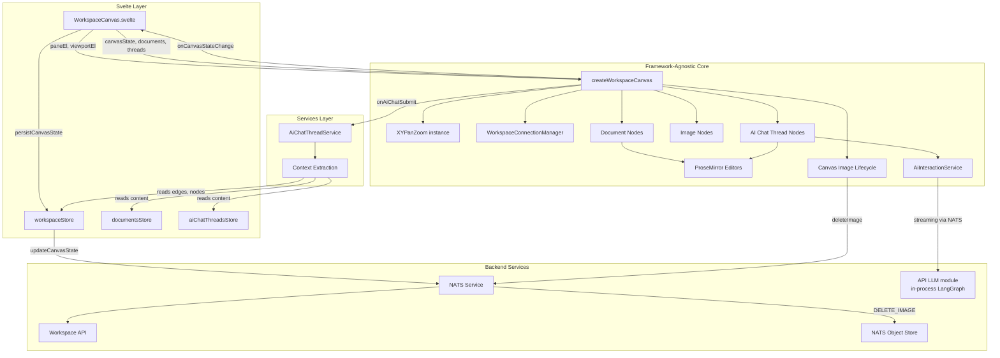
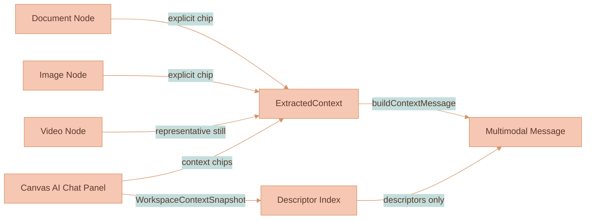
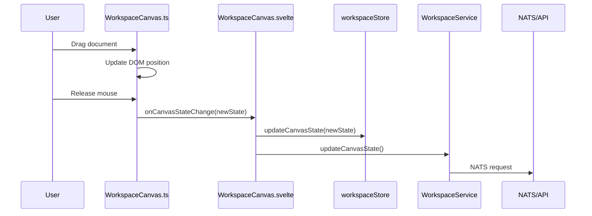

# Workspace Canvas

This module renders the main workspace view: a zoomable, pannable canvas where documents, images, and videos appear as draggable, resizable canvas nodes. AI chat sessions live in the right-side panel; older workspaces may still contain `aiChatThread` canvas data, but the current renderer does not draw those nodes.

> **Where to look first.**
>
> - For the rendering architecture (DOM interaction layer + PIXI v8 media/edge layers), the LoD-tier loader, texture cache, decode pool, and remaining performance work, read [`documentation/canvas/RENDERING-ENGINE.md`](../../../../../documentation/canvas/RENDERING-ENGINE.md).
> - For collision resolution, viewport-centered insertion cleanup, and drag-release collision rules, read [`documentation/canvas/COLLISION-RESOLUTION.md`](../../../../../documentation/canvas/COLLISION-RESOLUTION.md).
> - For workspace data flow, persisted canvas shape, and workspace subjects, read [`documentation/canvas/WORKSPACE-MODEL.md`](../../../../../documentation/canvas/WORKSPACE-MODEL.md) and [`documentation/platform/SYSTEM-ARCHITECTURE.md`](../../../../../documentation/platform/SYSTEM-ARCHITECTURE.md).
> - For the shared canvas and in-chat video control bar, read [`documentation/media-generation/VIDEO-PLAYER-CONTROLS.md`](../../../../../documentation/media-generation/VIDEO-PLAYER-CONTROLS.md).
> - For context chips, automatic workspace relevance, reference-vs-lineage rules, generated-media provenance, and the balanced branch-tree layout, read [`documentation/ai-chat/CONTEXT-RELEVANCE.md`](../../../../../documentation/ai-chat/CONTEXT-RELEVANCE.md) and [`documentation/media-generation/BRANCH-LINEAGE.md`](../../../../../documentation/media-generation/BRANCH-LINEAGE.md).
> - This README documents the local code shape — file roles, DOM structure, click and selection rules, AI chat thread layout, edge connection UX.

> **Configuration rule.** Workspace-canvas values that are meant to be tuned - colors, shadows, dimensions, gaps, hit radii, resize cursor activation areas, animation timing, behavior flags, and generated-image placement spacing - belong in [`settings.ts`](../../settings.ts). Keep them in logical top-level subsections such as `aiChatThread`, `connector`, `imageNode`, and `imageBranchLineage`; use nested subsections for child domains such as `aiChatThread.rail` and `aiChatThread.panelTabs`; separate every group with a blank line before and after; and document every key with what changing it does. Use getters only when a setting needs to self-reference sibling settings through `this`; keep ordinary static values as plain properties.

## What It Does

When you open a workspace, you see a canvas. On that canvas are nodes (documents, images, or videos). You can:

- **Pan** the canvas by clicking and dragging empty space (or two-finger scroll on trackpad)
- **Zoom** with pinch gestures or Ctrl+scroll
- **Multi-select nodes** by dragging a marquee rectangle from empty canvas space
- **Toggle selection membership** with Mod-click (`Cmd` on macOS, `Ctrl` on other platforms)
- **Drag** nodes by grabbing the overlay (top bar for documents, anywhere for images/videos)
- **Drag selected groups** as a rigid set while preserving relative spacing
- **Resize** nodes from any corner by hovering that corner handle (images preserve aspect ratio)
- **Edit** document content directly—ProseMirror editors are embedded in document cards
- **Chat with AI** in the right-side panel; it can open with no region and creates a standalone session only on first submit
- **Add images** via the toolbar button which opens an upload modal
- **Open the Media Library** from the independent bottom-right icon above the original zoom badge to browse Features, explicitly saved Images, or explicitly saved Videos; the canvas-owned full-height drawer shifts left when AI chat is open and covers its launcher while open
- **Save media for reuse** from an image or video bubble menu; saved Media Library items are independent Object Store copies that survive removal of the source canvas node. Saving confirms in place (no panel switch) and re-saving the same source media reuses the existing item instead of duplicating it
- **Connect nodes** by dragging from a handle, then use the AI Chat panel context tray and workspace relevance to decide what the next prompt sees
- **Provide AI context** from explicit context chips while also sending a compact workspace descriptor snapshot with each chat turn
- **Use the AI Chat panel composer** to send prompts with explicit context chips and workspace relevance
- **Select edges** by clicking the connector line
- **Delete edges** using Delete/Backspace (when an edge is selected), or by dragging an endpoint to empty space

All of this happens without the Svelte component knowing the details. It just passes DOM refs, performs app/service integration, and gets callbacks when things change. Canvas behavior such as placement, collision resolution, drag/resize planning, and viewport-coordinate math belongs in this `infographics/workspace` module or its utilities, not in `services/web-ui/src/components/WorkspaceCanvas.svelte`.

## Node Types

### Document Nodes
- Contain embedded ProseMirror editors with `documentType: 'document'`
- Have a drag overlay at the top (20px)
- Free resize (no aspect ratio constraint)
- Support block-level content (paragraphs, headings, lists, etc.)

### Image Nodes
- Display uploaded images from workspace storage
- Have a full-area drag overlay
- Resize preserves aspect ratio (stored when image is uploaded)
- Automatically delete their workspace object when removed from canvas; explicitly saved Media Library copies are separate objects and remain available
- Expose `Add to Media Library` in the bubble menu once their stored object is available; streaming generated-image placeholders hide the action until completion

### Video Nodes
- Display generated or media-library videos with a PIXI poster/placeholder behind a visible DOM `<video>` surface that is moved into the transformed chrome layer once the video handler creates the attached element
- Keep the node shell as interaction chrome only; completed playback, seeking, PiP, and fullscreen are driven by the browser-composited `<video>` element so connector edges are not tied to a PIXI video frame loop
- Use the shared SVG `components/videoControls` bar in the transformed image-chrome overlay, bound to that same attached `HTMLVideoElement`
- Reveal the control bar whenever the pointer is over the visible video chrome or the bar itself; the chrome surface also mirrors node drag, click selection, and corner resize behavior
- Scrubbing pauses at the pressed timestamp, moves the control position immediately, writes the first video seek immediately, then applies the latest drag target as soon as the active seek settles so paused video frames keep updating during drag; it resumes on release only when the video was already playing
- Support play/pause, seek, skip, speed, volume, picture-in-picture, and fullscreen without persisting playback state into `canvasState`
- Expose `Add to Media Library` once their stored MP4 is available; videos still polling through VEO hide the action until completion

### Branch Lineage Trees
- Generated images/videos that share a lineage form a **branch tree**; the first generated image/video is normally the branch root and carries the originating prompt + references in its own `generatedBy` metadata
- Fresh multi-model generations with no source/thread node create a temporary `branchOrigin` root marker, rendered with a robot-face placeholder and referenced by every child output through `generatedBy.branchOriginNodeId`; the code is marked TODO until final branch-origin UX is designed
- On every generated-media add/remove the affected tree re-tidies via `rebalanceBranchTreesAndResolve` in `branchTreeLayout.ts`, which lays each lineage out as a balanced left-to-right tidy tree using the pure `utils/layoutTree.ts` algorithm
- Depth spacing uses `settings.imageBranchLineage.imageToImageGap`, plus `branchFanoutDepthGap` for each extra child when a node forks; sibling spacing uses `branchToBranchGap`. The root keeps its anchor, children fan out symmetrically around its vertical center, and linear chains stay collinear. Final image/video aspect-ratio updates preserve the node center, then re-tidy the tree so resolved media proportions cannot collapse a fork back onto the predecessor center line
- The whole tree is then rigid-separated from neighbors by the unchanged resolver (one bounding box per tree), so a tree moves as a block and never loses its internal balance — see [`documentation/canvas/COLLISION-RESOLUTION.md`](../../../../../documentation/canvas/COLLISION-RESOLUTION.md)
- Dragging a tree node runs only the existing per-node overlap cleanup and does not snap back; the next add/remove re-tidies deterministically

### Media Library Panel
- Implemented in `mediaLibraryPanel.ts` and `media-library-panel.scss` inside this canvas module; Svelte supplies the independent bottom-right launcher above the unchanged zoom badge and the style import.
- Renders `Features` through the established Feature subjects; promoted Feature samples copy to durable storage before scope changes and legacy promoted samples migrate before origin-workspace deletion.
- Renders `Images` and `Videos` through generic media-library records whose Object Store bytes are copied on save and copied again when inserted back onto the canvas.
- Supports `Workspace`, `Mine`, `Organization`, `Public`, and `All available` filtering in one compact scope selector; new media saves start in the current workspace scope.
- Uses `settings.mediaLibrary` for its two-thirds width, is flush to the canvas top and bottom, and occupies the space immediately to the left of visible AI chat.
- Uses concise Feature browse cards with large previews and two-line summary previews; selection opens a full-detail inspector, or a focused detail view with Back at narrow widths.

### AI Chat Panel And Sessions

The canvas owns a singleton right-side AI Chat panel. The outside top-right toggle shows the chat icon while closed and the collapse icon while open, shifting left when the panel opens; it opens the panel with zero tabs if needed, without creating an `AiChatThread`. The first prompt creates a standalone history record. Open/closed panel state, ordered tabs, active tab, width, prompt drafts, and explicit context chips are stored in `canvasState.aiChatPanel`. Open tabs render through the shared SVG `components/slidingTabsSwitch` primitive, with geometry and slide timing configured by `settings.aiChatThread.panelTabs`; the context chip tray sits above the composer, persists forced node ids, and can update without tearing down the ProseMirror draft.

The Sessions surface includes standalone chats and feature-extraction sessions. It is collapsed by default and toggled from the history icon in the context-control row; when expanded it renders directly under that row and above the tab switch. The plus control beside the history toggle starts a fresh draft with no context chips and no active tab; the durable chat is still created only when the user submits. Closing the last open tab uses that same blank-draft path so stale context chips, active thread ids, and legacy last-active-thread state cannot carry into the next prompt. Each history row shows a title, absolute update date plus relative recency, and session metadata such as chat message count, status, extraction provider, or source count. Its expanded state is persisted in `canvasState.aiChatPanel`. Closing any tab leaves its session reopenable. Standalone chats and extraction sessions can be deleted explicitly; deleting an extraction session does not delete a separately saved Feature.

### Legacy AI Chat Thread Nodes
This section documents the older canvas-thread implementation that still has code and persisted data types in the repository. The current workspace renderer does not create or draw `aiChatThread` canvas nodes; active chat sessions live in the right-side AI Chat panel.

- Contain embedded ProseMirror editors with `documentType: 'aiChatThread'`
- Have a drag overlay at the top (20px)
- Free resize (no aspect ratio constraint)
- Display an animated 4-color gradient background on the canvas for visual separation
- Each thread has its own `AiInteractionService` instance for AI messaging
- Support streaming AI responses with real-time token parsing
- Content is persisted separately from documents in the AI-Chat-Threads table
- Automatically extract context from connected nodes (documents, images, other threads) when sending messages
- Each AI chat thread node always has its own floating prompt input visible below it, regardless of selection state; these per-thread inputs automatically target the correct thread and follow the node during drag and resize

- A **vertical rail** element spans the full height of the thread node, the gap, and the floating input. It is a sibling element in the viewport (not nested inside the thread node) tracked via the `threadRails` Map. The rail uses a two-layer architecture:
- **Outer container** (`.workspace-thread-rail`) — spans the full functional height (thread + gap + floating input). Handles drag interactions and connection proxy hit areas. Invisible by itself
- **Inner visual line** (`.workspace-thread-rail-line`) — a child div whose height is limited to the thread node height via the `--rail-thread-height` CSS variable. Hosts the `::before` pseudo-element that renders the visible gradient line, using the same `linear-gradient(135deg, …)` as model selector dropdown highlights, themed with `settings.aiChatThread.rail.gradient` and `settings.aiChatThread.rail.width`
- **Drag handle** — clicking and dragging anywhere on the full-height outer container moves both the thread node and its floating input (reuses `handleDragStart`)
- **Connection proxy** — all connector line left-side anchors are shifted to the rail position via `railOffset` in `WorkspaceConnectionManager`, so edges visually connect to the rail rather than the node edge. The anchor Y range spans the full rail height (thread + gap + floating input) via `railHeights`, so connectors slide from the very top to the very bottom of the rail. The top/bottom edge margin is configurable via `aiChatThreadRailEdgeMargin` (fractional, default 0.025). When the rail height is below `aiChatThreadRailMinSlideHeight` (default 120px) all connectors snap to the vertical center instead of sliding
- **Menu-driven connect snap** — the image-node “Connect to node” action snaps against that same full rail geometry, including the floating input area for empty threads, and only commits the edge on mouse release so the snap preview is visible before creation. The snap distance is configurable via `settings.connector.menuConnectionSnapRadius`
- **Floating panel resize** — the canvas-owned AI chat panel reuses the same full-height outer rail on its left edge as the horizontal resize target. Dragging that rail changes `--workspace-ai-chat-sidebar-width`, keeping the panel right edge fixed and preserving the zoom indicator offset
- The horizontal offset from the node edge is configurable via `settings.aiChatThread.rail.offset` (default `-2px`), and the invisible resize/drag grab area uses `settings.aiChatThread.rail.dragGrabWidth` (default `20px`). Negative offsets move the rail inside the node boundary; the rail is rendered at z-index 9990 (above all nodes, below floating inputs) to ensure it stays visible regardless of node layering.
- **AI-generated images** appear as independent canvas nodes positioned to the right of the source thread root or previous image in the branch lineage, with generous canvas-space breathing room. New thread-rooted branch rows are placed below the previous root branch using `settings.imageBranchLineage.branchToBranchGap`, while descendants in the same lineage continue horizontally using `imageToImageGap` and remain vertically center-aligned with their preceding image. When a generated-media node forks, `branchFanoutDepthGap` adds more horizontal space for every extra child, so a large fan pushes the whole child column and its descendants farther right during the same tree rebalance. Fresh/reference-only branches use the combined reference-media bounds plus `rootOutputGap`, so they are not packed against whichever reference was first selected. Intrinsic image/video proportion updates preserve the resolved node center and re-run branch-tree layout instead of re-centering every child on the predecessor, so final frames keep forks balanced. Their insertion dimensions are fixed canvas units regardless of the current zoom, so generated outputs arrive at the same logical size as a 100% zoom insertion. Generated outputs are connected by an edge with `sourceMessageId` only when they continue a real thread or image lineage; reference and style images never become parent connectors by themselves. On every add/remove the lineage re-tidies into a balanced tree and is rigid-separated from neighbors (see `branchTreeLayout.ts` and [Collision Resolution](../../../../../documentation/canvas/COLLISION-RESOLUTION.md)); the first generated image is the branch root and carries the originating prompt + references in its own provenance.
- Progressive partial previews update the same PIXI-backed canvas image node in real-time during generation, including across changing provider preview indices, and the finalized response inserts the revised prompt plus a small `aiGeneratedImage` thumbnail that references the same stored image (`imageUrl`, `fileId`, and `workspaceId`) as the canvas node. Standalone AI Chat panel generations use explicit context chips, selected media, workspace relevance, and the image-branch resolver to anchor that placeholder on the canvas and persist the same `generatedBy` provenance as thread-rooted generations. While generation is preparing, the same PIXI traveling outline renderer frames the generated placeholder plus all selected/reference media using canvas-state node bounds; the first real partial clears the reference outlines and leaves the outline only on the generated output, and completion clears it there too.
- Multi-model media requests keep one shared pending placement group per `generationRequestId`, then track each image/video child by `mediaRunId`. Trace events register expected child runs before media placeholders arrive, so one completed variant does not delete the shared lineage/reference placement while siblings are still running. Every generated sibling receives the same branch resolution plus its own run metadata in `generatedBy`, and branch-tree sibling order uses `variantIndex` before `createdAt` for deterministic fanout layout.
- Generated image provider badges and the image-generation info button render in a transformed chrome layer above PIXI. The info button opens a full-image-width block below the image that reconstructs the original user prompt plus the producing AI response's image-generation details from the persisted chat thread, using the same chat message shells and trace details renderer as chat history. The canvas provenance block expands to its full content height; it does not crop long prompts or reference metadata.
- Drag membership is planned by `workspaceDragPlan.ts`, so AI chat thread drags move only the thread node and real `parentId` descendants. Generated outputs remain independent branch nodes.
- Render-state reconciliation is planned by `workspaceRenderStatePlan.ts`. When the active AI chat panel emits a stale metadata render while a local drag commit is still waiting for store acknowledgement, the canvas preserves the locally committed node and edge positions until the store acknowledges the visual state.

## Architecture



## How It Works

### Initialization

1. Svelte mounts and binds `paneEl` and `viewportEl` refs
2. `createWorkspaceCanvas()` is called with these refs plus initial data
3. XYPanZoom attaches to the pane for viewport control
4. Document nodes are created as DOM elements and appended to viewport

### Viewport Transform

The viewport element uses CSS transforms for pan/zoom:

```
transform: translate(${x}px, ${y}px) scale(${zoom})
```

XYPanZoom fires `onTransformChange` on every pan/zoom. We update the CSS and notify Svelte via `onViewportChange`. The Svelte layer debounces and persists to backend.

During interaction, the live viewport inside `WorkspaceCanvas.ts` is the rendering source of truth. `onTransformChange` updates `currentCanvasState.viewport` immediately, and Svelte persistence is treated as an acknowledgement. If a later store render changes only `viewport` and disagrees with the live transform already on screen, `workspaceViewportStatePlan.ts` preserves the live viewport so a stale debounced save cannot replay an older pan position and make nodes appear to jump.

### Document Nodes

Each canvas node becomes a `div.workspace-document-node` with:

```
┌─────────────────────────────────────────┐
│ .document-drag-overlay (20px, cursor:move)
├─────────────────────────────────────────┤
│                                         │
│  .document-node-editor                  │
│  (ProseMirror lives here)               │
│                                         │
└─────────────────────────────────────────┘
  ↖ resize     resize ↗
  handle       handle

  ↙ resize     resize ↘
  handle       handle
```

### Image Nodes

Image nodes have a simpler structure:

```
┌─────────────────────────────────────────┐
│  .image-drag-overlay                    │
│   (covers entire image for dragging)    │
└─────────────────────────────────────────┘
  ↖ resize     resize ↗
  handle       handle

  ↙ resize     resize ↘
  handle       handle
```

Generated-image provider badges, info buttons, and expanded provenance panels do not live inside the image node shell. They render in `.workspace-image-chrome-viewport`, above the PIXI media layer, so stored image sprites cannot cover them.

Image pixels are drawn by **PIXI** (see `pixiMediaLayer.ts` and [Rendering Engine](../../../../../documentation/canvas/RENDERING-ENGINE.md)). Canvas image nodes do not create a DOM `` proxy. Progressive AI image partials and final stored images both update canvas state and render through PIXI. Completed video playback is the exception: `videoNodeHandler.ts` still loads the poster into PIXI for stable canvas geometry, but `WorkspaceCanvas.ts` moves the attached `<video>` into `.workspace-video-chrome` for visible playback and controls. While generation is active, the shared `PixiTravelingOutlineRenderer` draws a subdued rounded track and a traveling blue-purple-orange progress segment in `generatingBorderLayer`, above the media sprite. Image/video corner rounding is configured through `settings.imageNode.borderRadius` and applied through the PIXI sprite mask or chrome surface.

New PIXI image entries must initialize their sprite position, size, and placeholder rectangle during the same first `sync()` that inserts them into the spatial index. They should not need a later viewport change, click, or store render before their pixels line up with the DOM node.

Toolbar image insertion uses `settings.imageNode.defaultInsertionWidth` as the canvas-unit width for new image nodes. The inserted height is derived from the natural image aspect ratio; if the client cannot probe dimensions, the fallback node is a square using that same configured width.

Image resize always preserves aspect ratio using the `aspectRatio` value stored when the image was uploaded.

Connector edges that enter or leave image nodes always anchor to the vertical midpoint of the image side. Image endpoints do not slide, fan out, or follow message-level source alignment; non-image endpoints can still use those behaviors.

On image load the client verifies the image's natural aspect ratio and will auto-correct the node's dimensions if a mismatch is detected (this helps self-heal nodes created by older clients). When a correction is necessary the client persists the corrected `dimensions` and updated `aspectRatio` via the normal canvas state persistence flow (`onCanvasStateChange` / `commitCanvasState`).

Resizing uses a stable diagonal-based calculation to preserve aspect ratio smoothly during diagonal drags and avoid axis-switching jumps that can cause jitter during resize. Resize handles are dynamically sized and positioned (computed from the current viewport zoom) so they remain a uniform screen-pixel size and precisely aligned to node corners regardless of canvas zoom or node scale. The handles are invisible hitboxes until their own corner is hovered; selecting or hovering the body of a node does not reveal every handle. This zoom-compensated sizing is controlled by `settings.imageNode.useZoomCompensatedResizeHandleScaling` (default `true`).

Empty AI chat thread parent containers preserve their persisted dimensions. Parent auto-expansion may still grow a thread container to fit children moved with it, but it must not reset an empty thread back to the default `300x200` size after a commit. When a child image or document belongs to a larger existing thread container, the thread keeps its existing size unless the child bounds plus padding exceed it.

AI chat is rendered by a singleton canvas-owned floating panel. Opening the panel itself does not select a node or create a conversation record. The panel is right-flush and full-height within the workspace shell. A non-interactive decorative underlay extends left behind the rail and applies a masked glass blur so canvas imagery fades gradually beneath the panel instead of ending at a hard blur boundary. Reduced-transparency mode replaces that blur with a faded opaque surface. When it is open, the zoom indicator remains logically bottom-right but offsets left by the chat panel width, and the global user avatar moves to the panel's bottom-left corner.

### Image Generation Visual Feedback

When an AI-generated image is being created, the canvas provides visual feedback before and during generation:

1. **Candidate snapshot** - On submit with an image model selected, the browser builds an `ImageBranchCandidateSnapshot` from selected workspace media, generated image nodes, lineage metadata, and thread transcript labels. If exactly one image node in the active thread context is selected, the snapshot marks it as `active-target` and records `activeTargetNodeId` so purely deictic prompts can continue the selected lineage. The selected image is not sorted ahead of other candidates; the API VLM must still inspect all candidate pixels and let explicit subject text override a conflicting selection. This snapshot is non-authoritative; it only gives the API VLM candidates to inspect.
2. **VLM branch resolution** — The API emits `IMAGE_BRANCH_RESOLVED` before image partials. `WorkspaceCanvas.ts` stores that result and uses it for generated-image placement, true lineage parent edge selection, and `generatedBy` lineage metadata. Reference, style, and source-context media can anchor placement and receive temporary progress outlines, but only generated branch targets/parents or chat thread roots become generated-output connectors. This includes `style_transfer` resolutions when the resolver is continuing an active generated branch. Fresh/reference-only branches are placed to the right of the full reference group with `rootOutputGap` breathing room. When the API identifies an existing generated candidate as the target/identity reference, placement follows that generated node and preserves its branch id even if the requested color palette or medium changes. `IMAGE_BRANCH_RESOLUTION_ERROR` clears pending placement and stops the generation path visibly.
3. **Early placeholder** — The backend emits an `IMAGE_PARTIAL` with an empty `imageUrl` as soon as OpenAI's `response.output_item.added` event fires (before any pixel data arrives). `buildImageSrc` converts the empty URL to a transparent 1×1 PNG data URI for the generated canvas node.
4. **Animated progress border** — `pixiMediaLayer.ts` feeds active generated-media and temporary reference-media bounds to the shared `PixiTravelingOutlineRenderer`, which draws a PIXI `Graphics` track with a colored snake segment traveling around the rounded media perimeter while generation is preparing. Motion follows the loop-safe `Easing.travelingOutlineTransition()` curve; track, snake palette, length, width, and lap duration are configured through `settings.imageNode.generationBorder`.
5. **First real partial** — When `onImagePartialToCanvas` receives a non-empty `imageUrl`, it commits the updated canvas image node for PIXI to render, clears reference outlines, and continues replacing only the generated node for later partials.
6. **Completion** — `onImageCompleteToCanvas` clears the tracker only after the final image arrives, which removes the generated-node PIXI progress outline.

### Image Lifecycle

When an image node is removed from the canvas, the `canvasImageLifecycle` tracker detects the change and triggers deletion from NATS Object Store via the `WORKSPACE_SUBJECTS.IMAGE_SUBJECTS.DELETE_IMAGE` NATS subject.

### Drag and Resize

Both drag and resize temporarily disable XYPanZoom's panning to prevent conflicts:

```typescript
panZoom.update({
    ...panZoomConfig,
    panOnDrag: false,
    userSelectionActive: true,
    connectionInProgress: true
})
```

After mouse-up, we re-enable panning and commit the new position/dimensions via `onCanvasStateChange`.

### Multi-Selection

Node selection is runtime-only UI state and is not persisted into `canvasState`.

#### Click Interactions

| Action | Result |
|---|---|
| Plain click on node (non-editor area) | Selects that node; no overlay appears |
| Plain click on empty space | Clears the selection |
| Mod-click on node | Toggles that node in/out of the selection |
| Click on ProseMirror editor content | Passes through to the editor — no selection change, no resize handles |
| Hover a node corner | Shows only that corner's resize handle |

**Editor content bypass:** The `nodeEl` click handler checks `isContentEditable`, `.ProseMirror`, and `.ai-chat-thread-wrapper` and bails out before reaching `selectNode`. This prevents clicks inside AI chat thread content from triggering node selection UI (resize handles, outline), which would block text editing. Mod-click still fires through the bypass to allow toggling selection.

**Image node shadows:** Image nodes use `settings.imageNode.defaultBoxShadow` in their default state and `selectedBoxShadow` when selected. The default shadow should stay subtler than the selected shadow so selection remains legible.

#### Marquee Selection

Empty-space drag draws a marquee rectangle and selects all overlapping nodes.

Legacy empty AI chat thread nodes used special marquee-selection bounds so hidden thread shells did not create phantom selection areas. Current visible workspace nodes use their own DOM bounds directly.

#### Selection Overlay Rules

The selection group overlay (z-index 10000) appears based on two conditions:

| Condition | Overlay visible? |
|---|---|
| 2+ nodes selected (any source) | Yes |
| 1 node selected via marquee | Yes |
| 1 node selected via plain click | **No** |
| 0 nodes selected | No |

This is controlled by the `selectionIsFromMarquee` flag. `setSelectedNodes(ids, fromMarquee)` stores the flag; `shouldShowSelectionGroupOverlay()` checks `size > 1 || selectionIsFromMarquee`. The function does not inspect node types — no special-casing for AI chat threads or any other node type.

#### Deferred Selection in Drag

`handleDragStart` does **not** select nodes immediately on mousedown. Instead it records `wasAlreadySelected` and defers selection:

- **On drag movement** — selects `resolvedNodeId` for group drag.
- **On mouseup without movement (click)** — selects the original `nodeId` (the image itself).

This prevents the selection overlay from appearing between mousedown and mouseup, which would intercept the mouseup event and break the image click flow.

The drag overlay passes `node.nodeId` (not pre-resolved) to `handleDragStart` so both code paths have access to the original ID.

#### Group Drag

Dragging any selected draggable node moves the entire selection together. During group drag:

- Legacy AI chat thread companion UI (vertical rail and floating input) stays attached to its thread when those old nodes are present
- Collision resolution is skipped for multi-node moves to preserve rigid spacing
- The follow-up click event is suppressed so multi-selection is not collapsed to a single node after drag

#### Single-Target UI

Single-target canvas UI stays single-target:

- The image bubble menu appears only when exactly one image node is selected
- The detached prompt input is deprecated; the active composer lives in the AI Chat panel
- Legacy per-thread floating inputs remain attached only to old AI chat thread nodes if those nodes are ever rendered again

Selection colors (marquee border/background, overlay border/background, thread-input outline) are configurable via `settings.selection` and applied as CSS custom properties on the pane element. Clicking outside the selected range clears the selection.

Note: viewport transforms are only re-applied when the saved viewport actually changes. This prevents temporary zoom/pan flashes when unrelated canvas updates (for example, image onload corrections) occur.

Rendering note: full re-renders are triggered when node structure or document load state changes; position/dimension updates are handled directly in the DOM during drag/resize to avoid unnecessary work.

### Workspace Edges

Edges are stored in `canvasState.edges` and rendered by the PIXI edge renderer. Connection interactions are handled by `WorkspaceConnectionManager.ts` using `@xyflow/system`'s `XYHandle`.

- Node DOM elements get left/right connection handles (target/source)
- Edge direction follows the drag direction (arrow points toward the node you dragged TO)
- **Proximity Connect**: Dragging a node near a connectable graph node shows a dashed ghost line; dropping creates the connection automatically (threshold configured via `settings.connector.proximityConnectThreshold`).
- **Zoom-compensated scaling**: Connector stroke width, arrowhead marker sizes, marker offsets, and invisible hit areas use bounded inverse zoom. From 40% upward, their screen size stays constant; below 40%, world size freezes so overview zooms naturally render them thinner instead of chunky. Connector scaling is controlled by `settings.connector.useZoomCompensatedScaling` (default `true`). Workspace connector pixels, hit testing, and edge bubble menu anchoring all use cached PIXI path data.
- **Pan-optimized rendering**: During pure panning (no drag, zoom, or edge changes), edge re-rendering is skipped because the PIXI edge layer can redraw from the current viewport transform. During zoom, `WorkspaceConnectionManager.ts` recomputes only the PIXI edge datum affected by zoom-compensated marker offsets, then the PIXI layer flushes immediately. Explicit data mutations (node drag, resize, edge add/remove) still trigger a full edge datum render. Resize handle updates remain zoom-gated.
- Clicking an edge selects it and shows a bubble menu below it with a Delete action
- Deleting an edge updates `canvasState.edges` via the normal persistence flow

### AI Chat Context Extraction

Standalone chat tabs use the panel's context chips as explicit forced context. Chips are resolved through the existing extraction service, and each submit also sends a `WorkspaceContextSnapshot`: a descriptors-only index of context-bearing workspace nodes with chip and edge-forced flags for the API relevance stage. When the API streams `CONTEXT_RELEVANCE_RESOLVED`, the panel adds distinct ephemeral auto chips for non-explicit selections and patches any `improvedDescriptors` into local canvas state so descriptor chrome updates without a reload.



The extraction flow:

1. **Context source** - Standalone tabs call `extractSelectedContext({ nodeIds })` for explicit context chips
2. **Content extraction** - Documents and AI threads have their ProseMirror content parsed; embedded images are collected. Image nodes are fetched and converted to base64; video nodes contribute their representative still (`frameFileId`, falling back to poster) for normal model context
3. **Workspace snapshot** - `buildWorkspaceContextSnapshot()` indexes all context-bearing nodes by descriptor summary/tags plus media object references and force-include flags; it never embeds pixel data
4. **Resolution feedback** - `CONTEXT_RELEVANCE_RESOLVED` bypasses markdown parsing, renders removable auto chips for engine selections, and applies improved descriptors to the live canvas
5. **Message building** - `buildContextMessage()` formats explicit context as multimodal content blocks (`input_text` for text, `input_image` for images and video stills)
6. **Submission** - The context message is prepended to the user's messages, and the workspace snapshot is sent alongside the chat request

The context extraction logic lives in `AiChatThreadService`, not in the canvas module, since it's business logic rather than rendering.

### ProseMirror Integration

Each document node instantiates a `ProseMirrorEditor`. The editor container has `.nopan` so clicking inside doesn't pan the canvas. Content changes fire `onDocumentContentChange` which the Svelte layer forwards to `DocumentService`.

## State Flow



## Canvas Bubble Menu

When an image node, video node, or edge is selected on the canvas, a bubble menu appears below it — the same shared `BubbleMenu` component used in ProseMirror editors. The menu provides context-specific actions for canvas elements.

### Image Node Actions
- **Create Variant** — dispatches a `canvas-create-image-variant` custom event on the viewport element
- **Download** — fetches the image as a blob and triggers a browser download via `downloadImage()` utility
- **Add to Media Library** — saves a completed stored image as an independent library copy
- **Delete** — removes the node and its associated edges from canvas state

### Video Node Actions
- **Replace** — uploads a new video through `/api/videos/:workspaceId`, swaps the MP4/poster IDs on the existing node, and keeps the node in place
- **Download** — downloads the stored MP4 through the Range-capable video route with `download=true`
- **Add to Media Library** — saves a completed stored video and poster as independent library copies
- **Connect to node** — starts the same menu-driven graph connection flow as images
- **Extend video in new thread** — creates a new AI chat thread seeded with the selected video as VEO extension input
- **Delete** — removes the node and its associated edges from canvas state

The bubble menu automatically hides during drag and resize operations, and repositions itself when the selected image or video moves. Media menus anchor to the canvas node box, not the inner pixel or video element, so the toolbar remains below the node while dragging or resizing.

The shared bubble menu measures layout size separately from visual scale when positioning. This keeps media menus horizontally centered on first show, during movement, and throughout resize. Canvas media menus also opt out of parent-bound clamping and entrance motion, so the toolbar stays attached to the node when it moves past the visible canvas edge and does not drift during first-load display.

Menu items are defined in `canvasBubbleMenuItems.ts`. The core `BubbleMenu` class is from `$src/components/bubbleMenu/`.

## Files

| File | Purpose |
|------|---------|
| `WorkspaceCanvas.ts` | Core logic: pan/zoom setup, node creation, drag/resize handlers, bubble menu integration, and PIXI media layer wiring |
| `WorkspaceConnectionManager.ts` | Edge connection logic: XYHandle integration, PIXI edge data feed, cached path hit-testing, bubble-menu anchoring, selection/deletion |
| `pixiMediaLayer.ts` | PIXI v8 media layer for image pixels, video posters/placeholders, and generated-image progress-outline synchronization: sprite registry, texture cache, LoD-tier loader, RBush-based visibility scanner, idle prefetch scheduler, mipmap config |
| `pixiMediaLayerLogic.ts` | Pure helpers used by the PIXI layer: tier ranking (`tierRank`), world-position math, source URL building, LoD `?size=` injection, world-rect computation |
| `../../utils/animations/gradients/pixiTravelingOutlineRenderer.ts` | Reusable PIXI traveling outline renderer: rounded-perimeter sampling, track/segment paint, easing, active-only rAF lifecycle |
| `pixiImageDecoder.ts` | Six-worker decode pool. Round-robin dispatch with per-worker request tracking so a single worker crash does not nuke all in-flight requests |
| `pixiImageDecodeWorker.ts` | Web Worker body: `fetch` → `createImageBitmap` → transfer the bitmap back to the main thread |
| `rendering/pixiEdgeRenderer.ts` | Diffed PIXI edge renderer: reuses `Graphics` objects across renders; only repaints when an edge's path/colour/arrow fingerprint changes |
| `rendering/viewportBridge.ts` | Single call site that applies a viewport change to the DOM CSS transform and all viewport-aware PIXI worlds |
| `branchTreeLayout.ts` | Builds the generated-media branch forest, lays each lineage out as a balanced tidy tree (via pure `utils/layoutTree.ts`), and rigid-separates trees + loose nodes through the shared resolver |
| `rendering/mediaNodeRegistry.ts` | Dispatches non-image media nodes to specialized handlers. Image nodes are handled directly by `pixiMediaLayer`; video nodes route to `videoNodeHandler.ts` |
| `rendering/videoNodeHandler.ts` | Video renderer that owns PIXI poster/placeholder sprites and the authenticated `HTMLVideoElement` moved into DOM video chrome |
| `workspace-canvas.scss` | All styles for canvas, DOM interaction nodes, handles, edges, editors, and media chrome |
| `canvasImageLifecycle.ts` | Tracks image nodes and deletes orphaned images from storage |
| `canvasBubbleMenuItems.ts` | Bubble menu item definitions for canvas elements (image and edge actions) |
| `imagePositioning.ts` | Computes viewport-normalized insertion dimensions and generated image placement positions next to source threads |
| `nodeLayering.ts` | Z-index management for bringing nodes to front |

## CSS Classes

| Class | Purpose |
|-------|---------|
| `.workspace-canvas` | Root container |
| `.workspace-pane` | Pan/zoom target |
| `.workspace-viewport` | Transformed container for nodes |
| `.workspace-image-chrome-viewport` | Transformed overlay layer for generated-image provider badges, info buttons, and expanded info blocks above PIXI image sprites |
| `.workspace-video-chrome` | Transformed video overlay surface that hosts the visible `<video>` and shared SVG control bar above the PIXI poster |
| `.workspace-video-controls-host` | DOM mount point for `components/videoControls` inside each video chrome surface |
| `.workspace-document-node` | Individual document card |
| `.workspace-image-node` | Individual image card |
| `.workspace-branch-origin-node` | Temporary fresh-branch origin marker for generated-media lineage |
| `.workspace-ai-chat-thread-node` | Canvas-owned floating AI chat panel styling |
| `.document-drag-overlay` | Top bar for dragging documents |
| `.ai-chat-thread-drag-overlay` | Top bar for dragging AI chat threads |
| `.image-drag-overlay` | Full-area overlay for dragging images |
| `.document-node-editor` | ProseMirror container for documents |
| `.ai-chat-thread-node-editor` | ProseMirror container for AI chat threads |
| `.workspace-thread-rail` | Vertical rail outer container spanning thread + gap + floating input (drag handle, connection proxy) |
| `.workspace-thread-rail-line` | Inner visual line child limited to thread node height; hosts `::before` gradient line |
| `.workspace-generated-image-chrome` | Per-generated-image chrome container positioned below the image node at the exact image-node width |
| `.image-model-badge` | Large circular image-provider icon badge for generated images |
| `.image-info-button` | Large circular icon button that expands the generated-image metadata block and uses `$steelBlue` when active |
| `.canvas-generated-image-info-panel` | Full-width expanded generated-image metadata block containing the originating prompt and shared image-generation details renderer without internal cropping |

| `.document-resize-handle` | Invisible corner hitbox that reveals only its own resize control on hover or active drag |
| `.nopan` | Prevents panning when interacting |
| `.is-dragging` / `.is-resizing` | State classes during interaction |

## Legacy AI Chat Thread Background

Legacy AI chat thread nodes can display an animated shifting gradient background. The gradient is rendered to a small 60×80 pixel bitmap and scaled up with bilinear interpolation for smooth, low-cost rendering. The canvas element is injected as the first child of `.workspace-ai-chat-thread-node` with class `.shifting-gradient-canvas`.

The gradient uses 4 color points with inverse distance weighting and a subtle swirl distortion for an organic feel. When sending a message, the gradient animates to the next phase position.

During thread resizing, the gradient canvas keeps the existing bitmap visible while its CSS box changes. When the backing-store size really changes, the renderer redraws immediately; unchanged `ResizeObserver` callbacks are ignored so the canvas is not cleared unnecessarily.

The legacy thread node gradient and the panel composer gradient are controlled by feature flags in `settings.ts`:

- `settings.aiChatThread.useShiftingGradientBackground` (default `false`) — gradient on legacy AI chat thread canvas nodes.
- `settings.aiPromptInput.useShiftingGradientBackground` (default `true`) — gradient on AI prompt input surfaces, including the AI Chat panel composer.

For the shared freeform/SVG gradient architecture, shifting-background technical details, color customization, and the color analysis tool, see [Visual Effects](../../../../../documentation/canvas/VISUAL-EFFECTS.md).
