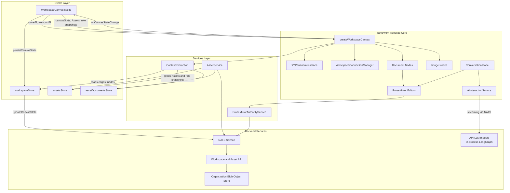
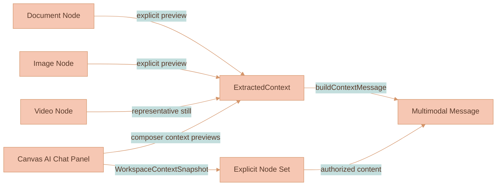
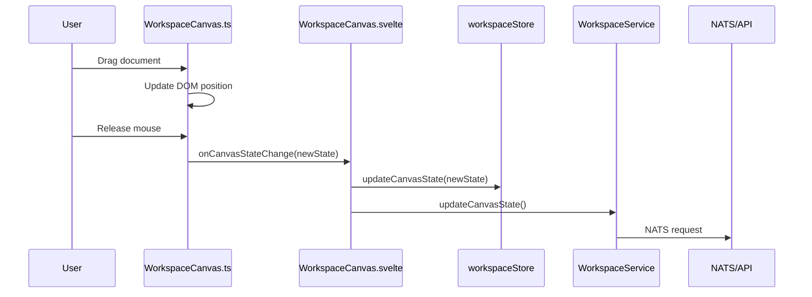

# Workspace Canvas

This module renders the main workspace view: a zoomable, pannable canvas where Asset-backed documents, media, registered Capability Artifacts, and branch lineage markers appear as draggable, resizable canvas nodes. The only AI prompt input is the screen-fixed composer at the bottom-center of the canvas; the right-side panel browses Capabilities, Artifacts, Media, and conversation Assets. Conversations do not persist as canvas nodes.

> **Where to look first.**
>
> - For the rendering architecture (DOM interaction layer + PIXI v8 media/edge layers), the LoD-tier loader, texture cache, decode pool, and remaining performance work, read [`documentation/canvas/RENDERING-ENGINE.md`](../../../../../documentation/canvas/RENDERING-ENGINE.md).
> - For collision resolution, viewport-centered insertion cleanup, and drag-release collision rules, read [`documentation/canvas/COLLISION-RESOLUTION.md`](../../../../../documentation/canvas/COLLISION-RESOLUTION.md).
> - For workspace data flow, persisted canvas shape, and workspace subjects, read [`documentation/canvas/WORKSPACE-MODEL.md`](../../../../../documentation/canvas/WORKSPACE-MODEL.md) and [`documentation/platform/SYSTEM-ARCHITECTURE.md`](../../../../../documentation/platform/SYSTEM-ARCHITECTURE.md).
> - For the shared canvas and in-chat video control bar, read [`documentation/media-generation/VIDEO-PLAYER-CONTROLS.md`](../../../../../documentation/media-generation/VIDEO-PLAYER-CONTROLS.md).
> - For explicit context chips, prompt references, reference-vs-lineage rules, generated-media provenance, and the balanced branch-tree layout, read [`documentation/ai-chat/CONTEXT-RELEVANCE.md`](../../../../../documentation/ai-chat/CONTEXT-RELEVANCE.md) and [`documentation/media-generation/BRANCH-LINEAGE.md`](../../../../../documentation/media-generation/BRANCH-LINEAGE.md).
> - This README documents the local code shape — file roles, DOM structure, click and selection rules, AI chat thread layout, edge connection UX.

> **Configuration rule.** Workspace-canvas values belong in [`settings.ts`](../../settings.ts) only when they are supported product configuration or theme tokens. Keep behavior flags, interaction thresholds, semantic sizing knobs, generated-media placement spacing, colors, shadows, borders, border radii, line styles, and line thicknesses there. Put theme-only values under the nearest `styles` key, and keep non-style configuration at that group root. Do not add CSS mechanics to settings: `display`, `position`, offsets, z-index, grid templates, background repeat/size, component-internal padding/gaps, and typography metrics that exist only to make the layout fit stay in SCSS or local component code.

### Capability library primitives

`capabilityLibraryPanel.ts` renders authorized Tools. Internal Skills referenced by a Tool remain implementation details and are not listed independently. Listed Skills remain available through the `@` picker. The panel reuses the Media Library browse and inspector shells, attaches stable Capability references to prompts, and does not expose workflow input schemas or Capability-management controls.

`artifactLibraryPanel.ts` renders persisted `capabilityArtifact` Assets in a separate top-level panel. It delegates list and inspector content by `artifactTypeId`, while `WorkspaceCanvas.ts` supplies generic attach, scope, review, history, editor, geometry, and transport hosts.

## What It Does

When you open a workspace, you see a canvas. On that canvas are nodes (documents, images, or videos). You can:

- **Pan** the canvas by clicking and dragging empty space (or two-finger scroll on trackpad)
- **Zoom** with pinch gestures or Ctrl+scroll
- **Multi-select nodes** by dragging a marquee rectangle from empty canvas space
- **Toggle selection membership** with Mod-click (`Cmd` on macOS, `Ctrl` on other platforms)
- **Delete selected nodes** with Delete or Backspace after single, modifier-assisted, or marquee selection; editor focus keeps normal text-editing behavior
- **Drag** nodes by grabbing the overlay (top bar for documents, anywhere for images/videos)
- **Drag selected groups** as a rigid set while preserving relative spacing
- **Resize** nodes from any corner by hovering that corner handle (images preserve aspect ratio)
- **Edit** document content directly—ProseMirror editors are embedded in document cards
- **Chat with AI** from the bottom-center composer; each submit creates a standalone session. The right-side panel opens as a view-only transcript of past sessions
- **Upload files** via the toolbar button; the server sniffs the bytes, stores the original, and returns or later publishes the canonical canvas-safe media object
- **Open the Media Library** from the independent bottom-right icon to browse cataloged Assets; an open composer reference picker is temporarily stacked above that action button so its results remain unobstructed
- **Open Asset details** from any Asset-backed node; every created Asset already has its initial catalog reference and survives placement removal without copying bytes
- **Connect nodes** by dragging from a handle, then use AI Chat composer context previews and workspace relevance to decide what the next prompt sees
- **Provide AI context** from explicit composer previews while also sending a compact workspace descriptor snapshot with each chat turn
- **Use the bottom-center canvas composer** to send prompts with context previews and workspace relevance
- **Select edges** by clicking the connector line
- **Delete edges** using Delete/Backspace (when an edge is selected), or by dragging an endpoint to empty space

All of this happens without the Svelte component knowing the details. It just passes DOM refs, performs app/service integration, and gets callbacks when things change. Canvas behavior such as placement, collision resolution, drag/resize planning, and viewport-coordinate math belongs in this `infographics/workspace` module or its utilities, not in `services/web-ui/src/components/WorkspaceCanvas.svelte`.

## Node Types

### Document Nodes
- Reference an Asset with a `content` role and embed a ProseMirror editor using `documentType: 'assetContent'`
- Have a drag overlay at the top (20px)
- Free resize (no aspect ratio constraint)
- Support block-level content (paragraphs, headings, lists, etc.)

### Image Nodes
- Resolve uploaded/generated image renditions from the node's `assetId`
- Have a full-area drag overlay
- Resize preserves aspect ratio (stored when image is uploaded)
- Detach their Workspace reference atomically with canvas removal; the complete removed-node set keeps orphaned branch markers and incident edges from returning during membership rebase
- Reject generated candidates from the node action strip even while generation is active; pending rejection authoritatively cancels the durable request, releases generation-owned conversation and catalog references, and detaches the node, while ordinary deletion preserves independent catalog membership
- Delete zero-reference Assets and Blobs asynchronously; Blob deletion claims are recoverable after Object Store or DB failures
- Expose Asset details once metadata is loaded; pending generation keeps its stable Asset identity
- Render the editable Asset title through a title-only ProseMirror document above the media node; render editable title and description metadata together at the top of the unified generated-output details sidebar. The background-free info-letter button opens that one surface: current Asset metadata/details first, then the producing user turn, reasoning, model prompt, references, resolver audit, and generation timeline. Generated media never renders a below-node details/history panel, a separate accepted-output message pill, or a second history surface. Sealed provenance is resumed for candidate outputs as soon as it exists so replay and history read the same immutable per-Asset source as the API; accepting an output changes topology and live-progress visibility, not the provenance source. All media chrome icon controls use equal boxes, normalized visual glyph bounds, the provider-icon color at rest, and the branch-review controls' 30px visual baseline; both surfaces follow the same adaptive bounded zoom curve. Candidate generated media exposes background-free accept, reject, and regeneration actions; prompt regeneration belongs exclusively to the branch-lineage controls.
- Use the shared model-control dropdown configuration for Asset scope changes: settings-backed dark theme, no per-option color overrides, and a sidebar-contained popover; keep storage, rendition, and lineage state visible as read-only details

### Operation Status Nodes
- File uploads insert an inert `operationStatus` node with `operation: 'upload'` before the API returns. The node carries no `assetId` and is ignored by descriptor analysis and Asset reference maintenance. The same state family represents media-generation progress, ambiguity, native verification, and terminal provider failures. Every concrete media run creates a hidden operation node and its stable pending image/video output node when the request is accepted, before reasoning or Capability execution begins; the submission acknowledgement applies that initial authoritative geometry immediately. The operation points directly to `outputNodeId`; no branch-marker ownership edge is created. Live and replayed request events project `generationProgress` onto that output node without persisting each heartbeat to the Workspace or DynamoDB request. Provider verification and failures can render actionable recovery cards, but reference ambiguity remains a provider-neutral request-state projection: it attaches to the matching submitted prompt marker by `generationRequestId`, presents candidates through the canonical inline `@Asset` reference atoms, and uses the marker's existing stop control instead of detached candidate/Cancel buttons. The resolver renders one unresolved binding at a time and atomically replaces both its binding ID and candidate Asset IDs on each live/replayed action, so a candidate can never be displayed under a binding that does not authorize it. Recovery subscribes before replay, deduplicates stream sequences, and reconciles only the matching operation/output nodes; it never reloads the Workspace and complete Asset catalog for each request event.
- The upload response supplies an Asset ID. Once the required rendition is ready, the placeholder becomes an image/video/audio/document node containing only that `assetId` and canvas geometry.
- The attach mutation persists the replacement before the browser commits it locally. That local commit is structural: it removes the placeholder shell, mounts the inserted media shell without a full canvas rerender, preserves the current canvas selection, and asks PIXI to resolve the Asset rendition.
- Image rendition failures caused by an early pending/missing rendition are retried only when that Asset's revision changes; unrelated Asset updates and already-loaded textures do not trigger canvas rebuilds or texture reloads.
- Converting placeholders show the same compact ring loading indicator used by waiting AI responses and extraction sections.
- Conversion failures mark the operation node as failed instead of creating an image/video node that would trigger descriptor analysis against unsupported bytes. Media-generation failures retain the API-planned lineage assignment when one exists and expose sanitized provider details, Edit request, and explicit Dismiss actions above the node's full-area drag overlay, while the non-action card surface remains draggable. Live recovery replaces the pending media at its visual center and immediately rebalances the mixed success/failure tree; the authoritative Asset-detach revision persists that replacement under the reserved output node ID. A failure before lineage planning uses the durable run's preassigned output node and Asset IDs for the same transaction, so it cannot leave an empty media shell plus a detached operation card. Snapshot reconciliation treats that same-ID pending-media-to-operation-status transition as a DOM replacement, so the media shell, partial texture, spinner, and stale geometry cannot survive after the failed state arrives.

### Video Nodes
- Display generated or media-library videos with a PIXI poster/placeholder behind a visible DOM `<video>` surface that is moved into the transformed chrome layer once the video handler creates the attached element
- Keep the node shell as interaction chrome only; completed playback, seeking, and fullscreen are driven by the browser-composited `<video>` element so connector edges are not tied to a PIXI video frame loop
- Use the shared SVG `components/videoControls` bar in the transformed media-chrome overlay, bound to that same attached `HTMLVideoElement`
- Render the control bar as an always-visible external row below the video surface, using the same bounded zoom-scaling pattern as other canvas chrome. The video surface mirrors node drag, click selection, and corner resize behavior; control hit areas stop their own pointer and click events so controls never trigger video-node drag, resize, selection, or playback toggles, while empty row space still allows canvas pan and zoom gestures
- Project generated-media info/provider/history chrome below the external control row for video nodes, so the info button, model badge, and user-message pill stay below playback controls
- Scrubbing pauses at the pressed timestamp, moves the control position immediately, writes the first video seek immediately, then applies the latest drag target as soon as the active seek settles so paused video frames keep updating during drag; it resumes on release only when the video was already playing
- Support play/pause, seek, continuous speed, volume, and fullscreen without persisting playback state into `canvasState`
- Resolve playback and Asset details from the same Asset while generated videos transition from pending to ready
- Treat an Asset revision change as a rendition-source change even when `assetId` is stable. A pending video can cache an expected 404 before storage settles; once `original` becomes ready, the canvas invalidates the handler source key, reloads the attached `<video>`, and rebuilds its live chrome without requiring a workspace refresh.

### Uploaded Audio and Document Nodes
- Uploaded audio nodes use an `audio` canvas node. PIXI renders the rounded audio geometry while a hidden DOM `<audio>` element owns playback metadata and controls.
- Uploaded PDFs, converted office documents, text, and Markdown use `mediaDocument` nodes. PIXI renders a first-page poster when available and falls back to a stable document rectangle.

### Capability Artifact Nodes

- Use the generic `capabilityArtifact` node with `assetId`, `artifactTypeId`, position, dimensions, and optional generated-output metadata.
- Live `CANVAS_GEOMETRY_RESOLVED` snapshots mount `capabilityArtifact` nodes incrementally, refresh the attached Asset/document, and reconcile the submit-time preflight marker with the API-owned lineage marker without waiting for a full workspace render.
- Resolve body, schema, editor plugins, info, replay, reference, and library views through the installed frontend registry; workspace code must not switch on Action Timeline.
- Resolve each registered Artifact's semantic glyph through that same frontend registry and reuse the existing SVG icon set; generic picker, chip, and context-preview hosts must not invent per-Artifact icons.
- Mount a live authority-backed ProseMirror editor for the `capabilityArtifact` document role and allow `@` insertion inside registered editable content.
- Measure complete content after load, edits, and width changes. Height may grow or shrink through branch-tree rebalancing; the user-resized width remains authoritative and the body never receives internal scrolling or truncation.
- Use the generalized generated-output title, model badge, accept, regenerate, history, collision, and marker cleanup contracts.
- Branch-lineage markers enumerate their candidates as generated outputs of every kind, so the marker's Accept all / Regenerate controls, readiness gating, reasoning-model glyphs, and generation-group activity never vary by whether the branch produced images, video, or Artifacts. Review readiness is one rule per output kind — an Artifact document or an original media rendition, plus sealed provenance. Accepting a media output removes its live `generationProgress` from the canvas snapshot together with active branch ownership; historical progress remains in sealed provenance and renders only inside the generated-output details sidebar. Hydration also requires active lineage for terminal side progress, so an older accepted node cannot flash historical timeline chrome while its Asset review record is still loading. Regeneration replays one descriptor list: media descriptors contribute replay prompts and model config groups, Artifact descriptors contribute Capability inputs. Artifact-only branches carry no media trace, so they re-run from their sealed Capability inputs with lineage preserved by the supersede call rather than through media replay prompts.
- Artifact details use the same `generatedOutputDetailsSidebar.ts` entry point as image/video outputs. The sidebar mounts the shared editable title/description editor and Asset status/scope/documents/lineage section around the Artifact-specific structured metrics view; raw unlabelled metric text is not a valid details surface.

### Branch Lineage Trees
- `WorkspaceCanvas.ts` is presentational for generated-media lineage. It allocates the durable request ID before submit, applies live `IMAGE_BRANCH_RESOLVED` / `MEDIA_LINEAGE_PLANNED` events, then renders API-persisted canvas projection snapshots for branch markers, pending media, partial frames, final media, and lineage edges. It may render transient preflight markers while the API is still resolving, but durable branch markers, media nodes, generated lineage fields, media generation phase, media frames, dimensions, and connector parentage are persisted by `services/api`. When explicit references have one structurally unambiguous generated target, the preflight marker is immediately connected after that target using the target's full right-side chrome collision envelope; ambiguous preflight remains screen-fixed. A preflight marker and its API-planned marker are phases of one request/run owner: promotion removes every matching temporary state and DOM identity, and render ownership permits exactly one visible marker even if duplicate preflight events race. It must not decide durable branch IDs, branch-root creation, fork creation, final lineage parentage, reasoning-model fanout, resolver outcomes, marker provenance, generated-media IDs, or generated-media geometry.
- Missing API lineage is a hard failure for generated-media topology. Do not add browser fallbacks, compatibility shims, edge-derived parents, existing-node recovery, model-count heuristics, or DOM-state recovery in `WorkspaceCanvas.ts`, `branchLineageState.ts`, `generatedMediaRebalancePipeline.ts`, `branchTreeLayout.ts`, marker renderers, or event handlers. Fix the API lineage plan, stream timing, or data migration instead.
- Media-reference hover cards use the shared context-preview controller. Inline labels remain inside message/timeline text, while an open card is projected into the canvas pane at the active viewport scale so line clamping stays intact and generated-output chrome cannot cover the card.
- Planned and media-owning marker phases keep using the exact submitted prompt atoms until the matching persisted user turn is readable, so provider-safe placeholder text never replaces the visible request during handoff. Once every visible request output is terminal, that terminal media state also settles stale in-memory Capability steps instead of leaving the marker pipeline active.
- Generated images/videos that share a lineage form a **branch tree**; the first generated image/video is normally the branch root and carries the originating prompt + references in its own `generatedBy` metadata
- Branch origin, fork, and continuation markers render as labeled ovals with read-only prompt/reasoning text projected from the stored AI chat ProseMirror message. Shared request work—understanding the request, resolving references/Capabilities/Tools/Skills, and committing lineage/media runs—renders inside the dark marker surface; per-media Capability and provider execution does not. The collapsed reasoning step keeps one ellipsized response line, while its expanded execution trace owns the complete reasoning so that text is never duplicated. Every trace step can expose structured model calls, provider icons, parameters, prompts, handles, timing, token usage, and results. Trace values render as compact bullet-list typography instead of definition tables or paired columns, while categorical values use the shared `packages/lixpi/ui-kit/src/components/tagPill` SVG primitive. Assets, Capabilities, Tools, and Skills use the shared prompt-reference chip and hover-card rendering. Every generated media node keeps its info control; an active run also shows the shared progress ripple immediately to its right. Both controls open the same generated-output details sidebar, while terminal runs hide the ripple and remain reachable through the info control. JetStream replay restores the accumulated tree before live events continue, and switching nodes replaces only the sidebar instance, not the per-request replay cache. Terminal history renders the same timeline from sealed Asset provenance. Generated-media connectors and marker model circles remain owned by the API lineage plan and are unaffected by sidebar disclosure.
- Per-media timelines never participate in canvas collision or connector geometry because they mount inside the fixed right sidebar. Progress heartbeats update only the selected sidebar instance and the node's small trace control; they do not rebalance the generated-media tree.
- Reasoning-fanout media requests render one API-declared temporary `branchFork` marker per reasoning run. Generated media from that reasoning run persist API-assigned `generatedBy.branchForkNodeId` and edge from that fork, so one selected reasoning model produces one branch lineage node even when several image/video models are selected. The fork's media-model circles stack vertically and each generated-media edge visually starts from the matching circle. If there is an existing lineage source, the fork sits under that source; otherwise the fork itself is the visible root marker. Clicking a `branchFork` opens the unified right-sidebar projection scoped to media under that fork so the chat reconstruction uses only the relevant reasoning model response.
- On every generated-media add/remove, `generatedMediaRebalancePipeline.ts` runs the deterministic pipeline: proxy pending media to its visible pre-frame geometry, add planned-media proxies for not-yet-started sibling markers, call `rebalanceBranchTreesAndResolve` in `branchTreeLayout.ts`, restore persisted node geometry, and report branch markers that now own generated media so stale live projection overrides can be cleared
- Branch tree parentage is read from API-assigned generated-media fields in order: `branchForkNodeId` / `branchLineNodeId`, then `parentMediaNodeId`, then `branchOriginNodeId`. It is not inferred from selected models, connector edges, existing nodes, or schema aliases.
- Removing the last generated image/video that references a `branchOrigin` or `branchFork` also removes the temporary marker and any incident lineage edges, so lineage chrome cannot remain as unreachable canvas nodes
- Depth spacing uses `settings.mediaBranchLineage.mediaToMediaGap`, plus `branchFanoutExtraGap` for each extra generated media node when a lineage forks. The first segment from a parentless root branch marker uses `rootToFirstMediaGap`, and the first segment from a temporary `branchOrigin` marker uses `branchOriginToFirstMediaGap`. `settings.mediaBranchLineage.nodeGap` is the minimum empty space reserved around every `branchOrigin`, `branchFork`, and `branchLine` marker during reference-root placement, on-canvas marker stacking, drag-release cleanup, and branch-tree rigid separation. Sibling spacing uses `branchRowGap` for generated media rows, while screen-projected preflight markers use `pendingMarkerInputGap` as their compact marker-to-marker gap. Pending stack reflow preserves the current top-to-bottom marker order and only runs for pending markers that do not already own generated-media children; branch-marker preview refresh follows the same rule and drops stale projection overrides for started markers. Completed fork/line markers are structural API run nodes in the tidy tree, so generated media fan out from the prompt/continuation node instead of a client-derived midpoint. Fresh unanchored lineage placement searches the submitted visible area for a clear marker slot, and API collision cleanup clamps that request's marker envelope back inside the same visible bounds. The root keeps its anchor, generated media fan out symmetrically around its vertical center, and linear chains stay collinear. Streaming response text updates the stored conversation without publishing per-chunk canvas geometry. Before the first generated frame exists, each node persists `mediaGenerationPhase: 'pending-before-first-frame'`; API and browser rebalances use the configured pre-frame circle for vertical spacing and connector anchoring while reserving the final media width horizontally. The early reservation stack therefore stays compact vertically without shifting a pending sibling left of an already resolved sibling. As each media frame resolves its proportions, the layout expands vertically to the actual card plus chrome and rebalances dynamically without changing the shared media column. Collision cleanup iterations and overlap thresholds are configured per canvas node type in `settings.workspaceCollision`; branch lineage marker margins are normalized from `nodeGap` so the same clearance applies across insertion, drag release, and generated-media rebalance.
- Pending image/video interaction before the first frame uses that same visible pre-frame circle for both the DOM drag target and pane coordinate hit-testing. The transparent future full-size media rectangle is non-interactive, so it cannot cover a nearby branch marker, steal the marker stop-button hover/click, or open the media bubble menu from outside the visible spinner.
- Branch marker stop controls remain visible while marker pending state, in-memory lineage-run bookkeeping, or a persisted descendant output reports nonterminal generation. Recovering a Workspace after an application restart therefore restores the stop control from durable output progress even though the browser's run maps are empty. Pressing stop cancels the request and persists removal of its branch markers, generated-output nodes, incident edges, and generation-only Asset references, so the projection stays gone after reload. Each Asset-backed node leaves the canvas in the same transaction that detaches its Workspace reference. Completed generated descendants are structural history and do not keep the stop control alive after `MEDIA_GENERATION_REQUEST_COMPLETE` settles the request. Once a marker leaves its compact screen-fixed composer pose, live reasoning rows immediately use the same text-driven on-canvas dimensions as the settled marker.
- Preflight marker insertion, lineage-plan handoff, pending-state clearing, and completion cleanup are transient browser projections. They never persist a client canvas snapshot over API-owned generated-media membership. Lineage-plan handoff waits for the complete API-planned marker set, then promotes the screen-fixed marker onto those exact coordinates; the browser never classifies or rewrites an API marker position as a fallback. A preflight marker superseded by a started API-planned marker is excluded from the screen-fixed composer stack and removed from the overlay, so stale persisted markers cannot shift a later run upward or keep a spinner visible. Final-run settlement removes both request- and thread-scoped placement aliases, sweeps stale marker elements from the screen-fixed overlay and canvas viewport, and retains exactly the API-planned on-canvas marker.
- Completed branch markers expose right-aligned, background-free checkmark and refresh icons separated by the same fading divider and optical spacing used by media review controls. The pair anchors below the marker's actual rendered content height. The complete control pair uses the generated-media chrome adaptive bounded zoom curve, while hover colors use the shared settings-backed hover duration and `hoverTransition(...)`. The refresh icon opens a two-option menu for Regenerate variants and Regenerate prompt. Asset completion, rather than delayed request-group cleanup, restores these controls; provenance sealing then enables them. Accept all detaches every candidate child and prunes an empty marker. A single-output Regenerate variants action keeps the current candidate, verifies its sealed provenance, and creates a continuation marker from that media node to the next candidate. Repeating the action therefore produces a visible candidate-editing line instead of replacing prior output. Ordinary media replays use the canonical stored prompt; a Capability-owned output may explicitly execute its Capability again so the next candidate preserves the same composite workflow. The browser never synthesizes lineage topology and applies the API's persisted canvas geometry. Regenerate prompt remains destructive to the old candidate set and submits the full model set through normal reasoning as fresh lineage.
- Ready media renders its Asset title persistently at the top of the node. The final descriptor VLM pass supplies a two-to-three-word title alongside the summary and tags; the generated-output details sidebar places the description and tags before Asset diagnostics, followed by the immutable generating-turn provenance in the same surface.
- Generated-media chrome uses one settings-backed screen-pixel gap on both sides of the icon strip, so media-to-icons and icons-to-expanded-info spacing remain equal across zoom levels.
- The whole tree is then rigid-separated from neighbors by the unchanged resolver (one bounding box per tree), so a tree moves as a block and never loses its internal balance — see [`documentation/canvas/COLLISION-RESOLUTION.md`](../../../../../documentation/canvas/COLLISION-RESOLUTION.md)
- Dragging a tree node runs settings-backed overlap cleanup and does not snap back; branch-marker connector geometry keeps the live release bounds through the commit so edges do not render against stale marker dimensions, and moved branch markers are locked as manually positioned so stream-driven stack reflow cannot put them back on top of each other. The next add/remove re-tidies deterministically

### Media Library Panel

The canvas details panel and Media Library inspector mount one shared Subject identity dropdown using the same `createPureDropdown` component and configuration as the Asset scope selector. It performs the direct revisioned attestation mutation and restores the previous selection on conflict/error. Medium and identity remain separate fields; there is no modal or proof form.
- Implemented in `mediaLibraryPanel.ts` and `media-library-panel.scss` inside this canvas module; Svelte supplies the independent bottom-right launcher above the zoom badge, and both bottom controls align to the same right side panel gap as the panel toggle when the panel is open.
- The top-level `Capabilities` / `Media` / `AI Threads` switch is the shared mode control for the right side panel. Capabilities lists authorized Tools; Media hosts cataloged Assets.
- Renders media through Asset metadata projections; save and insertion create references without copying Blob bytes.
- Shows the authorized Assets attachable to the current canvas: its own Workspace-scoped Assets plus available user- and Organization-scoped Assets. Assets scoped to another Workspace are excluded because the API cannot attach them to the current canvas.
- Uses `settings.mediaLibrary` for its two-thirds width, is flush to the canvas top and bottom, and occupies the space immediately to the left of visible AI chat.
- Uses concise Asset rows; selection opens metadata, scope, content, and provenance details, with a focused Back flow at narrow widths.

### AI Chat Panel And Sessions

The canvas owns a singleton right side panel that hosts the view-only AI Chat surface — it has no prompt input of its own; all prompting happens in the bottom-center canvas composer. Its `SidePanel` instance owns the outside top-right toggle, using the panel collapse icon in both states; the closed state rotates it 180 degrees, and the open state moves it with the panel. It opens the panel with zero tabs if needed, without creating a conversation Asset. Open/closed panel state, ordered tabs, active tab, width, and explicit context chips are stored in `canvasState.aiChatPanel`. Opening a conversation mounts it as a tab. When more than one chat tab is open, tabs render through the shared SVG `components/slidingTabsSwitch` primitive, with geometry and slide timing configured by `settings.aiChatThread.panelTabs` and active-tab theming under `settings.aiChatThread.panelTabs.styles`; a single open tab renders only a section divider at the tab strip's top edge. The opened conversation keeps a live ProseMirror transcript mounted for `asset.document.resume`, Asset-role step subscription, and receiving-state projection. The same panel hosts `generatedOutputDetailsSidebar.ts`, the single explicit entry point used by branch lineage, media info controls, active progress ripples, and accepted-output history. That component combines editable Asset metadata, descriptor tags, scope, subject identity, storage state, lineage, Artifact details, the original user turn, assistant reasoning, model prompt, references, resolver audit, and the recursive generation timeline. The media title remains part of the editable metadata section at its full details size; the `Generation details` heading begins the history section below its separator, and the component body is the panel's single vertical scroll surface. Sent user-message reference previews, inline `prompt_reference` atoms, branch-marker prompt references, Capability Artifact references, branch-origin provided-reference previews, and generation-trace reference items use the shared `components/contextPreview` tile renderer and stylesheet. Canvas references select its inline-popover policy so hover cards remain descendants of the scaled canvas surface and stack above local node chrome; app-panel and composer references use the same renderer with viewport-clamped body portals. Image and video previews fill their media container with normal sizing; portrait media places text beside the preview. Their color, radius, border, and shadow tokens live in `settings.aiChatThread.contextPreview.styles`; canvas-only chip controls stay in `workspace-canvas.scss`.

The Sessions surface includes standalone chats. It is collapsed by default and toggled from the history icon in the panel control row; when expanded it renders directly under that row and above the tab strip when multiple chat tabs are open. Closing the active chat tab selects the tab to its right, or the new rightmost tab when the closed tab was already rightmost. Closing the last open chat tab clears the active tab and leaves the panel on its empty "reopen a session" state. Each history row shows a title, absolute update date plus relative recency, and chat message-count metadata. Its expanded state is persisted in `canvasState.aiChatPanel`. Closing any tab leaves its session reopenable, and standalone chats can be deleted explicitly.

Session history colors, row hover gradient, and thread marker colors live under `settings.aiChatThread.sessionHistory.styles`; the shared panel divider border lives under `settings.aiChatThread.styles`. Fixed control sizing stays in `workspace-canvas.scss`.

### Conversation Assets

AI chat sessions are conversation Assets whose `conversation` ProseMirror role is authoritative. Sessions live in the right-side panel and branch-marker projections; they are not persisted as canvas transcript nodes. `ProseMirrorAuthorityService` submits Asset-coordinate steps under an edit lease, and the API settles immutable Blob snapshots. Context comes only from explicit composer/marquee context and inline `prompt_reference` atoms; canvas adjacency and unselected nodes are not scanned or auto-included. Media and Artifact prompt-reference atoms are authoritative request context rather than embedded conversation surfaces: they may be present in the initial submitted snapshot, are point-authorized by the API, and never require an `asset.reference.attach` mutation merely to create the conversation.

- **Connector auto-alignment** — a connector's left-side anchor slides along the target node's left edge to align with its source, clamped to a top/bottom margin (`settings.connector.autoAlign.edgeMargin`). When the target node is shorter than `settings.connector.autoAlign.minSlideHeight` (default 120px) the anchor snaps to the vertical center instead of sliding. This applies to every node type.
- **Menu-driven connect snap** — the image-node “Connect to node” action snaps against target node geometry and only commits the edge on mouse release so the snap preview is visible before creation. The snap distance is configurable via `settings.connector.menuConnectionSnapRadius`
- **Floating panel resize, typography, and overlay** — the canvas-owned right side panel defaults to a 494px content column and uses its `SidePanel` resize handle on the left edge as the horizontal resize target. Dragging that handle changes `--workspace-right-side-panel-width`, keeping the panel right edge fixed and preserving the zoom indicator offset. Regular messages and generation-trace content share the 14px `settings.rightSidePanel.typography.contentFontSize` token; execution-trace tag pills use the separate 12px regular-weight `tagPillFontSize` and `tagPillFontWeight` tokens. The full-canvas overlay is disabled; the panel retains its own backdrop and pointer/touch swipe-to-close gesture. Dimensions, typography, resize-handle geometry, toggle geometry, overlay behavior, drag thresholds, and slide timing are configured via `settings.rightSidePanel`.
- **AI-generated media** appears as independent canvas nodes positioned to the right of the API-declared thread source, generated-media parent, or lineage marker, with generous canvas-space breathing room. A generated Asset with live matching branch topology continues that branch. Accepted media retains immutable generation history after its review topology is removed, but an explicit later edit still uses that generated Asset as the continuation parent; the API creates a new live branch id for the edit instead of dropping the target into a disconnected fresh root. New thread-rooted branch rows are placed below the previous root branch using `settings.mediaBranchLineage.branchRowGap`, while descendants in the same lineage continue horizontally using `mediaToMediaGap` and remain vertically center-aligned with their preceding media. When a generated-media node forks, `branchFanoutExtraGap` adds more horizontal space for every extra generated media node, so a large fan pushes the whole media column and its descendants farther right during the same tree rebalance. Fresh/reference-only branches use the combined reference-media bounds to place the API-planned root marker; the marker preserves the configured first-media slot when it fits, but clamps after the reference group by at least `settings.mediaBranchLineage.nodeGap` so long prompt labels cannot overlap source media. With no reference bounds, the root marker is inset from the visible viewport's left edge by `settings.mediaBranchLineage.nodeGap` and vertically centered in that viewport. Pending media without a frame is laid out with the final media width and the temporary pre-frame circle's compact vertical footprint; connector anchors still use the visible outline bounds, including the configured outline gap, stroke width, and zoom-scaling behavior. Intrinsic image/video proportion updates preserve the resolved node center and re-run branch-tree layout instead of re-centering every generated media node on the predecessor, so final frames keep forks balanced. Their insertion dimensions are fixed canvas units regardless of the current zoom, so generated outputs arrive at the same logical size as a 100% zoom insertion. Generated outputs are connected by an edge with `sourceMessageId` only when the API plan continues a real thread or generated-media lineage; uploaded/source/reference/style media never become parent connectors by themselves. On every add/remove the lineage re-tidies into a balanced tree and is rigid-separated from neighbors through `generatedMediaRebalancePipeline.ts` and `branchTreeLayout.ts` (see [Collision Resolution](../../../../../documentation/canvas/COLLISION-RESOLUTION.md)); the first generated media node is the branch root and carries the originating prompt + references in its own provenance.
- Progressive partial previews update the deterministic PIXI-backed pending Asset node through revision-specific transient-media references. An empty partial carrying only the preassigned `assetId` remains a pre-frame circle and does not request a rendition. The first decoded partial may fit the node from its natural aspect ratio; later partials preserve that resolved geometry while PIXI keeps the currently decoded texture bound, decodes the replacement, and swaps pixels atomically. After an API snapshot replaces a media DOM shell, the canvas reapplies authoritative geometry to that replacement; after the partial tracker changes from the pre-frame circle to media bounds, it reprojects the DOM shadow, PIXI outline target, and media-owned progress anchor together. Repeated partial events carrying an already-applied API layout revision update only pixels; they do not reapply node snapshots, rebuild the DOM container, or rerun layout. Final events carry `assetId` and API-authored `canvasGeometry`; fully applied authoritative geometry is adopted into `workspaceStore` with its layout revision and invalidates queued client saves from older asset membership. Completion arms PIXI to fetch the already-ready `original` rendition before applying final geometry or releasing the transient frame, so pending `thumbnail`/`preview` derivatives cannot produce a handoff-time 404. Completion explicitly refreshes the generated Asset, and subsequent Asset-state changes rebuild the media action strip and branch review controls without requiring a workspace reload. Video source failures are remembered separately for poster and original renditions; Asset revision or completion clears the failed element source, increments a cache-busting source revision, immediately runs the media-layer upsert, and remounts the same playable `<video>` element. A successful local decode is authoritative for frame visibility, so a late or stale Asset invalidation cannot replace displayed pixels with the pending spinner. The browser treats missing final geometry as a projection error and never persists partial URLs. The chat thumbnail references the same Asset. Explicit context, workspace relevance, lineage, and traveling-outline behavior remain shared across panel and canvas generation.
- The bottom-center composer creates a conversation Asset for each submit and projects pending branch markers from its authoritative ProseMirror snapshot. The pending placement retains the exact submitted prompt parts until the persisted conversation turn becomes readable, so the preflight marker never falls back to scalar text and lose a Capability or media-reference atom. Submitted Capability-module atoms stay at their exact inline position in the user message and compact marker, render through the same prompt-reference chip factory used by the composer, and use a lighter version of the Capability accent on the dark submitted-message surface. The screen-fixed marker dimension contract reserves its reasoning glyph, live spinner, stop control, flex gaps, and reference glyphs before measuring the visible prompt, so a short Capability-bearing request cannot ellipsize before its atom. Clicking a Capability-output lineage marker uses the same read-only chat-turn projection and generated-output sidebar as image and video lineage; Artifact outputs never substitute a Capability-specific summary panel. Accepted image/video and Capability Artifact history use the same generated-output details entry point. Both paths read the original stored user turn, preserve inline Capability order, and fall back to the API-persisted prompt only when the turn is unavailable. Accepted Artifact history resolves directly from its durable `generatedBy` turn identity and the conversation Asset, so removing or reconciling its live lineage-marker node cannot make the trigger inert. Capability-only output disables image/video work, forces the selected reasoning provider to execute the attached Tool once inside its normal agent loop, persists the Capability generation-details trace, and then streams a brief no-code completion into the same reasoning run. The API publishes the terminal stream event and finalizes the authoritative conversation before it publishes the Artifact node. History therefore projects the current user message, execution metadata, and assistant reasoning through the standard chat renderer. An in-flight turn that has not received a response remains user-only and never borrows the preceding turn's response. A top-level API rejection retires the detached run and its preflight marker instead of leaving a permanent spinner. `MEDIA_LINEAGE_PLANNED` promotes preflight markers into API-authored canvas topology. Structural renders rebuild the screen-fixed marker overlay instead of retaining its DOM children, and promotion removes every temporary or pre-existing DOM copy before mounting the single resolved marker in the canvas viewport. Authoritative canvas-snapshot reconciliation also removes any conversation-keyed preflight marker whose alias handoff lost a state-replacement race, so the resolved API marker cannot coexist with its temporary input-side copy. Cancellation uses the conversation Asset ID plus generation request ID, aborts all grouped providers, seals transcript/provenance state, removes pending Asset placements, and persists the rebalanced canvas before acknowledging the request. Reload replays durable pipeline events and Asset document steps; late nonterminal events for a cancelled request are ignored.
- Lineage promotion recovers a screen-fixed marker directly from its overlay identity (`conversationAssetId` plus reasoning index/model) when an incoming state replacement has already lost the in-memory alias. API canvas snapshots defer rendering their planned marker while that preflight element still owns the handoff, so the viewport marker cannot appear beside the composer-attached copy. The incremental planned-marker sync consumes that recovered overlay element through the same atomic identity promotion even when the transient preflight state node has already disappeared. Full structural renders also resolve preflight/planned ownership from canvas state: preflight remains the sole visible owner before the planned media starts, then the planned marker becomes the sole visible owner once its media placeholder or edge exists. Request completion also sweeps marker elements for that completed conversation that survive only in the overlay and have no matching current canvas-state node; concurrent conversations remain untouched.
- Multi-model media requests create and track one stable pending output per reasoning/media axis by `mediaRunId` at request submission. The API centers the early pending stack in the visible canvas when no reference Asset anchors it, and each node immediately renders its own progress while reasoning and lineage planning continue. When the provisional lineage plan is available at submission, the reservation progress and hidden operation record already carry model/provider identity plus the exact lineage assignment, so the first balanced tree projection and provider attribution do not wait for pixels or an Asset-catalog refresh. `MEDIA_LINEAGE_PLANNED` reuses those output identities, persists branch markers, and binds each operation/output pair to its exact assignment. The first Asset-backed media attachment adds `generatedBy` and adopts the preassigned Asset reference through the reference-counted Workspace transaction without replacing that identity. A reasoning child that emits no media settles only its own marker, while the matrix-level completion settles the shared request after every reasoning child finishes. Trace events attach live run tracking to those API-owned assignments, so one completed or failed variant does not delete sibling progress or shared lineage/reference placement. On terminal failure, the API's Asset-detach transaction replaces the pending output reservation with a failed operation card at the same center, carries its lineage assignment forward, and rebalances it together with successful siblings. Live recovery mirrors that exact replacement transiently from either the durable event or a generic reasoning-stream failure, so partial pixels, progress chrome, trackers, and stale node geometry disappear immediately; the API also broadcasts the resulting authoritative failure geometry, and reconstructed browser geometry is never persisted. Every generated sibling receives the same branch resolution plus its own run metadata in `generatedBy`, and branch-tree sibling order uses `variantIndex` before `createdAt` for deterministic fanout layout. Marker text normally comes from the authoritative conversation document and falls back to API-persisted marker provenance while that document is still resuming. Its response row prefers the model's conversational preamble, then non-empty collapsible reasoning text, then the reasoning run's media Tool prompt or Capability result from the persisted generation trace. Request settlement copies the bounded marker response preview into provenance, so reloads and replay workflows cannot lose the reasoning row when the conversation document is not mounted.
- Generated media chrome renders in a screen-space layer above the viewport DOM but below the PIXI media layer. Before the first frame, its centered group contains the info button followed by the active progress ripple; after the frame resolves, the below-node strip preserves that order before the provider/model badge and candidate review actions. The ripple exists only while the run is active and disappears on completion, cancellation, or failure. The info button remains available for terminal and accepted output details. Both controls open the same generated-output sidebar without changing node bounds or connector anchors. The strip uses the shared bounded zoom curve and participates in collision geometry, while the right-sidebar content does not. Active nodes read their live JetStream-replayed progress and continue updating the mounted recursive timeline; terminal nodes recover the same timeline from sealed provenance. Accepted history remains sourced from the producing thread turn plus sealed Asset provenance.
- Generated-media provenance reads as one ordered pipeline inside every history surface. The submitted user message is first, and the pipeline starts immediately below it. Assistant preamble is represented once as the `Understand request` summary, while the reasoning-authored media prompt is one top-level pipeline step after shared lineage resolution; its expanded detail uses the same purple surface and left border as the trace prompt it replaces. Per-run trace rendering keeps references, resolver audit, Capability comparison, and output details but suppresses the duplicate standalone prompt section. The pipeline presentation is derived from `generationProgress` embedded on that Asset's generated-media provenance node and the matching stored generation trace; it is never prepended above the submitted turn or reconstructed from unrelated live request state. History opened from either media info or a branch-lineage node starts with every nested detail expanded for candidate and accepted media alike, never reuses focused live-progress state, applies no extra horizontal margin to the timeline, and aligns its root rail with the pipeline header instead of inheriting ProseMirror's list indent. On an active expanded branch marker, the stop control reserves space only in the submitted-prompt row; the separator and progress timeline retain the full inner marker width. The user can still collapse back to top-level steps plus active/problem detail while that history surface remains open.
- Drag membership is planned by `workspaceDragPlan.ts`, so AI chat thread drags move only the thread node and real `parentId` descendants. Generated outputs remain independent branch nodes.
- Render-state reconciliation is planned by `workspaceRenderStatePlan.ts`. When the active right side panel emits a stale metadata render while a local user-driven canvas commit is still waiting for store acknowledgement, the canvas preserves the locally committed visual node/edge state until the store catches up. Generated branch markers, partial media, and completion handoff visuals are transient and do not create a pending local visual commit that can mask the API-owned canvas projection. Active generated-media trackers are overlaid back onto incoming API canvas renders until the run completes, so a lineage-plan projection cannot erase an in-flight placeholder/progress outline.

## Architecture



## How It Works

### Initialization

1. Svelte mounts and binds `paneEl` and `viewportEl` refs
2. `createWorkspaceCanvas()` is called with these refs plus initial data
3. XYPanZoom attaches to the pane for viewport control
4. Document nodes are created as DOM elements and appended to viewport

Workspace Asset synchronization loads only Assets reachable from canvas nodes, generated-output conversation metadata, branch markers, open conversation tabs, or the last active conversation, then follows their persisted lineage source IDs before committing `assetsStore`; it never enumerates document, conversation, or Artifact catalogs during route hydration. Library panels page lightweight catalog metadata on demand. Unknown Asset events do not trigger a full Workspace reload, while events for already loaded Assets refresh only that Asset. Capability Artifact references therefore retain canonical titles, thumbnails, and hover previews after reload even when the source media has no independent canvas placement. Asset-role snapshots are committed to `assetDocumentsStore` in bounded batches during the concurrency-limited resume pass, so prioritized conversations become available without one reactive update per snapshot. A content snapshot that arrives after its canvas node mounts replaces that node's loading placeholder with its ProseMirror editor in place. Document or conversation hydration never clears `viewportEl`, destroys unrelated editors, or rebuilds generated-media chrome; full canvas DOM reconstruction is reserved for Workspace identity or canvas node-structure changes.

### Viewport Transform

The viewport element uses CSS transforms for pan/zoom:

```
transform: translate(${x}px, ${y}px) scale(${zoom})
```

XYPanZoom fires `onTransformChange` on every pan/zoom. We update the CSS and notify Svelte via `onViewportChange`. The Svelte layer debounces and persists to backend.

During interaction, the live viewport inside `WorkspaceCanvas.ts` is the rendering source of truth. `onTransformChange` updates `currentCanvasState.viewport` immediately, and Svelte persistence is treated as an acknowledgement. If a later store render changes only `viewport` and disagrees with the live transform already on screen, `workspaceViewportStatePlan.ts` preserves the live viewport so a stale debounced save cannot replay an older pan position and make nodes appear to jump.

### Document Nodes

Each canvas node becomes a `div.workspace-document-node` with:

```
┌─────────────────────────────────────────┐
│ .document-drag-overlay (20px, cursor:move)
├─────────────────────────────────────────┤
│                                         │
│  .document-node-editor                  │
│  (ProseMirror lives here)               │
│                                         │
└─────────────────────────────────────────┘
  ↖ resize     resize ↗
  handle       handle

  ↙ resize     resize ↘
  handle       handle
```

### Image Nodes

Image nodes have a simpler structure:

```
┌─────────────────────────────────────────┐
│  .image-drag-overlay                    │
│   (covers entire image for dragging)    │
└─────────────────────────────────────────┘
  ↖ resize     resize ↗
  handle       handle

  ↙ resize     resize ↘
  handle       handle
```

Generated media model labels, info buttons, and active-only progress ripples do not live inside the image node shell. They render in `.workspace-generated-media-chrome-layer`, above the viewport DOM but below the PIXI media layer, so active generation outlines stay visually on top of the strip. All generated-output metadata, history, and pipeline content renders through `generatedOutputDetailsSidebar.ts` inside the singleton right side panel; no expanded below-node provenance layer exists.

Image pixels are drawn by **PIXI** (see `pixiMediaLayer.ts` and [Rendering Engine](../../../../../documentation/canvas/RENDERING-ENGINE.md)). Canvas image nodes do not create a DOM `` proxy. Progressive AI image partials and final stored images both update canvas state and render through PIXI. Completed video playback is the exception: `videoNodeHandler.ts` still loads the poster into PIXI for stable canvas geometry, but `WorkspaceCanvas.ts` moves the attached `<video>` into `.workspace-video-chrome` for visible playback and controls. While generation is active, `PixiTravelingOutlineRenderer` from `@lixpi/canvas-engine/frontend/rendering` draws a continuous tapered colored-glass droplet progress snake in `generatingBorderLayer`, above the media sprite, using the configured generation-border palette. `workspaceLoadingOutline.ts` uses that same renderer and the generated-media pre-frame circle geometry for the centered workspace-switch loading indicator, with the workspace content covered by the same backdrop blur treatment used by the side panel glass. If route data loading fails, the same TypeScript-owned overlay keeps the blurred cover visible, clears the PIXI outline, and renders retryable error feedback. Media corner rounding is configured through `settings.mediaNode.styles.borderRadius` and applied through the PIXI sprite mask or chrome surface.

New PIXI image entries must initialize their sprite position, size, and placeholder rectangle during the same first `sync()` that inserts them into the spatial index. They should not need a later viewport change, click, or store render before their pixels line up with the DOM node. When a decoded texture is bound to an already-sized placeholder sprite, the media layer must keep cache ownership on the entry and replace the sprite plus mask objects if Pixi rejects the texture swap, so a successful final image cannot leave the canvas with a blank generated node or a destroyed mask.

PIXI renderers must not destroy or replace GPU-backed buffers during ordinary canvas sync, selection, edge, or outline animation work. Edge and foreground `Graphics` objects hide/reuse instead of being recreated, and dynamic mesh renderers use fixed-size buffers with in-place updates so Pixi does not recreate WebGPU buffers when outline or glass geometry changes. The media layer disables Pixi's automatic renderer resource GC and wraps native `GPUBuffer.destroy()` with a short rAF deferral because Pixi can resize or unload internal batch buffers during the same render turn that submits WebGPU commands. This keeps WebGPU command buffers from referencing resources that a newer canvas update has already destroyed.

### PIXI Media Debug Dump

`pixiMediaLayer.ts` always installs `window.__lixpiPixiMediaDebugDump()` in the browser. Use it before reloading when images disappear, placeholders stay blank, WebGPU reports `Buffer used in submit while destroyed`, culling looks wrong after pan/zoom, or a texture-cache issue needs a reproducible snapshot.

Copy a dump from DevTools:

```js
copy(JSON.stringify(window.__lixpiPixiMediaDebugDump?.(), null, 2))
```

The dump contains the workspace id, renderer health, viewport, pane dimensions, cache counters, one snapshot per PIXI image entry, recent compact media-layer events, and native `GPUBuffer.destroy()` stack traces. URLs are sanitized so object-store auth tokens are not pasted into bug reports.

For verbose event payloads and live console streaming while reproducing a flaky case:

```js
localStorage.setItem('lixpi.debug.pixiMedia', '1')
```

Turn it off after capture:

```js
localStorage.removeItem('lixpi.debug.pixiMedia')
```

Workspace render-state and generated-media chrome diagnostics are also opt-in. Enable them only for a targeted capture with `localStorage.setItem('lixpi.debug.workspaceCanvas', '1')`, then remove that key afterward. Normal workspace loading does not stream these diagnostics to the console.

Read the dump in this order: `gpuBufferDestroys` first for WebGPU lifetime problems, `entries` next for sprite/renderable/texture state, then `recent events` for the sync or visibility action that led into the failure. A visible image with `sprite.renderable: true`, no `textureKey`, and no `requestedTier` points at request scheduling or culling. A stack in `gpuBufferDestroys` that mentions Pixi `Buffer.unload`, `setDataWithSize`, `GraphicsContextSystem`, or `BatcherPipe` points at renderer resource lifetime, not image fetch/decode.

Toolbar image insertion uses `settings.mediaNode.image.defaultInsertionWidth` as the canvas-unit width for new image nodes. The inserted height is derived from the natural image aspect ratio; if the client cannot probe dimensions, the inserted node is a square using that same configured width.

Image resize always preserves aspect ratio using the `aspectRatio` value stored when the image was uploaded.

Connector edges that enter or leave image nodes always anchor to the vertical midpoint of the image side. Image endpoints do not slide, fan out, or follow message-level source alignment; non-image endpoints can still use those behaviors.

On image load the client verifies the image's natural aspect ratio and will auto-correct the node's dimensions if a mismatch is detected (this helps self-heal nodes created by older clients). When a correction is necessary the client persists the corrected `dimensions` and updated `aspectRatio` via the normal canvas state persistence flow (`onCanvasStateChange` / `commitCanvasState`).

Resizing uses a stable diagonal-based calculation to preserve aspect ratio smoothly during diagonal drags and avoid axis-switching jumps that can cause jitter during resize. Resize handles are dynamically sized and positioned (computed from the current viewport zoom) so they remain a uniform screen-pixel size and precisely aligned to node corners inside the configured zoom band. Below the configured lower zoom breakpoint, their world size freezes so overview zooms thin them consistently with connector chrome. The handles are invisible hitboxes until their own corner is hovered; selecting or hovering the body of a node does not reveal every handle. This zoom-compensated sizing is controlled by `settings.mediaNode.useZoomCompensatedResizeHandleScaling`, with size, offset, minimum size, and breakpoint under `settings.mediaNode.resizeHandle`.

Empty AI chat thread parent containers preserve their persisted dimensions. Parent auto-expansion may still grow a thread container to fit children moved with it, but it must not reset an empty thread back to the default `300x200` size after a commit. When a child image or document belongs to a larger existing thread container, the thread keeps its existing size unless the child bounds plus padding exceed it.

AI chat currently renders in the singleton canvas-owned right side panel. Opening the panel itself does not select a node or create a conversation record. The panel is right-flush and full-height within the workspace shell. A non-interactive decorative underlay extends left behind the resize handle and applies a masked glass blur so canvas imagery fades gradually beneath the panel instead of ending at a hard blur boundary. Reduced-transparency mode replaces that blur with a faded opaque surface. When it is open, the zoom indicator remains logically bottom-right but offsets left by the right side panel width, and the global user avatar moves to the panel's bottom-left corner.

### Image Generation Visual Feedback

When an AI-generated image is being created, the canvas provides visual feedback before and during generation:

1. **Candidate snapshot** - On submit with a media model selected, the browser builds a request-bounded `MediaBranchCandidateSnapshot` from only the media explicitly attached through context chips or inline media references. Every candidate has a stable `candidateId` and `assetId`; canvas-backed candidates also carry `nodeId` and existing lineage metadata. Unselected canvas nodes and ambient thread outputs are excluded. If exactly one attached media node is present, the snapshot marks it as `active-target` and records `activeTargetCandidateId`; the API still reauthorizes every Asset, compiles stable aliases, and owns final role assignment.
2. **VLM branch resolution and lineage planning** — Request creation persists one pending image/video output and hidden operation node per selected reasoning/media run before VLM resolution begins. Each output immediately owns its generic progress state and selected provider/model identity. When the provisional plan is known, those same reservations also receive the exact pending lineage assignment before the first authoritative marker rebalance; `generatedBy` remains reserved for the Asset-backed attachment. The API then emits `IMAGE_BRANCH_RESOLVED` and `MEDIA_LINEAGE_PLANNED`, reusing those stable output identities while adding marker topology, exact assignment bindings, and authoritative geometry. `WorkspaceCanvas.ts` accepts those API snapshots; it never creates output topology. The transient submit-time marker remains the prompt/reasoning surface while the independently visible pending media nodes report their own work. Final request settlement removes every thread-owned overlay marker, including a retained stale DOM copy whose transient state node was already replaced. On reload, recent standalone `canvas-*` threads with a submitted user turn are reattached so request and pipeline replay can reconcile the media-owned progress and `MEDIA_LINEAGE_PLANNED` topology. `MEDIA_GENERATION_REQUEST_COMPLETE` is the API terminal backstop that settles remaining pending state by `generationRequestId`. Reference, style, and source-context media can anchor placement and receive temporary progress outlines, but only API-assigned generated branch targets/parents or planned lineage markers become generated-output connectors. Fresh/reference-only branches place their planned root marker from the full reference group bounds when references exist; without reference bounds, the root marker uses the visible viewport inset and vertical-center fallback before generated outputs chain from the marker. That fallback uses lineage order rather than the total canvas-node count, clamps the marker to the submitted visible world bounds, and excludes hidden operation records from collision resolution, so orchestration bookkeeping cannot push the visible branch tree off-screen. When the API identifies an existing generated candidate as the target/identity reference, placement follows that generated node and preserves its branch id even if the requested color palette or medium changes. `IMAGE_BRANCH_RESOLUTION_ERROR` clears pending placement and stops the generation path visibly.
3. **Early placeholder** — API lineage requests create generated image and video placeholders through canvas projection snapshots. `VIDEO_PENDING` carries the persisted API geometry that starts the browser's traveling outline; the browser refuses to synthesize fallback video topology or coordinates. `IMAGE_GENERATION_TRACE` only registers the media run and attaches outline tracking to an existing API-projected node; empty partial heartbeats refresh existing outline tracking but do not create nodes. `MEDIA_GENERATION_REQUEST_COMPLETE` applies API removals for unresolved pending media so unstarted slots disappear from both canvas state and DOM. A terminal `generationProgress` status always stops pending-before-first-frame geometry and the traveling outline even when no provider frame ever arrived, leaving the failed pipeline and operation problem visible instead of a permanent spinner. Generated-media tracker keys prefer `mediaRunId` from `generationRun` or `generationRun.lineageAssignment`, so API-projected placeholders and provider partial/complete events reconcile to the same visible node while the run metadata is enriched through the media router.
4. **Animated progress border** — `pixiMediaLayer.ts` feeds active generated-media and temporary reference-media bounds to the shared `PixiTravelingOutlineRenderer`, which draws a single-mesh continuous tapered colored-glass droplet snake traveling around the rounded media perimeter while the reasoning model is still preparing the media prompt. Generated-media placeholders render as a centered circular outline at `settings.mediaNode.inProgressOutlineAnimation.preFrameCircleScale` with the generated-media provider icon centered in the circle until the first non-empty frame URL arrives; after that the outline expands back to the media node perimeter for the rest of the run. The connection manager uses the visible pre-frame outline bounds for connector anchors, so edges meet the placeholder rather than the hidden full-size media box. The pre-frame circle scales its lap duration to the smaller perimeter so it keeps the same path speed as the full media-node outline. Motion follows the loop-safe `Easing.travelingOutlineTransition()` curve; snake palette, glass material, length, width, head rounding, tail taper, node gap, lap duration, adaptive bounded stroke scaling, and development flags are configured through `settings.mediaNode.inProgressOutlineAnimation`.
5. **Prompt handoff** — `IMAGE_GENERATION_TRACE` / `VIDEO_GENERATION_TRACE` marks one planned media run's handoff from reasoning model to media model. Explicit marquee/context-chip media and canvas-backed inline `@` media references keep their reference outlines until every planned run has handed off; one sibling trace cannot clear another sibling's evaluation state. For images, later partials apply API geometry snapshots to update only the generated node.
6. **Completion or failure** — `onImageCompleteToCanvas` moves the generated-node PIXI progress outline onto the final API-owned image node and clears it only after PIXI reports the final texture's intrinsic size, with a bounded fallback if texture loading fails. When the API has already persisted the final media node before the completion event, the final node is appended before the transient partial node is removed so the canvas never drops to an empty generation slot between progress and output. Media completion does not tear down the hidden ProseMirror-backed thread editor; teardown waits for the AI thread receive state to end so final LLM text can still resume into the branch marker after a refresh. Because the backend may persist the final AI-thread document after the media completion event, completion also schedules a short bounded refresh of the persisted AI thread before re-rendering branch marker previews. `IMAGE_ERROR` clears transient pixels and run tracking but retains the API-projected failed operation node so its sanitized reason and explicit Edit/Dismiss actions remain visible.

### Media Node Lifecycle

When an Asset-backed node is removed, the host submits `asset.detach` with the node ID and the exact canvas mutation. The API commits Workspace geometry and Asset reference removal transactionally. It never deletes bytes inline; zero-reference Asset and Blob maintenance rechecks counters before removing records or Object Store bytes.

Normal canvas saves and Asset membership mutations share one FIFO write lane per workspace. Each attach or detach rebases its requested snapshot onto the latest renderer state, reads the current persisted revision only after earlier writes finish, and commits only after the NATS response explicitly confirms the requested membership. This prevents overlapping uploads from sharing a stale revision or leaving locally visible nodes whose membership transaction was rejected.

Media replacement is a normal canvas-state save plus storage cleanup. Replacing a generated media node must include a transient `mediaReplacement` marker with the previous file id, because the API full-save merge otherwise preserves API-owned generated-media payloads over stale browser saves. The API consumes that marker, applies the incoming media payload to the same generated node id, keeps lineage metadata, patches the matching generated-media node in the owning AI chat thread document, and does not persist the marker. The canvas schedules a persisted thread refresh for generated-media replacements so the generated-output sidebar uses the same file id as the canvas node. If the API reports `STALE_CANVAS_STATE` with a current canvas save token, `WorkspaceService` must retry the pending local save with that token instead of throwing away the visual replacement and reloading old canvas state. If cleanup reaches the API before the replacement save is visible, image/video delete utilities retry `FILE_STILL_REFERENCED_BY_CANVAS` rather than treating it as a permanent failure.

Workspace navigation and first non-empty workspace load reinitialize the media lifecycle tracker from the opened workspace's canvas state before local commits can run. The tracker must never compare media from one workspace against another workspace's node set, because a cross-workspace diff would turn a navigation render into destructive storage deletion.

Generated media stream callbacks also verify that the event's thread still belongs to the currently rendered workspace before they mutate canvas state. Late image/video events from a previously opened workspace must be ignored instead of inserted into the new workspace.

### Drag and Resize

Both drag and resize temporarily disable XYPanZoom's panning to prevent conflicts:

```typescript
panZoom.update({
    ...panZoomConfig,
    panOnDrag: false,
    userSelectionActive: true,
    connectionInProgress: true
})
```

After mouse-up, we re-enable panning and commit the new position/dimensions via `onCanvasStateChange`.

### Multi-Selection

Node selection is runtime-only UI state and is not persisted into `canvasState`.

#### Click Interactions

| Action | Result |
|---|---|
| Plain click on node (non-editor area) | Selects that node; no overlay appears; no prompt context preview is added |
| Plain click on empty space | Clears the selection |
| Mod-click on node | Toggles that node in/out of the selection without changing prompt context previews |
| Click on ProseMirror editor content | Passes through to the editor — no selection change, no resize handles |
| Hover a node corner | Shows only that corner's resize handle |

**Editor content bypass:** The `nodeEl` click handler checks `isContentEditable`, `.ProseMirror`, and `.ai-chat-thread-wrapper` and bails out before reaching `selectNode`. This prevents clicks inside AI chat thread content from triggering node selection UI (resize handles, outline), which would block text editing. Mod-click still fires through the bypass to allow toggling selection.

**Media node shadows:** Image and video nodes use `settings.mediaNode.styles.defaultBoxShadow` in their default state and `settings.mediaNode.styles.selectedBoxShadow` when selected. The default shadow should stay subtler than the selected shadow so selection remains legible.

#### Marquee Selection

Empty-space drag draws a marquee rectangle and selects all overlapping nodes.

Persisted empty AI chat thread canvas nodes use special marquee-selection bounds so hidden thread shells do not create phantom selection areas. Visible workspace nodes use their own DOM bounds directly.

When a marquee drag completes, eligible document, image, video, and `capabilityArtifact` nodes in the final marquee selection become explicit composer context previews. Transient hits while the marquee is still moving do not create previews. Artifact chips carry `assetId` plus `artifactTypeId`; the API authorizes and validates the Artifact document, serializes embedded references with current Asset titles, and attaches the cited image, video-frame, audio, and document content to the consuming model request.

#### Selection Overlay Rules

The selection group overlay (z-index 10000) appears based on two conditions:

| Condition | Overlay visible? |
|---|---|
| 2+ nodes selected (any source) | Yes |
| 1 node selected via marquee | Yes |
| 1 node selected via plain click | **No** |
| 0 nodes selected | No |

This is controlled by the `selectionIsFromMarquee` flag. `setSelectedNodes(ids, fromMarquee)` stores the flag after filtering out IDs that are no longer in the current canvas state; `shouldShowSelectionGroupOverlay()` checks `size > 1 || selectionIsFromMarquee`. Branch lineage markers are marquee-selectable, but plain click still opens their lineage details instead of selecting them. Markers cannot become AI chat context chips. Deleting a selected marker uses branch-level generated-output rejection so its candidate outputs, canvas topology, and owned Asset references are removed together. If the marker has no generated output Asset, the API removes the orphan marker and its incident edges directly instead of rejecting the request as `GENERATED_OUTPUT_NOT_FOUND`.

#### Deferred Selection in Drag

`handleDragStart` does **not** select nodes immediately on mousedown. Instead it records `wasAlreadySelected` and defers selection:

- **On drag movement** — selects `resolvedNodeId` for group drag.
- **On mouseup without movement (click)** — selects the original `nodeId` (the image itself).

This prevents the selection overlay from appearing between mousedown and mouseup, which would intercept the mouseup event and break the image click flow.

The drag overlay passes `node.nodeId` (not pre-resolved) to `handleDragStart` so both code paths have access to the original ID.

#### Group Drag

Dragging any selected draggable node moves the entire selection together. During group drag:

- Persisted AI chat thread companion UI (vertical rail and floating input) stays attached to its thread when those nodes are present
- Collision resolution is skipped for multi-node moves to preserve rigid spacing
- The follow-up click event is suppressed so multi-selection is not collapsed to a single node after drag

#### Single-Target UI

Single-target canvas UI stays single-target:

- The image bubble menu appears only when exactly one image node is selected
- The only interactive composer is the screen-fixed bottom-center canvas composer; the right side panel is view-only
- Per-thread floating inputs remain attached only to persisted AI chat thread canvas nodes if those nodes are rendered

Selection colors (marquee border/background, overlay border/background, thread-input outline) are configurable via `settings.selection.styles` and applied as CSS custom properties on the pane element. Clicking outside the selected range clears the selection.

Note: once a workspace is mounted, its live renderer owns the viewport. Same-workspace store renders preserve the current pan and zoom even when generated nodes, edges, documents, or other visual state require synchronization or a full DOM rebuild. Persisted viewport state is applied only when loading or switching workspaces; matching save acknowledgements are inert. Workspace saves mark viewport writes explicitly, and ordinary metadata, node, edge, descriptor, and panel-state saves preserve the existing database viewport even if they carry a stale client viewport.

Rendering note: full re-renders are triggered when node structure or document load state changes; position/dimension updates are handled directly in the DOM during drag/resize to avoid unnecessary work.

### Workspace Edges

Edges are stored in `canvasState.edges` and rendered by the PIXI edge renderer. Connection interactions are handled by `WorkspaceConnectionManager.ts` using `@xyflow/system`'s `XYHandle`.

- Node DOM elements get left/right connection handles (target/source)
- Edge direction follows the drag direction (arrow points toward the node you dragged TO)
- API-projected generated-output and media-operation edges persist explicit `right` source and `left` target handles. The renderer also treats a missing handle on those target node types as `left`, repairing legacy or interrupted projections without drawing the connector behind the media.
- **Proximity Connect**: Dragging a node near a connectable graph node shows a dashed ghost line; dropping creates the connection automatically (threshold configured via `settings.connector.proximityConnectThreshold`).
- **Zoom-compensated scaling**: Connector marker offsets and invisible hit areas use adaptive bounded inverse zoom in world units. PIXI connector stroke width and arrowhead size travel through render data as explicit screen-space base sizes, then the PIXI renderer applies the same adaptive bounded screen-size curve once. Pre-frame placeholder endpoints use the visible circle outline bounds but keep the same marker-offset math as regular nodes. Connector chrome is constant at 100% and above, shrinks with the shared low-zoom curve below 100%, and keeps thinning below the configured lower breakpoint. Connector scaling is controlled by `settings.connector.useZoomCompensatedScaling`; stroke width, marker size, marker offsets, hit-area width, and breakpoint live under `settings.connector.scaling`. Workspace connector pixels, hit testing, and edge bubble menu anchoring all use cached PIXI path data.
- **Pan-optimized rendering**: During pure panning (no drag, zoom, or edge changes), edge re-rendering is skipped because the PIXI edge layer can redraw from the current viewport transform. During zoom, `WorkspaceConnectionManager.ts` recomputes only the PIXI edge datum affected by zoom-compensated marker offsets, then the PIXI layer flushes immediately. Explicit data mutations (node drag, resize, edge add/remove) still trigger a full edge datum render. Resize handle updates remain zoom-gated.
- Clicking an edge selects it and shows a bubble menu below it with a Delete action
- Deleting an edge updates `canvasState.edges` via the normal persistence flow

### AI Chat Context Extraction

Standalone chat tabs and the screen-fixed canvas composer use context previews as explicit context for the next submitted message. The panel renders previews inside its composer; the screen-fixed canvas composer renders them in a tray above the input pill. Each submit snapshots and clears that explicit set. `WorkspaceContextSnapshot` contains only those chip nodes, and media candidate snapshots contain only explicitly attached media. Prompt reference atoms in the authoritative user message add their own authorized context. Canvas edges, generated branches, descriptors, and unselected nodes do not expand the request.



The extraction flow:

1. **Context source** - Standalone tabs call `extractSelectedContext({ nodeIds })` for the explicit composer previews snapshotted on submit
2. **Content extraction** - Document and conversation Asset snapshots are parsed; media nodes resolve authorized Asset renditions. Video nodes contribute `representativeFrame`, falling back to `poster`.
3. **Workspace snapshot** - `buildWorkspaceContextSnapshot()` emits only nodes whose IDs were explicitly added to the context tray
4. **Resolution feedback** - `CONTEXT_RELEVANCE_RESOLVED` bypasses markdown parsing and reports the authorized explicit selections for the submitted turn
5. **Message building** - `buildContextMessage()` formats explicit context as multimodal content blocks (`input_text` for text, `input_image` for images and video stills)
6. **Submission** - The context message is prepended to the user's messages, and the workspace snapshot is sent alongside the chat request

The browser identifies explicit node context and sends node/Asset coordinates. The API filters the request to that explicit set, authorizes Assets, and resolves Blob-backed model inputs.

### ProseMirror Integration

Each document node instantiates a `ProseMirrorEditor`. The editor container has `.nopan` so clicking inside does not pan the canvas. Canvas document editors use `ProseMirrorAuthorityService` with Asset/organization/role coordinates. Local steps require the workspace lease, stream through `asset.document.steps`, and settle to immutable content snapshot Blobs. Plain document typing does not request text descriptors or VLM analysis; descriptor repair happens during API context self-heal when an AI turn needs a better descriptor.

## State Flow



## Canvas Bubble Menu

When an image node, video node, or edge is selected on the canvas, a bubble menu appears below it — the same shared `BubbleMenu` component used in ProseMirror editors. The menu provides context-specific actions for canvas elements.

### Image Node Actions
- **Create Variant** — dispatches a `canvas-create-image-variant` custom event on the viewport element
- **Download** — downloads the Asset's `original` rendition through the authenticated `/api/assets` route
- **Open Asset details** — opens global title, scope, content, lineage, rendition state, and provenance
- **Delete** — removes the node and its associated edges from canvas state

### Video Node Actions
- **Replace** — uploads a new video Asset and atomically changes the placement reference while keeping node geometry
- **Download** — downloads the Asset's `original` rendition through the authenticated `/api/assets` route
- **Open Asset details** — opens global title, scope, content, lineage, rendition state, and provenance
- **Connect to node** — starts the same menu-driven graph connection flow as images
- **Delete** — removes the node and its associated edges from canvas state

The bubble menu automatically hides during drag and resize operations, and repositions itself when the selected image or video moves. Media menus anchor to the canvas node box, not the inner pixel or video element, so the toolbar remains below the node while dragging or resizing.

The shared bubble menu measures layout size separately from visual scale when positioning. Its canvas visual scale uses the same adaptive bounded zoom curve as connector chrome, with the breakpoint configured at `settings.canvasBubbleMenu.zoomScaling` and the low-zoom curve supplied by the runtime adapter. This keeps media menus horizontally centered on first show, during movement, and throughout resize without making the toolbar visually grow while the canvas zooms out. Canvas media menus also opt out of parent-bound clamping and entrance motion, so the toolbar stays attached to the node when it moves past the visible canvas edge and does not drift during first-load display.

Menu items are defined in `canvasBubbleMenuItems.ts`. The core `BubbleMenu` class is imported from `@lixpi/ui-kit/components/bubble-menu`.

## Files

| File | Purpose |
|------|---------|
| `WorkspaceCanvas.ts` | Canvas rendering and interaction mechanics: pan/zoom setup, node DOM/PIXI wiring, drag/resize handlers, bubble menu integration, and application of API-owned generation state |
| `mediaGenerationProgress.ts` | Shared recursive timeline mounted inside branch markers for shared request work, in the right sidebar for live per-run work, and from sealed Asset provenance in accepted history |
| `generatedOutputDetailsSidebar.ts` | Single right-sidebar component used by media info, active progress, branch-lineage, and accepted-history entry points; hosts metadata, provenance/chat projection, and recursive pipeline content in one vertically scrollable panel body without nested content scrollers |
| `mediaGenerationTraceButton.ts` | Media-node progress-ripple control; pulses and opens generated-output details while a run is active, then hides for terminal runs |
| `mediaGenerationOperationRecovery.ts` | Durable request snapshot/event recovery for hidden operation nodes and their stable pending media outputs |
| `WorkspaceConnectionManager.ts` | Edge connection logic: XYHandle integration, PIXI edge data feed, cached path hit-testing, bubble-menu anchoring, selection/deletion |
| `pixiMediaLayer.ts` | PIXI v8 media layer for image pixels, video posters/placeholders, and generated-image progress-outline synchronization: sprite registry, texture cache, LoD-tier loader, RBush-based visibility scanner, idle prefetch scheduler, mipmap config |
| `pixiMediaLayerLogic.ts` | Pure helpers used by the PIXI layer: tier ranking (`tierRank`), world-position math, source URL building, LoD `?size=` injection, world-rect computation |
| `packages/lixpi/canvas-engine/src/frontend/rendering/progress/pixiTravelingOutlineRenderer.ts` | Reusable PIXI traveling outline renderer: rounded-perimeter sampling, tapered snake paint, easing, active-only rAF lifecycle |
| `pixiImageDecoder.ts` | Six-worker decode pool. Round-robin dispatch with per-worker request tracking so a single worker crash does not nuke all in-flight requests |
| `pixiImageDecodeWorker.ts` | Web Worker body: `fetch` → `createImageBitmap` → transfer the bitmap back to the main thread |
| `rendering/pixiEdgeRenderer.ts` | Diffed PIXI edge renderer: reuses `Graphics` objects across renders; only repaints when an edge's path/colour/arrow fingerprint changes |
| `rendering/viewportBridge.ts` | Single call site that applies a viewport change to the DOM CSS transform and all viewport-aware PIXI worlds |
| `branchLineageState.ts` | Shared branch-lineage type guards and generated-media marker-state derivation used by drag, connector anchoring, tree layout, and generated-media rebalancing |
| `generatedMediaRebalancePipeline.ts` | Deterministic generated-media rebalance pipeline: pending-media proxying, planned sibling proxying, branch-tree layout invocation, persisted-geometry restoration, and started-marker reporting |
| `branchTreeLayout.ts` | Builds the generated-media branch forest, lays each lineage out as a balanced tidy tree (via pure `@lixpi/canvas-engine` layout helpers), and rigid-separates trees + loose nodes through the shared resolver |
| `rendering/mediaNodeRegistry.ts` | Dispatches non-image media nodes to specialized handlers. Image nodes are handled directly by `pixiMediaLayer`; video nodes route to `videoNodeHandler.ts` |
| `rendering/videoNodeHandler.ts` | Video renderer that owns PIXI poster/placeholder sprites and the authenticated `HTMLVideoElement` moved into DOM video chrome |
| `workspace-canvas.scss` | All styles for canvas, DOM interaction nodes, handles, edges, editors, and media chrome |
| `asset-service.ts` | Asset metadata, scope, lease, catalog, and transactional placement operations |
| `canvasBubbleMenuItems.ts` | Bubble menu item definitions for canvas elements (image and edge actions) |
| `imagePositioning.ts` | Computes viewport-normalized insertion dimensions and generated image placement positions next to source threads |
| `nodeLayering.ts` | Z-index management for bringing nodes to front |

## CSS Classes

| Class | Purpose |
|-------|---------|
| `.workspace-canvas` | Root container |
| `.workspace-pane` | Pan/zoom target |
| `.workspace-viewport` | Transformed container for nodes |
| `.workspace-media-chrome-viewport` | Transformed overlay layer for video surfaces and video controls above PIXI media sprites |
| `.workspace-generated-media-chrome-layer` | Screen-space layer for the generated-media icon strip; each strip is projected from media node bounds and uses bounded zoom compensation from `settings.mediaNode.generatedMediaChrome` |
| `.media-generation-trace-button` | Compact active-only media-node control using the shared progress ripple; sits immediately right of the info control and opens the unified generated-output sidebar |
| `.workspace-media-generation-trace-panel` | White right-sidebar surface reused by the unified generated-output details component; metadata, original request, reasoning, purple model-prompt blocks, references, resolver audit, and the complete live/replayed or sealed timeline share one vertically scrollable panel flow without nested content scroll containers |
| `.workspace-branch-marker-progress` | Shared request-resolution timeline embedded inside the expanded dark branch-marker surface; never used for per-media execution |
| `.workspace-generated-media-pending-icon-layer` | Screen-space layer for the centered pre-first-frame info/progress control group |
| `.workspace-video-chrome` | Transformed video chrome that contains the node-sized visible video surface plus the external controls row |
| `.workspace-video-surface` | Node-sized DOM mount for the visible browser-composited `<video>` above the PIXI poster |
| `.workspace-video-controls-host` | External below-surface DOM mount point for `components/videoControls`; individual control hit areas stop pointer/click events while the host itself stays transparent to canvas gestures |
| `.workspace-document-node` | Individual document card |
| `.workspace-image-node` | Individual image card |
| `.workspace-branch-origin-node` | Labeled temporary fresh-branch origin marker for generated-media lineage |
| `.workspace-branch-fork-node` | Labeled temporary lineage split marker for generated-media branchFork groups |
| `.workspace-branch-line-node` | Labeled temporary continuation marker for plain generated-media branch lines |
| `.workspace-ai-chat-thread-node` | Canvas-owned floating AI chat panel styling |
| `.document-drag-overlay` | Top bar for dragging documents |
| `.ai-chat-thread-drag-overlay` | Top bar for dragging AI chat threads |
| `.image-drag-overlay` | Full-area overlay for dragging images |
| `.document-node-editor` | ProseMirror container for documents |
| `.ai-chat-thread-node-editor` | ProseMirror container for AI chat threads |
| `.workspace-generated-media-chrome` | Generated-media chrome containing the info button, active-only progress ripple, provider badge, and review actions, positioned below the media node at its projected width and bounded by shared canvas-chrome zoom scaling |
| `.workspace-generated-media-pending-icon` | Centered info button plus active-only progress ripple used while a generated-media placeholder has not received its first frame |
| `.media-model-badge` | Shared `@lixpi/ui-kit/components/media-model-badge` provider icon and pretty model title label, reused by generated media and execution traces; the UI-kit component owns the common square icon slot and provider-specific optical normalization for every rendering surface |
| `.media-info-button` | Persistent left-side icon button that opens the unified generated-output details sidebar |
| `.canvas-generated-media-reasoning-model` | Shared generated-media provenance header used by the generated-output details sidebar and the normal right-side AI Chat projection |
| `.workspace-generated-output-details-content` | Unified unbounded sidebar content flow for editable metadata, descriptors, Asset diagnostics, Artifact details, producing chat turn, reasoning, model prompt, references, audit, and pipeline timeline |

| `.document-resize-handle` | Invisible corner hitbox that reveals only its own resize control on hover or active drag |
| `.nopan` | Prevents panning when interacting |
| `.is-dragging` / `.is-resizing` | State classes during interaction |

## AI Prompt Surface Background

AI prompt surfaces can display an animated shifting gradient background. The gradient is rendered to a small bitmap and scaled with bilinear interpolation for smooth, low-cost rendering.

The gradient uses 4 color points with inverse distance weighting and a subtle swirl distortion for an organic feel. When sending a message, the gradient animates to the next phase position.

During surface resizing, the gradient canvas keeps the existing bitmap visible while its CSS box changes. When the backing-store size changes, the renderer redraws immediately.

The thread node gradient and the bottom-center composer gradient are controlled by feature flags in `settings.ts`:

- `settings.aiPromptInput.useShiftingGradientBackground` — gradient on AI prompt input surfaces, including the bottom-center canvas composer.
- `settings.canvasChrome.glassBorder` — 10px screen-space Pixi glass border for the bottom-center composer and adjacent action panels. `pixiMediaLayer` captures the Pixi stage into a render texture and refracts that capture through a per-target liquid normal-map border, so Pixi edges, media sprites, generation outlines, and foreground overlays distort under the ring while flat background remains visually quiet.

For the shared freeform/SVG gradient architecture, shifting-background technical details, color customization, and the color analysis tool, see [Visual Effects](../../../../../documentation/canvas/VISUAL-EFFECTS.md).
