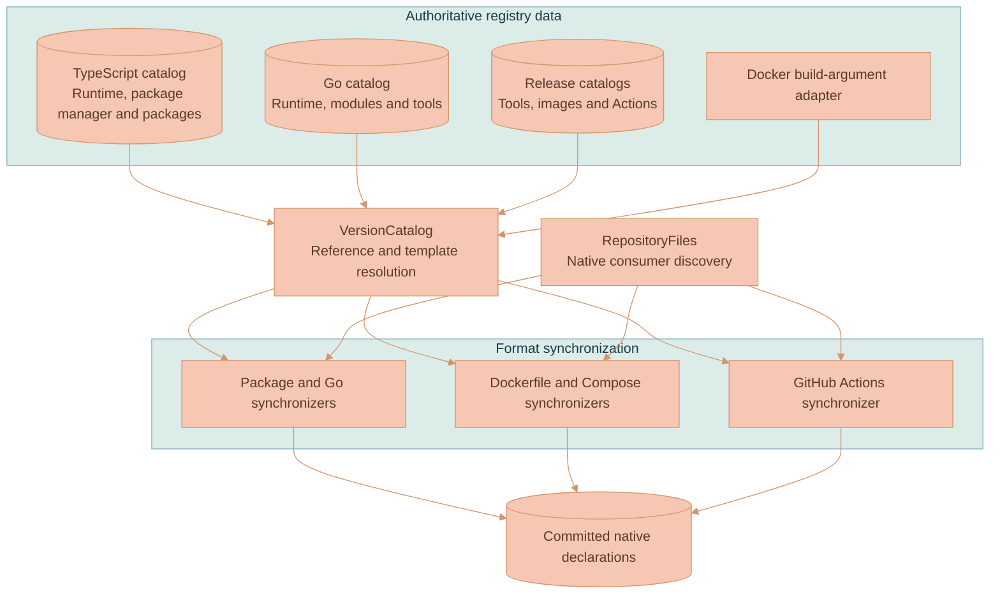
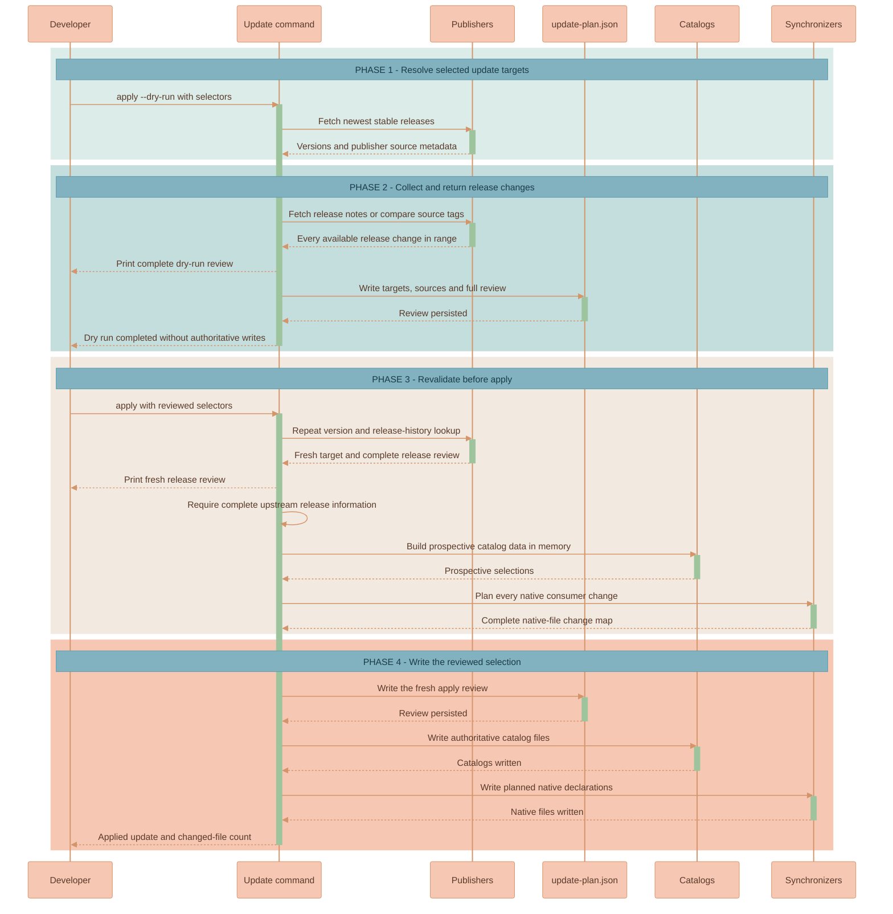

# Dependency Version Registry Architecture

The [dependency version registry](../README.md) separates release selection from the file formats that consume those releases. JSON catalogs record the selected values. `VersionCatalog` resolves references and exposes one typed view. Format synchronizers compare that view with native declarations. The repository still commits those declarations because each ecosystem must remain usable without a registry-aware wrapper.

The update path adds publisher lookup and release review before it changes the catalogs. It uses the same synchronization planner as a manual catalog edit, so publisher-driven updates and exact manual selections produce native files through one path.

## Catalog and native-file boundaries

The catalogs are grouped by dependency domain. The Docker build-argument adapter is separate because an argument name such as `NODE_VERSION` belongs to a Dockerfile interface, while `node` is the canonical catalog key.

| Component | Responsibility |
|---|---|
| TypeScript catalog | Selects Node.js, pnpm, npm packages, and workspace package versions |
| Go catalog | Selects the Go language version, Go modules, and Go development tools |
| Release catalogs | Select external tools, container-image tags, and GitHub Action releases |
| Docker build-argument adapter | Maps descriptive Docker argument names to canonical catalog paths |
| `VersionCatalog` | Resolves direct values, cross-catalog templates, the `major` transform, image references, and Docker arguments |
| `RepositoryFiles` | Discovers supported native files and confines registry and repository paths |
| Format synchronizers | Validate one native format and return its complete expected source text |

The synchronizers do not maintain a file-by-file mapping. Discovery recognizes `package.json`, `go.mod`, Dockerfile names, root Compose files, and workflow YAML under `.github/workflows/`. Dependency caches, build output, fixtures, vendored test data, and the registry itself are excluded from discovery.

## Reference resolution

A catalog value can contain `{{catalog.path}}`. `VersionCatalog` walks that path through the combined catalog data, resolves nested references, and rejects a circular reference, an unknown path, an unsupported transform, or a value that is not one nonempty line.

The `major` transform extracts the first numeric component from the resolved value. It exists for consumers such as AWS Lambda images that publish one tag per runtime major while the main Node.js images use a complete runtime version. The container-image catalog combines the repository key with the resolved tag, so Docker synchronizers compare complete image references.

This reference mechanism is intentionally small. It shares selected releases; it does not implement conditions, arithmetic, ecosystem-specific version ranges, or arbitrary expressions. Consumer-specific names remain in adapters or native files instead of becoming aliases in the canonical catalogs.

## Synchronization planning

`planRepositorySynchronization` reads every discovered native consumer, passes it to the matching format synchronizer, and records changed output in memory. If any file contains an unregistered dependency or unsupported declaration, planning fails before `sync` writes a native file.

`check` uses the same plan and fails when the map is nonempty. It never writes. `sync` writes the fully planned map after every consumer has been processed successfully. The update command also creates a prospective `VersionCatalog` in memory and runs this planner before it writes the authoritative catalogs.

Each native format keeps its own syntax and semantics:

| Native format | Registry behavior |
|---|---|
| `package.json` | Replaces registered dependency fields, workspace package versions, and `pnpm@...`; preserves `workspace:`, `file:`, and `link:` declarations |
| `go.mod` | Replaces the single `go` directive and every registered requirement; keeps comments and indirect markers |
| Dockerfile | Generates registered `ARG` defaults, requires external `FROM` images to use registered arguments, and rejects direct managed tool versions |
| Root Compose YAML | Replaces registered external image references and preserves local `lixpi/*` image names |
| GitHub Actions workflow | Replaces external `uses:` releases and preserves local actions and `docker://` actions |

## Dry run and apply

The update command accepts one dependency, several dependencies, a group, or `all`. The dry run resolves the newest stable release without restricting it to the selected major, then collects the release material needed to assess that change. Actual apply repeats the network lookup so it never installs a stale target from an earlier report.

| Participant | Responsibility |
|---|---|
| Developer or agent | Chooses the dependency scope, reads the dry-run review, and updates repository code when the release material requires migration |
| Update command | Coordinates selection, publisher lookup, release review, prospective catalog construction, planning, and writes |
| Publishers | Supply the latest stable version and the available release history |
| `update-plan.json` | Keeps the complete timestamped review for the latest local command run |
| Catalogs | Hold selected releases after apply succeeds |
| Synchronizers | Calculate and write every affected native declaration |

If release information is incomplete, the successful-write phases do not run. Dry run marks that dependency as `unavailable`; actual apply fails before it builds or writes the selected update. A failed publisher request also ends the command before catalog writes.

## Release-history sources

The latest-version source and the release-history source are separate because a package registry can identify a target without publishing migration notes.

| Dependency domain | Latest version | Release review |
|---|---|---|
| npm package | npm `latest` distribution tag | GitHub releases from npm repository metadata, with tag comparison fallback |
| Go module | Go proxy `@latest` for the exact module path | GitHub releases or commit comparison when the module path identifies GitHub |
| Node.js | Node.js distribution index | Official versioned Node.js changelogs |
| Go runtime | Go stable download metadata | GitHub release or tag comparison from `golang/go` |
| pnpm and registered tools | npm metadata or latest GitHub release | Registered GitHub release history or tag comparison |
| Container image | Alpine stable metadata, a registered release endpoint, or every Docker Hub tag page | Registered GitHub history when available; otherwise the review is unavailable |
| GitHub Action | Latest stable GitHub release | GitHub release history or tag comparison |

GitHub release bodies are used only when every matching release in the range contains notes. Otherwise the resolver compares the selected and target tags and records every returned commit message. Go pseudo-versions contribute their commit hashes to that comparison. Paginated retrieval must account for the complete upstream result; the resolver does not label a partial comparison as available.

## Native dependency metadata

The registry selects declared direct and indirect requirements that appear in supported native files. Native ecosystem metadata still has its own job. Go's minimal version selection can raise requirements, and `go.sum` stores checksums for the resolved graph. After changing Go requirements, run the permitted module-maintenance command from the [Go Testing and Tooling guide](../../documentation/testing/Go/TESTING-GUIDE.md), then synchronize again if Go changed a declared requirement.

The registry does not replace lockfile resolution, compiler compatibility checks, image builds, or application migrations. Release review gives the agent the evidence needed to make those changes before apply; the relevant service or package workflow verifies them afterward when the thread authorizes that verification.
